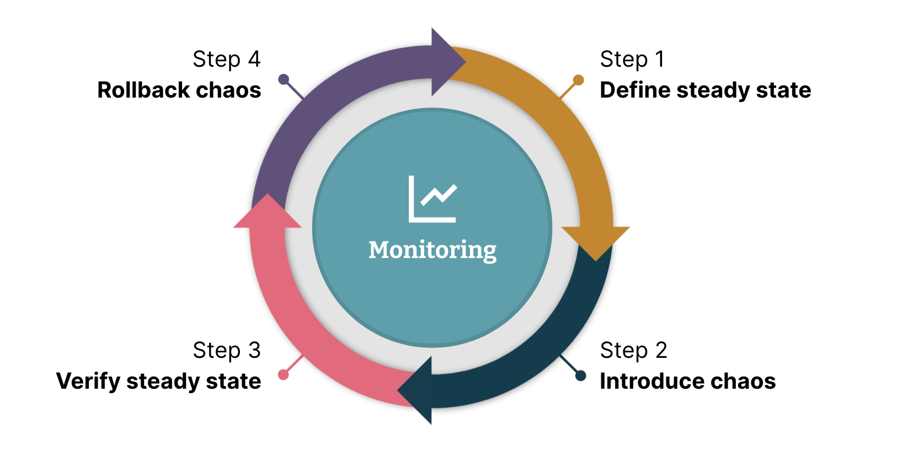

# Ingeniería de caos

## ¿Por qué necesitamos la ingeniería del caos?

La necesidad de la ingeniería del caos surge de la creciente complejidad de los sistemas modernos, especialmente en un mundo dominado por la arquitectura de microservicios y la computación en la nube. Tradicionalmente, los sistemas monolíticos presentaban un único punto de fallo; es decir, si una parte del sistema fallaba, el impacto era más predecible y controlable. Sin embargo, en los sistemas distribuidos actuales, múltiples puntos de fallo pueden interactuar de formas inesperadas, provocando fallos catastróficos difíciles de anticipar mediante métodos tradicionales de prueba.

Un ejemplo claro es el de un cliente de comercio electrónico que durante una venta del Black Friday experimentó caídas sucesivas de sus aplicaciones. A pesar de no detectarse picos de uso en CPU o memoria, el problema radicaba en que el espacio en disco del contenedor se agotaba debido al registro continuo de logs, lo que terminaba bloqueando las aplicaciones. Esto ilustra cómo fallos no evidentes —como un simple llenado de disco— pueden comprometer todo el sistema.

Además, en los ecosistemas de microservicios, un servicio lento no solo afecta su propio rendimiento, sino que puede propagar su latencia a lo largo de toda la cadena de servicios interconectados, multiplicando el impacto negativo. Debido a esta complejidad, resulta insuficiente confiar únicamente en las pruebas convencionales: se necesita un enfoque más proactivo y realista que permita descubrir debilidades antes de que éstas se conviertan en fallos graves.

Por tanto, la ingeniería del caos se vuelve esencial para validar la resiliencia, estabilidad y capacidad de recuperación de los sistemas, en condiciones que simulan el tipo de estrés real que enfrentan en producción.

## ¿Cómo funciona la ingeniería del caos?

La ingeniería del caos opera bajo una analogía muy ilustrativa: funciona como una vacuna. Así como una vacuna expone al cuerpo a una versión controlada del virus para que el sistema inmunológico aprenda a combatirlo eficazmente, la ingeniería del caos expone deliberadamente un sistema a fallos controlados, para que pueda fortalecerse frente a problemas reales.

Este enfoque implica introducir fallos de forma deliberada y controlada en el sistema, observando su comportamiento, analizando su capacidad de recuperación y realizando ajustes para mejorar su resiliencia.

Entre los problemas comunes que afectan a las aplicaciones encontramos:

- Picos de CPU o memoria: sobrecargas que pueden colapsar el procesamiento.
- Latencia de red: retrasos en la comunicación que afectan la respuesta de los servicios.
- Errores de cambio de horario: problemas al ajustarse el reloj del sistema, típicamente durante cambios de horario de verano.
- Espacio en disco reducido: agotamiento del almacenamiento, que puede impedir operaciones básicas del sistema.
- Caídas de aplicaciones: interrupciones inesperadas del servicio.

El objetivo inicial es fortalecer la infraestructura para resistir estos escenarios adversos, asegurando que los sistemas no solo sobrevivan, sino que mantengan operaciones críticas incluso durante fallos parciales.

## Creación de resiliencia con ingeniería del caos

La creación de resiliencia en los sistemas mediante pruebas de caos sigue un proceso de cuatro pasos principales:

### 1. Definir un estado estacionario

Antes de iniciar cualquier experimento de caos, es crucial definir cómo se ve el "comportamiento normal" del sistema. Esto puede incluir métricas clave como tasas de respuesta, tiempo de latencia, disponibilidad de servicios o estados de salud de endpoints (por ejemplo, un endpoint que responda HTTP 200). Este estado de referencia es fundamental porque permitirá detectar cualquier degradación provocada por el experimento.

### 2. Introducir el caos

Luego, se simula un fallo específico. Algunos ejemplos comunes incluyen:

- Reducir el ancho de banda de la red.
- Llenar el disco hasta quedarse sin espacio.
- Derribar servicios críticos para observar el impacto.
- Introducir retrasos artificiales en respuestas. La clave está en inyectar fallos controladamente y medir cómo reacciona el sistema.

### 3. Verificar el estado estacionario

Después de introducir el fallo, se debe comparar el comportamiento actual del sistema con el estado definido inicialmente. Si las diferencias son mínimas o tolerables, el sistema es considerado resiliente. Además, se verifica si las alertas automáticas (correo, SMS, Slack, etc.) se activan correctamente, ya que el monitoreo adecuado es parte esencial de la resiliencia.

### 4. Revertir el caos

Finalmente, es crucial detener el experimento y asegurar la recuperación total del sistema. En ambientes de producción, este paso es vital para evitar daños prolongados. Restaurar los servicios al estado previo garantiza que cualquier impacto sea momentáneo y contenido.

Si la aplicación pasa la prueba, es evidencia tangible de que el sistema es robusto. Si no lo pasa, se aplica el enfoque "prueba roja-verde": identificar el error, corregirlo, y volver a ejecutar la prueba hasta lograr superar satisfactoriamente el escenario de fallo.

## ¿Cómo iniciar las pruebas de caos?

Cuando se comienza en el mundo de la ingeniería del caos, no es necesario implementar de inmediato soluciones complejas. Se puede iniciar de forma sencilla:

- Scripts de Shell:

Un script que, por ejemplo, simule la caída de un servicio o el llenado de disco puede ser suficiente en las primeras etapas. Es importante acompañar siempre estos experimentos de una hipótesis de estado estacionario y monitoreo en paralelo.

Algo tan sencillo como ejecutar un comando kill -9 en un servidor de prueba puede ser un excelente punto de partida. Esto permite simular la caída abrupta de un servicio y observar cómo responde el sistema de forma realista.

A medida que el equipo adquiere experiencia, puede migrar a herramientas especializadas, como:

- Gremlin: Una de las plataformas líderes, que permite realizar experimentos de forma intuitiva y segura, con una amplia gama de escenarios de fallo.

- Litmus Chaos Toolkit: Especializado en aplicaciones Kubernetes, facilita la realización de experimentos de caos en entornos de contenedores.

- Istio Service Mesh: Permite simular fallos relacionados con la red como latencias, interrupciones de servicio o errores, siendo ideal para microservicios.

- AWS Fault Injection Simulator: Orientado a sistemas desplegados en AWS, facilita la creación de experimentos que validan la resiliencia de infraestructuras cloud.

- Chaos Monkey: Desarrollado por Netflix, es una herramienta emblemática que apaga aleatoriamente instancias en producción para garantizar que el sistema puede recuperarse automáticamente sin intervención humana.

Aunque idealmente las pruebas de caos se ejecutan mejor en producción para observar el comportamiento real, es recomendable iniciar en entornos de desarrollo o staging. Solo cuando los equipos y clientes tengan suficiente confianza, se puede pasar a experimentos controlados en producción. Un proceso de maduración típico puede llevar varios meses.

Posteriormente, se puede automatizar la ejecución de pruebas de caos, integrándolas en las pipelines de CI/CD, garantizando que cada nueva versión de software mantenga los niveles de resiliencia requeridos.

## ¿Qué resultados ofrece la ingeniería del caos?

La ingeniería del caos ha demostrado ofrecer resultados concretos y medibles en las organizaciones que la adoptan de forma sistemática:

- Mayor disponibilidad:

Muchas empresas que practican la ingeniería del caos logran mantener niveles de disponibilidad superiores al 99,9 %, asegurando así una experiencia de usuario estable y confiable.

- Reducción del MTTR (Mean Time To Recovery):

Gracias a los experimentos controlados y la detección proactiva de debilidades, el tiempo medio de resolución de incidentes disminuye drásticamente.

- El 23 % de los equipos logró reducir su MTTR a menos de una hora.
- El 60 % lo redujo a menos de 12 horas.

Además, la práctica constante genera confianza entre los equipos de desarrollo, operaciones y clientes, quienes saben que el sistema ha sido sometido a escenarios extremos y ha demostrado ser capaz de resistir.

## Ingeniería del caos como disciplina de experimentación en infraestructura

Más allá de ser una simple técnica de prueba, la ingeniería del caos se entiende como una disciplina de experimentación cuyo propósito es revelar debilidades sistémicas ocultas.

El proceso de verificación empírica ayuda a descubrir problemas que serían casi imposibles de identificar en entornos de prueba convencionales, como:

- Configuraciones de respaldo incorrectas, que pueden impedir una recuperación adecuada tras un fallo de servicio.
- Reintentos desmesurados causados por tiempos de espera mal ajustados, que pueden empeorar un problema inicial saturando aún más el sistema.
- Cortes de servicio masivos debido a la saturación de componentes críticos.
- Fallos en cascada provocados por la caída de un único nodo o microservicio, revelando la existencia de puntos únicos de fallo (SPOF).

Estas debilidades pueden manifestarse de forma catastrófica en producción si no se identifican y corrigen previamente.
