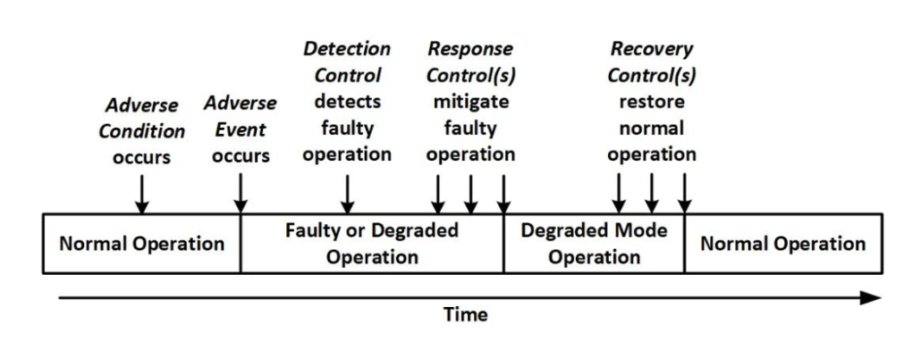
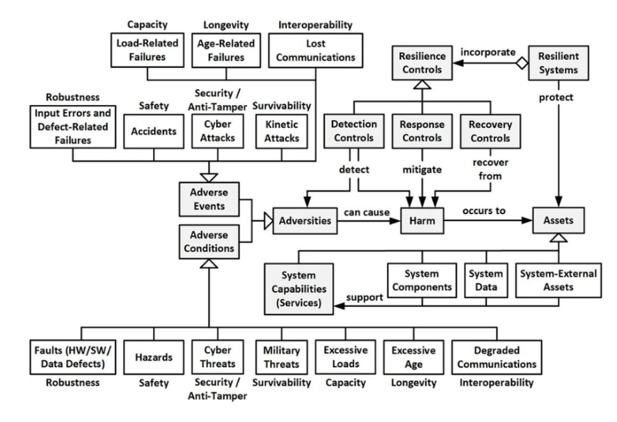

# Resiliencia

## Introducción

Un sistema resiliente es aquel que continúa funcionando y proporcionando las capacidades necesarias incluso cuando enfrenta situaciones adversas o difíciles. La resiliencia en un sistema no solo implica mantener la disponibilidad y la confiabilidad, sino también ser capaz de resistir perturbaciones, operar en modos degradados cuando sea necesario y recuperarse rápidamente después de cualquier interrupción. En otras palabras, un sistema resiliente debe garantizar la continuidad del servicio a pesar de condiciones adversas.

## Conceptos Clave

### ¿Qué es la tolerancia a fallos en software?

La tolerancia a fallos en software es la capacidad de un sistema para seguir operando de manera satisfactoria incluso cuando uno o varios de sus componentes presentan fallos. Un sistema tolerante a fallos no solo detecta los errores de forma temprana, sino que también toma acciones correctivas de manera automática para evitar interrupciones en el servicio. Estas acciones pueden incluir, por ejemplo, redirigir tráfico a instancias saludables, activar servicios de respaldo, o reintentar operaciones fallidas. La tolerancia a fallos es esencial en sistemas críticos donde la continuidad del servicio es prioritaria, como en servicios financieros, telecomunicaciones o plataformas de salud.

### ¿Qué es un ciclo de vida de recuperación en la resiliencia de software?

El ciclo de vida de recuperación describe el proceso completo que atraviesa un sistema para restaurar su operación normal después de enfrentar un fallo. Este ciclo incluye varias etapas fundamentales:

- Detección: Identificar que un fallo ha ocurrido, mediante monitoreo activo o health checks automáticos.
- Contención: Limitar el impacto del fallo evitando que se propague a otros componentes o servicios.
- Recuperación: Restaurar el sistema a un estado operativo, ya sea mediante reinicios automáticos, redirección de tráfico o activación de sistemas de respaldo.
- Prevención futura: Analizar la causa raíz del fallo y tomar medidas para que incidentes similares no vuelvan a ocurrir.

La implementación eficaz de este ciclo es clave para minimizar tiempos de inactividad y garantizar la resiliencia a largo plazo del sistema.

### ¿Qué es la recuperación en caliente en la resiliencia de software?

La recuperación en caliente (o hot recovery) se refiere a la capacidad de un sistema para superar un fallo sin necesidad de detener o reiniciar el servicio. En otras palabras, el sistema puede reanudar sus operaciones normales de forma inmediata, manteniendo a los usuarios activos y minimizando el impacto percibido. Técnicamente, esto puede lograrse mediante técnicas como la replicación activa de servicios, balanceo dinámico de cargas y conmutación por error (failover) automática hacia réplicas saludables.

Esta capacidad es especialmente valiosa en entornos donde los tiempos de inactividad no son aceptables, como plataformas de comercio electrónico, servicios financieros en tiempo real o aplicaciones médicas.

### ¿Qué es un evento adverso en la resiliencia de software?

Un evento adverso es cualquier situación no planeada que puede afectar negativamente el funcionamiento de un sistema o servicio. Ejemplos de eventos adversos incluyen caídas de servidores, fallos de bases de datos, errores humanos, ataques cibernéticos o pérdidas de conectividad. La resiliencia de un sistema se pone a prueba precisamente en estos momentos, y su capacidad de respuesta ante eventos adversos determina en gran medida su confiabilidad y robustez.

### ¿Qué es una condición adversa en la resiliencia de software?

Una condición adversa se refiere a un entorno operativo desfavorable bajo el cual el sistema debe continuar funcionando. A diferencia de un evento puntual, una condición adversa puede ser prolongada o continua, como un tráfico inusualmente alto, fluctuaciones en la calidad de la red, fallos parciales de hardware o recursos de infraestructura limitados. Diseñar sistemas que puedan adaptarse y operar bajo estas condiciones es fundamental para garantizar una resiliencia sólida.

### ¿Qué son los health checks y para qué se utilizan en un sistema de software?

Los health checks o comprobaciones de salud son mecanismos automáticos que permiten verificar el estado de los componentes de un sistema en tiempo real. Estos mecanismos pueden consistir en simples pings a un servicio, validaciones de bases de datos, pruebas de conectividad entre microservicios o revisiones más complejas que simulan transacciones de usuario.
Su objetivo principal es detectar problemas de forma temprana y permitir una respuesta rápida antes de que los fallos afecten a los usuarios finales. Además, los health checks son fundamentales para orquestadores de infraestructura (como Kubernetes o sistemas de balanceo de carga) que toman decisiones de enrutamiento basadas en el estado de salud de los servicios.

## Características de un sistema resiliente

- Continuidad del servicio: Un sistema resiliente sigue funcionando cuando ocurren interrupciones, aunque sea en un modo de operación degradado. Por ejemplo, si un servicio experimenta fallas parciales, un sistema resiliente podría seguir ofreciendo funciones esenciales mientras soluciona los problemas. Esto es crucial en sectores donde la interrupción del servicio puede tener graves consecuencias, como en la banca, el transporte o la salud.

- Recuperación rápida: Además de mantener su funcionamiento bajo condiciones adversas, un sistema resiliente debe poder recuperarse rápidamente después de un incidente. Esto implica que, tras la detección de una falla o daño, el sistema implemente acciones de recuperación de manera ágil para restaurar su funcionamiento normal en el menor tiempo posible.

- Detección y respuesta a perturbaciones: Para ser resiliente, el sistema debe incorporar mecanismos de monitoreo y detección que identifiquen eventos y condiciones adversas. Estos controles permiten que el sistema reaccione de forma oportuna a las perturbaciones, minimizando el impacto negativo en los servicios críticos.

## ¿Qué servicios críticos debe mantener un sistema resiliente?

Al diseñar un sistema resiliente, es fundamental identificar qué servicios críticos deben seguir funcionando durante una interrupción. Dependiendo del contexto, los servicios esenciales varían, pero en términos generales pueden incluir:

- Procesos comerciales clave.
- Servicios de seguridad y autenticación.
- Sistemas de comunicación interna y externa.
- Procesos de recuperación y respaldo de datos.

## Tipos de adversidades que puede enfrentar un sistema

Las adversidades que pueden interrumpir la capacidad del sistema para seguir proporcionando servicios críticos pueden ser tanto externas como internas. Entre ellas se incluyen:

- Eventos ambientales adversos: Desastres naturales como terremotos, inundaciones, incendios forestales o pérdida de suministro eléctrico externo. Estos eventos pueden dañar tanto el hardware como la infraestructura del sistema, afectando su capacidad operativa.

- Condiciones ambientales adversas: Factores como temperaturas extremas o fluctuaciones en las condiciones del entorno físico en el que opera el sistema. Estas condiciones pueden afectar el rendimiento de los componentes físicos, como servidores o sistemas de red.

- Errores de entrada: Fallos humanos o errores del usuario que pueden desencadenar problemas en la operatividad del sistema. Los errores del operador pueden ser involuntarios, pero igualmente dañinos para la continuidad del servicio.

- Ataques de ciberseguridad y manipulación: Amenazas maliciosas, como ataques de hackers, manipulación de datos o virus, que buscan comprometer la seguridad del sistema, su integridad y disponibilidad.

- Ataques físicos: En situaciones extremas, ataques terroristas o militares podrían dañar físicamente los activos del sistema, incluyendo su infraestructura crítica.

- Picos de carga: El aumento inesperado en la demanda de los servicios, que sobrecarga la capacidad del sistema. Estos picos pueden resultar en fallos si no se manejan adecuadamente, ya que el sistema puede no estar preparado para gestionar la sobrecarga.

- Envejecimiento y desgaste: Con el tiempo, el desgaste de los componentes físicos y de software puede generar fallos que afecten la funcionalidad y la disponibilidad del sistema.

- Pérdida o degradación de las comunicaciones: En muchos sistemas modernos, la conectividad es esencial para mantener la operatividad. La pérdida de comunicación, ya sea con servidores, clientes o dispositivos externos, puede causar interrupciones críticas.

## Ejemplos de falla de resiliencia

### 1. CrowdStrike - Julio 2024

Descripción del incidente:

Una actualización defectuosa en la plataforma de seguridad Falcon de CrowdStrike causó que múltiples dispositivos que ejecutaban Windows experimentaran pantallas azules de la muerte (BSOD).

Microsoft estimó que 8.5 millones de dispositivos fueron afectados por esta actualización fallida.

Problemas de resiliencia identificados:

- Recuperación lenta: Las empresas afectadas no pudieron recuperar rápidamente sus sistemas porque las claves de recuperación no estaban accesibles. Esto prolongó el tiempo de inactividad y empeoró el impacto del incidente.
- Dependencia de proveedores externos: La falla en el servicio de CrowdStrike comprometió los servicios de Microsoft. Esto evidencia la vulnerabilidad creada por depender de una única solución de seguridad.
- Amplio impacto: La dependencia de una única herramienta de seguridad centralizó el problema, lo que hizo más difícil mitigar el incidente y aumentar su alcance.

### 2. GitLab - 2023

Descripción del incidente:

GitLab, una plataforma popular para desarrollo y gestión de proyectos de software, experimentó una interrupción significativa causada por fallas en los sistemas de almacenamiento de su proveedor en la nube, Google Cloud.

Esto resultó en una desconexión temporal y pérdida de datos en ciertas regiones, afectando a miles de usuarios y equipos de desarrollo que dependen de la plataforma para su trabajo diario.

Problemas de resiliencia identificados:

- Dependencia de infraestructura externa: GitLab dependía completamente de su proveedor de servicios en la nube, lo que creó un punto único de falla. Esta dependencia limita la capacidad de GitLab para mitigar el impacto de fallas en su infraestructura.
- Falta de redundancia adecuada: Aunque GitLab distribuye su infraestructura en varias zonas geográficas, la recuperación fue lenta, lo que sugiere que no tenía la redundancia suficiente para gestionar una falla de esta magnitud.
- Pérdida de datos temporales: Aunque los datos finalmente se recuperaron, se experimentó una pérdida temporal que interrumpió el trabajo continuo de los equipos de desarrollo. Un sistema más resiliente debería contar con mecanismos de respaldo y recuperación más rápidos para evitar la pérdida de datos críticos.

## Técnicas para mejorar la resiliencia

- Rate Limiting: Implementar limitación de tasa para evitar la sobrecarga del sistema con solicitudes excesivas, protegiéndolo de ataques de denegación de servicio (DDoS).

- Patrón de Circuit Breaker: Utilizar el patrón de circuit breaker para aislar componentes defectuosos. Cuando se detectan problemas en un servicio, el circuito se "abre", evitando que el problema se propague, y se cierra después de un tiempo para comprobar si el servicio se ha restablecido.

- Retries y Timeout: Configurar reintentos automáticos en caso de errores temporales y establecer tiempos límite (timeouts) para evitar bloqueos prolongados, lo que ayuda a mantener el servicio en funcionamiento.

- Redundancia: Implementar componentes redundantes asegura que, si un componente falla, otro pueda tomar su lugar y evitar la interrupción del servicio.

- Bulkhead/Segmentación: Aislar consumidores y servicios mediante el uso de compartimentos (bulkheads). Esto evita que un fallo en una parte del sistema cause una falla en cascada que afecte todo el sistema.

- Sistemas de monitoreo y detección de eventos adversos: Utilizar herramientas de monitoreo en tiempo real para detectar eventos adversos y actuar de inmediato para mitigar su impacto.

- Automatización de recuperación: Implementar procedimientos automáticos de recuperación para reiniciar componentes fallidos, redirigir el tráfico a réplicas de servicios o tomar las medidas adecuadas cuando ocurren fallos.

- Pruebas de resiliencia: Realizar pruebas periódicas de resiliencia, simulando eventos adversos para evaluar cómo responde el sistema. Esto ayuda a identificar debilidades y mejorar la capacidad de recuperación del sistema.

- Actualizaciones y parches regulares: Mantener el software actualizado mediante la instalación de parches de seguridad y actualizaciones para mitigar vulnerabilidades conocidas que podrían comprometer la resiliencia.

- Capacitación y concienciación: Capacitar a los equipos en prácticas de resiliencia y fomentar una cultura de concienciación en torno a la importancia de la resiliencia en el desarrollo y operación de software.
