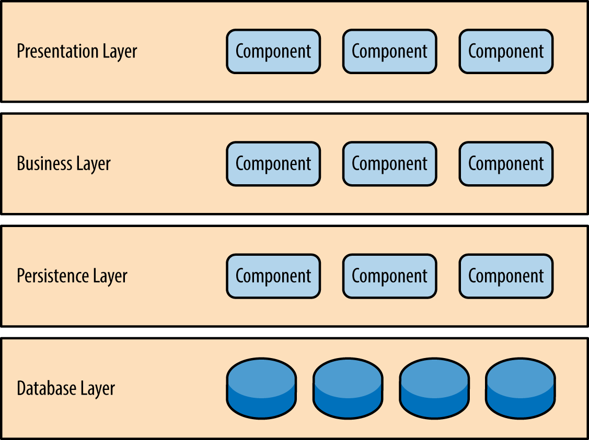
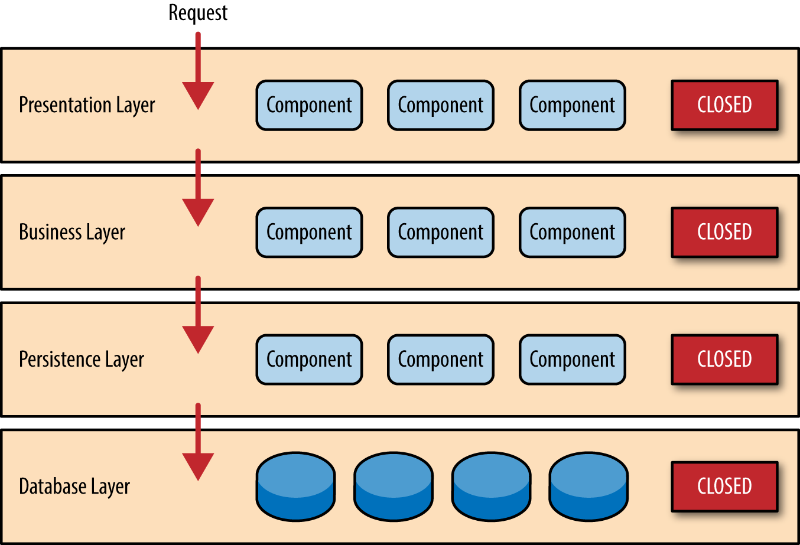
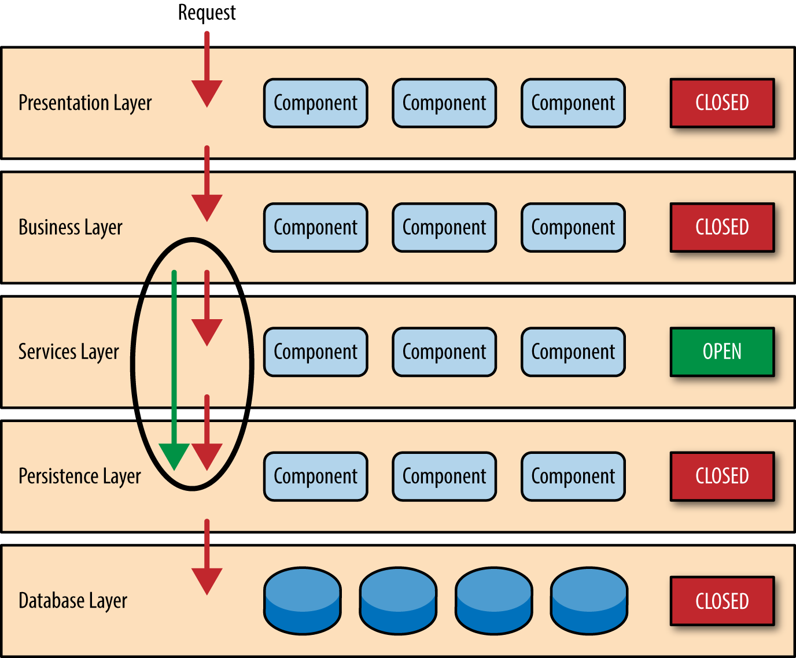
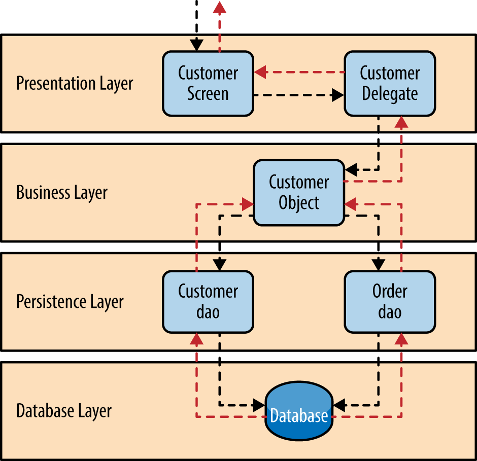

# Arquitectura en capas

El patrón de arquitectura más común es el patrón de arquitectura en capas, también conocido como patrón de arquitectura n-tier. Este patrón es el estándar de facto para la mayoría de las aplicaciones Java EE y, por lo tanto, es ampliamente conocido por la mayoría de arquitectos, diseñadores y desarrolladores. El patrón de arquitectura en capas coincide estrechamente con las estructuras tradicionales de comunicación y organización de TI que se encuentran en la mayoría de las empresas, lo que lo convierte en una opción natural para la mayoría de los esfuerzos de desarrollo de aplicaciones empresariales.

## Descripción del patrón

Los componentes dentro del patrón de arquitectura en capas se organizan en capas horizontales, cada capa desempeñando un rol específico dentro de la aplicación (por ejemplo, lógica de presentación o lógica de negocio). Aunque el patrón de arquitectura en capas no especifica el número ni los tipos de capas que deben existir en el patrón, la mayoría de las arquitecturas en capas constan de cuatro capas estándar: presentación, negocio, persistencia y base de datos (Figura 1-1). En algunos casos, la capa de negocio y la capa de persistencia se combinan en una sola capa de negocio, particularmente cuando la lógica de persistencia (por ejemplo, SQL o HSQL) está incrustada dentro de los componentes de la capa de negocio. Por lo tanto, aplicaciones más pequeñas pueden tener solo tres capas, mientras que aplicaciones empresariales más grandes y complejas pueden contener cinco o más capas.

Cada capa del patrón de arquitectura en capas tiene un rol y responsabilidad específicos dentro de la aplicación. Por ejemplo, una capa de presentación sería responsable de manejar toda la lógica de interfaz de usuario y comunicación con el navegador, mientras que una capa de negocio sería responsable de ejecutar reglas de negocio específicas asociadas con la solicitud. Cada capa en la arquitectura forma una abstracción alrededor del trabajo que debe hacerse para satisfacer una solicitud de negocio particular. Por ejemplo, la capa de presentación no necesita saber ni preocuparse por cómo obtener los datos del cliente; solo necesita mostrar esa información en la pantalla en un formato particular. De manera similar, la capa de negocio no necesita preocuparse por cómo formatear los datos del cliente para mostrarlos en pantalla o incluso de dónde provienen los datos del cliente; solo necesita obtener los datos desde la capa de persistencia, ejecutar la lógica de negocio sobre los datos (por ejemplo, calcular valores o agregar datos) y pasar esa información a la capa de presentación.

Figura 1-1. Patrón de arquitectura en capas

Una de las características poderosas del patrón de arquitectura en capas es la separación de responsabilidades entre componentes. Los componentes dentro de una capa específica solo tratan con la lógica que corresponde a esa capa. Por ejemplo, los componentes en la capa de presentación solo tratan con lógica de presentación, mientras que los componentes que residen en la capa de negocio solo tratan con lógica de negocio. Este tipo de clasificación de componentes facilita construir modelos efectivos de roles y responsabilidades en la arquitectura, y también facilita el desarrollo, prueba, gobernanza y mantenimiento de aplicaciones usando este patrón arquitectónico debido a interfaces bien definidas y alcance limitado de los componentes.

## Conceptos clave

Obsérvese en la Figura 1-2 que cada una de las capas en la arquitectura está marcada como cerrada. Este es un concepto muy importante en el patrón de arquitectura en capas. Una capa cerrada significa que a medida que una solicitud se mueve de capa en capa, debe pasar por la capa justo debajo de ella para llegar a la siguiente capa inferior. Por ejemplo, una solicitud que se origina en la capa de presentación debe pasar primero por la capa de negocio y luego por la capa de persistencia antes de finalmente llegar a la capa de base de datos.

Figura 1-2. Capas cerradas y acceso a solicitudes

Entonces, ¿por qué no permitir que la capa de presentación acceda directamente a la capa de persistencia o a la capa de base de datos? Después de todo, el acceso directo a la base de datos desde la capa de presentación es mucho más rápido que pasar por muchas capas innecesarias solo para recuperar o guardar información en la base de datos. La respuesta a esta pregunta radica en un concepto clave conocido como capas de aislamiento.

El concepto de capas de aislamiento significa que los cambios realizados en una capa de la arquitectura generalmente no afectan ni impactan a los componentes de otras capas: el cambio está aislado a los componentes dentro de esa capa y posiblemente a otra capa asociada (como una capa de persistencia que contiene SQL). Si se permite que la capa de presentación tenga acceso directo a la capa de persistencia, entonces los cambios realizados al SQL dentro de la capa de persistencia afectarían tanto a la capa de negocio como a la de presentación, produciendo así una aplicación muy acoplada con muchas interdependencias entre componentes. Este tipo de arquitectura se vuelve muy difícil y costosa de cambiar.

El concepto de capas de aislamiento también significa que cada capa es independiente de las otras capas, por lo que tiene poco o ningún conocimiento del funcionamiento interno de otras capas en la arquitectura. Para entender el poder e importancia de este concepto, considere un gran esfuerzo de refactorización para convertir el framework de presentación de JSP (Java Server Pages) a JSF (Java Server Faces). Suponiendo que los contratos (por ejemplo, el modelo) usados entre la capa de presentación y la capa de negocio permanecen iguales, la capa de negocio no se ve afectada por la refactorización y permanece completamente independiente del tipo de framework de interfaz de usuario usado por la capa de presentación.

Aunque las capas cerradas facilitan las capas de aislamiento y por lo tanto ayudan a aislar los cambios dentro de la arquitectura, hay ocasiones en las que tiene sentido que ciertas capas estén abiertas. Por ejemplo, supongamos que quieres agregar una capa de servicios compartidos a una arquitectura que contiene componentes de servicio comunes a los que acceden los componentes dentro de la capa de negocio (por ejemplo, clases utilitarias de datos y cadenas o clases de auditoría y registro). Crear una capa de servicios suele ser una buena idea en este caso porque arquitectónicamente restringe el acceso a los servicios compartidos solo a la capa de negocio (y no a la capa de presentación). Sin una capa separada, no hay nada en la arquitectura que restrinja que la capa de presentación acceda a estos servicios comunes, lo que dificulta gobernar esta restricción de acceso.

En este ejemplo, la nueva capa de servicios probablemente residiría debajo de la capa de negocio para indicar que los componentes en esta capa de servicios no son accesibles desde la capa de presentación. Sin embargo, esto presenta un problema, ya que la capa de negocio ahora está obligada a pasar por la capa de servicios para llegar a la capa de persistencia, lo cual no tiene sentido. Este es un problema clásico con la arquitectura en capas, y se resuelve creando capas abiertas dentro de la arquitectura.

Como se ilustra en la Figura 1-3, la capa de servicios en este caso está marcada como abierta, lo que significa que las solicitudes pueden omitir esta capa abierta y pasar directamente a la capa inferior. En el siguiente ejemplo, dado que la capa de servicios está abierta, la capa de negocio ahora puede omitirla y pasar directamente a la capa de persistencia, lo que tiene perfecto sentido.

Figura 1-3. Capas abiertas y flujo de solicitudes

Aprovechar el concepto de capas abiertas y cerradas ayuda a definir la relación entre las capas de arquitectura y los flujos de solicitud, y también proporciona a diseñadores y desarrolladores la información necesaria para entender las diversas restricciones de acceso entre capas dentro de la arquitectura. La falta de documentación o comunicación adecuada sobre qué capas en la arquitectura están abiertas o cerradas (y por qué) generalmente resulta en arquitecturas muy acopladas y frágiles que son muy difíciles de probar, mantener y desplegar.

## Ejemplo del patrón

Para ilustrar cómo funciona la arquitectura en capas, consideremos una solicitud de un usuario de negocio para recuperar información de un cliente en particular, como se muestra en la Figura 1-4. Las flechas negras muestran la solicitud que fluye hacia abajo hasta la base de datos para recuperar los datos del cliente, y las flechas rojas muestran la respuesta que fluye de vuelta hacia la pantalla para mostrar los datos. En este ejemplo, la información del cliente consiste tanto en datos del cliente como en datos de órdenes (órdenes realizadas por el cliente).

La pantalla del cliente es responsable de aceptar la solicitud y mostrar la información del cliente. No sabe dónde están los datos, cómo se recuperan, ni cuántas tablas de la base de datos deben consultarse para obtener los datos. Una vez que la pantalla del cliente recibe una solicitud para obtener información de un cliente en particular, entonces reenvía esa solicitud al módulo delegado de cliente. Este módulo es responsable de saber qué módulos en la capa de negocio pueden procesar esa solicitud, así como de cómo llegar a ese módulo y qué datos necesita (el contrato). El objeto cliente en la capa de negocio es responsable de agregar toda la información necesaria para la solicitud de negocio (en este caso, para obtener información del cliente). Este módulo llama al módulo dao de cliente (objeto de acceso a datos) en la capa de persistencia para obtener los datos del cliente, y también al módulo dao de órdenes para obtener la información de las órdenes. Estos módulos, a su vez, ejecutan sentencias SQL para recuperar los datos correspondientes y los pasan de vuelta al objeto cliente en la capa de negocio. Una vez que el objeto cliente recibe los datos, los agrega y pasa esa información de vuelta al delegado de cliente, que luego pasa esos datos a la pantalla del cliente para ser presentados al usuario.

Figura 1-4. Ejemplo de arquitectura en capas

Desde una perspectiva tecnológica, hay literalmente docenas de formas en que estos módulos pueden ser implementados. Por ejemplo, en la plataforma Java, la pantalla del cliente puede ser una pantalla (JSF) Java Server Faces acoplada con el delegado de cliente como el componente managed bean. El objeto cliente en la capa de negocio puede ser un bean local de Spring o un bean remoto EJB3. Los objetos de acceso a datos ilustrados en el ejemplo anterior pueden implementarse como simples POJOs (Plain Old Java Objects), archivos XML Mapper de MyBatis, o incluso objetos que encapsulan llamadas JDBC en bruto o consultas Hibernate. Desde la perspectiva de la plataforma Microsoft, la pantalla del cliente puede ser un módulo ASP (Active Server Pages) usando el framework .NET para acceder a módulos C# en la capa de negocio, con los módulos de acceso a datos de cliente y orden implementados como ADO (ActiveX Data Objects).

## Consideraciones

El patrón de arquitectura en capas es un patrón sólido y de propósito general, lo que lo convierte en un buen punto de partida para la mayoría de las aplicaciones, particularmente cuando no estás seguro de qué patrón arquitectónico es el más adecuado para tu aplicación. Sin embargo, hay un par de cosas a considerar desde un punto de vista arquitectónico al elegir este patrón.

La primera cosa a tener en cuenta es lo que se conoce como el antipatrón “sumidero arquitectónico” (architecture sinkhole). Este antipatrón describe la situación donde las solicitudes fluyen a través de múltiples capas de la arquitectura como un simple procesamiento de paso directo, con poca o ninguna lógica realizada en cada capa. Por ejemplo, supongamos que la capa de presentación responde a una solicitud del usuario para recuperar datos del cliente. La capa de presentación pasa la solicitud a la capa de negocio, que simplemente pasa la solicitud a la capa de persistencia, la cual hace una simple llamada SQL a la capa de base de datos para recuperar los datos del cliente. Los datos son entonces pasados de vuelta por toda la pila sin procesamiento adicional o lógica para agregar, calcular o transformar los datos.

Cada arquitectura en capas tendrá al menos algunos escenarios que caen dentro del antipatrón “sumidero arquitectónico”. La clave, sin embargo, es analizar el porcentaje de solicitudes que caen en esta categoría. La regla 80-20 suele ser una buena práctica para determinar si estás experimentando el antipatrón “sumidero arquitectónico”. Es típico tener alrededor del 20 por ciento de las solicitudes como simple procesamiento de paso directo y el 80 por ciento de las solicitudes con alguna lógica de negocio asociada a la solicitud. Sin embargo, si descubres que esta proporción está invertida y la mayoría de tus solicitudes son simple procesamiento de paso directo, quizás quieras considerar hacer algunas de las capas de la arquitectura abiertas, teniendo en cuenta que será más difícil controlar el cambio debido a la falta de aislamiento entre capas.

Otra consideración con el patrón de arquitectura en capas es que tiende a favorecer aplicaciones monolíticas, incluso si divides la capa de presentación y la capa de negocio en unidades desplegables separadas. Aunque esto puede no ser un problema para algunas aplicaciones, sí plantea algunos problemas potenciales en términos de despliegue, robustez y confiabilidad general, rendimiento y escalabilidad.

## Análisis del patrón

La siguiente tabla contiene una calificación y análisis de las características comunes de arquitectura para el patrón de arquitectura en capas. La calificación para cada característica se basa en la tendencia natural de esa característica como capacidad basada en una implementación típica del patrón, así como en lo que generalmente se conoce sobre el patrón. Para una comparación lado a lado de cómo este patrón se relaciona con otros patrones en este informe, por favor consulta el Apéndice A al final de este informe.

### Agilidad general

Calificación: Baja

Análisis: La agilidad general es la capacidad de responder rápidamente a un entorno en constante cambio. Aunque el cambio puede aislarse a través de la característica de capas de aislamiento de este patrón, sigue siendo engorroso y consume mucho tiempo hacer cambios en este patrón arquitectónico debido a la naturaleza monolítica de la mayoría de las implementaciones, así como al acoplamiento estrecho de los componentes que usualmente se encuentran con este patrón.

### Facilidad de despliegue

Calificación: Baja

Análisis: Dependiendo de cómo implementes este patrón, el despliegue puede convertirse en un problema, particularmente para aplicaciones grandes. Un pequeño cambio en un componente puede requerir un redepliegue de toda la aplicación (o de una gran parte de la aplicación), resultando en despliegues que deben planificarse, programarse y ejecutarse fuera de horario o durante fines de semana. Por lo tanto, este patrón no se presta fácilmente para una canalización de entrega continua, reduciendo aún más la calificación general para despliegue.

### Testabilidad

Calificación: Alta

Análisis: Debido a que los componentes pertenecen a capas específicas en la arquitectura, otras capas pueden ser simuladas (mocked) o stubbed, haciendo que este patrón sea relativamente fácil de probar. Un desarrollador puede simular un componente de presentación o pantalla para aislar las pruebas dentro de un componente de negocio, así como simular la capa de negocio para probar cierta funcionalidad de la pantalla.

### Rendimiento

Calificación: Baja

Análisis: Aunque es cierto que algunas arquitecturas en capas pueden rendir bien, el patrón no se presta para aplicaciones de alto rendimiento debido a las ineficiencias de tener que pasar por múltiples capas de la arquitectura para cumplir con una solicitud de negocio.

### Escalabilidad

Calificación: Baja

Análisis: Debido a la tendencia hacia implementaciones monolíticas y fuertemente acopladas de este patrón, las aplicaciones construidas usando esta arquitectura son generalmente difíciles de escalar. Puedes escalar una arquitectura en capas dividiendo las capas en despliegues físicos separados o replicando toda la aplicación en múltiples nodos, pero en general la granularidad es demasiado amplia, haciendo que escalar sea costoso.

### Facilidad de desarrollo

Calificación: Alta

Análisis: La facilidad de desarrollo obtiene una puntuación relativamente alta, principalmente porque este patrón es tan conocido y no es excesivamente complejo de implementar. Debido a que la mayoría de las compañías desarrollan aplicaciones separando las habilidades por capas (presentación, negocio, base de datos), este patrón se convierte en una elección natural para la mayoría del desarrollo de aplicaciones de negocio. La conexión entre la estructura de comunicación y organización de una compañía y la forma en que desarrolla software es lo que se llama la ley de Conway. Puedes buscar “ley de Conway” en Google para obtener más información sobre esta fascinante correlación.

