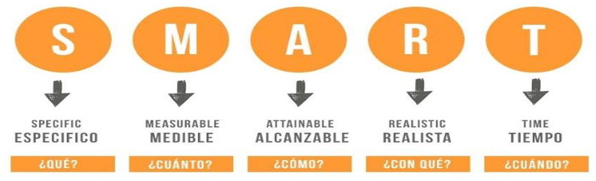

# Proyectos

## ¿Qué es un Proyecto?

Según la Guía del PMBOK – Sexta Edición, un proyecto se define como:

> “Un proyecto es un esfuerzo temporal y único que se lleva a cabo para generar un resultado que contribuye a generar un beneficio.”

Esta definición, aunque breve, encapsula características fundamentales que permiten diferenciar un proyecto de otras actividades dentro de una organización, como las operaciones o procesos continuos.

### Temporalidad

La primera característica esencial de un proyecto es que es temporal. Esto significa que tiene un inicio definido y un fin determinado, independientemente de si su duración es corta (días o semanas) o extensa (meses o incluso años). La temporalidad implica que:

Un proyecto no es una actividad permanente dentro de una organización.

Finaliza cuando se cumplen sus objetivos, cuando se determina que dichos objetivos no pueden alcanzarse o cuando se decide finalizarlo por otras razones.

Si bien puede extenderse, por ejemplo, por decisiones estratégicas o por contratiempos, no puede prolongarse indefinidamente. Es decir, no es una operación continua, sino una iniciativa que ocurre en un periodo de tiempo específico.

### Carácter Único

Otra característica clave de los proyectos es que son únicos. Esto significa que cada proyecto produce un resultado distinto, incluso si se parecen en forma o en objetivos a otros proyectos realizados previamente. Esta unicidad se manifiesta en aspectos como:

- Los objetivos específicos que se persiguen.
- Los recursos humanos y materiales involucrados.
- El entorno en el que se desarrolla.
- Los riesgos y desafíos que enfrenta.

Por ejemplo, dos proyectos para desarrollar una aplicación móvil pueden compartir tecnología y metodología, pero diferir en su diseño, funcionalidades específicas, usuarios objetivo o incluso en la cultura del equipo de trabajo. Por eso, nunca se puede afirmar que dos proyectos sean exactamente iguales.

### Resultados del Proyecto

Todo proyecto se orienta hacia la generación de un resultado concreto. Este resultado es el propósito final del proyecto: lo que se quiere construir, entregar, cambiar o mejorar. Los resultados pueden ser:

- Tangibles: Como un producto físico, una infraestructura, una herramienta tecnológica, etc.
- Intangibles: Como un servicio nuevo, una mejora en un proceso, una capacitación, una investigación de mercado, entre otros.

Algunos ejemplos de resultados posibles de un proyecto son:

- El desarrollo de una nueva versión de un producto, como una golosina con un nuevo sabor.
- La implementación de una mejora en la atención al público, como un sistema de tickets digitales.
- La remodelación de un local comercial para hacerlo más moderno y funcional.
- La realización de una investigación de mercado para estudiar la viabilidad de un nuevo producto.
- La implementación de iniciativas para lograr mayor motivación del personal, como programas de bienestar.
- El diseño y ejecución de una nueva campaña publicitaria en redes sociales para aumentar la visibilidad de una marca.

Estos resultados reflejan el objetivo último del proyecto, el cual debe contribuir de alguna forma a generar un beneficio, ya sea económico, social, organizacional o de otra índole.

## Restricciones

En la gestión de proyectos, las restricciones son condiciones, limitaciones o compromisos que determinan cómo se puede llevar a cabo un proyecto y qué es lo que se puede lograr dentro de él. Estas restricciones son inherentes a cualquier proyecto y deben ser cuidadosamente gestionadas, ya que impactan directamente en la planificación, ejecución y éxito del mismo.

Aunque pueden existir otras limitaciones específicas dependiendo del contexto, existen cuatro restricciones principales presentes en prácticamente todos los proyectos:

Alcance

- Define qué productos o resultados deben generarse a lo largo del proyecto.
- Incluye tanto los entregables finales como los intermedios.
- El alcance establece los límites del proyecto, evitando desviaciones o esfuerzos no planificados (lo que se conoce como scope creep).

Calidad

- Se refiere a los estándares o requisitos que deben cumplir los entregables del proyecto.
- Un entregable puede estar completo en términos de forma, pero no cumplir con los niveles de calidad esperados, por lo tanto, no se considera aceptable.
- Garantizar la calidad implica definir criterios claros de aceptación y verificación.

Tiempo

- Especifica el plazo disponible para completar el proyecto y entregar los productos finales.
- Incluye las fechas límite, los hitos importantes y la duración prevista de las actividades.
- Una gestión inadecuada del tiempo puede generar retrasos que afecten otros aspectos del proyecto, como los costos o la satisfacción del cliente.

Recursos

- Incluye la disponibilidad y asignación de personas, dinero, tecnología, equipamiento e infraestructura.
- Los recursos son limitados y deben ser gestionados con eficiencia para lograr los objetivos del proyecto sin sobrepasar el presupuesto ni comprometer la calidad.
- Estas restricciones están interrelacionadas: un cambio en una puede afectar directamente a las demás. Por ejemplo, si el alcance del proyecto se amplía, podría requerirse más tiempo, más recursos y ajustes en la calidad esperada.

## Entregables

Un entregable es cualquier producto tangible, servicio o impacto intangible que se obtiene como resultado del trabajo realizado en el proyecto. Representa el resultado concreto de una o varias actividades, y no debe confundirse con las actividades mismas.

Los entregables pueden clasificarse en:

- Entregables intermedios: Son productos o resultados que se generan durante el desarrollo del proyecto y sirven como base o parte del entregable final.

- Entregables finales: Representan el resultado principal del proyecto, el cual satisface el objetivo global para el cual fue diseñado.

Ejemplo:

- Objetivo final del proyecto: Aumentar la velocidad de atención a los usuarios en la oficina NNN.

- Entregables intermedios:
    - Procedimientos o guías del proceso de atención actualizadas.
    - Sistema informático ajustado a los nuevos requerimientos.
    - Personal capacitado para implementar los nuevos procesos.
    - Informe de medición que muestre la mejora en la velocidad de atención.

- Entregables finales:
    - Oficina funcionando con los nuevos procedimientos (impacto intangible).
    - Informe final de resultados (producto tangible).

Todo entregable dentro de un proyecto debe contar con los siguientes elementos:

- Atributos de calidad: Se establecen los estándares, normas o requisitos que deben cumplir los entregables para ser aceptados.
- Recursos humanos: Se define quién es el responsable de cada entregable (puede ser un empleado interno o un contratista externo).
- Recursos materiales: Presupuesto asignado, equipamiento necesario, espacios físicos, etc.
- Lista de actividades: Conjunto de tareas necesarias para construir el entregable, ordenadas secuencialmente.
- Cronograma: Fechas clave, duración estimada de las actividades, dependencias entre tareas.
- Metodología específica: Forma particular de construir o desarrollar el entregable, que puede incluir marcos de trabajo, tecnologías específicas, normas internas, etc.

## Objetivo Específico

El objetivo específico de un proyecto representa la acción concreta que se debe llevar a cabo para generar el resultado final previsto. Este objetivo define con precisión qué se va a hacer, cómo se va a lograr y cuándo se considera exitoso.

### Características

- Concreto y claro: El objetivo debe estar redactado en términos comprensibles y directos, sin ambigüedades.
- Medible: Debe incluir indicadores que permitan verificar su cumplimiento.
- Alcanzable: Debe ser realista y factible dentro del marco del proyecto.
- Temporal: Debe tener un marco de tiempo definido para su cumplimiento.
- Relevante: Tiene que estar alineado con las necesidades que originan el proyecto.

### Ejemplos

- Abrir un nuevo local de venta de cervezas en el barrio centro antes de diciembre.
- Crear y aplicar un nuevo procedimiento de atención al público en 3 meses.
- Disminuir el grado de insatisfacción de los clientes un 10% en el primer trimestre.
- Investigar una nueva tecnología de refrigeración en los próximos 6 meses.

Un objetivo específico no debe confundirse con un deseo, una intención general o una visión a largo plazo. Su función es servir como guía operativa del proyecto, detallando la acción que se va a ejecutar.

## Objetivos Generales o Propósitos del Proyecto

Mientras que el objetivo específico es una acción concreta, el objetivo general o propósito del proyecto responde a una pregunta clave:

¿Por qué se emprende este proyecto? ¿Qué se busca mejorar, cambiar o lograr a través de él?

- Representa una aspiración o necesidad, muchas veces surgida de una carencia detectada, una oportunidad o una exigencia externa.
- No siempre es cuantificable ni limitado al alcance del proyecto, pero el proyecto contribuye a alcanzarlo.
- Puede tener un carácter estratégico, social, organizacional o personal.
- Ayuda a entender el impacto más amplio del proyecto y su importancia dentro de un contexto mayor.

### Ejemplos

- Mejorar la experiencia del cliente en la atención presencial.
- Impulsar el crecimiento de la empresa en nuevos mercados.
- Posicionar una nueva línea de productos en el mercado local.
- Contribuir a la innovación tecnológica en la industria alimentaria.

Un proyecto puede tener varios propósitos u objetivos generales, dependiendo de los grupos involucrados o beneficiarios (clientes, empleados, sociedad, empresa, etc.). Identificarlos es esencial para generar compromiso, comunicación efectiva y motivación entre las partes interesadas.

## El Valor o Beneficio

Todo proyecto nace a partir de una necesidad o una exigencia, ya sea personal, organizacional o social. De ahí que uno de los elementos centrales al planificar y justificar un proyecto es identificar claramente el valor o beneficio que se espera obtener con su ejecución.

### Beneficios Tangibles

Aquellos que pueden medirse en términos concretos y tienen un impacto visible sobre los recursos o resultados de una organización o individuo.

- Aumento de ingresos o ganancias.
- Reducción de costos operativos.
- Expansión de la participación en el mercado.
- Cumplimiento de normativas legales.
- Incremento de la productividad.
- Alineación con la estrategia empresarial.

### Beneficios Intangibles

Se refieren a los beneficios difíciles de cuantificar directamente, pero que aportan valor estratégico, emocional o social.

- Mejora del prestigio institucional.
- Reconocimiento de marca.
- Beneficio público o comunitario.
- Aumento en la motivación de empleados.
- Apoyo a causas sociales.
- Desarrollo de conocimiento o innovación.

### Justificación del Proyecto

Un proyecto no se inicia por sí solo, sino porque alguien (persona, organización o grupo) necesita mejorar o cambiar una situación actual. Esta necesidad es la base para definir el propósito, el objetivo específico y los beneficios esperados, y constituye la motivación esencial para invertir recursos en el proyecto.

Comunicar de forma clara la necesidad y los beneficios del proyecto es clave tanto para obtener apoyo como para generar compromiso entre las partes involucradas.