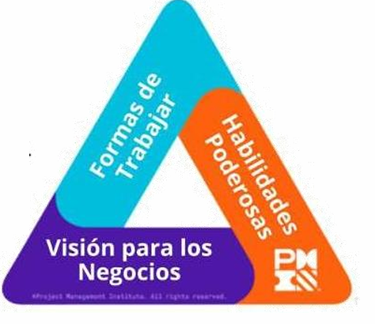

# Roles e interesados

## Dirección del Proyecto

El Director del Proyecto, también conocido como Project Manager (PM), Gerente de Proyecto, Coordinador o Responsable del Proyecto, es la figura central en la ejecución de un proyecto. Su papel es planificar, coordinar, controlar y supervisar todas las actividades necesarias para cumplir con los objetivos establecidos, en el marco de los tiempos, costos, calidad y alcance definidos.

Esta persona es asignada formalmente por la organización promotora del proyecto y tiene como principal responsabilidad lograr que el proyecto alcance sus metas de manera efectiva y eficiente. Dependiendo del tipo de estructura organizacional (funcional, matricial o proyectizada), el Director del Proyecto puede reportar a:

- Un director funcional (por ejemplo, el jefe del área de Tecnología).
- Un director de programas, si el proyecto forma parte de un programa mayor.
- Un director de portafolios, si forma parte de una cartera de proyectos.

Cuando el proyecto se ejecuta para un cliente externo o una organización contratante, es fundamental que dicho cliente también designe una figura equivalente, para facilitar las coordinaciones, la toma de decisiones y la ejecución fluida del proyecto.

Principales responsabilidades del Director del Proyecto:

- Definir y planificar el alcance del proyecto.
- Armar y liderar el equipo de trabajo.
- Controlar tiempos, costos, calidad y riesgos.
- Gestionar la comunicación con todas las partes interesadas.
- Asegurar el cumplimiento de los objetivos estratégicos del proyecto.

### Competencias y Habilidades

El Project Management Institute (PMI®) identifica un conjunto clave de habilidades necesarias para un buen desempeño en la dirección de proyectos, agrupadas en lo que se conoce como el Triángulo del Talento (PMI Talent Triangle®). Este triángulo incluye tres dimensiones esenciales:

1. Formas de Trabajar (Ways of Working)
Implica la capacidad de elegir y aplicar el enfoque metodológico adecuado para cada proyecto:

- Enfoque Predictivo (tradicional): útil en proyectos bien definidos, con poco margen de cambio.
- Enfoque Ágil: ideal para contextos cambiantes o innovadores, con entregas incrementales.
- Enfoque Híbrido: combinación de metodologías según las necesidades del proyecto.

También abarca el uso de herramientas y técnicas apropiadas, así como la adaptación al cambio, un aspecto crítico en entornos dinámicos.

2. Habilidades Poderosas (Power Skills)
Son las habilidades blandas que hacen a un liderazgo efectivo y a la gestión de equipos:

- Liderazgo inspirador y ético.
- Comunicación clara y eficaz.
- Negociación y resolución de conflictos.
- Motivación, delegación de tareas y gestión del desempeño del equipo.

Estas competencias son clave para lograr cohesión, compromiso y productividad en los equipos.

3. Visión del Negocio (Business Acumen)
El Project Manager debe comprender el contexto estratégico y operativo de la organización:

- Alinear el proyecto con los objetivos de negocio y las necesidades del cliente.
- Buscar crear valor continuamente a través de los entregables del proyecto.
- Comprender el impacto de las decisiones del proyecto en el negocio en general.

## Patrocinadores

El Patrocinador del Proyecto es una figura fundamental que actúa como impulsor y facilitador del proyecto. Generalmente es un miembro de la alta dirección o un representante con capacidad de decisión, que tiene un interés personal o institucional en el éxito del proyecto.

Su rol no implica la gestión diaria, sino que proporciona dirección estratégica, apoyo político y recursos clave (presupuesto, personal, equipamiento), facilitando que el Project Manager pueda ejecutar el plan con respaldo y autoridad.

- Posee poder de influencia y toma de decisiones a nivel estratégico.
- Está comprometido activamente con el éxito del proyecto.
- Facilita la resolución de conflictos de alto nivel.
- Ayuda a remover obstáculos organizacionales que pueden interferir con la ejecución del proyecto.
- Valida entregables clave y autoriza fases importantes del proyecto.

Ejemplos de Patrocinadores:

- Un director o gerente funcional, en proyectos sectoriales internos.
- Un Comité de Dirección, en proyectos transversales que afectan varias áreas.
- Un gerente cliente, en proyectos tercerizados.

En el caso de proyectos para una organización externa, debe identificarse un patrocinador también del lado del cliente, para asegurar una relación fluida y cooperativa.

## Equipos de Apoyo

Los Equipos de Apoyo a la Gestión del Proyecto cumplen una función clave en la ejecución exitosa del proyecto, ya que asisten directamente al Gerente del Proyecto en tareas específicas relacionadas con la planificación, seguimiento y control del proyecto. Su rol se centra en optimizar la gestión y liberar al líder del proyecto de tareas operativas, permitiéndole concentrarse en la dirección estratégica y la toma de decisiones críticas.

- Apoyar en la gestión de costos (presupuestos, informes financieros).
- Elaborar y controlar el cronograma del proyecto.
- Coordinar la comunicación con stakeholders internos y externos.
- Gestionar la relación con proveedores.
- Colaborar en tareas de seguimiento y reporte de avances.
- Facilitar la coordinación entre distintos equipos técnicos o de desarrollo.

Características:

- La existencia y tamaño de estos equipos depende de factores como la complejidad del proyecto, la disponibilidad de recursos humanos, y la experiencia del Gerente del Proyecto.
- Generalmente, trabajan bajo una metodología común de gestión de proyectos, que puede estar definida por la organización y liderada por el propio director del proyecto.
- Pueden estar asignados durante toda la duración del proyecto o solamente en etapas específicas (inicio, planificación, ejecución, cierre).

## Equipos de Construcción / Desarrollo de Entregables

Los Equipos de Construcción o Desarrollo de Entregables están conformados por los profesionales y técnicos encargados de crear, construir, implementar y validar los productos o servicios que el proyecto busca entregar. Estos equipos son, en definitiva, los responsables directos de materializar los resultados del proyecto.

- Pueden ser personas individuales o equipos completos, y pueden pertenecer tanto a la organización promotora como ser externos contratados.
- Su labor incluye: diseño, construcción, pruebas, y puesta en producción del entregable (por ejemplo, software, infraestructura, eventos, capacitaciones, productos físicos, etc.).
- Utilizan su propia metodología especializada, adaptada al tipo de entregable que están construyendo. Ejemplos:
    - Scrum o XP (Extreme Programming) para proyectos de software.
    - Metodologías de obra para la construcción edilicia.
    - Modelos instruccionales en el caso de desarrollo de capacitaciones o eventos.

Roles dentro del equipo:

- Scrum Master, Product Owner, Developer, Tester (en proyectos ágiles).
- Arquitecto, Jefe de Obra, Proyectista, Técnico, Encargado, entre otros.

Cada equipo de desarrollo tiene un jefe o coordinador, quien actúa como punto de contacto con el Gerente del Proyecto, al cual rinde cuentas y con quien coordina aspectos críticos como el presupuesto, cronograma y recursos asignados.

## Colaboradores

Los Colaboradores del Proyecto son áreas o personas que no forman parte directamente del equipo principal del proyecto, pero cuya participación puntual o especializada resulta fundamental para el desarrollo y/o gestión del proyecto. Estos colaboradores, aunque no estén completamente dedicados al proyecto, aportan recursos, servicios o conocimientos técnicos esenciales en momentos específicos.

- Son parte de la estructura funcional de la organización.
- Participan de manera intermitente o a demanda.
- Su colaboración puede estar dirigida tanto a facilitar la gestión del proyecto, como a apoyar la producción de los entregables.

Ejemplos:

- Área de Tecnología Informática: Instalación de software, configuración de equipos, conectividad, soporte técnico.
- Área de Compras/Adquisiciones: Procesos de licitación, contratación de proveedores, gestión de importaciones.
- Recursos Humanos / Gestión Humana: Reclutamiento, selección de personal, coordinación de capacitaciones, reservas de salas o recursos logísticos.
- Finanzas o Contaduría: Seguimiento presupuestario, pagos, rendiciones.

## Partes Interesadas (Stakeholders)

En la gestión de proyectos, se denomina partes interesadas o stakeholders a todas aquellas personas, grupos u organizaciones que pueden influir, verse influidos o percibirse como afectados por el desarrollo o los resultados del proyecto. Estas partes interesadas pueden estar dentro de la organización promotora o ser externas a ella, y su papel puede variar significativamente a lo largo del ciclo de vida del proyecto.

- Afectan o son afectados por el proyecto, ya sea directa o indirectamente.
- Pueden influir en el proyecto antes, durante y después de su finalización.
- Pueden ser internos (miembros de la organización) o externos (clientes, proveedores, entes regulatorios, etc.).
- Pueden aparecer en cualquier momento, incluso durante la ejecución o cierre del proyecto.
- Deben ser identificados desde el inicio, y su identificación debe mantenerse actualizada a lo largo del proyecto.
- Es fundamental que sean gestionados proactivamente, atendiendo sus intereses, expectativas, preocupaciones y nivel de influencia.

La gestión de stakeholders implica mantener una comunicación adecuada, establecer relaciones de colaboración y reducir posibles resistencias, lo que contribuye al éxito del proyecto.

### Grupos Comunes

A continuación se presentan algunos de los grupos más frecuentes de partes interesadas. Estos no son excluyentes entre sí y pueden superponerse según el contexto del proyecto:

▪ Clientes del Proyecto
Son las personas, áreas internas o entidades externas que impulsan la creación del proyecto y esperan obtener beneficios concretos a partir de sus resultados. Suelen tener una alta participación en la definición de objetivos, requerimientos y prioridades.

▪ Usuarios de los Productos o Resultados
Representan a quienes utilizarán el producto, servicio o resultado que genere el proyecto. Su feedback es clave para asegurar que los entregables satisfagan las necesidades reales.

▪ Proveedores
Pueden ser organizaciones externas o departamentos internos que proveen recursos, servicios o productos esenciales para ejecutar el proyecto. Incluyen proveedores de tecnología, materiales, consultorías, mano de obra especializada, entre otros.

▪ Colaboradores del Proyecto
Son áreas o personas que, aunque no forman parte del equipo central del proyecto, colaboran en momentos puntuales brindando soporte, conocimientos o recursos específicos. Por ejemplo, las áreas de informática, adquisiciones, o recursos humanos.

▪ Otros Stakeholders
En función del tipo de proyecto, pueden intervenir otras partes interesadas relevantes, como:

- Organismos gubernamentales o municipales.
- Sindicatos o asociaciones laborales.
- Competidores (en el caso de proyectos que impliquen innovación estratégica).
- ONGs, organismos internacionales o entes reguladores.
- Comunidades afectadas por la ejecución del proyecto (en obras de infraestructura, por ejemplo).

### Aportes e Influencia

Las partes interesadas tienen una influencia significativa sobre el rumbo, la ejecución y el éxito de un proyecto. Pueden actuar como aliados estratégicos o representar riesgos si sus intereses no son gestionados adecuadamente.

Entre sus principales aportes e impactos podemos destacar:

- Definición de requisitos: Ayudan a especificar las características, funcionalidades y criterios de éxito de los entregables del proyecto.
- Asesoramiento técnico o normativo: Brindan conocimientos valiosos para ejecutar el proyecto según estándares, regulaciones y buenas prácticas.
- Detección de riesgos u oportunidades: Pueden advertir sobre posibles obstáculos o beneficios adicionales que el equipo del proyecto no había considerado.
- Aprobaciones o bloqueos: Pueden apoyar el proyecto con recursos, decisiones y legitimidad institucional, o bien bloquear su avance si consideran que no se respetan sus intereses.
- Apoyo y motivación: Algunos stakeholders, como los patrocinadores, pueden facilitar el acceso a recursos estratégicos y generar sinergias positivas dentro de la organización.

### Importancia

La gestión efectiva de los stakeholders es una disciplina clave dentro de la dirección de proyectos. Involucra actividades como:

- Identificación y clasificación (poder, interés, influencia).
- Comunicación estratégica.
- Participación activa.
- Manejo de conflictos.
- Revisión continua del mapa de interesados.

Un proyecto que ignora las expectativas o necesidades de sus stakeholders corre el riesgo de enfrentar resistencias, bloqueos o falta de legitimidad, incluso si cumple con los entregables técnicos. En cambio, una adecuada gestión puede ser determinante para el éxito y la sostenibilidad de los resultados del proyecto.

## Identificación y Gestión de las Partes Interesadas del Proyecto

La identificación de las partes interesadas (stakeholders) es una actividad crítica en las etapas iniciales del proyecto, y su gestión debe mantenerse a lo largo de todo el ciclo de vida del mismo. Una correcta identificación permite anticiparse a posibles conflictos, potenciar apoyos clave y alinear expectativas, mejorando así las probabilidades de éxito del proyecto.

### Técnicas y Herramientas para Identificar Interesados

Para llevar adelante la identificación de stakeholders, se pueden aplicar diversas técnicas, tanto cualitativas como participativas. Estas permiten obtener una visión amplia y precisa sobre quiénes tienen interés, poder o influencia en el proyecto:

- Juicio de expertos: Consultas a referentes técnicos, asesores internos o externos, que por su experiencia pueden anticipar interesados relevantes.
- Reuniones: Sesiones iniciales con el equipo del proyecto y partes involucradas que permitan discutir y mapear a los stakeholders.
- Encuestas y cuestionarios: Instrumentos útiles para recopilar percepciones y expectativas desde distintos sectores de la organización o del entorno.
- Tormentas de ideas: Dinámicas grupales que fomentan la generación abierta de posibles interesados, sin descartar opciones en primera instancia.
- Análisis de documentos: Revisión de documentos institucionales, estudios previos, contratos, organigramas, etc., para detectar posibles interesados formales o informales.

### Análisis de los Interesados

Una vez identificados, se realiza un análisis cualitativo de cada interesado con el objetivo de comprender su posición frente al proyecto y definir acciones adecuadas para gestionarlo.

Este análisis implica considerar los siguientes aspectos:

- Tipo de interés: ¿Apoya, se opone, es neutral o tiene una posición indefinida?
- Causas del interés o posición: ¿Qué motiva su actitud? ¿Qué aspectos del proyecto lo benefician o perjudican?
- Nivel de influencia o poder: ¿Puede aportar recursos, tomar decisiones clave, bloquear avances, o actuar como promotor?
- Acciones a considerar: ¿Qué tipo de gestión se requiere? ¿Conviene informar, involucrar, negociar, observar o empoderar?

### Herramientas para el Análisis y Gestión de Stakeholders

Para organizar y visualizar esta información, se utilizan herramientas específicas como:

▪ Registro o Matriz de Interesados

Una tabla que detalla información clave de cada stakeholder:

- Interesado
- Interés
- Causa del Interés
- Influencia
- Momento de intervención
- Rol en el proyecto
- Acciones necesarias

▪ Matrices de representación

Visualizaciones gráficas que permiten clasificar y priorizar stakeholders según diferentes criterios.

▪ Modelo de prominencia

Considera tres dimensiones: poder, legitimidad y urgencia, ayudando a identificar el tipo de atención que cada stakeholder requiere.

▪ Matriz de Poder / Interés

Una de las más utilizadas, clasifica a los interesados según su nivel de poder y su grado de interés en el proyecto:

| Poder / Interés | Bajo Interés                                | Alto Interés                                                 |
|-----------------|---------------------------------------------|--------------------------------------------------------------|
| Alto Poder      | Informar y observar (Latentes)              | Involucrar permanentemente (Promotores o Patrocinadores)     |
| Bajo Poder      | Promover e informar (Apáticos)              | Mantener informados y considerar aportes (Defensores o Aliados) |

### Gestión Continua de los Stakeholders

Identificar a los interesados es solo el primer paso. Su gestión debe ser proactiva y continua durante todo el proyecto, dado que:

- Pueden surgir nuevos interesados en distintas etapas.
- Su nivel de interés o influencia puede variar con el avance del proyecto.
- Sus reacciones pueden representar riesgos o oportunidades.

Por ello, es fundamental que el equipo del proyecto:

- Mantenga el tema en agenda durante las reuniones de seguimiento.
- Actualice el registro de interesados ante cualquier cambio.
- Defina y ejecute acciones de comunicación y relación adecuadas según el tipo de stakeholder.

Una buena gestión de stakeholders implica saber comunicar, negociar, escuchar y actuar con inteligencia política, garantizando el alineamiento entre los objetivos del proyecto y las expectativas del entorno.