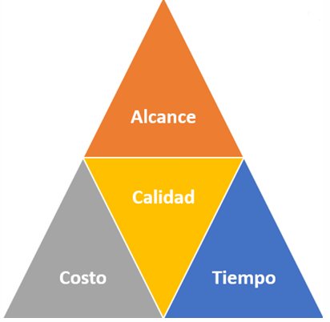

# Restricciones, oportunidades y riesgos

## Restricciones en un Proyecto

En la gestión de proyectos, las restricciones son aquellos límites, condiciones o compromisos que determinan hasta dónde puede llegar un proyecto y cómo debe llevarse a cabo. No son obstáculos per se, sino marcos dentro de los cuales el proyecto debe desenvolverse.

Las restricciones son fundamentales porque condicionan las decisiones de planificación, ejecución y control, y cualquier cambio en una de ellas suele impactar en las demás. Por esta razón, se habla muchas veces del "triángulo de restricciones", aunque hoy en día es más común hablar de cuatro restricciones clásicas que están presentes en casi todos los proyectos.

### Las Cuatro Restricciones Clásicas

#### 1. Alcance

Define qué entregables debe producir el proyecto, tanto los finales como los intermedios. También incluye los límites del trabajo, es decir, qué sí está incluido en el proyecto y qué no lo está.

- Un alcance bien definido permite evitar desviaciones, confusiones o tareas innecesarias.
- Una mala definición de alcance puede llevar al temido scope creep (incremento no controlado del alcance), que desbalancea al proyecto.

#### 2. Calidad

Establece los requisitos técnicos, funcionales o normativos que deben cumplir los entregables para que puedan considerarse terminados correctamente y aceptados.

- Puede estar relacionada con normas específicas, expectativas del cliente, buenas prácticas o requisitos legales.
- La calidad no solo afecta al producto final, sino también a los procesos utilizados para crearlo.

#### 3. Tiempo

Se refiere al plazo máximo que se tiene para completar el proyecto y entregar los productos acordados.

- Puede estar definido por contratos, necesidades estratégicas, ciclos económicos, etc.
- Incluye fechas clave como hitos, entregas parciales, o el plazo total.

#### 4. Recursos

Incluye todo lo necesario para ejecutar el proyecto: personas, presupuesto, equipamiento, tecnología e infraestructura.

- La disponibilidad o escasez de estos recursos puede determinar el ritmo y la calidad del trabajo.
- El presupuesto suele ser uno de los recursos más sensibles a cambios.

### Origen de las Restricciones

Las restricciones pueden venir de diferentes fuentes:

- Externas al proyecto, impuestas por el cliente, patrocinadores, leyes o el entorno.
- Internas a la organización, como políticas institucionales o decisiones estratégicas.
- Desde el propio equipo de proyecto, cuando al planificar se acuerdan límites razonables.

Al iniciar el proyecto, estas restricciones se consolidan en lo que se llama la línea base del proyecto, que funciona como el marco de referencia oficial para su ejecución.

### La Línea Base del Proyecto

La línea base representa la versión original del plan del proyecto, incluyendo:

- Lista definida de entregables.
- Plazos comprometidos y fechas límite.
- Presupuesto asignado y recursos disponibles.
- Niveles de calidad esperados.

Esta línea base permite realizar comparaciones para evaluar desempeño y tomar decisiones en caso de desvíos.

### Balanceo de la Línea Base

En la práctica, es común que surjan cambios imprevistos durante la ejecución del proyecto. Ante estos cambios, se debe realizar un balanceo de restricciones, es decir, ajustar unas restricciones para poder cumplir con otras.

Ejemplos de balanceo:

- Se solicita un nuevo entregable, pero no se puede aumentar el presupuesto → Se debe reducir el nivel de calidad de otros productos o eliminar otro entregable.

- Se imponen nuevas exigencias legales (por ejemplo, accesibilidad web), pero no se pueden extender los plazos → Puede ser necesario reestructurar el equipo, tercerizar tareas o descartar funcionalidades no críticas.

- Se necesita acortar el tiempo de entrega, pero sin aumentar recursos → Puede que se deba reducir el alcance o aceptar ciertos compromisos de calidad.

Este equilibrio es responsabilidad del gerente del proyecto y debe hacerse en consenso con los interesados relevantes.

### Otras Posibles Restricciones

Además de las clásicas, pueden existir otras restricciones contextuales o específicas según el tipo de proyecto:

- Legales o regulatorias: Normas que el proyecto debe cumplir (ej. normas ambientales, licencias, propiedad intelectual).
- Culturales: Creencias, valores o costumbres que influyen en cómo se ejecuta el proyecto (muy importante en proyectos internacionales).
- Geográficas: Ubicación física que impone desafíos logísticos o técnicos (como conectividad, acceso, clima).
- Estratégicas: Restricciones definidas por decisiones de alto nivel dentro de la organización (como alineamiento con políticas corporativas o imagen institucional).

## Supuestos, Riesgos y Oportunidades

En la gestión de proyectos, es fundamental anticipar lo que podría pasar durante la ejecución. Para ello, el equipo de proyecto identifica y analiza tres tipos de elementos clave:

1. Riesgos (o amenazas)
2. Oportunidades (o palancas)
3. Supuestos (condiciones que se asumen como ciertas)

Todos estos factores, aunque distintos, están interrelacionados y pueden impactar significativamente el desarrollo, la planificación y el éxito del proyecto.

### 1. Riesgos (Amenazas)

Un riesgo es cualquier factor o situación futura e incierta que, de concretarse, podría generar un impacto negativo en el proyecto, afectando el cumplimiento de sus objetivos, entregables, cronograma, costos o calidad.

Ejemplos comunes de riesgos:

- Atrasos en entregables importantes.
- Presupuesto insuficiente para completar tareas planificadas.
- Errores técnicos en entregables o productos.
- Insatisfacción de partes interesadas clave.
- Baja disponibilidad de recursos humanos.

Claves para gestionar los riesgos:

- Identificarlos desde el inicio y de forma continua.
- Evaluar su probabilidad de ocurrencia y nivel de impacto.
- Planificar respuestas para mitigar o evitar sus consecuencias.
- Monitorearlos permanentemente durante todo el proyecto.

### 2. Oportunidades (Palancas)

Una oportunidad es un evento o condición incierta que, si se presenta, puede tener un impacto positivo en el proyecto, ya sea facilitando su desarrollo o mejorando sus resultados.

Ejemplos de oportunidades:

- Incorporar nuevos entregables que generen mayor valor sin afectar el plazo.
- Capacitar al equipo en temas alineados con objetivos estratégicos de la organización.
- Obtener el apoyo de nuevas partes interesadas que sumen recursos o visibilidad.
- Captar nuevos clientes gracias al impacto indirecto del proyecto.

Claves para aprovechar oportunidades:

- Identificarlas proactivamente.
- Evaluar su beneficio potencial y viabilidad.
- Diseñar acciones específicas para materializarlas.
- Monitorear el entorno del proyecto, ya que las oportunidades pueden surgir en cualquier momento.

### 3. Supuestos

Los supuestos son condiciones o situaciones que se consideran ciertas al momento de planificar el proyecto, aunque no haya garantías de que efectivamente ocurran. Son necesarios para avanzar con la planificación, pero si no se cumplen, pueden convertirse en riesgos reales.

Ejemplos de supuestos:

- Que ciertas partes interesadas brindarán apoyo al proyecto.
- Que los recursos humanos y técnicos estarán disponibles cuando se necesiten.
- Que los entregables pueden completarse dentro del presupuesto asignado.
- Que no habrá cambios importantes en las regulaciones legales.

Claves para gestionar los supuestos:

- Listarlos explícitamente desde la planificación.
- Evaluar su nivel de incertidumbre y su posible impacto si no se cumplen.
- Transformarlos en riesgos si su cumplimiento se vuelve incierto.
- Revaluarlos constantemente a medida que avanza el proyecto.

### Actividades para Identificar Riesgos, Oportunidades y Supuestos

Para detectar y analizar estos elementos, se pueden aplicar diversas técnicas colaborativas y de análisis, tales como:

- Juicio de expertos: Consultar a personas con experiencia en proyectos similares.
- Reuniones con interesados: Recoger información directamente de quienes se ven afectados o participan en el proyecto.
- Tormentas de ideas: Generar colectivamente una lista amplia de posibles eventos positivos o negativos.
- Análisis de documentación: Revisar informes, lecciones aprendidas o documentación de proyectos anteriores o similares.

### Evolución y Monitoreo Durante el Proyecto

Es fundamental que el equipo de proyecto se mantenga atento durante toda la ejecución, ya que los riesgos, oportunidades y supuestos pueden cambiar con el tiempo, especialmente por:

- Cambios en las restricciones del proyecto (alcance, tiempo, calidad, recursos).
- Cambios en el entorno organizacional (estrategias, personas, prioridades).
- Cambios en el contexto externo (situaciones económicas, sociales, legales, tecnológicas).

¿Qué implica esto?

- Nuevos riesgos pueden surgir en cualquier momento.
- Supuestos que se consideraban válidos pueden dejar de serlo.
- Oportunidades no previstas pueden abrirse y generar beneficios adicionales.

Es necesario revisar regularmente estos temas en las reuniones de seguimiento del proyecto y definir las acciones correspondientes para adaptar la planificación.

## Formalización del Proyecto

¿Qué es el Acta de Constitución del proyecto?

El Acta de Constitución es el documento formal que marca el inicio oficial de un proyecto dentro de una organización. Es la primera gran señal de que el proyecto existe, tiene respaldo, y cuenta con autorización para utilizar recursos.

### Propósitos clave del Acta

- Autorizar el inicio del proyecto
    - Se reconoce oficialmente la existencia del proyecto dentro de la organización.
    - Se define su legitimidad ante los demás actores institucionales.

- Designar al Director del Proyecto
    - Le da autoridad para gestionar recursos y tomar decisiones.
    - El Project Manager (o Gerente de Proyecto) ya puede empezar la planificación.

- Comunicar el proyecto a la organización
    - Se puede distribuir a los actores clave para que conozcan la iniciativa.
    - Sirve como una primera fuente de información básica.

- Base para la planificación
    - Contiene la información conocida hasta ese momento.
    - Guía la etapa de planificación donde se detallarán todos los aspectos.

### ¿Quién lo elabora y quién lo firma?

- Responsable de confección: El Patrocinador del Proyecto (Sponsor).
- Participan en su elaboración:
    - El Director del Proyecto.
    - El Patrocinador.
    - Otros actores clave identificados desde el inicio.
- Firma final: La hace el Patrocinador, dando el aval formal.

En proyectos con clientes externos, el Acta de Constitución puede complementar al contrato comercial, aportando una visión más técnica y operativa del trabajo a realizar.

### ¿Qué información incluye el Acta de Constitución?

| Elemento                  | Descripción                                                                 |
|---------------------------|------------------------------------------------------------------------------|
| Nombre del proyecto       | Título o denominación formal.                                               |
| Objetivo general          | Qué se quiere lograr con el proyecto.                                       |
| Alcance preliminar        | Qué incluye y qué no el proyecto.                                           |
| Cronograma preliminar     | Fechas estimadas de inicio y fin.                                           |
| Presupuesto estimado      | Recursos económicos iniciales asignados.                                    |
| Patrocinador              | Persona o área que impulsa y financia el proyecto.                          |
| Director del proyecto     | Persona responsable de llevarlo adelante.                                   |
| Actores clave             | Personas o áreas que pueden influir en el proyecto o ser afectadas.         |
| Riesgos iniciales         | Riesgos conocidos al inicio.                                                |
| Supuestos y restricciones | Condiciones asumidas y limitaciones conocidas.                              |

### Recomendaciones

- Reunirse con el Patrocinador: Para entender bien la visión, expectativas y límites del proyecto.
- Consultar a actores clave: Obtener información clave, necesidades, recomendaciones, y detectar posibles conflictos o resistencias.
- Identificar riesgos, oportunidades y supuestos tempranamente: Esto facilita el inicio del análisis para la planificación.
- Aprender de la experiencia: Revisar documentación y lecciones aprendidas de proyectos anteriores parecidos.
- No prometer nada todavía: El Acta es un punto de partida, no debe incluir compromisos detallados sin un análisis profundo (esto vendrá en la planificación).

La elaboración del Acta no debería extenderse demasiado. Su objetivo es marcar el inicio y guiar la planificación, no resolver todos los detalles desde el inicio.

### Relación con la Planificación

Una vez que el Acta está aprobada y firmada, el proyecto avanza hacia la etapa de planificación, donde se confecciona el Plan del Proyecto (también llamado a veces Formulación del proyecto o Enunciado del alcance).

Este nuevo documento:

- Desarrolla con mayor profundidad los elementos del Acta.
- Incorpora nuevos detalles: recursos específicos, cronogramas ajustados, planes de gestión de calidad, comunicación, riesgos, etc.
- Refina los supuestos iniciales con información más precisa.