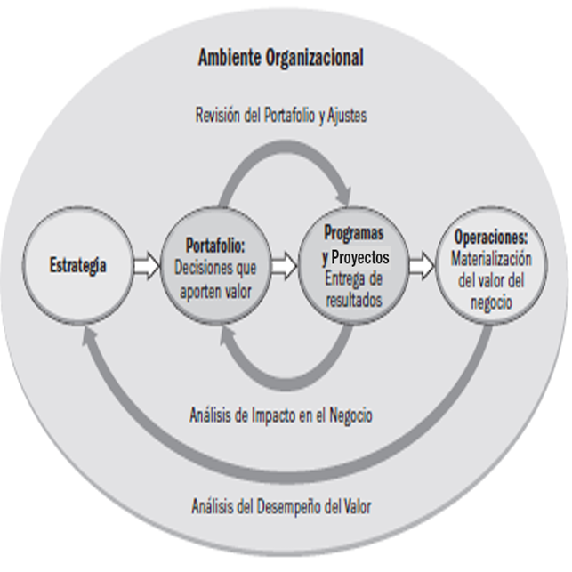
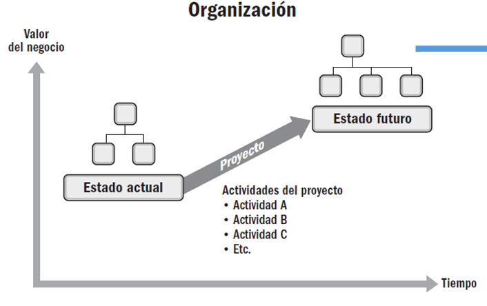
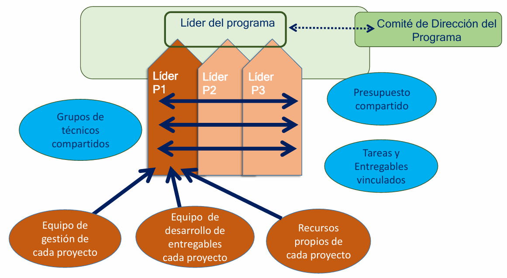
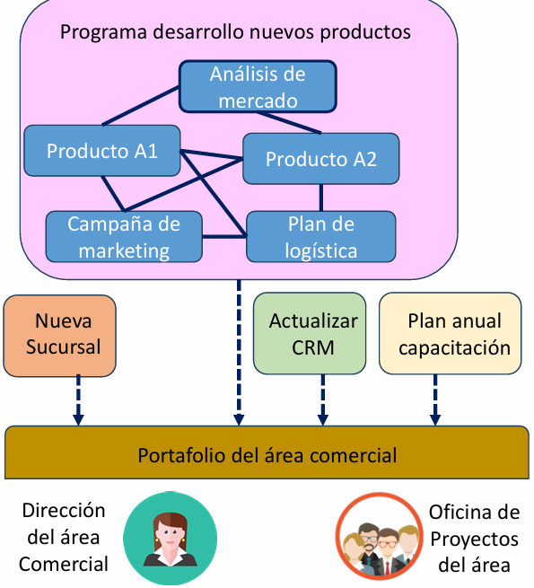

# Entorno Organizacional: Estrategia, Portafolios, Programas, Proyectos y Operaciones

En cualquier organización —ya sea una empresa grande, una pequeña organización, un área específica o incluso un grupo de empleados— las actividades que se realizan están orientadas a cumplir con ciertos objetivos estratégicos. Para lograr esos objetivos, se utilizan diferentes mecanismos de acción, y dos de los más importantes son: las operaciones y los proyectos.

Ambos coexisten dentro del entorno organizacional, pero cumplen funciones distintas. Las operaciones mantienen el negocio en funcionamiento, mientras que los proyectos impulsan el cambio.

## Proyectos y su vínculo con la estrategia

Los proyectos dentro de una organización no son eventos aislados ni improvisados. Por el contrario, responden a un alineamiento estratégico. Las organizaciones definen una estrategia que refleja su visión, misión y objetivos a largo plazo. Para alcanzar esos objetivos, implementan una serie de iniciativas, entre las que se encuentran los proyectos.

La ejecución de proyectos forma parte de una jerarquía estructurada que también incluye portafolios y programas:

- Estrategia: Es la guía general que orienta el rumbo de la organización. Define hacia dónde quiere ir la empresa, qué quiere lograr, y en qué áreas va a competir o enfocarse.

- Portafolio: Es el conjunto de todos los proyectos, programas y otros trabajos agrupados para facilitar su gestión y alinearlos con los objetivos estratégicos.

- Programa: Es un grupo de proyectos relacionados entre sí que se gestionan de forma coordinada para obtener beneficios que no se conseguirían si se gestionaran por separado.

- Proyecto: Es un esfuerzo temporal emprendido para crear un producto, servicio o resultado único. Tiene un inicio y un fin, y requiere recursos y planificación.

- Operaciones: Son actividades permanentes, repetitivas y continuas que sostienen el funcionamiento habitual de la organización.

### Diferencias clave entre Proyectos y Operaciones

Una distinción esencial dentro del entorno organizacional es la que se establece entre proyectos y operaciones. Aunque ambos pueden compartir recursos, interactuar y estar conectados, sus características son muy distintas:

➤ Operaciones

Las operaciones son las actividades regulares que mantienen el negocio en marcha. Se trata de procesos estables, repetitivos y continuos, como puede ser la atención al cliente, la producción de bienes, el mantenimiento de sistemas, la contabilidad, entre otros.

Estas operaciones suelen estar documentadas en procedimientos y políticas organizacionales y se realizan sin una fecha de finalización específica. El equipo encargado suele estar formado por personal permanente, con funciones bien definidas y expectativas claras sobre los resultados. En general, las operaciones implican un alto grado de certeza respecto a lo que se debe hacer y a los resultados que se van a obtener.

➤ Proyectos

En cambio, los proyectos son iniciativas temporales, diseñadas para lograr un objetivo específico, como el desarrollo de un nuevo producto, la implementación de un nuevo sistema, o la construcción de una infraestructura. Cada proyecto tiene un inicio y un fin claramente definidos, y su ejecución involucra incertidumbre y riesgos, ya que se trata de algo nuevo o diferente.

Los equipos de proyecto suelen ser temporales o mixtos, con miembros que trabajan en distintas áreas o que se asignan solo por la duración del proyecto. A menudo, se documentan menos procedimientos al inicio, y muchas decisiones se toman sobre la marcha, a medida que el proyecto evoluciona.

### Relación entre proyectos y operaciones

Aunque son diferentes, proyectos y operaciones se complementan. Un proyecto puede ser iniciado para mejorar o cambiar una operación existente, y, a su vez, una operación puede estar involucrada en apoyar la ejecución de un proyecto.

Por ejemplo:

- Un proyecto puede desarrollar un nuevo software que, una vez finalizado, pasará a ser mantenido por el equipo de operaciones.
- Un área operativa puede asignar parte de su personal para colaborar temporalmente en un proyecto estratégico.

### Impacto de los proyectos en la organización

Los proyectos tienen un rol clave en la evolución y adaptación de las organizaciones. Su principal función es impulsar el cambio, y este cambio puede materializarse de varias formas:

- Hacer más eficientes las operaciones: A través de nuevos procesos o herramientas que aumentan la productividad.
- Incrementar la efectividad: Lograr mejores resultados con los mismos recursos, o incluso menos.
- Implementar nuevas estrategias de negocio: Por ejemplo, lanzar un nuevo canal de ventas o automatizar la atención al cliente.
- Cumplir con nuevas normativas: Cuando la legislación cambia o aparecen nuevos requisitos sociales, los proyectos permiten adaptarse.
- Ofrecer mejores productos o servicios: Rediseñar una línea de productos, crear nuevas funcionalidades o mejorar la experiencia del cliente.

A veces, un solo proyecto es suficiente para lograr el cambio deseado. En otras ocasiones, se requiere un grupo de proyectos relacionados que trabajen en conjunto. En ese caso, se puede hablar de un programa orientado a transformar una parte significativa de la organización.

## Programa de Proyectos

Un programa es una agrupación estructurada de proyectos que están relacionados entre sí, ya sea porque comparten objetivos, recursos o tienen interdependencias técnicas, temporales o estratégicas. A diferencia de gestionar cada proyecto por separado, hacerlo dentro de un programa permite una gestión coordinada y sinérgica, lo cual potencia los beneficios globales que se pueden obtener.

Por ejemplo, si una empresa decide lanzar una nueva línea de productos, ese gran objetivo puede descomponerse en varios proyectos: uno para investigar el mercado, otro para diseñar el producto, otro para fabricar los prototipos, y otro para lanzar campañas publicitarias. Estos proyectos pueden —y deben— gestionarse de forma integrada, compartiendo conocimientos, equipos, recursos y cronogramas.

El valor de un programa no está solo en la ejecución individual de cada proyecto, sino en cómo colaboran entre sí para lograr un propósito común más grande. Esto también permite optimizar recursos, reducir costos y minimizar riesgos.

### Beneficios de gestionar proyectos como un programa

- Centralización de compras: Al agrupar proyectos que requieren insumos similares, es posible hacer compras más grandes y negociar mejores precios, reduciendo costos significativamente.
- Unificación de criterios técnicos: Los entregables de diferentes proyectos pueden seguir los mismos estándares de calidad, diseño o documentación, haciendo más fácil su integración o mantenimiento posterior.
- Coordinación de equipos: Es posible que el mismo grupo de personas trabaje en varios proyectos relacionados, lo que mejora la comunicación y reduce tiempos de adaptación.
- Gestión compartida del conocimiento y los riesgos: Se pueden compartir las lecciones aprendidas de un proyecto con los demás del programa, y manejar los riesgos de manera global, anticipando problemas antes de que se repitan.

Además, una correcta gestión de los cronogramas permite que los proyectos interdependientes no se bloqueen entre sí, asegurando que un retraso en uno no paralice todo el programa.

### Roles clave en un programa

- Director del programa: Es la persona responsable de coordinar la ejecución de todos los proyectos dentro del programa. Debe asegurarse de que trabajen alineados, optimizando recursos y tiempos, y resolviendo conflictos entre proyectos.

- Patrocinador del programa: Es quien promueve el programa desde un rol más alto, generalmente un gerente o directivo. Proporciona el respaldo político, financiero y estratégico necesario para su éxito.

## Portafolio de Proyectos y Programas

El portafolio es una categoría más amplia. Se refiere a la agrupación de proyectos y programas, que pueden o no estar relacionados directamente entre sí, pero que en conjunto contribuyen a los objetivos estratégicos de la organización o de un área específica.

Por ejemplo, una empresa puede tener un portafolio del área comercial que incluya proyectos como la apertura de una nueva sucursal, la actualización del sistema de atención al cliente (CRM), y un programa completo de desarrollo de nuevos productos. Aunque estos proyectos y programas no estén conectados entre sí de forma técnica o operativa, todos responden a una misma visión estratégica: hacer crecer el área comercial.

### Beneficios de gestionar un portafolio

- Alineación estratégica global: La gestión del portafolio garantiza que los recursos estén invertidos en iniciativas que realmente aporten valor a la organización.
- Homogeneidad en procesos de gestión: Establecer metodologías comunes de planificación, seguimiento y evaluación mejora la eficiencia.
- Control presupuestal centralizado: Permite tomar decisiones más inteligentes sobre en qué proyectos o programas conviene invertir más, y cuáles podrían suspenderse si no son prioritarios.
- Evaluación previa de iniciativas: Antes de aprobar un proyecto, se realiza un análisis del caso de negocio, evaluando viabilidad, riesgos, retorno esperado, etc.
- Asignación eficiente de recursos: A nivel portafolio, se puede ver qué personas, materiales o herramientas están disponibles o sobreutilizadas, para asignarlos mejor.
- Gestión de riesgos y lecciones aprendidas a gran escala: Se identifican patrones comunes y se mejora continuamente la forma en que se gestionan nuevas iniciativas.

El director o gerente del área suele ser quien lidera el portafolio, actuando como patrocinador y tomando decisiones clave. Muchas veces, delega el monitoreo y el apoyo a una PMO (Project Management Office).

## Oficina de Gestión de Proyectos (PMO)

La PMO (siglas de Project Management Office) es una estructura —formal o informal— dentro de la organización, creada con el propósito de dar apoyo, control y supervisión a los proyectos y programas, asegurando que estén alineados con los planes estratégicos y operativos.

Puede estar compuesta por una o varias personas, y sus funciones varían según el tamaño y madurez de la organización, pero en general:

Funciones principales de una PMO

- Monitoreo y análisis objetivo de proyectos: Evalúa el avance de los proyectos y programas, sus resultados, cronogramas y presupuestos, manteniendo informadas a las autoridades.
- Capacitación y estandarización: Desarrolla metodologías, guías, plantillas y herramientas para la gestión de proyectos. También puede brindar talleres, coaching y acompañamiento directo.
- Gestión del conocimiento: Al tener visibilidad de proyectos pasados y presentes, la PMO actúa como memoria organizacional, permitiendo evitar errores repetidos y planificar de forma más precisa:
    - Identificación de riesgos recurrentes y planes de contingencia efectivos.
    - Sistematización de lecciones aprendidas.
    - Repositorios de documentación de proyectos anteriores.
    - Recomendaciones y soluciones a problemas comunes.

La PMO no solo contribuye al éxito de los proyectos individuales, sino que también mejora la capacidad organizacional de gestionar múltiples iniciativas al mismo tiempo.

## Comparación: Programa vs Portafolio

Veamos un ejemplo concreto que ilustra las diferencias entre un programa y un portafolio:

Programa de desarrollo de nuevos productos

Una empresa lanza un programa para crear una nueva línea de productos:

- Proyecto 1: Investigación de mercado para determinar qué productos desarrollar.
- Proyecto 2: Diseño y construcción del producto A1.
- Proyecto 3: Diseño y construcción del producto A2 (compartiendo recursos con A1).
- Proyecto 4: Campañas publicitarias y estrategia de comercialización.

Estos proyectos están íntimamente relacionados, se coordinan entre sí, y juntos logran el objetivo común del programa: lanzar nuevos productos al mercado.

Portafolio del área comercial

El área comercial de la empresa tiene un portafolio que incluye:

- Proyecto 1: Apertura de una nueva sucursal.
- Proyecto 2: Actualización del CRM.
- Programa: Desarrollo de productos A1 y A2.
- Proyecto 3: Plan de capacitación comercial.

Estos proyectos y programas no necesariamente están vinculados entre sí operativamente, pero todos buscan fortalecer la capacidad comercial de la organización, y se gestionan en conjunto para optimizar recursos y alinearse con los objetivos estratégicos.

