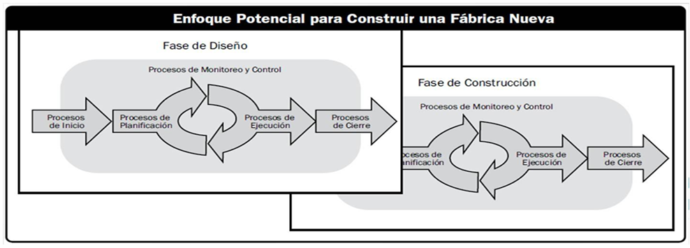

# Procesos y  enfoques de dirección

## Grupos de Procesos de un Proyecto

Un proyecto implica una cantidad significativa de actividades interrelacionadas. Algunas se enfocan en diseñar y construir los entregables, es decir, los productos, servicios o resultados que se esperan del proyecto. Otras actividades son de dirección y gestión del proyecto, necesarias para coordinar y controlar los esfuerzos de construcción, de modo que se logren los objetivos establecidos en tiempo, costo, alcance y calidad. Para organizar mejor estas actividades, se utilizan cinco grandes grupos de procesos:

### 1. Inicio del Proyecto

El inicio de un proyecto es una etapa crítica en la que se siembran las bases para todo lo que vendrá después. No se trata simplemente de tener una idea, sino de transformar una necesidad o interés detectado en una oportunidad concreta de acción.

Primero, surge una necesidad. Puede originarse en el seno de una institución, como una necesidad de mejorar procesos, lanzar un nuevo producto o resolver un problema específico. También puede provenir de empleados que detectan oportunidades de mejora o incluso de intereses personales o familiares. El punto clave es que debe haber una motivación clara que justifique poner en marcha un esfuerzo organizado.

Luego, se debe identificar el objetivo específico del proyecto. Esto significa definir exactamente qué se busca hacer: ¿qué problema se quiere resolver?, ¿qué producto se quiere construir?, ¿qué servicio se quiere brindar? Además del objetivo específico, también se deben considerar los beneficios generales o necesidades más amplias que se espera satisfacer.

Posteriormente, se identifican las partes interesadas (stakeholders) y el equipo de proyecto. Las partes interesadas son todas aquellas personas, grupos o instituciones que se verán afectadas positiva o negativamente por el proyecto. Es fundamental comprender quiénes son y qué esperan, ya que su apoyo o rechazo puede influir enormemente en el éxito.

Después, se identifican los principales entregables. Un entregable es cualquier producto, resultado o servicio que debe ser producido para completar el proyecto. Es importante tener claro desde el principio cuáles son los entregables esenciales para asegurar una comprensión compartida de lo que se espera lograr.

También, se deben reconocer las restricciones principales. Estas pueden ser limitaciones de presupuesto, tiempo, recursos humanos, tecnología disponible, regulaciones legales, entre otros. Tenerlas claras ayuda a planificar de manera realista.

Una vez completados estos pasos, se debe elaborar el Acta de Constitución del Proyecto. Este documento formaliza el inicio del proyecto. Incluye los objetivos, los entregables principales, los recursos asignados de manera preliminar y las restricciones identificadas. Aunque es una primera aproximación y aún no contiene un análisis detallado, es fundamental porque otorga legitimidad y autoridad al proyecto.

Finalmente, el acta debe ser aprobada por las autoridades correspondientes, y su aprobación debe comunicarse a las partes interesadas más relevantes para que el proyecto comience oficialmente con el respaldo necesario.

El Acta de Constitución es, entonces, el primer documento oficial que autoriza la existencia del proyecto, proporciona autoridad al gerente del proyecto para utilizar recursos organizacionales y sirve como referencia base para todas las etapas posteriores.

### 2. Planificación

La planificación es el corazón estratégico del proyecto. Si bien el inicio define el “qué” y el “por qué”, la planificación responde al “cómo”, “cuándo”, “con qué recursos” y “quiénes”.

En primer lugar, se deben definir las líneas base. Estas son acuerdos formales sobre:

- Alcance: qué entregables se producirán.
- Calidad: qué estándares deben cumplir los entregables.
- Tiempos: el cronograma de ejecución.
- Costos: el presupuesto estimado.

Estos elementos son fundamentales porque se utilizarán posteriormente para monitorear el avance y controlar el proyecto.

Simultáneamente, se termina de conformar el equipo de desarrollo y de dirección. Es vital asignar los roles y responsabilidades de cada miembro del equipo para que no haya ambigüedades durante la ejecución.

Otro aspecto clave es la planificación de la gestión de comunicaciones, de los riesgos, de la calidad y de otros planes de apoyo (como la gestión de adquisiciones o recursos humanos si es necesario). Estos planes permiten anticipar problemas y definir estrategias de respuesta.

El resultado principal de esta fase es la elaboración de la Propuesta del Proyecto (también llamada Formulación del Proyecto o Statement of Work, SOW). Este documento concreta qué se va a hacer, cómo se va a hacer, qué recursos se utilizarán, cuánto tiempo llevará y cuánto costará. A diferencia del Acta de Constitución, aquí ya se basa en un análisis detallado y realista.

La formulación debe ser firmada por las autoridades para su aprobación definitiva. Una vez aprobada, se continúa con la comunicación hacia las partes interesadas, ahora con datos más precisos y compromisos más sólidos.

Durante todo el proceso de planificación, es vital fomentar el involucramiento de las partes interesadas, ya que su apoyo es esencial para evitar resistencias y asegurar la cooperación futura.

### 3. Ejecución (Construcción de los Entregables)

La ejecución es donde se pone en práctica todo lo planificado. Es el momento en que el equipo de desarrollo toma acción concreta para construir los entregables del proyecto.

Cada miembro del equipo tiene la responsabilidad de trabajar en su área para producir los entregables asignados, respetando las especificaciones de calidad, los tiempos acordados y el presupuesto disponible.

Construir los entregables implica seguir las especificaciones técnicas, cumplir requisitos funcionales y de calidad, y documentar adecuadamente los avances.

Una parte esencial de la ejecución es el testeo y la validación. No basta con construir el entregable: debe verificarse que cumple con los requisitos establecidos. Esta verificación debe hacerse junto con el equipo de dirección del proyecto y las partes interesadas. Validar los entregables a tiempo evita sorpresas al final del proyecto y permite realizar correcciones tempranas.

La ejecución, en definitiva, es la materialización de los planes en productos, servicios o resultados concretos.

### 4. Monitoreo y Control

Mientras la ejecución ocurre, en paralelo debe llevarse adelante el monitoreo y control del proyecto. Esta función es responsabilidad principalmente del equipo de dirección, liderado por el Gerente de Proyecto.

El monitoreo implica observar y medir regularmente el avance del proyecto contra las líneas base definidas (alcance, tiempo, costo y calidad). Se utilizan indicadores, informes de avance y reuniones de seguimiento para conocer el estado real del proyecto.

El control, por su parte, no es simplemente observar, sino actuar. Significa analizar las desviaciones detectadas y tomar decisiones correctivas. Si un entregable se retrasa, si se superan los costos previstos, o si la calidad no es la esperada, el equipo de dirección debe ajustar los planes, reasignar recursos, renegociar restricciones o modificar cronogramas para mantener el proyecto en rumbo.

Además, se debe validar continuamente la conformidad de los entregables para asegurarse de que cumplan los requisitos y estén listos para ser aceptados por los interesados.

Monitoreo y control son fundamentales para garantizar que el proyecto cumpla sus objetivos y que cualquier problema se aborde antes de que crezca y comprometa el éxito.

### 5. Cierre

El cierre formaliza la finalización del proyecto. Es un proceso tan importante como cualquier otro, ya que asegura que todo trabajo esté efectivamente completado y que se haga un aprendizaje organizacional.

La responsabilidad principal recae en el equipo de dirección del proyecto.

El primer paso del cierre es presentar un informe final al patrocinador y a otras partes interesadas. Este informe debe detallar los logros alcanzados, comparar los resultados reales con los planificados, y documentar cualquier desviación y sus razones.

Un elemento fundamental del cierre es recopilar las lecciones aprendidas. Reflexionar sobre qué funcionó bien, qué problemas se enfrentaron y cómo se solucionaron permite a la organización mejorar sus prácticas de gestión de proyectos para el futuro.

Finalmente, el cierre implica finalizar todas las tareas administrativas pendientes (como la liberación de recursos, cierre de contratos, archivo de documentación) y la disolución formal del equipo de proyecto. Cada miembro del equipo debe ser reasignado o liberado de sus responsabilidades en el proyecto de manera clara y ordenada.

Un cierre efectivo no solo marca el fin del trabajo, sino que consolida el valor obtenido y deja la organización mejor preparada para futuros proyectos.

## Fases o etapas de un proyecto

Todo proyecto, por su propia naturaleza, es único. Esto significa que nunca se ejecuta exactamente igual que otro, y por lo tanto, siempre está expuesto a algún grado de incertidumbre. Esta incertidumbre puede manifestarse en diversas formas: desde cambios en los requisitos del cliente, falta de información completa al inicio, variaciones en el contexto económico, social o tecnológico, hasta riesgos que no pueden preverse del todo en la planificación inicial.

Además, algunos proyectos comienzan sin tener total claridad sobre cuál será el resultado final. Es común en proyectos de innovación, de investigación y desarrollo, o aquellos que dependen de factores externos aún no definidos. Dado este contexto de variabilidad e imprevisibilidad, tratar de planificar el proyecto completo de principio a fin con un único y detallado plan no solo es difícil, sino en muchos casos imposible o contraproducente.

La solución a esta problemática es dividir el proyecto original en fases o etapas. Cada fase se gestiona como un subproyecto, con un alcance más reducido y una mejor capacidad de control y respuesta ante cambios. Esta estrategia reduce riesgos, facilita el manejo de los recursos y permite adaptarse a cambios en las condiciones iniciales del proyecto.

### El ciclo de vida de un proyecto

El ciclo de vida de un proyecto se define como el conjunto de fases o etapas que atraviesa un proyecto desde su inicio hasta su finalización. Cada fase se caracteriza por tener su propio conjunto de actividades, objetivos y entregables, aunque todas ellas están alineadas con el objetivo general del proyecto.

En general, podemos considerar las siguientes fases principales en el ciclo de vida de un proyecto:

1. Iniciar y Planificar el Proyecto (Fase 1)

Esta fase representa la puesta en marcha del proyecto. Inicia con la identificación de una necesidad, oportunidad o problema que se quiere resolver. A partir de allí, se trabaja en:

- Definir los objetivos específicos que se desean alcanzar.
- Establecer el alcance de esta primera fase: qué se va a lograr y qué no.
- Armar el equipo de trabajo que llevará adelante esta etapa inicial.
- Realizar una planificación preliminar, que incluya los recursos, tiempos, costos y riesgos asociados.
- Formalizar la aprobación de esta fase por parte de las autoridades competentes o los patrocinadores.

Este momento es fundamental para sentar las bases del proyecto y definir su rumbo. Un error o una omisión en esta fase puede comprometer todo el proyecto futuro.

2. Ejecución de Fase(s) de Desarrollo (Fase 2 y posteriores)

Una vez iniciado, se pasa a la ejecución de las fases de desarrollo propiamente dichas. Cada fase tiene:

- Un equipo que trabaja en la construcción de los entregables específicos.
- Un proceso de seguimiento y control para asegurar que se cumplen los objetivos de la fase en tiempo, costo y calidad.
- Posibles ajustes ante imprevistos o cambios de requisitos.

Cada fase puede involucrar equipos distintos, tecnologías diferentes y hasta formas diversas de gestión, dependiendo de su grado de complejidad.

3. Finalizar el Proyecto

La última fase consiste en el cierre formal del proyecto. Aquí se presentan:

- Los entregables finales a los patrocinadores y partes interesadas.
- El informe final, donde se detallan los logros, lecciones aprendidas y recomendaciones para futuros proyectos.
- La liberación de recursos (disolución del equipo) y el cierre administrativo (finalización de contratos, liquidaciones económicas, entre otros).

El éxito del cierre depende de que todas las fases anteriores hayan sido ejecutadas correctamente y de que el proyecto haya cumplido con sus objetivos establecidos.

### Características de la gestión por fases

El enfoque de dividir un proyecto en fases tiene varias ventajas fundamentales:

- Mayor adaptabilidad: Permite responder más rápido y de manera más efectiva a cambios en el entorno, a nuevas prioridades o a imprevistos.

- Reducción de riesgos: Al trabajar con alcances más limitados en cada fase, el impacto de los errores o cambios es mucho menor.

- Mejor gestión de recursos: Los recursos pueden asignarse de forma más eficiente fase por fase, en lugar de comprometerse globalmente desde el inicio.

- Evaluación continua: Al finalizar cada fase se revisan los resultados y se toma la decisión consciente de continuar, ajustar o incluso cancelar el proyecto si fuera necesario.

Es importante entender que cada fase se comporta como un proyecto en sí mismo, siguiendo los grupos de procesos clásicos de la gestión de proyectos (Inicio, Planificación, Ejecución, Monitoreo y Control, y Cierre).

### Duración, entregables y equipos por fase

Cada fase puede ser muy diferente en términos de:

- Duración: Algunas fases pueden durar semanas, otras meses o años, dependiendo de la complejidad del trabajo a realizar.

- Entregables: Cada fase tiene objetivos y productos concretos que deben completarse antes de pasar a la siguiente fase.

- Equipos de trabajo: No necesariamente se mantiene el mismo equipo de una fase a otra. De hecho, puede ser recomendable cambiar o complementar el equipo según las necesidades específicas de cada etapa.

- Gerencia de proyecto: En algunos casos, distintas fases pueden estar lideradas por diferentes gerentes de proyecto, especialmente en proyectos muy grandes o de larga duración.

### Revisión y decisión entre fases

Al final de cada fase, se realiza una revisión crítica de los resultados alcanzados. Se evalúa:

- Si se cumplieron los objetivos de la fase.

- Si los entregables son de la calidad esperada.

- Si los riesgos han cambiado o evolucionado.

- Si el proyecto debe continuar, cambiar de enfoque o detenerse.

Esta revisión puede implicar ajustes importantes antes de avanzar a la siguiente fase. Así, el proyecto mantiene una capacidad constante de adaptación a las circunstancias cambiantes.

### Fases secuenciales y superpuestas

Generalmente, las fases de un proyecto son secuenciales, es decir, una fase comienza solo después de que la anterior haya terminado. Este enfoque es más ordenado y minimiza riesgos, pero puede alargar la duración total del proyecto.

En otros casos, las fases pueden superponerse o ejecutarse en paralelo, para acelerar tiempos. Sin embargo, este enfoque aumenta la complejidad y los riesgos, ya que cambios en una fase pueden afectar directamente a otra que ya está en curso.

La decisión de trabajar de forma secuencial o en paralelo depende de varios factores:

- La urgencia del proyecto.

- El nivel de interdependencia entre las fases.

- La capacidad de gestión del equipo para manejar la complejidad adicional.

## Enfoques de dirección y ejecución de proyectos

La dirección y ejecución de un proyecto debe ser adaptada según las características propias del proyecto, los entregables esperados y, sobre todo, el entorno organizacional en el que se desarrolla. No existe un único enfoque aplicable a todos los proyectos. En cambio, el equipo de dirección debe ser capaz de analizar la situación y seleccionar el enfoque que permita gestionar mejor el proyecto y construir los entregables de la forma más efectiva.

Entre los enfoques más comunes se encuentran los enfoques predictivo, adaptativo (iterativo, incremental, ágil) y híbrido. 

### Enfoque Predictivo

El enfoque predictivo, también conocido como waterfall o cascada, es uno de los enfoques más tradicionales en la gestión de proyectos. Su principal característica es que la planificación se realiza de manera exhaustiva desde el inicio, estableciendo claramente los entregables finales e intermedios, el cronograma de actividades, los recursos necesarios, los costos estimados y los riesgos potenciales.

Este enfoque supone que se conoce bien:

- Qué se debe entregar (entregables definidos),
- Cómo se va a realizar cada parte del proyecto,
- Cuándo estarán disponibles los productos o servicios,
- Qué recursos (humanos, materiales y financieros) son necesarios.

El proyecto avanza de manera secuencial a través de fases bien diferenciadas:

- Inicio y planificación: Se define el proyecto, sus objetivos, entregables, plazos, costos y riesgos.
- Diseño y construcción de los entregables: Cada entregable se desarrolla según lo planificado.
- Presentación de resultados: Se presentan los entregables para su revisión y validación.
- Puesta en producción: El entregable es implementado o utilizado según lo previsto.
- Cierre del proyecto: Se formaliza la finalización del proyecto, se documentan lecciones aprendidas y se liberan los recursos.

Este enfoque es particularmente útil cuando los cambios son mínimos o indeseables debido al alto costo o impacto que tendrían. Ejemplos típicos incluyen:

- Obras civiles (edificios, carreteras),
- Diseño de piezas de ingeniería,
- Producción de materiales audiovisuales definidos,
- Programas anuales de capacitación,
- Planes de mejora de infraestructura urbana.

### Enfoque Adaptativo: Iterativo

En el enfoque adaptativo iterativo, el proyecto se divide en fases o iteraciones. Cada iteración permite construir parte del entregable o alcanzar un objetivo intermedio, facilitando la incorporación de cambios y nuevos requerimientos a medida que se avanza.

Este enfoque se utiliza cuando:

- No están claramente definidos los entregables al inicio.
- Los entregables dependen de resultados previos.
- El entorno es muy dinámico y se esperan cambios frecuentes en requisitos, alcance o calidad.
- Es preferible entregar valor de manera progresiva, sin esperar al producto final.

Cada iteración implica su propio ciclo de:

- Planificación (definir lo que se hará),
- Ejecución (desarrollar lo planificado),
- Control (asegurar calidad y objetivos),
- Cierre (validar resultados y decidir próximos pasos).

Ejemplos comunes de proyectos que utilizan un enfoque iterativo incluyen:

- Plan de mejoras urbanas: donde cada barrio constituye una fase,
- Desarrollo de nuevos negocios: en distintas etapas de maduración,
- Implantación de sistemas de software modulares,
- Programas de expansión de sucursales,
- Planes de mejora ambiental en etapas sucesivas.

### Enfoque Adaptativo: Incremental

El enfoque incremental se basa en la elaboración progresiva del producto a través de incrementos sucesivos de funcionalidad o de valor. Aunque existe una definición general del producto desde el inicio, los detalles se van refinando en cada iteración.

En este modelo:

- Se define inicialmente una versión básica del producto.
- En cada iteración, se agrega funcionalidad o se mejora el entregable anterior.
- Cada versión o incremento aporta valor tangible al cliente o usuario.
- El mismo equipo suele participar en todas las iteraciones, manteniendo continuidad y conocimiento compartido.

A diferencia del enfoque iterativo, donde puede haber grandes revisiones en los objetivos de cada fase, en el incremental los cambios entre iteraciones suelen ser pequeños ajustes.

Proyectos típicos incluyen:

- Campañas publicitarias lanzadas en etapas,
- Desarrollo de software por grupos de funcionalidades,
- Construcción de plantas industriales por secciones,
- Capacitaciones que progresan de nivel básico a avanzado.

### Enfoque Adaptativo Ágil

El enfoque ágil combina características del iterativo y incremental, pero introduce iteraciones muy cortas y altamente adaptativas, denominadas sprints, que duran típicamente entre 2 y 4 semanas.

Características clave del enfoque ágil:

- Cada sprint entrega un incremento funcional del producto o servicio.
- Al inicio de cada sprint, el equipo planifica qué tareas realizar basándose en las prioridades del negocio (definidas en el product backlog).
- Durante el sprint, el equipo trabaja intensamente para completar los objetivos acordados.
- Al finalizar, se realiza una revisión (Sprint Review) para presentar el avance a las partes interesadas y recoger retroalimentación inmediata.
- Entre sprints, el backlog puede ser re-priorizado y ajustado.

Este enfoque es ideal cuando:

- Los requisitos cambian rápidamente,
- Se necesita entregar valor en forma urgente,
- No se conoce completamente el producto final,
- Se gestiona un contrato de servicios continuos.

Ejemplos aplicables:

- Proyectos de desarrollo de productos innovadores,
- Investigaciones científicas de descubrimiento progresivo,
- Diseño de campañas de marketing interactivas,
- Servicios de mantenimiento y evolución de software,
- Desarrollo de aplicaciones web basadas en prototipos iterativos.

### Enfoque Híbrido

El enfoque híbrido surge de la necesidad de combinar lo mejor de los métodos predictivos y adaptativos, adaptándose a la realidad compleja de muchos proyectos.

En un proyecto híbrido:

- Algunas fases o componentes se gestionan de manera predictiva (cuando están bien definidos).
- Otras fases o entregables se gestionan de forma adaptativa (cuando los requisitos son inciertos o cambiantes).

Las combinaciones pueden ser muy diversas:

- Un contrato claro en tiempos y costos, pero que permita un diseño de entregables flexible basado en iteraciones o sprints.
- Proyectos en fases secuenciales, donde unas fases son predictivas (ej. instalación de infraestructura) y otras son adaptativas (ej. desarrollo de software o diseño de experiencias de usuario).
- Ejecución de productos principales de manera predictiva, mientras que ajustes menores o personalizaciones se realizan de forma adaptativa.

Este enfoque es especialmente útil en proyectos de:

- Transformación digital,
- Desarrollo de productos tecnológicos,
- Expansiones de negocio internacionales,
- Modernización de infraestructuras públicas con alta participación ciudadana.

## Planificación del Proyecto

La planificación del proyecto es una fase crítica donde se definen los cimientos sobre los cuales se construirá todo el trabajo futuro. Implica identificar claramente qué se va a hacer, cómo se va a hacer, quién lo hará, cuándo y con qué recursos. Además, establece los criterios para medir el éxito del proyecto.

La lista de actividades fundamentales para la planificación incluye:

### Definir el Alcance del Proyecto

Definir el alcance significa establecer con precisión qué trabajo será realizado y qué no. El alcance delimita los límites del proyecto, evitando desviaciones y asegurando que todos los interesados compartan la misma visión. Existen dos tipos de alcance:

- Alcance del Proyecto: Se refiere al conjunto de entregables que el equipo debe completar para cumplir con el objetivo. Estos entregables se plasman en una lista organizada (EDT - Estructura de Desglose del Trabajo). El objetivo es incluir solo lo necesario, ni más ni menos.

- Alcance del Producto: Se centra en describir las características y funcionalidades del producto final. Es decir, define qué debe hacer el producto o servicio una vez terminado.

Elementos clave para definir el alcance:

- Propuesta del Proyecto: —también conocida como Formulación del Proyecto, Project Scope, Enunciado de Alcance o SOW (Statement of Work)— es un documento que describe cómo se llevará a cabo el proyecto, qué resultados se esperan, los riesgos previstos y el presupuesto estimado. Es aplicable a todos los enfoques, tanto en la etapa de inicio como en fases tempranas (por ejemplo, en un sprint 0). Debe ser revisada y aprobada por el patrocinador y otros interesados clave, quienes deberían participar en su redacción y revisión previa a la firma. Este documento representa un compromiso formal de responsabilidades entre el equipo de proyecto y los interesados principales.

- Lista de Entregables (EDT): Describe de forma estructurada los productos o resultados que se deben producir.

- Product Backlog (en enfoques ágiles): Lista priorizada de requisitos, generalmente redactados como historias de usuario, donde cada ítem representa una necesidad o funcionalidad del producto.

- Requisitos de los entregables (Diccionario de la EDT): Especificaciones detalladas que cada entregable debe cumplir para ser considerado aceptable.

- Definition of Done (en métodos ágiles): Criterios que definen cuándo una historia de usuario, entregable o incremento está verdaderamente "terminado" según los estándares de calidad acordados.

### Construir un Cronograma del Proyecto

Una vez definidos los entregables, se debe planificar cuándo se realizarán. Construir un cronograma implica:

- Ordenar las actividades de manera lógica.
- Estimar tiempos de duración.
- Identificar dependencias entre tareas (qué tarea necesita de otra para comenzar).
- Asignar responsables.
- Representarlo en herramientas como diagramas de Gantt, redes PERT, o en tableros Kanban si se trabaja ágilmente.

El cronograma proporciona una hoja de ruta visual que guía la ejecución y supervisión del proyecto.

### Revisar Riesgos y Oportunidades y Planes de Contingencia

Todo proyecto enfrenta incertidumbre. Revisar los riesgos significa:

- Identificar eventos que pueden afectar negativamente al proyecto (riesgos).
- Detectar oportunidades que puedan traer beneficios.
- Evaluar la probabilidad y el impacto de cada evento.
- Planificar respuestas: estrategias para mitigar riesgos, aprovechar oportunidades o contingencias para reaccionar en caso de que ocurra un riesgo.

Tener planes de contingencia es esencial para no improvisar ante problemas imprevistos y mantener el control del proyecto.

### Establecer Indicadores y Metas para el Éxito

No se puede gestionar lo que no se mide. Definir indicadores de desempeño permite:

- Evaluar si el proyecto progresa adecuadamente.
- Medir aspectos como cumplimiento de cronograma, calidad de entregables, satisfacción del cliente, entre otros.

Además, es necesario establecer metas claras y cuantificables para saber cuándo considerar que un objetivo ha sido alcanzado.

### Plan de Comunicación para los Interesados

Una parte crucial de la gestión del proyecto es asegurar que la comunicación fluya de forma efectiva. El plan de comunicación define:

- Qué información será compartida.
- A quién se enviará.
- Cómo (correo, reuniones, informes).
- Con qué frecuencia.

Esto garantiza que todos los interesados estén informados, comprometidos y puedan aportar a la toma de decisiones cuando sea necesario.

### Análisis de Costos – Presupuestos y Reservas

El análisis de costos implica calcular cuánto costará completar el proyecto considerando:

- Costos directos (materiales, salarios, equipamiento).
- Costos indirectos (costos administrativos, alquileres, seguros).
- Reservas para riesgos (dinero apartado para cubrir imprevistos).

Un presupuesto bien elaborado sirve como referencia para controlar el gasto a lo largo de la ejecución.

### Elaborar y Firmar la Propuesta de Proyecto

La Propuesta de Proyecto es un documento que formaliza el compromiso entre el equipo y el patrocinador o cliente. En ella se describen:

- Los objetivos.
- El alcance.
- Los entregables.
- El presupuesto.
- Los riesgos principales.
- Los cronogramas tentativos.

El documento debe ser revisado, ajustado y aprobado por los interesados clave, quienes deben participar activamente en su redacción para asegurar que refleje sus expectativas.

### Aprobación e Inicio de los Procesos de Ejecución

Una vez que el patrocinador aprueba la propuesta, el proyecto pasa a la fase de ejecución. Esta aprobación marca el inicio formal del trabajo operativo, y todo el equipo debe estar alineado con la planificación realizada.

## Definiendo el Alcance en Profundidad

### Estructura de Desglose del Trabajo (EDT)

La EDT es una herramienta fundamental para organizar el alcance del proyecto de forma visual y comprensible:

- Es un diagrama jerárquico que descompone el objetivo final del proyecto en entregables más pequeños y manejables.
- Cada nivel de la jerarquía representa una mayor descomposición y detalle.
- Se enfoca en qué se debe entregar, no en cómo ni cuándo.

Características importantes de la EDT:

- Cada elemento de la estructura tiene un solo padre.
- Cada padre debe tener al menos dos hijos (regla de coherencia).
- No sigue una organización temporal.

La descomposición continúa hasta llegar a Paquetes de Trabajo, unidades suficientemente pequeñas para asignarlas a personas o equipos específicos.

### Paquetes de Trabajo

Un paquete de trabajo es la unidad mínima dentro de la EDT:

- Asignable a un responsable.
- Estimable en cuanto a duración, costos y recursos.
- Verificable mediante un criterio de aceptación que establece cuándo se considera completo.

Trabajar con paquetes de trabajo mejora la claridad y facilita la planificación detallada de actividades, cronograma, presupuesto y gestión de calidad.

### Diccionario de la EDT

El Diccionario de la EDT complementa al diagrama jerárquico proporcionando detalles adicionales sobre cada paquete de trabajo:

- Descripción de lo que implica.
- Requisitos de calidad.
- Recursos necesarios.
- Restricciones o consideraciones especiales.

Este documento es esencial para mantener la coherencia y garantizar que todos los involucrados entiendan lo mismo respecto a cada entregable.

### Refinamiento del Alcance del Proyecto

El refinamiento es un proceso iterativo donde se ajusta el alcance en base a la realidad de los recursos disponibles:

- Involucra a expertos técnicos, usuarios y otros interesados para definir requisitos de calidad, recursos y actividades necesarias.
- Permite revisar si el proyecto es factible considerando limitaciones de tiempo, presupuesto, capacidad humana y riesgos.

Puede conducir a:

- Dividir la EDT en proyectos o fases más manejables.
- Modificar el objetivo para que sea más realista y alcanzable.

Este enfoque colaborativo asegura que el plan de proyecto no solo sea deseable, sino también factible.