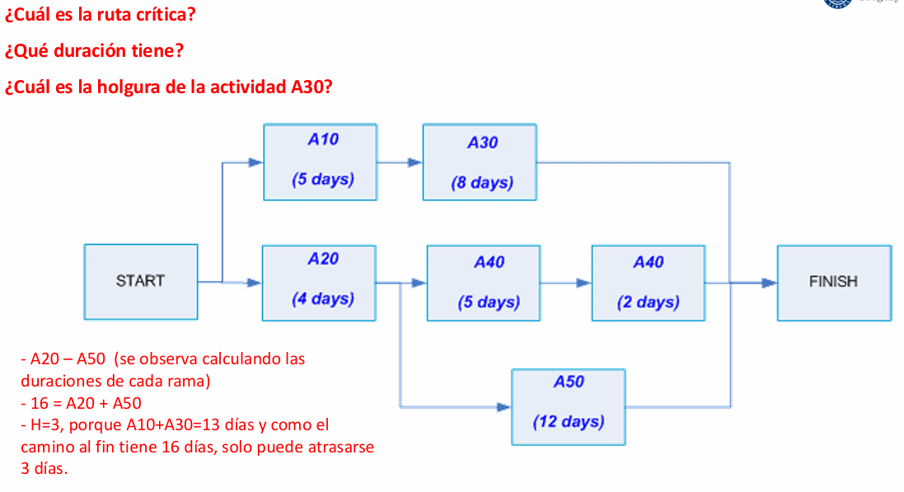

# Gestión del cronograma en el proyecto

La gestión del cronograma comprende el conjunto de procesos que permiten garantizar que el proyecto se complete a tiempo. Esto incluye la definición de actividades, la secuenciación de las mismas, la estimación de su duración, el desarrollo del cronograma como tal, y su posterior monitoreo y control. No es un proceso estático: debe adaptarse según el enfoque de gestión adoptado por el proyecto (predictivo, ágil, iterativo o híbrido) y sus características específicas.

## ENFOQUES EN LA GESTIÓN DEL CRONOGRAMA

### Proyectos con enfoques predictivos, iterativos o incrementales

En este tipo de proyectos, donde el alcance es claramente definido desde el inicio, se suelen utilizar herramientas tradicionales de planificación como el diagrama de Gantt. Esta herramienta permite representar visualmente las tareas, sus duraciones y sus relaciones de dependencia, facilitando la identificación del camino crítico y la gestión de los tiempos.

En enfoques iterativos o incrementales, aunque se mantenga una planificación más estructurada, se recomienda aplicar una planificación progresiva, es decir, ir refinando y detallando el cronograma conforme se avanza en las fases del proyecto. Esto da mayor flexibilidad ante incertidumbres o cambios del entorno.

Por ejemplo, en una construcción, se puede tener un cronograma detallado para la cimentación y estructura, y uno más general para acabados, que se especificará cuando llegue su turno.

### Proyectos con enfoques ágiles puros

En estos casos, no se trabaja con un cronograma tradicional. En su lugar, se utilizan tableros Kanban o Scrum para visualizar y gestionar las tareas en tiempo real. Se trabaja en sprints, iteraciones cortas (usualmente de 1 a 4 semanas), y se mide el progreso con gráficos como el burndown chart, que muestran la cantidad de trabajo completado a lo largo del sprint.

Aquí, la adaptabilidad prima sobre la planificación estricta. El cronograma se gestiona sprint a sprint, con reuniones frecuentes (como la planificación de sprint o las dailies) para revisar avances y ajustar prioridades.

### Proyectos con enfoque híbrido

En un enfoque híbrido coexisten elementos predictivos y ágiles. Esto implica tener, por un lado, un cronograma de alto nivel con entregables contractuales y fechas clave, y por otro, herramientas ágiles para manejar los entregables con mayor incertidumbre.

Por ejemplo, se puede tener una planificación predictiva para la infraestructura (cronograma detallado con Gantt) y usar Scrum para el desarrollo del software (gestión de sprints y tareas en Kanban). La clave está en coordinar ambos ritmos de trabajo.

## PLAN DE CÓMO GESTIONAR EL CRONOGRAMA

Antes de comenzar el proyecto, es fundamental establecer un acuerdo claro entre todos los involucrados sobre cómo se gestionará el cronograma. Aunque este acuerdo no siempre se formalice en un documento, su contenido debe ser comprendido y aceptado. Este plan debe contemplar los siguientes aspectos:

- Herramientas a utilizar: como MS Project, Jira, Trello, Excel, entre otros.
- Duración de iteraciones o ciclos de liberación: especialmente importante en enfoques ágiles.
- Nivel de exactitud y unidades de medida: días, semanas, trimestres, etc.
- Umbrales de control: márgenes de desviación aceptables antes de considerar una replanificación.
- Reglas para medir avance: por ejemplo, si se usa la técnica 0/100 (nada o todo) o 0/50/100 (inicio, mitad, final).
- Formatos y periodicidad de los informes: según el destinatario (cliente, patrocinador, equipo, etc.).

Esta planificación permite estandarizar la forma en que se evaluará el progreso, se detectarán desvíos y se tomarán decisiones correctivas.

## DEFINIR LAS ACTIVIDADES

Este proceso consiste en identificar todas las tareas necesarias para completar los entregables del proyecto. Se hace paralelamente a la creación de la EDT (Estructura de Desglose del Trabajo) y requiere la participación activa del equipo.

Entradas importantes:

- Plan para la dirección del proyecto
- Línea base del alcance: entregables, supuestos, restricciones
- Diccionario de la EDT: especificaciones de cada paquete de trabajo
- Diccionario de la WBS: especificaciones de responsables y actividades principales

Técnicas clave:

- Descomposición: dividir los entregables en partes más manejables, que luego se transforman en actividades concretas.
- Planificación por oleadas (Rolling Wave Planning): planificar con mayor detalle las fases próximas, dejando otras fases menos definidas hasta que se acerque su ejecución.

Jerarquía de actividades:

- Tarea global: resume todo el proyecto
- Tarea padre: de nivel intermedio
- Tarea hija: actividades específicas
- Hitos: eventos significativos, duración cero
    - Los hitos permiten marcar puntos clave del cronograma (entregables importantes, fin de fases, decisiones críticas) y sirven como referencia de avance.

## SECUENCIAR LAS ACTIVIDADES

Una vez identificadas las actividades, es necesario establecer su orden lógico de ejecución. Este proceso se conoce como secuenciación y se realiza utilizando el Método de Diagramación por Precedencia (PDM). Aquí las actividades se representan como nodos y se conectan según relaciones lógicas.

### Tipos de relaciones

- Fin a Inicio (FS): la más común. Ej.: no se puede pintar hasta que se termine de construir.
- Inicio a Inicio (SS): ambas actividades inician a la vez. Ej.: pruebas de integración y documentación pueden empezar juntas.
- Fin a Fin (FF): ambas deben finalizar a la vez. Ej.: control de calidad y producción.
- Inicio a Fin (SF): menos común. Ej.: el cambio de turno en una línea de montaje.

### Tipos de dependencias

- Obligatorias: naturales o contractuales. Ej.: no se puede programar sin definir requisitos.
- Discrecionales: preferidas por experiencia o estrategia. Ej.: primero capacitar antes de ejecutar.
- Internas: dentro del control del equipo.
- Externas: dependen de factores externos al proyecto.

### Adelantos (Lead) y Retrasos (Lag)

- Adelanto: permite que una actividad sucesora comience antes de que termine su predecesora. Ej.: empezar pruebas antes de terminar la documentación.
- Retraso: obliga a esperar un tiempo tras terminar una actividad para comenzar otra. Ej.: dejar fraguar el concreto antes de continuar.

### Diagrama en red

Un diagrama en red representa gráficamente todas estas relaciones de dependencia. Es una herramienta clave para analizar rutas críticas, identificar cuellos de botella y optimizar el cronograma.

## ESTIMAR LA DURACIÓN DE LAS ACTIVIDADES

La estimación de duración de actividades es un proceso clave dentro de la planificación de un proyecto. Su objetivo es prever cuánto tiempo llevará completar cada actividad necesaria para alcanzar los entregables del proyecto. Esta estimación permite construir un cronograma realista y útil para la gestión efectiva del tiempo y los recursos.

Existen diversas técnicas de estimación, cada una con su enfoque, ventajas y limitaciones. Las principales son: estimación análoga, paramétrica, ascendente y basada en tres valores. A continuación se explican en profundidad.

### 1. Estimación Análoga

La estimación análoga es una técnica que se basa en la comparación de la actividad que se desea estimar con otras actividades o proyectos similares ya realizados en el pasado. Utiliza la información histórica combinada con el juicio de expertos para hacer predicciones sobre la duración probable de una tarea actual.

Esta técnica es especialmente útil cuando se dispone de poca información detallada sobre la actividad, o cuando se requiere una estimación rápida y de bajo costo. No obstante, su precisión suele ser limitada, ya que se basa en aproximaciones generales y no tiene en cuenta particularidades específicas del nuevo contexto.

Un aspecto fundamental de la estimación análoga es el ajuste por diferencias. Si bien se parte de un caso previo, se deben identificar las diferencias entre ese contexto y el actual (tecnología utilizada, cantidad de personal, complejidad del entorno, etc.) para realizar ajustes que aproximen más la estimación a la realidad.

Ejemplo: “El tiempo para disponer esta compra es de aproximadamente 6 meses, que es lo que ha llevado otras compras similares”.

Este tipo de afirmación ejemplifica cómo la experiencia previa puede guiar la planificación en proyectos futuros, aunque sin una base numérica precisa o detallada.

### 2. Estimación Paramétrica

La estimación paramétrica se basa en la aplicación de relaciones matemáticas o estadísticas entre variables conocidas. Utiliza modelos cuantitativos que vinculan parámetros históricos (como duración, costo o esfuerzo) con factores específicos de la actividad actual, como tamaño, cantidad de trabajo o productividad del equipo.

En términos prácticos, consiste en multiplicar la cantidad de unidades de trabajo por el tiempo que cada unidad requiere. La precisión de esta técnica depende de la validez del modelo utilizado y de la calidad de los datos disponibles.

Cuando se cuenta con datos fiables y un modelo bien calibrado, la estimación paramétrica puede proporcionar resultados muy exactos. Sin embargo, su implementación puede requerir más tiempo y recursos en comparación con la estimación análoga.

Ejemplo: “El tiempo para construir un kilómetro de la nueva carretera es de aproximadamente 2 semanas, según el tipo de materiales y la cantidad de personas que trabajan.”

Aquí, la duración estimada surge del cálculo de unidades repetibles (kilómetros de carretera) y de variables que afectan su construcción.

### 3. Estimación Ascendente

También conocida como bottom-up, esta técnica consiste en descomponer una actividad compleja en tareas más pequeñas y manejables. Se estiman las duraciones de estas tareas subordinadas y luego se suman para obtener la duración total de la actividad superior.

Este enfoque es considerado uno de los más precisos, ya que permite tener en cuenta las dependencias entre tareas, posibles retrasos, adelantos y otras condiciones específicas del proyecto.

Para aplicarla correctamente, se debe contar con un Work Breakdown Structure (WBS) bien definido. Este enfoque exige mayor esfuerzo y tiempo, pero ofrece un control detallado y mayor capacidad de ajuste durante la ejecución del proyecto.

Ventajas:

- Alta precisión.
- Permite identificar cuellos de botella potenciales.
- Facilita la asignación de recursos específicos.

Limitación principal:

- Requiere un conocimiento profundo de las actividades involucradas.

### 4. Estimación Basada en Tres Valores

Esta técnica considera tres escenarios posibles para estimar la duración de una actividad:

- Tiempo Optimista (tO): Es el menor tiempo posible en el que podría completarse la actividad, suponiendo que todo funcione perfectamente.
- Tiempo Más Probable (tM): Es la duración más realista, basada en una ejecución típica con condiciones normales y recursos disponibles.
- Tiempo Pesimista (tP): Es la duración que tendría la actividad en el peor de los casos, incluyendo retrasos y dificultades.

A partir de estos tres valores, se puede calcular una duración esperada (tE) mediante fórmulas estadísticas, siendo la más común:

$$
t_E = \frac{t_O + 4t_M + t_P}{6}
$$

Esta fórmula se basa en la distribución beta, la cual permite incorporar la incertidumbre en la estimación. Cuanto mayor es la diferencia entre los tiempos pesimista y optimista, mayor es el grado de incertidumbre.

Ejemplo:

- tO: 40 minutos (sábado por la tarde)
- tM: 50 minutos (día normal)
- tP: 70 minutos (viernes antes de Semana de Turismo)

$$
t_E = \frac{40 + 4(50) + 70}{6} = \frac{310}{6} \approx 51.67 \text{ minutos}
$$

Este valor promedio permite tomar decisiones más informadas en entornos con incertidumbre.

## DESARROLLAR EL CRONOGRAMA

Una vez que se han estimado las duraciones de todas las actividades del proyecto, el siguiente paso consiste en desarrollar el cronograma, es decir, organizar las actividades en una secuencia lógica y temporal que permita alcanzar los objetivos del proyecto dentro del tiempo previsto.

Este proceso involucra varios componentes clave, que se detallan a continuación:

### Análisis de Reservas

Las reservas de contingencia son márgenes de tiempo añadidos a algunas actividades para absorber riesgos conocidos y posibles variaciones. Estas reservas pueden expresarse como un número de días o como un porcentaje del tiempo total estimado.

Hay dos formas comunes de incorporar reservas:

- Incluirlas dentro de la duración de la tarea: Puede generar confusión respecto a la duración real.
- Definirlas como tareas separadas ("colchón"): Mejora la transparencia, ya que permite distinguir entre duración estimada y contingencia.

A medida que el proyecto avanza y se dispone de más información, estas reservas pueden eliminarse, reducirse o ajustarse. No obstante, mal gestionadas, pueden inducir retrasos innecesarios si los equipos tienden a “usar todo el tiempo disponible” sin necesidad real.

### Desarrollar el Cronograma de Alto Nivel

El cronograma de alto nivel establece la estructura inicial del proyecto. Se construye a partir de los paquetes de trabajo definidos en la Planilla de Requisitos de Entregables, y se sigue una lógica jerárquica y secuencial.

Pasos comunes en su elaboración:

1. Tarea de resumen del proyecto: Es la actividad 1 que abarca todas las demás y permite calcular la duración total del proyecto.
2. Hito de inicio del proyecto: Marca el comienzo oficial y establece la fecha inicial del cronograma.
3. Dependencias FIN-INICIO: La primera tarea principal suele depender del hito de inicio. Este tipo de relación permite ajustar automáticamente fechas si el inicio se retrasa o adelanta.
4. Vinculación entre tareas: Todas las tareas deben estar conectadas con una o más anteriores (excepto el hito inicial), lo que asegura una lógica de red completa.
5. Hitos de cierre: Se recomienda incluir un hito al finalizar cada entregable importante, para facilitar el seguimiento del progreso.

Este enfoque jerárquico facilita la planificación, asignación de recursos, y posterior seguimiento del proyecto.

### Análisis de la Red del Cronograma

El cronograma puede representarse como una red de actividades, donde se visualizan las relaciones de precedencia entre las tareas. Este modelo permite aplicar técnicas de análisis como la identificación del camino crítico y la evaluación de la holgura.

#### Holgura

La holgura es el margen de tiempo con el que cuenta una actividad sin que su retraso afecte el inicio de las actividades sucesoras o la fecha final del proyecto.

- Holgura de tarea: Si una tarea tiene, por ejemplo, 3 días de holgura, significa que puede demorarse hasta 3 días sin alterar la siguiente.
- Holgura de proyecto: Es el tiempo total que puede extenderse el cronograma sin que se incumpla la fecha impuesta externamente (por el cliente o la gerencia).

La gestión efectiva de la holgura permite optimizar el uso de recursos y priorizar las tareas realmente críticas.

#### Camino Crítico

El camino crítico es la secuencia de tareas que determina la duración total del proyecto. Las actividades en esta ruta no tienen holgura: cualquier retraso en ellas retrasará el proyecto completo.

Este camino puede variar durante la ejecución del proyecto, si cambian las duraciones o las dependencias. Además, puede haber más de un camino crítico simultáneo, lo que aumenta el riesgo del proyecto, ya que hay más tareas que pueden afectar su finalización.

Visualmente, es la ruta de mayor duración entre el primer y último hito del cronograma. Identificar el camino crítico permite a los gestores enfocarse en las tareas que realmente deben controlarse para cumplir con los plazos del proyecto.

### Método de cálculo de la Ruta Crítica (Critical Path Method - CPM)

El método de la ruta crítica es una técnica de análisis del cronograma que permite identificar las tareas que determinan la duración total del proyecto. El primer paso es construir un mapa de red que muestre todas las actividades del proyecto, sus dependencias lógicas (precedencias) y su duración estimada. Cada actividad se representa como un nodo que se conecta con otras según su relación lógica.

Una vez creada la red, se calculan las fechas de inicio y finalización más tempranas (ES, Earliest Start y EF, Earliest Finish), y también las fechas de inicio y finalización más tardías (LS, Latest Start y LF, Latest Finish). Estos cálculos permiten determinar la holgura o margen de maniobra de cada actividad.

- EF = ES + D: La fecha de finalización más temprana se calcula sumando la duración de la actividad a la fecha de inicio más temprana.
- LS = LF - D: La fecha de inicio más tardía se obtiene restando la duración de la actividad a la fecha de finalización más tardía.
- Holgura (H) = LS - ES = LF - EF: Es el tiempo que puede atrasarse una actividad sin que ello afecte la fecha de inicio de las siguientes o la fecha de finalización del proyecto.

#### Ejemplo

Si la tarea A tiene una duración (D) de 7 días, un inicio más temprano (ES) en el día 21, y una fecha de finalización más tardía (LF) de 33 días:

- EF = 21 + 7 = 28
- LS = 33 - 7 = 26
- H = LS - ES = 26 - 21 = 5

Esto indica que la tarea A tiene una holgura de 5 días, es decir, puede atrasarse hasta 5 días sin afectar el cronograma global.

La ruta crítica se compone por aquellas tareas con holgura cero; cualquier retraso en ellas afectará directamente la fecha de finalización del proyecto. Identificar esta ruta es crucial para saber dónde enfocar los esfuerzos de seguimiento y control.

### Nivelación de recursos

En la práctica, no basta con planificar actividades y duraciones; es necesario asegurarse de que los recursos (humanos, técnicos o materiales) estén disponibles cuando se los necesita. La nivelación de recursos busca equilibrar la demanda con la disponibilidad real de estos.

Este proceso puede implicar retrasos en actividades para evitar sobrecargar recursos o reprogramarlas en función de sus restricciones. Se realiza usualmente con ayuda de software especializado, como Microsoft Project, que puede recalcular automáticamente las fechas ajustando las tareas sin violar las dependencias lógicas.

Este ajuste puede alterar la ruta crítica original del proyecto y utilizar parte o toda la holgura disponible. Es una práctica clave para hacer viable el cronograma, aunque puede extender la duración total si no hay suficiente flexibilidad.

### Compresión del cronograma

Cuando es necesario acortar la duración del proyecto sin modificar el alcance, se puede recurrir a técnicas de compresión del cronograma. Estas técnicas se aplican principalmente a actividades dentro de la ruta crítica, ya que son las únicas que, al reducirse, impactan directamente en la duración total del proyecto.

#### Intensificación (Crashing)

Consiste en agregar recursos adicionales a una actividad crítica para acortar su duración. Por ejemplo, asignar más trabajadores o aumentar el turno de trabajo. Es eficaz, pero puede elevar significativamente los costos y provocar disminución de eficiencia por la saturación de recursos.

#### Ejecución rápida (Fast Tracking)

Implica solapar actividades que originalmente estaban previstas en secuencia. Por ejemplo, comenzar el diseño detallado de un componente antes de terminar completamente el diseño general. Aunque puede reducir tiempo, incrementa el riesgo de retrabajo y errores si se produce un cambio en las tareas iniciales.

Ambas técnicas deben ser evaluadas cuidadosamente para balancear el beneficio en tiempo con los costos y riesgos adicionales.

### Salidas: Cronograma del proyecto

El resultado final de la planificación del cronograma es un documento que establece las fechas de inicio y finalización de cada actividad, así como sus dependencias y recursos asignados. Este cronograma puede presentarse en distintos formatos:

- Diagrama de barras (Gantt): Representa visualmente las tareas con sus duraciones y secuencias.
- Diagrama de red: Muestra gráficamente la secuencia lógica entre actividades.
- Diagrama de hitos: Resalta los puntos clave de avance o entregables importantes.

Además, se establece la línea base del cronograma, que es el cronograma aprobado por el patrocinador del proyecto. Este se utiliza como referencia para comparar el desempeño real y detectar desviaciones.

El cronograma se integra al Plan para la Dirección del Proyecto, junto con la línea base de alcance y la línea base de costos, constituyendo los pilares del seguimiento y control del proyecto.

### Controlar el cronograma (proceso de monitoreo)

Durante la ejecución del proyecto, es fundamental monitorear y controlar el cronograma para asegurar que el proyecto se mantiene alineado con lo planificado. Este proceso incluye varias actividades clave:

- Revisiones de desempeño: Se analizan las diferencias entre los datos reales y los valores previstos en la línea base.
- Análisis de variación: Se evalúan los motivos de las desviaciones y se analizan alternativas correctivas. Una herramienta útil es la técnica del Valor Ganado (Earned Value Management), que permite medir el desempeño en costo y tiempo.
- Ajuste de recursos: Se puede aplicar nuevamente nivelación de recursos si hay cuellos de botella.
- Adelantos y retrasos (Leads y Lags): Se ajustan las relaciones entre tareas si es posible comenzar una actividad antes de que finalice su predecesora (lead) o si se debe dejar un tiempo de espera entre tareas (lag).
- Compresión del cronograma: Si es necesario recuperar retrasos, se pueden aplicar nuevamente las técnicas de crashing o fast tracking.

#### Salidas de este proceso

- Informes de desempeño: Incluyen detalles del avance de las tareas, desviaciones, tareas finalizadas y próximos hitos.
- Pronósticos del cronograma: Estimaciones revisadas de las fechas futuras, basadas en el rendimiento actual.
- Solicitudes de cambio: Si se detecta que el cronograma aprobado ya no es realista, se puede solicitar una actualización de la línea base.
- Registros de riesgos, supuestos y oportunidades: Toda nueva información identificada debe registrarse para su consideración futura.
- Ajustes en calendarios y recursos: Cambios necesarios en la disponibilidad de recursos o fechas laborales.

El control del cronograma es un proceso continuo que requiere análisis, adaptabilidad y comunicación constante con los interesados del proyecto.
