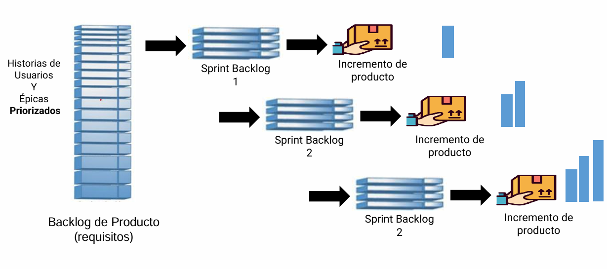

# Ciclos de vida

## Ciclo de Vida de un Proyecto

El ciclo de vida de un proyecto es el marco general que describe las distintas fases por las que transita un proyecto desde su inicio hasta su cierre formal. No importa el tipo de proyecto —sea en ingeniería, tecnología, construcción o servicios—, todos atraviesan un conjunto de etapas que permiten organizar, planificar, ejecutar y cerrar el trabajo de forma ordenada. Este ciclo proporciona una estructura lógica para dividir el trabajo, asignar recursos, establecer objetivos y controlar el avance.

Por lo general, este ciclo consta de cuatro fases principales:

- Inicio: Se define el proyecto, se justifican sus objetivos y se aprueba formalmente.
- Planificación: Se detalla el alcance, se estiman tiempos y costos, se diseña el cronograma y se identifican los riesgos.
- Ejecución y monitoreo: Se implementan las actividades planificadas, y se realiza un seguimiento constante para asegurar que el proyecto se mantenga dentro de los parámetros establecidos.
- Cierre: Se completa el trabajo, se entregan los productos finales y se realiza una evaluación para capturar lecciones aprendidas.

Cada una de estas fases puede dividirse en subfases o actividades, y normalmente termina con la entrega de un producto parcial o un resultado tangible que permite avanzar a la siguiente fase.

### Fases del Proyecto

Una fase es un subconjunto del ciclo de vida de un proyecto, compuesto por actividades interrelacionadas que concluyen con la producción de un entregable específico. Por ejemplo, en un proyecto de software, una fase puede consistir en el diseño de la arquitectura, otra en la implementación del código, y otra en las pruebas del sistema.

Estas fases permiten controlar de manera más granular el progreso del proyecto y ofrecen puntos de revisión y validación, donde se puede decidir si el proyecto continúa, necesita ajustes o debe ser cancelado.

### Ciclo de Vida del Desarrollo del Producto

Dentro del ciclo de vida del proyecto, se encuentra el ciclo de vida del producto, que se enfoca específicamente en la creación del producto, servicio o resultado final. A diferencia del ciclo del proyecto, que gestiona todo el proceso organizacional y administrativo, el ciclo de vida del producto aborda los aspectos técnicos del desarrollo.

Por ejemplo, en el desarrollo de una app móvil, el ciclo de vida del producto incluirá fases como: análisis de requisitos, diseño de interfaces, desarrollo del backend y frontend, pruebas de calidad y despliegue. Estas fases pueden estar contenidas dentro del ciclo de vida general del proyecto.

Es importante entender que un mismo ciclo de vida de proyecto puede incluir varios ciclos de desarrollo de producto, especialmente cuando se entregan productos incrementales o evolutivos.

## ENFOQUES DE CICLO DE VIDA: PREDICTIVO Y ADAPTATIVO

### Enfoque Predictivo

En el enfoque predictivo (también conocido como tradicional o en cascada), la totalidad del trabajo y los entregables se planifican por completo al comienzo del proyecto. Se define de forma detallada el alcance, los requisitos, las tareas y el cronograma. Este enfoque es apropiado cuando el producto es bien conocido, los requisitos son estables y el entorno no sufre cambios significativos durante la ejecución.

En este modelo:

- Los cambios son controlados mediante procedimientos formales.
- La línea base del cronograma, el alcance y el costo se define al inicio y se utiliza como punto de comparación en la fase de control.
- Los interesados participan en puntos específicos (como revisiones de entregables o hitos).
- Los riesgos se minimizan mediante una planificación exhaustiva al inicio.
- Las fases se ejecutan en secuencia lógica: requisitos → diseño → desarrollo → pruebas → implementación.
- Es común en proyectos de construcción, ingeniería o cuando los márgenes de error deben ser mínimos.

### Enfoque Adaptativo o Ágil

En contraste, el enfoque adaptativo —o ágil— acepta la incertidumbre como parte del proceso. Se caracteriza por trabajar en ciclos cortos e iterativos donde se desarrollan entregables funcionales y se ajustan en función de la retroalimentación constante del cliente. En lugar de planificar todo por adelantado, el trabajo se organiza en iteraciones que permiten reevaluar prioridades, modificar requisitos y ajustar el plan continuamente.

Sus características principales incluyen:

- Requisitos y planes que evolucionan a lo largo del proyecto.
- Cambios frecuentes aceptados como parte natural del ciclo.
- Participación continua del cliente y de los stakeholders.
- Validación frecuente de entregables, lo que reduce riesgos al detectar errores o desviaciones más temprano.
- Utilización de técnicas como User Stories, Product Backlogs y Sprint Reviews para organizar y priorizar el trabajo.

Este enfoque es ideal para proyectos donde el entorno es altamente cambiante, como el desarrollo de software, productos digitales o innovación.

## CICLOS DE VIDA ÁGILES: ITERACIÓN Y FLUJO

### Ágil Basado en Iteración

Este modelo organiza el trabajo en iteraciones o timeboxes, es decir, períodos de tiempo de igual duración (por ejemplo, dos semanas) durante los cuales se completa un conjunto priorizado de funcionalidades. Cada iteración busca entregar una parte funcional del producto, priorizando primero las tareas de mayor valor.

Sus características clave incluyen:

- Priorización de trabajo: siempre se trabaja sobre la tarea más importante en ese momento.
- Retroalimentación rápida: al finalizar cada iteración, se revisa con el cliente lo desarrollado.
- Repetición cíclica de procesos: se recopilan requisitos, se define el alcance y se crean tareas para cada iteración, no solo una vez al inicio.
- Flexibilidad: se puede cambiar la dirección del proyecto entre iteraciones.
- Ejemplo: Scrum, que organiza el trabajo en Sprints.

Este enfoque es útil para contextos donde se necesita velocidad, capacidad de respuesta y aprendizaje continuo.

### Ágil Basado en Flujo

A diferencia del enfoque iterativo, el enfoque basado en flujo (ej. Kanban) no establece iteraciones con duración fija, sino que se enfoca en el movimiento continuo de tareas a través de un flujo de trabajo. Este se representa visualmente mediante un tablero, donde las tareas pasan por columnas como "Por hacer", "En progreso", "En revisión" y "Completado".

Principales características:

- Visualización del trabajo: todo el equipo ve el estado de cada tarea.
- Control del trabajo en curso (WIP): se limita la cantidad de tareas en cada etapa para evitar sobrecarga.
- Entregas continuas: las tareas se completan tan pronto como estén listas, no al final de una iteración.
- Flexibilidad extrema: el flujo se adapta a las capacidades del equipo y los cambios del contexto.

Es ideal para equipos que trabajan con demandas constantes o mantenimiento continuo de productos.

## Complejidad e Incertidumbre

### Complejidad

La complejidad es una propiedad inherente a muchos sistemas, problemas o situaciones que presentan múltiples componentes interrelacionados, cuyas interacciones generan comportamientos difíciles de prever o controlar. Un sistema complejo no necesariamente es complicado por cantidad de elementos, sino por cómo estos elementos interactúan entre sí, produciendo efectos no lineales, sin una relación directa entre causa y consecuencia.

En contextos de desarrollo de proyectos o productos, la complejidad se manifiesta cuando existen muchas variables simultáneas que afectan el resultado, tales como el entorno del negocio, los requerimientos del cliente, la tecnología empleada, los equipos de trabajo o las restricciones del mercado. Estas interacciones pueden generar resultados inesperados incluso cuando se tiene experiencia previa, dificultando la planificación y ejecución de las actividades del proyecto.

### Gestionar la complejidad

Entender y gestionar la complejidad resulta esencial para la toma de decisiones eficaces y la solución de problemas. Esta gestión no implica eliminar la complejidad (lo cual muchas veces es imposible), sino comprender sus orígenes, anticipar posibles efectos y adaptar nuestras prácticas para convivir con ella. Entre las principales dificultades que implica gestionar la complejidad se encuentran:

- Interacciones no esperadas entre componentes del sistema, lo cual puede producir efectos que no estaban contemplados originalmente.

- Difícil predicción del comportamiento futuro, ya que los cambios en una variable pueden tener consecuencias indirectas, acumulativas o emergentes que no son evidentes a priori.

Ambigüedad en los objetivos o requisitos, cuando no hay claridad absoluta sobre qué se desea lograr o cómo.

## Matriz de Stacey

La Matriz de Stacey es una herramienta conceptual utilizada para categorizar y entender diferentes tipos de problemas o decisiones en función de dos variables fundamentales: el grado de acuerdo sobre los requerimientos (qué se debe hacer) y el grado de certeza sobre la tecnología o métodos necesarios (cómo se debe hacer).

### Variables de la Matriz de Stacey

#### Requerimientos (¿Qué?)

Se refiere a la claridad con que los interesados pueden definir lo que necesitan o esperan del producto o proyecto. A mayor incertidumbre en los requerimientos, mayor complejidad.

Ejemplo: un cliente que no tiene claro qué funcionalidad necesita o cambia constantemente de opinión.

#### Tecnología (¿Cómo?)

Evalúa cuánto se conoce sobre los métodos, herramientas o procesos que se utilizarán para lograr el objetivo.

Una tecnología nueva, no probada o cambiante incrementa la incertidumbre sobre cómo abordar el proyecto.

#### Personas (¿Cuántas? ¿Quiénes?)

Aunque no aparece explícitamente en todos los modelos de Stacey, la inclusión de personas como variable resalta el impacto que tiene la cantidad y diversidad de los individuos involucrados en aumentar la complejidad.

Equipos grandes, distribuidos o con distintas culturas y habilidades también aportan incertidumbre al proceso.

### Dominios de la Matriz de Stacey

La matriz divide los escenarios en diferentes dominios de complejidad:

- Simple o Controlado: los requerimientos están claros y la tecnología es conocida. Se pueden aplicar prácticas tradicionales de gestión.

- Complicado: puede haber cierto desacuerdo o dificultad técnica, pero expertos pueden resolverlo. Aquí funcionan los enfoques predictivos.

- Complejo: no hay claridad completa ni sobre el qué ni sobre el cómo. Es el terreno ideal para metodologías ágiles.

- Caótico: no hay acuerdo ni conocimiento. Se requieren medidas urgentes, experimentación, innovación y adaptación rápida.

## Manifiesto Ágil

### Orígenes y Aplicabilidad

El Manifiesto Ágil, creado en 2001 por un grupo de desarrolladores de software, marcó un cambio de paradigma en la forma de gestionar proyectos, sobre todo en entornos donde reina la complejidad y la incertidumbre. Aunque surgió en el ámbito del software, sus principios son aplicables a cualquier contexto que requiera adaptación rápida, entrega de valor y colaboración continua.

### Valores del Manifiesto Ágil

El manifiesto establece cuatro valores fundamentales:

- Individuos e interacciones sobre procesos y herramientas.
- Software funcionando sobre documentación extensiva.
- Colaboración con el cliente sobre negociación de contratos.
- Respuesta ante el cambio sobre seguir un plan.

Estos valores invitan a priorizar lo humano, lo práctico y lo útil sobre lo burocrático, lo rígido o lo teórico.

### Principios del Manifiesto Ágil

Los 12 principios que lo acompañan son una guía para aplicar la filosofía ágil. Algunos de los más destacados incluyen:

- Satisfacción del cliente mediante entregas tempranas y continuas de productos con valor.
- Aceptación del cambio como una ventaja competitiva, incluso en etapas avanzadas del desarrollo.
- Entrega frecuente de productos funcionales, preferiblemente en ciclos cortos.
- Trabajo conjunto diario entre responsables del negocio y desarrolladores.
- Fomentar la motivación del equipo, otorgándole autonomía y soporte.
- Comunicación cara a cara como medio más efectivo.
- Producto funcionando como principal medida de progreso.
- Ritmo constante y sostenible para el desarrollo.
- Excelencia técnica y buen diseño como factores clave para mantener la agilidad.
- Simplicidad, eliminando todo lo innecesario.
- Equipos auto-organizados, capaces de tomar decisiones y adaptarse.
- Reflexión y ajuste continuo, en busca de mejora permanente.

### ¿Qué es una mentalidad?

La mentalidad es un conjunto de creencias, valores y actitudes que condicionan la forma en que una persona o grupo percibe el mundo, toma decisiones y actúa. En el contexto del desarrollo ágil, tener una mentalidad ágil implica mucho más que seguir un proceso; significa adoptar una forma de pensar y de actuar que se basa en:

- La mejora continua.
- La adaptación al cambio.
- La colaboración multidisciplinaria.
- La entrega constante de valor.

### Mentalidad Ágil

Adoptar una mentalidad ágil es esencial para moverse con éxito en contextos donde hay alta incertidumbre o turbulencia. Esta mentalidad nos permite comprender el entorno, detectar los cambios o amenazas y responder con rapidez, sin quedarnos atados a planes rígidos o modelos tradicionales.

Es un marco mental flexible que acepta que el error forma parte del aprendizaje, que promueve la experimentación, y que se adapta cada vez que se enfrenta una situación nueva. Esta forma de pensar se refleja en comportamientos concretos como:

- Preferir prototipos rápidos sobre análisis largos.
- Invitar a todas las voces del equipo a opinar y construir soluciones.
- Considerar que el plan puede cambiar si las circunstancias lo ameritan.
- Estar dispuesto a reflexionar periódicamente y ajustar el rumbo.

## Historia de Usuario

Una Historia de Usuario es una representación breve, clara y concisa de una necesidad o requerimiento expresado desde la perspectiva de un usuario final. Se utiliza principalmente en metodologías ágiles (como Scrum o Kanban) para capturar funcionalidades requeridas por los usuarios de forma comprensible, tanto para el equipo técnico como para el negocio. A diferencia de los requisitos tradicionales, una historia de usuario se enfoca más en el valor que se genera y en el por qué detrás de lo que se construye, y no tanto en especificaciones detalladas técnicas desde el inicio.

Las historias de usuario no solo describen qué se debe hacer, sino también para quién y con qué propósito. Esta perspectiva centrada en el usuario permite diseñar soluciones más enfocadas en el valor, la usabilidad y la experiencia.

### Estructura de una Historia de Usuario

Una historia de usuario típicamente se redacta siguiendo una fórmula simple pero poderosa:

> Como `<rol o persona>`
> Quiero `<objetivo o funcionalidad>`
> Para `<razón o beneficio esperado>`

Esta estructura obliga a pensar en tres niveles:

1. Quién lo necesita (rol).
2. Qué se necesita (acción, comportamiento o funcionalidad).
3. Por qué se necesita (valor que aporta al usuario o al sistema).

Por ejemplo:

> Como comprador habitual,
> Quiero poder guardar productos en una lista de favoritos,
> Para acceder rápidamente a ellos en futuras compras.

Este formato ayuda a alinear al equipo en torno a la necesidad del usuario y no simplemente en tareas técnicas. Además, fomenta la conversación entre los desarrolladores, el Product Owner y otros stakeholders.

### Criterios de Aceptación

Una vez que una historia está definida, se deben establecer los criterios de aceptación, que son un conjunto de condiciones específicas y verificables que deben cumplirse para que la historia sea considerada completa y aceptable. Estos criterios evitan malentendidos y aseguran que el equipo de desarrollo y el negocio tengan una comprensión compartida del objetivo de la historia.

Ejemplo de criterios de aceptación para la historia anterior:

- El usuario puede agregar productos a la lista de favoritos desde la página del producto.
- La lista de favoritos es persistente entre sesiones.
- El usuario puede eliminar productos de la lista de favoritos.

Los criterios deben ser claros, concretos y medibles, y sirven también como base para las pruebas funcionales.

### Características de una Buena Historia de Usuario: INVEST

El acrónimo INVEST describe seis atributos que debe tener una historia de usuario de calidad:

1. Independent (Independiente):
   Debe poder desarrollarse de manera aislada, sin dependencia crítica de otras historias. Esto facilita la planificación y el trabajo en paralelo.

2. Negotiable (Negociable):
   No debe ser un contrato rígido. Su contenido debe poder discutirse y modificarse entre el Product Owner y el equipo.

3. Valuable (Valiosa):
   Debe aportar valor claro al usuario final o al negocio.

4. Estimable:
   El equipo debe poder estimar cuánto esfuerzo requerirá su implementación, aunque no se sepa todo al 100 %.

5. Small (Pequeña):
   Debe ser lo suficientemente pequeña para poder completarse dentro de una iteración (sprint). Si no lo es, debe dividirse.

6. Testable (Comprobable):
   Debe poder verificarse si está hecha o no, a través de pruebas claras derivadas de sus criterios de aceptación.

---

### Épica

Una épica es una historia de usuario de gran tamaño o complejidad, que por sí sola no puede implementarse en una única iteración. Suele describir una necesidad amplia que involucra múltiples funcionalidades o procesos.

Las épicas sirven para tener una visión general de una funcionalidad mayor. A medida que se planifican las iteraciones, estas épicas se refinan y descomponen en historias de usuario más pequeñas y manejables que sí puedan ser desarrolladas en un sprint.

Por ejemplo, una épica podría ser:

> "Como usuario, quiero tener una sección de perfil personal para administrar mi cuenta."

Esa épica puede dividirse en historias más pequeñas:

- Ver y editar información personal.
- Cambiar la contraseña.
- Subir una foto de perfil.
- Configurar preferencias de privacidad.

### Iteración / Sprint

Un Sprint (también llamado iteración) es un periodo de tiempo fijo, típicamente de 1 a 4 semanas, durante el cual el equipo de desarrollo trabaja para completar una serie de historias de usuario seleccionadas. Cada sprint representa un ciclo completo de planificación, ejecución y entrega.

Características principales:

- Se planifica al inicio del sprint qué historias se abordarán, en función de su prioridad y tamaño.
- El objetivo es entregar un incremento de producto funcional y potencialmente entregable al final del sprint.
- Una vez finalizado el sprint, se evalúan los resultados y se ajusta el trabajo futuro en base a lo aprendido.
- El próximo sprint comienza de inmediato tras el anterior, generando un ritmo de trabajo sostenible.

### DoR y DoD: Definition of Ready y Definition of Done

#### Definition of Ready (DoR)

La Definición de Listo es un conjunto de condiciones o acuerdos que debe cumplir una historia antes de ser incluida en un sprint. Su objetivo es asegurar que la historia está bien preparada para ser trabajada, minimizando interrupciones y malentendidos.

Algunos criterios comunes:

- Historia redactada claramente con estructura "Como... Quiero... Para..."
- Criterios de aceptación definidos
- Sin dependencias técnicas bloqueantes
- Estimación realizada
- Comprensión compartida entre PO y equipo

#### Definition of Done (DoD)

La Definición de Hecho es un conjunto de condiciones que determinan cuándo una historia de usuario puede considerarse completamente terminada. Incluye aspectos funcionales, técnicos y de calidad.

Ejemplos de criterios DoD:

- Código desarrollado, revisado y aprobado (pull request)
- Pruebas unitarias y funcionales realizadas
- Documentación actualizada
- Desplegado en entorno de pruebas o producción
- Validado por el Product Owner

Estas definiciones fomentan la calidad y el alineamiento del equipo, y evitan entregas incompletas o mal entendidas.

### Puntos de Historia

Los puntos de historia son una unidad de medida abstracta usada por los equipos ágiles para estimar la complejidad relativa de una historia de usuario. A diferencia del tiempo en horas, los puntos se enfocan en el esfuerzo, riesgo y complejidad percibidos en relación con otras historias.

Por ejemplo:

- Historia A: 1 punto (muy simple)
- Historia B: 3 puntos (requiere más lógica y pruebas)
- Historia C: 8 puntos (compleja, con integraciones externas)

Los puntos de historia fomentan una mejor estimación colectiva y permiten medir la velocidad del equipo (cuántos puntos completan por sprint), lo cual es útil para planificaciones futuras.

## SCRUM

SCRUM es un marco de trabajo ágil utilizado en el desarrollo de productos complejos y adaptativos, especialmente en entornos donde los requerimientos pueden cambiar frecuentemente. No es un proceso ni una metodología estricta, sino un conjunto de prácticas, roles y artefactos que permiten a los equipos trabajar de manera organizada y colaborativa. Se centra en la entrega incremental de valor mediante sprints o iteraciones cortas.

### Iteración corta (Sprint)

La iteración, comúnmente llamada Sprint, es un período de tiempo fijo (normalmente de una a cuatro semanas) durante el cual un equipo trabaja para completar una cantidad de trabajo establecida previamente. Cada sprint comienza con una planificación (Sprint Planning) y termina con una revisión (Sprint Review) y una retrospectiva (Sprint Retrospective). En ese período, el equipo desarrolla un conjunto de funcionalidades completas, funcionales y potencialmente entregables.

La duración fija de los sprints brinda previsibilidad y permite medir avances reales. Además, este enfoque limita el riesgo y asegura que se produzca al menos un incremento útil al final de cada ciclo, fomentando la mejora continua.

### Backlog de Producto

El Backlog de Producto es un artefacto central en SCRUM que representa la lista priorizada de todo el trabajo pendiente requerido para el desarrollo del producto. Esta lista está en constante evolución a medida que se descubren nuevas necesidades, se agregan requisitos, o se eliminan funcionalidades innecesarias.

Cada ítem del backlog representa una necesidad o requerimiento, y se expresa generalmente como épicas (requisitos grandes y complejos) o historias de usuario (requisitos detallados y centrados en el usuario). La persona encargada de gestionar y priorizar este backlog es el Product Owner.

Este backlog está orientado al valor del usuario, lo que significa que los ítems que generan más valor para el negocio o cliente deben tener mayor prioridad. Se refina de manera continua a lo largo del proyecto.

### Historias de Usuario y Épicas

Las historias de usuario son descripciones breves y centradas en el usuario de una funcionalidad que se desea implementar. Su formato clásico es:

> Como [rol], quiero [objetivo], para [motivo/beneficio].

Por ejemplo:

> Como cliente, quiero poder pagar con tarjeta de crédito, para realizar compras rápidas y seguras.

Las épicas, en cambio, son historias de usuario de gran tamaño o nivel alto de abstracción, que engloban múltiples funcionalidades relacionadas. Las épicas no pueden completarse en un solo sprint y, por lo tanto, deben desglosarse en historias de usuario más pequeñas y manejables a lo largo del refinamiento del backlog.

### Backlog del Sprint

El Backlog del Sprint es una selección priorizada del backlog de producto, determinada durante la planificación del sprint. Representa el trabajo que el equipo se compromete a completar durante ese sprint.

Este backlog es más detallado que el backlog de producto y puede incluir tareas técnicas, pruebas, documentación, entre otros. Solo el equipo de desarrollo puede modificarlo durante el sprint y se espera que refleje el objetivo del sprint de forma clara.

El equipo se autoorganiza para dividir y realizar el trabajo. A medida que avanza el sprint, el backlog del sprint puede actualizarse para reflejar el estado actual del trabajo.

### Sprint

El Sprint es el corazón de SCRUM. En él se concreta el trabajo planificado en el backlog del sprint y se produce un incremento potencialmente entregable del producto. Cada sprint inicia con una reunión de planificación, donde se definen los objetivos y se seleccionan las historias de usuario a trabajar.

Durante el sprint, se realiza una reunión diaria llamada Daily Scrum, en la que el equipo sincroniza actividades y planifica las próximas 24 horas. Al finalizar el sprint, se realiza una revisión del sprint (donde se demuestra el trabajo completado) y una retrospectiva para mejorar continuamente los procesos.

### Incremento del Producto

El Incremento del Producto es el resultado tangible del trabajo realizado durante un sprint. Este incremento debe ser una versión funcional del producto, potencialmente entregable y usable por el cliente.

Cada incremento se suma a los incrementos anteriores, y su valor acumulativo es un paso más hacia la consecución del objetivo del producto. El incremento debe cumplir con la Definition of Done (DoD) acordada por el equipo, lo cual garantiza que está completamente terminado y listo para ser entregado.

### Artefactos SCRUM

SCRUM utiliza varios artefactos clave para dar transparencia al proceso y facilitar la inspección y adaptación:

- Backlog de Producto: Lista priorizada de requisitos del producto.
- Backlog del Sprint: Lista del trabajo comprometido para el sprint actual.
- Incremento del Producto: Resultado funcional del trabajo completado.
- Definition of Ready (DoR): Define cuándo una historia de usuario está lo suficientemente clara y detallada como para comenzar a trabajar en ella.
- Definition of Done (DoD): Criterios acordados que indican cuándo una historia de usuario está completamente terminada, incluyendo desarrollo, pruebas, documentación, etc.

### Valor de Negocio

El valor de negocio representa el beneficio tangible o intangible que una funcionalidad o producto aporta a la organización o al usuario final. Puede reflejarse en distintas dimensiones:

- Financieras: aumento de ingresos, reducción de costos.
- Tecnológicas: modernización de sistemas, eficiencia operativa.
- Sociales: impacto en la comunidad o mejora en el acceso.
- Ambientales: reducción del consumo energético, sostenibilidad.
- Experiencia del usuario: mayor satisfacción, retención.

SCRUM enfatiza la entrega continua de valor, priorizando aquellas historias que ofrecen mayor retorno en relación al esfuerzo invertido.

### MVP – Mínimo Producto Viable

El Mínimo Producto Viable (MVP) es la versión más básica pero funcional de un producto que permite entregarlo a los usuarios finales y obtener retroalimentación real con el menor esfuerzo posible.

El MVP no es un prototipo incompleto ni una idea a medio camino: es un producto que puede ser utilizado, aunque esté reducido a sus funciones esenciales. Su propósito es validar hipótesis del negocio, conocer al usuario y ajustar el rumbo del desarrollo antes de invertir más recursos.

Un MVP en SCRUM impulsa:

- La experimentación temprana con usuarios reales.
- La retroalimentación continua, base del pensamiento ágil.
- Un sentido de urgencia y progreso dentro del equipo.
