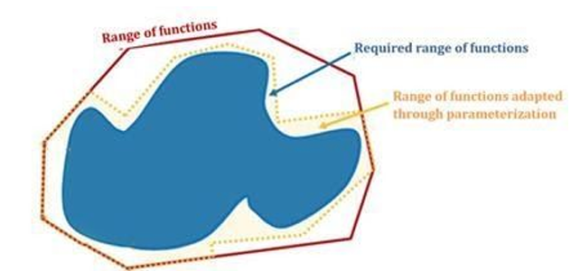
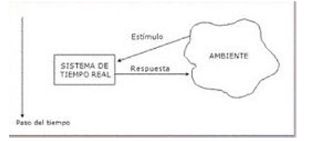
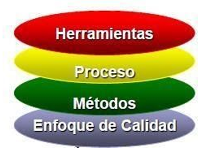

# Introducción a la ingenieriá de software

## Introducción 
La ingeniería de software es una disciplina que proporciona métodos y técnicas para el desarrollo y mantenimiento de software de calidad. Surge de la necesidad de sistematizar la creación de software, un proceso inherentemente creativo, mediante un enfoque estructurado, cuantificable y disciplinado. Esto permite monitorear proyectos y reducir la probabilidad de fracaso.

### Objetivos de la Ingeniería de Software
La ingeniería de software busca optimizar el desarrollo y mantenimiento de aplicaciones mediante diversos objetivos:

- Diseño eficiente y adaptable: Garantizar que el software se ajuste a las necesidades específicas de las organizaciones o propósitos para los que fue creado.

- Calidad del software: Mejorar la calidad de las aplicaciones, especialmente en sistemas complejos.

- Precisión en planificación: Aumentar la exactitud en la estimación de costos y tiempos de desarrollo.

- Eficiencia del sistema: Implementar procesos de medición y estándares que aseguren la mejor calidad posible del software según sus requisitos.

- Gestión del equipo de desarrollo: Organizar mejor los equipos de trabajo para el desarrollo y mantenimiento del software.

- Mejoras continuas: Identificar posibles optimizaciones mediante pruebas para mejorar el funcionamiento del software.

## Software
El software es la parte lógica de un sistema computacional, compuesta por datos e instrucciones, en contraste con el hardware, que son los componentes físicos del sistema. En la actualidad, el software es un elemento clave en la mayoría de los sistemas y un factor diferenciador en el ámbito empresarial.

- IEEE Std. 610: Define el software como “programas, procedimientos y documentación, junto con los datos asociados, que están relacionados con la operación de un sistema informático.”

- Webster’s New Collegiate Dictionary: Lo describe como “un conjunto de programas, procedimientos y documentación asociada a un sistema, especialmente un sistema informático.”

### Componentes del Software
Aunque comúnmente se percibe al software solo como programas, en realidad está compuesto por tres elementos esenciales:

- Programas: Son conjuntos de instrucciones escritas en lenguajes de programación que, al ejecutarse en un ordenador, proporcionan la funcionalidad deseada.

- Datos: Son la información manipulada por los programas para controlar su ejecución y realizar operaciones. Incluyen bases de datos, archivos y estructuras de datos necesarias para el funcionamiento del software.

- Documentación: Comprende manuales de usuario, guías operativas y documentación técnica que facilitan el uso y mantenimiento del software, asegurando su comprensión y actualización.

### Características del Software
El software posee características distintivas que lo diferencian de otros productos creados por el ser humano:

- Naturaleza lógica: El software es un conjunto de instrucciones (programas) que proporcionan funcionalidad, junto con los datos relacionados y la documentación asociada. A diferencia del hardware, que es un componente físico, el software es un elemento puramente lógico.

- Desarrollo, no fabricación: A diferencia del hardware, que se produce mediante procesos de manufactura con maquinaria y operarios especializados en tareas específicas, el software se desarrolla mediante un proceso de ingeniería. Su construcción implica análisis, diseño, implementación y pruebas, lo que lo diferencia fundamentalmente de la fabricación tradicional.

- Personalización: Cada software es único, ya que se desarrolla para satisfacer necesidades específicas de un cliente o usuario. Esto implica que su construcción requiere un enfoque de ingeniería para garantizar que cumpla con los requisitos establecidos.

- Proceso de desarrollo estructurado: La construcción de un software implica diversas etapas, que incluyen el análisis de requerimientos, el diseño del sistema, la implementación mediante lenguajes de programación y la validación a través de pruebas. Este proceso es gestionado como un proyecto y requiere la colaboración coordinada de un equipo de trabajo.

- Dependencia del factor humano: El principal recurso en el desarrollo de software es el equipo de trabajo. Aumentar la cantidad de desarrolladores en un proyecto no garantiza una aceleración inmediata, ya que la incorporación de nuevos miembros requiere capacitación y adaptación. Además, la comunicación efectiva dentro del equipo es fundamental para el éxito del proyecto.

- No se desgasta, pero puede fallar: A diferencia de los componentes físicos, el software no se deteriora con el uso. Sin embargo, puede contener defectos que se manifiestan durante sus primeras etapas de operación. Una vez corregidos, el software se estabiliza, siempre que no se introduzcan nuevos errores.

- Deterioro por mantenimiento: Aunque el software no se desgasta, sufre modificaciones a lo largo del tiempo debido a mejoras, correcciones o adaptaciones. Cada cambio puede introducir nuevos errores, lo que genera una degradación progresiva si no se gestiona adecuadamente.

- Reutilización: Un software bien diseñado permite la reutilización de componentes, facilitando el desarrollo de nuevas aplicaciones a partir de módulos existentes. Esto se logra mediante bibliotecas de funciones y objetos reutilizables, optimizando el esfuerzo de desarrollo y acelerando la producción de software.

### Atributos de un Buen Software
Un software de calidad debe proporcionar la funcionalidad y el rendimiento esperados de manera sostenible, fiable y aceptable para sus usuarios. Para ello, debe cumplir con los siguientes atributos:

- Mantenibilidad: Debe ser fácil de modificar y evolucionar para adaptarse a cambios en los requisitos o corregir errores sin afectar negativamente su funcionamiento.

- Fiabilidad: Debe garantizar un comportamiento predecible y correcto en su ejecución, minimizando fallos y errores.

- Eficiencia: Debe hacer un uso óptimo de los recursos del sistema, evitando el consumo innecesario de memoria, procesamiento y energía.

- Aceptabilidad: Debe ser comprensible, intuitivo y usable para los usuarios a los que está dirigido, además de ser compatible con otros sistemas con los que interactúe.

### Clasificaciones del Software

A continuación, se presentan las principales categorías del software según su utilización y funcionalidad:

#### Utilización del Software y su Funcionalidad

A continuación, se describen las principales categorías genéricas para las aplicaciones del software, cada una con sus características, funcionalidades y ejemplos.

##### 1. Software de Sistemas

El software de sistemas es un conjunto de programas diseñados para gestionar y coordinar el hardware de una computadora y proporcionar una base para que otros programas puedan ejecutarse. Este tipo de software no está diseñado para un usuario final específico, sino para facilitar la operación del sistema en su conjunto.

Características:

- Fuerte interacción con el hardware: Administra los recursos de hardware, como memoria, CPU, dispositivos de almacenamiento y periféricos.

- Uso por múltiples usuarios: En entornos multiusuario, permite que varias personas accedan simultáneamente a los recursos del sistema.

- Operación concurrente: Maneja múltiples procesos al mismo tiempo, requiriendo una planificación eficiente para evitar conflictos.

- Compartición de recursos: Optimiza el uso de los componentes del sistema para mejorar el rendimiento general.

- Manejo de estructuras de datos complejas: Necesario para administrar archivos, procesos y memoria de manera eficiente.

- Múltiples interfaces externas: Proporciona mecanismos de comunicación con otros sistemas y aplicaciones.

Ejemplos:

- Sistemas operativos (Windows, Linux, macOS).

- Controladores de dispositivos.

- Herramientas de gestión de memoria y almacenamiento.

- Software de virtualización como VMware o VirtualBox.

##### 2. Software de Tiempo Real

El software de tiempo real es aquel que debe responder a eventos externos en un tiempo determinado para garantizar un funcionamiento correcto. Se utiliza en sistemas donde el tiempo de respuesta es crítico.

Elementos Clave:

- Componente de adquisición de datos: Recoge y da formato a la información proveniente del entorno (sensores, dispositivos IoT, etc.).

- Componente de análisis: Procesa la información según las necesidades del sistema.

- Componente de control/salida: Responde al entorno externo mediante acciones adecuadas.

- Componente de monitorización: Coordina todos los elementos para garantizar una respuesta en tiempo real.

Ejemplos:

- Sistemas de control de tráfico.

- Monitoreo de pacientes en hospitales.

- Sistemas de automatización industrial.

- Software para el control de robots en líneas de producción.

##### 3. Software de Gestión

Este tipo de software facilita la administración de información comercial y operativa de empresas, instituciones y organizaciones.

Características:

- Gestiona bases de datos de clientes, empleados y productos.

- Permite realizar análisis de datos para la toma de decisiones.

- Facilita la automatización de procesos administrativos y financieros.

- Puede integrarse con otros sistemas para mejorar su funcionalidad.

Ejemplos:

- Sistemas de gestión empresarial (ERP) como SAP o Microsoft Dynamics.

- Software de contabilidad y facturación.

- Sistemas de gestión de relaciones con clientes (CRM) como Salesforce.

##### 4. Software de Ingeniería y Científico

Este tipo de software se especializa en la realización de cálculos complejos y análisis científico-técnicos.

Aplicaciones Comunes:

- Simulaciones de fenómenos físicos y químicos.

- Análisis estructural y de materiales.

- Modelado y diseño asistido por computadora (CAD).

- Simulación de sistemas dinámicos y aerodinámicos.

Ejemplos:

- MATLAB y Mathematica.

- AutoCAD para diseño asistido por computadora.

- Software de análisis de datos como SPSS y R.

##### 5. Software Empotrado

El software empotrado se encuentra integrado en dispositivos electrónicos para controlar su funcionamiento.

Características:

- Reside en memoria de solo lectura (ROM) o memoria flash.

- Diseñado para realizar tareas específicas con alta eficiencia.

- Puede operar sin intervención del usuario.

Ejemplos:

- Controladores de electrodomésticos (microondas, lavadoras, refrigeradores).

- Sistemas de control de vehículos (gestión del motor, ABS, airbag).

- Dispositivos IoT (termóstatos inteligentes, cámaras de seguridad).

##### 6. Software de Computadoras Personales

Incluye aplicaciones diseñadas para usuarios individuales en computadoras personales.

Tipos Comunes:

- Procesadores de texto y hojas de cálculo (Microsoft Word, Excel).

- Software de edición de imagen y video (Adobe Photoshop, Premiere Pro).

- Navegadores web (Google Chrome, Mozilla Firefox).

- Aplicaciones multimedia y de entretenimiento.

##### 7. Software Basado en Web

Son aplicaciones que se ejecutan en servidores web y se acceden a través de navegadores.

Ventajas:

- No requiere instalación en el dispositivo del usuario.

- Accesible desde cualquier lugar con conexión a Internet.

- Facilita la colaboración en tiempo real.

Ejemplos:

- Aplicaciones de correo electrónico (Gmail, Outlook Web).

- Plataformas de gestión de contenido (WordPress, Blogger).

- Herramientas de productividad en línea (Google Docs, Trello).

##### 8. Software de Inteligencia Artificial

Este software utiliza algoritmos avanzados para imitar la inteligencia humana y resolver problemas complejos.

Subcategorías:

- Sistemas expertos: Simulan la toma de decisiones de un especialista en un área específica.

- Redes neuronales artificiales: Utilizadas para reconocimiento de patrones e imagen.

- Aprendizaje automático: Algoritmos que mejoran con la experiencia.

- Procesamiento de lenguaje natural: Software de traducción, chatbots y asistentes virtuales.

Ejemplos:

- Asistentes virtuales (Siri, Alexa, Google Assistant).

- Algoritmos de recomendación (Netflix, Spotify).

- Sistemas de visión artificial en automóviles autónomos.

#### Tratamiento Comercial del Software

El software puede ser desarrollado con diferentes propósitos comerciales, lo que influye en cómo es distribuido, implementado y utilizado. En términos generales, los productos de software pueden ser diseñados para un cliente particular o para un mercado general. Dependiendo de su enfoque, el software puede clasificarse en tres categorías principales:

- Paquetes de software comercial (software estándar o empaquetado)

- Paquetes parametrizables o paramétricos

- Software a medida (personalizado para un cliente específico)

##### 1. Paquetes de Software Comercial

Este tipo de software es desarrollado para ser vendido a un mercado amplio, sin enfocarse en un cliente específico.

Características:

- Dirigido a usuarios promedio: Constituyen la mayoría de los sistemas consumidos por personas comunes, empresas y organizaciones.

- Generalmente compatible con distintos dispositivos: Aunque pueden existir versiones específicas para ciertos sistemas operativos, muchos de estos programas son diseñados para funcionar en múltiples plataformas.

- Menor personalización: Todos los usuarios poseen la misma versión del producto, sin posibilidad de adaptarlo a necesidades específicas más allá de las configuraciones básicas permitidas.

- Mayor accesibilidad y facilidad de uso: Suelen tener interfaces intuitivas y ser fáciles de instalar.

Ejemplos de paquetes de software comercial:

- Microsoft Office (Word, Excel, PowerPoint, etc.).

- Adobe Photoshop y otras aplicaciones de edición de imágenes.

- Software antivirus como Avast o Norton.

- Sistemas operativos como Windows o macOS.

- Sistemas de gestión empresarial (ERP) estándar como SAP Business One en su versión básica.

Ventajas:
✔ Costo más bajo en comparación con el software a medida.
✔ Actualizaciones periódicas y soporte técnico por parte del fabricante.
✔ Generalmente optimizado para un uso masivo.

Desventajas:
❌ No permite personalización avanzada para necesidades empresariales específicas.
❌ Puede incluir funciones innecesarias para algunos usuarios y carecer de otras cruciales para ciertos negocios.

##### 2. Paquetes Parametrizables o Paramétricos

Estos sistemas permiten cierto grado de personalización, ya que pueden ser ajustados mediante la configuración de parámetros predefinidos.

Características:

- Flexibilidad dentro de un marco definido: Aunque no son diseñados completamente a medida, ofrecen opciones para modificar su funcionamiento según el usuario o la empresa.

- Adaptabilidad mediante parámetros: Los usuarios pueden activar, desactivar o modificar configuraciones específicas según sus necesidades.

- Uso en múltiples sectores: Muchas empresas usan software parametrizable en áreas como contabilidad, recursos humanos y gestión de clientes (CRM).

- Suelen incluir módulos o componentes opcionales: Permiten adaptar su funcionalidad sin necesidad de modificaciones en el código fuente.

Ejemplos de paquetes parametrizables:

- Sistemas ERP como SAP S/4HANA o Microsoft Dynamics 365.

- Software de gestión hospitalaria que permite configurar reglas de administración de pacientes.

- Sistemas bancarios que permiten ajustar tasas de interés y condiciones de préstamos.

Parámetros comúnmente ajustables en este tipo de software:
✅ Definición de roles y autorizaciones: Configuración de accesos y permisos dentro de la organización.
✅ Creación de usuarios y asignación de roles: Administración de perfiles dentro del sistema.
✅ Definición de procesos y flujos de trabajo: Adaptación de los pasos que debe seguir una operación específica.
✅ Configuración de interfaces: Modificación de la apariencia y estructura visual del software.
✅ Ajustes de cálculo: Personalización de métricas como impuestos, puntajes o descuentos.
✅ Definición de alertas y notificaciones: Configuración de advertencias y límites de seguridad.

Origen del término "paramétrico":
El concepto proviene de las matemáticas y hace referencia al uso de parámetros o variables para modificar un resultado sin cambiar la estructura base del sistema.

Ventajas:
✔ Mayor adaptabilidad que el software estándar.
✔ Permite que una misma aplicación sea usada por múltiples tipos de empresas sin necesidad de desarrollo adicional.
✔ No requiere un desarrollo costoso desde cero.

Desventajas:
❌ No ofrece una personalización total, ya que solo puede modificarse dentro de los límites establecidos por el fabricante.
❌ Si se necesitan cambios más profundos, puede requerir desarrollos adicionales o integraciones con otros sistemas.

##### 3. Software a Medida (Personalizado)

El software a medida es desarrollado exclusivamente para un cliente o empresa en función de sus necesidades específicas.

Características:

- Diseñado para un cliente único: Se construye desde cero con base en las especificaciones y requisitos del usuario final.

- Optimizado para tareas especializadas: Se usa en aplicaciones donde los requisitos de precisión y rendimiento son críticos.

- Máximo nivel de personalización: Cada aspecto del software es adaptado a los procesos internos del cliente.

- Puede requerir un mayor tiempo y costo de desarrollo: Debido a que es una solución exclusiva, no se puede reutilizar fácilmente en otros entornos.

Ejemplos de software a medida:

- Sistemas de gestión interna para grandes empresas con necesidades específicas.

- Software médico personalizado para hospitales con protocolos especiales de atención.

- Aplicaciones de logística desarrolladas según procesos exclusivos de una compañía de transporte.

- Plataformas de análisis financiero avanzadas adaptadas a bancos o aseguradoras.

Ventajas:
✔ Se adapta completamente a los procesos y necesidades del cliente.
✔ Puede ser más eficiente y optimizado que un software genérico.
✔ No tiene funciones innecesarias que ocupen espacio o generen complicaciones.

Desventajas:
❌ Su desarrollo puede ser costoso y demorado, ya que implica una inversión significativa en análisis, diseño, programación y pruebas.
❌ Puede requerir mantenimiento constante, ya que no cuenta con un proveedor global que ofrezca actualizaciones estándar.
❌ En algunos casos, la dependencia del desarrollador o empresa que lo creó puede generar problemas si se requiere soporte técnico a largo plazo.

#### Exigencias en eficiencia y los factores críticos que se le exigen

Al desarrollar software, uno de los aspectos fundamentales es la eficiencia. Esta eficiencia se mide en términos de tiempo de respuesta, uso de recursos y capacidad de procesamiento. Dependiendo del tipo de sistema, los requisitos de eficiencia pueden ser más o menos estrictos. Dos de los sistemas que tienen mayores exigencias en cuanto a eficiencia son los sistemas de tiempo real (STR) y los sistemas transaccionales.

##### Software de Tiempo Real (STR)

Un software de tiempo real es aquel que debe responder a estímulos externos con una gran velocidad, en un tiempo tan reducido que la toma de decisiones ocurre casi de inmediato. Esta inmediatez suele estar en el orden de microsegundos o milisegundos, lo que significa que cualquier retraso puede ocasionar fallos en el sistema o consecuencias críticas en su funcionamiento.

Características:

- Dependencia del tiempo físico:

En un sistema de tiempo real, la corrección de los resultados no solo depende de la precisión de los cálculos lógicos, sino también del momento exacto en que esos cálculos se realizan.

Esto se debe a que el sistema interactúa con procesos físicos que evolucionan en el tiempo. Un ejemplo claro es una reacción química controlada por un software, donde los cambios en la composición continúan ocurriendo incluso si el sistema de control deja de funcionar.

- Reacción a estímulos en intervalos predefinidos:

Un software de tiempo real debe reaccionar a señales o eventos externos dentro de un margen de tiempo estrictamente determinado.

Si la respuesta del sistema se retrasa, el control puede volverse ineficiente o incluso peligroso.

Ejemplos:

- Control de tráfico aéreo: Sistemas que gestionan la ubicación y desplazamiento de aviones en tiempo real para evitar colisiones.

- Marcapasos: Dispositivos implantados en el corazón que monitorean los latidos y generan impulsos eléctricos cuando detectan ritmos anormales.

- Sistemas de transacciones financieras: Algunos sistemas bancarios requieren respuesta inmediata para evitar fraudes o problemas de sincronización en cuentas.

- Controladores en plantas nucleares o químicas: Garantizan la seguridad y estabilidad de procesos peligrosos mediante respuestas inmediatas a variaciones en sensores.

- Sistemas de frenado en automóviles modernos: El ABS (Sistema de Frenos Antibloqueo) ajusta la presión de los frenos en milisegundos para evitar derrapes.

##### Sistemas Transaccionales

Un sistema transaccional es aquel diseñado para gestionar transacciones, es decir, acciones que deben ejecutarse de manera segura, confiable y consistente dentro de una organización. Las transacciones pueden involucrar almacenamiento, modificación, recuperación o eliminación de datos.

Existen dos tipos principales de sistemas transaccionales:

- Sistemas transaccionales en línea (online)

- Sistemas de procesamiento por lotes (batch processing)

###### 1. Sistemas Transaccionales en Línea (Online Transaction Processing - OLTP)

Estos sistemas están diseñados para procesar transacciones de manera inmediata, permitiendo que los usuarios interactúen con ellos en tiempo real.

Características:

- Gestión eficiente de datos transaccionales: Manejan grandes volúmenes de operaciones pequeñas (lecturas, escrituras, actualizaciones) en una base de datos.

- Arquitectura cliente-servidor: Suelen estar distribuidos en una red, con múltiples clientes enviando solicitudes a servidores de base de datos.

- Tiempo de respuesta corto: Normalmente de 2 a 3 segundos para que la experiencia del usuario sea fluida.

- Alta concurrencia: Deben permitir que múltiples usuarios realicen transacciones simultáneamente sin afectar la integridad de los datos.

Ejemplos:

- Banca en línea: Transferencias de dinero, consultas de saldo y pagos en tiempo real.

- Compras por internet: Procesamiento inmediato de pedidos y pagos.

- Software de atención al cliente: Registros de llamadas, generación de tickets de soporte.

- Cajeros automáticos (ATM): Consultas de saldo, retiros y depósitos instantáneos.

###### 2. Procesamiento por Lotes (Batch Processing)

A diferencia de los sistemas online, los sistemas de procesamiento por lotes no requieren la supervisión o intervención directa del usuario.

Características:

- Automatización de tareas repetitivas: Se ejecutan procesos grandes sin necesidad de interacción en tiempo real.

- Alto volumen de datos: Suelen manejar archivos grandes que requieren procesamiento en conjunto.

- Planificación de ejecución: Las tareas pueden ejecutarse en momentos específicos (por ejemplo, en horarios nocturnos para no afectar el rendimiento del sistema principal).

- Independencia de la entrada de usuario: Pueden recibir parámetros o configuraciones previas sin intervención constante.

- Tiempo de procesamiento variable: Algunas tareas pueden tardar varios minutos u horas en completarse.

Ejemplos:

- Renderizado de películas: Procesamiento de gráficos y animaciones en la industria del cine.

- Generación de extractos bancarios: Cálculo y emisión de reportes mensuales de cuentas.

- Cálculo de intereses e indicadores económicos: Generación de datos financieros en empresas y bancos.

- Procesos de generación automática de archivos: Creación de respaldos, registros y archivos de auditoría.

## Ingeniería de Software

La ingeniería del software es una disciplina de la ingeniería preocupada por todos los aspectos de la producción y desarrollo de software rentable. Esto abarca desde las primeras etapas de especificación del sistema hasta su mantenimiento una vez que ha sido puesto en uso. La disciplina provee teorías, métodos y herramientas para el desarrollo profesional de software.

La ingeniería del software busca adoptar un enfoque sistemático y organizado en su trabajo, utilizando herramientas y técnicas apropiadas según el problema a solucionar, las restricciones del desarrollo y los recursos disponibles. Este enfoque estructurado suele conocerse como "modelo de proceso de software" o "proceso de desarrollo de software".

El proceso de desarrollo de software consiste en un conjunto de prácticas específicas que los ingenieros del software siguen en un orden predeterminado. Estas prácticas incluyen la gestión del proyecto, la elección del ciclo de vida, la ingeniería de requisitos, el diseño, la implementación, la verificación y validación, la documentación y la capacitación.

- Proceso de desarrollo de software: Conjunto de prácticas organizadas en pasos para la construcción de software.

- Prácticas de desarrollo de software: Actividades específicas realizadas por ingenieros para garantizar la calidad y funcionalidad del software.

- Modelos de proceso: Estrategias que definen cómo se organiza el desarrollo del software, como el modelo en cascada, el modelo iterativo y el modelo ágil.

- Ciclo de vida del software: Fases por las que pasa un sistema desde su concepción hasta su retiro. 

### Historia de la Ingeniería de Software

El término "ingeniería del software" se utilizó por primera vez en la Conferencia de Ingeniería de Software de la OTAN en 1968. Surgió como respuesta a la llamada "crisis del software", un problema en el que los proyectos de software se retrasaban, superaban el presupuesto o no cumplían con los requisitos esperados.

Desde entonces, la ingeniería del software ha evolucionado hasta convertirse en una profesión y un campo de estudio centrado en la creación de software de alta calidad, rentable, fácil de mantener y rápido de construir. A diferencia de otros campos de la ingeniería, el software no tiene componentes físicos, lo que ha llevado a debates sobre si realmente es una "ingeniería" en el sentido tradicional.

### Prácticas de Desarrollo de Software

Las prácticas de desarrollo de software abarcan diversas actividades que buscan garantizar la calidad y eficiencia del software producido. Algunas de las más relevantes incluyen:

#### Elección del Ciclo de Vida

El ciclo de vida del software describe las etapas por las que pasa un producto desde su concepción hasta su retiro. Algunos modelos populares incluyen:

- Modelo en cascada: Proceso lineal donde cada fase debe completarse antes de pasar a la siguiente.

- Modelo incremental: Desarrollo en pequeñas entregas funcionales.

- Modelo ágil: Desarrollo iterativo basado en colaboración y flexibilidad ante cambios.

- Modelo DevOps: Integración entre desarrollo y operaciones para entrega continua.

#### Gestión del Proyecto

La gestión del proyecto implica planificar, organizar y supervisar el desarrollo del software para garantizar que se cumplan los requisitos de calidad, tiempo y presupuesto. Incluye:

- Definición de objetivos y alcance del proyecto.

- Asignación de recursos y personal.

- Seguimiento del progreso y control de riesgos.

#### Desarrollo de Software

Comprende todas las etapas técnicas para construir el software, incluyendo:

- Ingeniería de requisitos: Definir qué debe hacer el software y documentar los requisitos funcionales y no funcionales.

- Análisis de sistemas: Comprender el entorno donde operará el software.

- Diseño: Definir la arquitectura y estructura del software.

- Implementación e implantación: Codificación y despliegue en el entorno de producción.

- Mantenimiento: Corrección de errores y actualizaciones para mejorar el rendimiento o agregar nuevas funcionalidades.

#### Procesos Integrales

Son procesos transversales que garantizan la calidad y la gestión adecuada del software:

- Gestión de configuración: Control de versiones y gestión de cambios en el software.

- Verificación y validación: Pruebas para asegurar que el software cumple con los requisitos.

- Documentación: Creación de manuales y guías para desarrolladores y usuarios.

- Capacitación: Formación del equipo y usuarios en el uso del software.

### Capas de la Ingeniería de Software

La Ingeniería del Software es una tecnología multicapa, lo que significa que se compone de varios niveles de abstracción y componentes que trabajan en conjunto para lograr el desarrollo de software de calidad. Esta estructura en capas permite que cada aspecto del proceso de desarrollo se aborde de manera sistemática y organizada, asegurando eficiencia, confiabilidad y mantenimiento del software.

Las capas principales de la Ingeniería de Software son:

- Enfoque de calidad: Representa el compromiso organizacional con la calidad del software.

- Métodos: Incluyen todas las actividades técnicas necesarias para desarrollar software.

- Procesos: Son marcos de trabajo que guían la gestión y ejecución de proyectos de software.

- Herramientas: Proporcionan apoyo automatizado a los procesos y métodos para mejorar la eficiencia y reducir errores.

#### Enfoque de Calidad

El enfoque de calidad en la Ingeniería del Software es esencial para garantizar que los productos desarrollados cumplan con las expectativas del cliente, los requisitos técnicos y las regulaciones de la industria. Una organización que no prioriza la calidad en sus procesos difícilmente podrá producir software confiable y eficiente.

Algunos aspectos clave del enfoque de calidad incluyen:

- Satisfacción del cliente: Garantizar que el software cumpla con las necesidades del usuario final.

- Competitividad: En un mercado globalizado, ofrecer software de calidad se traduce en ventajas competitivas.

- Reducción de errores: Detectar y corregir defectos a tiempo reduce costos y mejora la reputación del producto.

Para garantizar la calidad, existen diversas normativas y certificaciones internacionales, como:

##### Gestión de calidad de software de la ISO 9000

La norma ISO 9000 define un conjunto de estándares de calidad que las organizaciones pueden seguir para mejorar sus procesos. Incluye:

- Planificación de la calidad: Definir estrategias y objetivos para asegurar la calidad del software.

- Control de calidad: Inspeccionar y verificar que los procesos cumplen con los estándares.

- Aseguramiento de calidad: Implementar medidas para evitar defectos en el software.

- Mejora continua: Identificar oportunidades de optimización en los procesos de desarrollo.

##### CMMi

El modelo de madurez de capacidades (Capability Maturity Model Integration, CMMi) es una referencia global desarrollada por el Software Engineering Institute (SEI) de Carnegie Mellon. Este modelo ayuda a evaluar y mejorar los procesos de desarrollo de software en una organización, asegurando que se alcancen niveles de madurez y eficiencia progresivos.

##### Estándares de la IEEE

El IEEE ha desarrollado múltiples estándares aplicables a la Ingeniería del Software, entre los cuales se destacan:

- IEEE 1074: Modelo de proceso de software.

- IEEE 12207: Establece los procesos de ciclo de vida del software.

- IEEE 830: Define estándares para la documentación de requisitos de software.

#### Métodos

La construcción de software implica una amplia variedad de actividades técnicas que deben llevarse a cabo de manera estructurada y eficiente. La capa de métodos dentro de la ingeniería del software proporciona el conjunto de técnicas, procedimientos y estrategias necesarios para llevar a cabo estas actividades.

Esta capa está enfocada en definir cómo se deben realizar las tareas fundamentales de ingeniería del software, tales como:

- Análisis de requisitos: Proceso de recopilación y documentación de lo que se espera del sistema. Incluye entrevistas con usuarios, modelado de requisitos y validación.

- Diseño de software: Elaboración de modelos que describen la estructura y el comportamiento del sistema. Abarca desde diseño arquitectónico hasta diseño detallado de componentes.

- Construcción de programas: Implementación del diseño en un lenguaje de programación adecuado, asegurando buenas prácticas de codificación y estándares.

- Pruebas de software: Verificación de que el sistema cumple con los requisitos y no contiene errores. Incluye pruebas unitarias, de integración, de sistema y de aceptación.

- Mantenimiento: Modificación y mejora del software después de su implementación para corregir errores, mejorar rendimiento o adaptarse a nuevos requisitos.

Cada una de estas actividades se apoya en métodos específicos, que pueden incluir modelado gráfico (diagramas UML), técnicas descriptivas, normas de documentación, y herramientas de validación. La selección de los métodos adecuados es fundamental para garantizar la eficiencia y calidad del desarrollo.

#### Procesos

El proceso de ingeniería del software es el conjunto de actividades, metodologías y flujos de trabajo utilizados para gestionar y desarrollar software de manera estructurada. Esta capa proporciona un marco de trabajo que permite a los equipos de desarrollo coordinar sus esfuerzos y garantizar que el software sea entregado de manera efectiva y con la calidad esperada.

Características:

- Definición de fases y actividades: Describe las etapas del ciclo de vida del software, desde la concepción hasta el mantenimiento.

- Control y gestión de proyectos: Permite a los jefes de proyecto monitorear el progreso, asignar recursos y garantizar la entrega oportuna.

- Gestíon del cambio: Se encarga de manejar modificaciones en requisitos, diseño y código, asegurando la estabilidad y evolución del sistema.

- Aseguramiento de la calidad: Incorpora actividades de revisión, auditoría y pruebas para garantizar la conformidad con estándares y requisitos.

Existen diferentes modelos de procesos que guían el desarrollo del software, tales como:

- Modelo en cascada: Desarrollo secuencial donde cada fase depende de la finalización de la anterior.

- Modelo incremental: Desarrollo en iteraciones, permitiendo la entrega de funcionalidades parciales.

- Desarrollo ágil: Priorización de entregas rápidas y adaptación al cambio continuo, con metodologías como Scrum y Kanban.

- Modelo en espiral: Combinación de prototipado y evaluación de riesgos en cada iteración.

El proceso es el vínculo que conecta los métodos y herramientas, asegurando que las técnicas utilizadas sean aplicadas dentro de un marco ordenado y eficiente.

#### Herramientas

La automatización juega un papel fundamental en la ingeniería del software. La capa de herramientas proporciona soporte tecnológico a los procesos y métodos, reduciendo el esfuerzo manual, minimizando errores y facilitando la gestión eficiente del desarrollo.

Tipos:

- Herramientas de gestión de proyectos: Ayudan en la planificación, asignación de tareas y seguimiento del progreso. Ejemplos: Jira, Trello, Microsoft Project.

- Herramientas de control de versiones: Permiten el seguimiento de cambios en el código fuente y colaboración entre desarrolladores. Ejemplos: Git (GitHub, GitLab, Bitbucket).

- Herramientas de análisis y diseño: Facilitan la creación de diagramas y modelos de software. Ejemplos: Enterprise Architect, Lucidchart, Visual Paradigm.

- Herramientas de generación de código: Automatizan la escritura de código repetitivo o basado en modelos. Ejemplos: CodeSmith, JHipster.

- Herramientas de pruebas: Automatizan la verificación de software mediante pruebas unitarias, de carga y de integración. Ejemplos: Selenium, JUnit, Postman.

- Herramientas de documentación: Facilitan la creación de manuales y documentación técnica. Ejemplos: Doxygen, Swagger.

- Herramientas de prototipado: Permiten la creación de maquetas interactivas para visualizar la interfaz del usuario. Ejemplos: Figma, Adobe XD.

Beneficios de la automatización mediante herramientas:

- Mayor productividad: Reduce el tiempo requerido para tareas manuales.

- Menos errores humanos: Al minimizar la intervención manual, se reducen los defectos.

- Mejor colaboración: Facilita el trabajo en equipo mediante la integración de herramientas en un flujo unificado.

- Trazabilidad y gestión de cambios: Registra versiones, comentarios y revisiones de código.