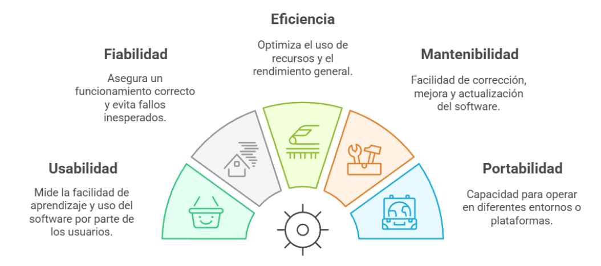

# Software

## ¿Qué es el software?

El software es una parte esencial del mundo digital, aunque muchas veces pase desapercibido por no ser algo tangible. En términos simples, el software es un conjunto de instrucciones, algoritmos y elementos visuales que le indican a una computadora o dispositivo electrónico cómo debe funcionar. Es decir, es el "cerebro lógico" que permite que un dispositivo haga algo útil.

A diferencia del hardware, que es la parte física (como el teclado, el disco duro o la pantalla), el software no se puede tocar. Pero sin él, ningún dispositivo electrónico moderno funcionaría como lo conocemos. Sería como tener una computadora sin saber cómo usarla: estaría encendida, pero sin hacer nada comprensible o útil para la mayoría de las personas.

Gracias al software, podemos interactuar fácilmente con computadoras, teléfonos, tablets y otros dispositivos. Por ejemplo, cuando usás una app para chatear, editar fotos o jugar, lo que estás usando es software. Y no solo eso: el sistema operativo, que organiza todo lo que pasa dentro del dispositivo (como Windows, Android o iOS), también es software.

### Un poco de historia

El concepto de software tiene sus raíces en los años 40, cuando el matemático Alan Turing propuso una máquina teórica, hoy conocida como la Máquina de Turing, que sentó las bases de lo que más adelante sería la programación. En las décadas siguientes, aparecieron los primeros lenguajes de programación, como COBOL y FORTRAN, que permitían a los humanos escribir instrucciones que las máquinas podían entender.

Con el tiempo, estos lenguajes fueron evolucionando hasta llegar a los llamados lenguajes de alto nivel, que son más parecidos al lenguaje humano y mucho más fáciles de usar. Esto permitió que el desarrollo de software se volviera más accesible y versátil, dando lugar a la enorme cantidad de programas que usamos hoy en día.

### Software y hardware: dos caras de la misma moneda

Aunque son conceptos distintos, el software y el hardware trabajan juntos. El hardware proporciona la base física (como el procesador o la memoria), mientras que el software le da sentido a ese hardware, diciéndole qué hacer y cómo hacerlo.

Por ejemplo, cuando editás un video en tu computadora, el software de edición te permite manipular imágenes y sonidos. Pero es el hardware, como la tarjeta gráfica o el procesador, el que realiza los cálculos y muestra los resultados. Sin software, el hardware no sabría qué hacer. Sin hardware, el software no tendría dónde ejecutarse.

### IEEE

IEEE Std. 610 (un estándar del Instituto de Ingenieros Eléctricos y Electrónicos): define el software como “programas, procedimientos y documentación y datos asociados, relacionados con la operación de un sistema informático.”
Esto quiere decir que el software no solo son los archivos que ejecutás (como una aplicación), sino también todo lo que rodea su uso:

- Programas: el código ejecutable que realiza tareas específicas.
- Procedimientos: instrucciones que indican cómo usar o administrar el software.
- Documentación: manuales, guías, ayudas técnicas.
- Datos asociados: información que el programa necesita o genera para funcionar.

### Webster’s Dictionary

Webster’s Dictionary lo define como “un conjunto de programas, procedimientos y documentación relacionada asociados con un sistema, especialmente un sistema informático.”

Es muy similar a la anterior y refuerza la idea de que el software es un conjunto organizado que va más allá del simple programa: abarca todo lo necesario para que un sistema funcione y pueda ser comprendido, operado y mantenido.

## Componentes

Existe una idea bastante común —pero incompleta— de que el software está compuesto únicamente por programas. Sin embargo, el software abarca mucho más. Se puede dividir en tres componentes fundamentales que trabajan de forma conjunta:

### Programas

Los programas son el núcleo funcional del software. Se trata de conjuntos de instrucciones escritas en uno o más lenguajes de programación, los cuales son comprensibles por el sistema informático.

Estas instrucciones indican al dispositivo qué debe hacer, cómo y en qué orden. Por ejemplo, un programa puede decirle al sistema que reproduzca un video, calcule una fórmula, o guarde datos en un archivo.

- Son lo que el usuario suele ver como una "aplicación" o "sistema".
- Pueden ser muy simples (como una calculadora) o extremadamente complejos (como un sistema operativo).
- Están diseñados para realizar tareas específicas cuando se ejecutan.

### Datos

Los datos son la materia prima con la que trabajan los programas. Un programa por sí solo no sirve de mucho si no puede recibir, manipular o mostrar datos. Estos datos pueden ser introducidos por el usuario o estar almacenados previamente en archivos, bases de datos u otras fuentes.

- Los datos permiten que el software tome decisiones, realice operaciones o muestre información útil.
- También son esenciales en procesos de prueba, mantenimiento y validación del software.
- El diseño de un programa incluye la planificación de cómo va a manejar, organizar y acceder a los datos necesarios para funcionar.

### Documentación

La documentación es la parte del software que explica cómo usarlo, entenderlo y mantenerlo. No es funcional en sí misma, pero es esencial para que el software sea accesible y utilizable por otras personas.

Hay dos grandes tipos de documentación:

- Documentación para el usuario: explica cómo usar el software. Incluye manuales, tutoriales, ayudas en pantalla, etc.
- Documentación técnica: está dirigida a desarrolladores, testers o personal de soporte. Describe cómo está construido el software, qué hace cada módulo, cómo se instala, cómo se actualiza o cómo se puede modificar.

Sin documentación:

- Los usuarios no sabrían cómo usar el sistema de manera correcta.
- Los técnicos no podrían mantener ni evolucionar el software con facilidad.

## Caracteristicas

El software no es un producto físico, y por lo tanto posee características propias y únicas que lo diferencian claramente de otras creaciones humanas, como una máquina, un edificio o un auto. A continuación, se detallan sus principales propiedades:

### Es un producto lógico, no físico

El software está compuesto por instrucciones, datos y documentación, no por materiales tangibles. A diferencia del hardware, que se puede ver y tocar, el software se ejecuta, se interpreta, pero no se fabrica en un sentido físico tradicional.

- Por eso se dice que el software es intangible.
- Existe a través de líneas de código, estructuras de datos y algoritmos.

### Se desarrolla, no se fabrica

A diferencia de un producto físico, que se fabrica en serie usando maquinaria, el software se construye paso a paso mediante un proceso de análisis, diseño, programación, pruebas y mantenimiento.

- Cada línea de código es escrita manualmente.
- Aunque haya automatización en algunas etapas, el desarrollo sigue siendo creativo, artesanal y técnico a la vez.

### Cada producto de software es único

Cada software suele ser construido a medida para satisfacer requisitos específicos de un cliente o problema. Incluso programas que se parecen (como dos apps de mensajería) tienen código, diseño y lógica que los hacen distintos.

- No hay dos proyectos de software exactamente iguales.
- Por eso el enfoque debe ser de ingeniería personalizada, no de producción en masa.

### Construir software es un proceso organizado

El desarrollo de software requiere comprender lo que se necesita, diseñar una solución, implementarla con un lenguaje de programación y verificar que cumpla con los objetivos.

- Esto se hace dentro de un proyecto organizado, donde cada miembro tiene un rol y se trabaja colaborativamente.
- Las tareas incluyen desde la toma de requisitos hasta la validación del producto final.

### Las personas son el recurso más importante

El software no se construye apilando materiales, sino coordinando equipos humanos: programadores, diseñadores, testers, analistas, entre otros.

- No se puede simplemente "agregar más personas" para terminar más rápido. Esto a veces ralentiza el proceso, especialmente si no hay buena comunicación o si los nuevos miembros requieren capacitación.
- Se necesita trabajo en equipo, comunicación efectiva y coordinación constante.

### El software no se desgasta, pero puede fallar

A diferencia del hardware, el software no se desgasta físicamente. Sin embargo, puede tener errores lógicos (bugs) que provocan fallos.

- Estos errores suelen aparecer en las primeras etapas de uso.
- Una vez corregidos, si no se introducen nuevos errores, el software suele estabilizarse.

### El software se deteriora con el tiempo (por mantenimiento)

Aunque no se dañe por uso como un objeto físico, el software puede deteriorarse cuando se le hacen modificaciones constantes.

- A medida que se actualiza o se adapta, se corre el riesgo de introducir nuevos errores o inconsistencias.
- El código puede volverse difícil de entender o mantener si no se gestiona adecuadamente.

### Es reutilizable

Una de las grandes ventajas del software es que se puede reutilizar. Muchas partes de código, funciones o módulos pueden ser aprovechados en diferentes proyectos.

- Esto mejora la eficiencia del desarrollo y permite centrarse en lo realmente nuevo o específico.
- Las bibliotecas, frameworks y componentes reutilizables son un claro ejemplo de esta característica.

## Atributos

Un buen software no solo debe cumplir su propósito funcional, sino que debe hacerlo de manera eficiente, confiable y sostenible a lo largo del tiempo. A continuación, se describen los principales atributos que lo caracterizan:

### Usabilidad

- ¿Qué es? La facilidad con la que los usuarios pueden aprender, entender y usar el software.
- Importancia: Un software usable mejora la experiencia del usuario, reduce la necesidad de formación y evita errores.
- Ejemplo: Una app bancaria con menús claros, botones intuitivos y mensajes de error comprensibles.

### Fiabilidad

- ¿Qué es? La capacidad del software de funcionar correctamente durante un periodo determinado y bajo condiciones definidas.
- Importancia: Un software fiable minimiza fallos inesperados y garantiza que el sistema siempre responde como se espera.
- Ejemplo: Un software de control aéreo que no falla en momentos críticos.

### Eficiencia

- ¿Qué es? El uso óptimo de los recursos del sistema (CPU, memoria, red, etc.) por parte del software.
- Importancia: Un software eficiente no ralentiza el sistema, es rápido y consume lo justo.
- Ejemplo: Una app que se ejecuta en segundo plano sin agotar la batería ni usar demasiada RAM.

### Mantenibilidad

- ¿Qué es? La facilidad con la que el software puede ser corregido, actualizado o mejorado.
- Importancia: Facilita la evolución del software ante nuevos requerimientos o errores descubiertos.
- Ejemplo: Un sistema con código limpio y bien documentado que puede adaptarse fácilmente a nuevas reglas de negocio.

### Portabilidad

- ¿Qué es? La capacidad del software para funcionar en distintos entornos o plataformas sin modificaciones significativas.
- Importancia: Reduce costos y tiempos de adaptación a diferentes sistemas operativos o dispositivos.
- Ejemplo: Un programa que puede ejecutarse tanto en Windows, Linux y macOS, o en móviles Android e iOS.

### Aceptabilidad

- ¿Qué es? Que el software sea aprobado y adoptado por los usuarios finales y cumpla con sus expectativas y requisitos.
- Incluye: ser entendible, usable y compatible con otros sistemas del entorno del usuario.
- Ejemplo: Un CRM que se adapta a la forma de trabajo de una empresa y puede integrarse con herramientas como Outlook o Google Calendar.

## Clasificación

### Según su Utilización y Funcionalidad

#### Software de Sistemas

Es un conjunto de programas que permiten que el hardware funcione correctamente y que otros programas puedan ejecutarse. Su función principal es la de servir de base para otros softwares, facilitando su ejecución y gestión de recursos.

Características principales:

- Alta interacción con el hardware (discos, memoria, CPU, periféricos).
- Soporta la utilización concurrente por múltiples usuarios o procesos.
- Gestiona recursos como la memoria, el tiempo de CPU y los dispositivos.
- Trabaja con estructuras de datos complejas.
- Posee interfaces externas con otros componentes o programas.

Ejemplos comunes:

- Sistemas operativos (Windows, Linux, macOS)
- Compiladores
- Drivers de dispositivos
- Editores de texto del sistema
- Herramientas de diagnóstico

#### Software de Tiempo Real

Es un tipo de software que responde a eventos del mundo real en el momento en que ocurren, en un plazo determinado o crítico.

Componentes típicos:

- Adquisición de datos: recibe información del entorno (sensores, entradas).
- Análisis de datos: procesa la información captada para tomar decisiones.
- Control/salida: actúa en el entorno (actuadores, alertas, mecanismos).
- Monitorización: coordina todos los módulos y asegura que se responda a tiempo.

Ejemplos comunes:

- Software para control de tráfico aéreo o ferroviario
- Sistemas embebidos en automóviles
- Controladores industriales automatizados
- Equipos médicos (como marcapasos o monitores de signos vitales)
- Juegos o simuladores con respuestas inmediatas

#### Software de Gestión (o Software de Aplicación Comercial)

Son programas que automatizan procesos administrativos y comerciales dentro de una organización. Su función principal es la de procesar, almacenar y analizar datos comerciales o de gestión para facilitar la toma de decisiones o realizar operaciones diarias.

Características clave:

- Acceden y manipulan bases de datos empresariales.
- Automatizan tareas como nóminas, inventarios, contabilidad, ventas.
- Permiten análisis y generación de informes y reportes.
- Incorporan interacción con el usuario y procesos en tiempo real, como puntos de venta.

Ejemplos comunes:

- Sistemas de gestión empresarial (ERP)
- Software de gestión de recursos humanos
- Programas de contabilidad
- Sistemas de facturación
- CRM (Customer Relationship Management)

#### Software de Ingeniería y Científico

Son programas desarrollados para resolver problemas técnicos o científicos mediante cálculos numéricos, simulaciones y análisis de datos. Su aplicación va desde la física y la biología hasta la ingeniería mecánica, aeroespacial o la medicina.

Características clave:

- Manejo intensivo de algoritmos numéricos.
- Alto grado de precisión y rendimiento matemático.
- Incluyen herramientas como CAD (Diseño Asistido por Computadora), simulación de sistemas, análisis de presión, dinámica, etc.
- En muchos casos, se integran con características de software de sistemas o de tiempo real, especialmente en simulaciones en vivo.

Ejemplos:

- MATLAB, AutoCAD, ANSYS
- Simuladores de física/mecánica
- Software de predicción meteorológica
- Modelos moleculares y genéticos

#### Software Empotrado (Embedded Software)

Software que reside dentro de dispositivos electrónicos o mecánicos y controla funciones específicas del hardware. Se usan desde electrodomésticos hasta autos, maquinaria industrial o dispositivos médicos.

Características clave:

- Se ejecuta desde memoria de sólo lectura (ROM).
- Funciona en tiempo real, con respuestas inmediatas a estímulos.
- Realiza tareas muy específicas y dedicadas.
- Puede tener desde funcionalidades básicas (botones) hasta complejas (frenado automático).

Ejemplos:

- Microondas, lavarropas, televisores
- Control electrónico de vehículos (inyección de gasolina, ABS)
- Dispositivos médicos portátiles
- Drones y robots

#### Software de Computadoras Personales

Es todo aquel software diseñado para ser usado directamente por usuarios finales en computadoras personales. Su propósito es cubrir necesidades personales, educativas, laborales y de entretenimiento.

Características clave:

- Interacción directa con el usuario.
- Gran variedad de funciones: texto, cálculo, multimedia, juegos.
- Enfocados en usabilidad, estética y productividad.

Ejemplos:

- Microsoft Word, Excel, PowerPoint
- Google Chrome, VLC, Spotify
- Videojuegos, reproductores multimedia
- Gestores de finanzas o tareas personales

#### Software Basado en Web

Son aplicaciones que se ejecutan a través del navegador web y no requieren instalación local. Se puede acceder desde cualquier lugar con conexión a Internet.

Características clave:

- Se alojan en servidores remotos (cloud computing).
- Se usan mediante navegadores (HTML, CSS, JS).
- Muchas veces integran funciones de bases de datos, autenticación, API.

Ejemplos:

- Google Docs, Gmail, Canva, Notion
- Plataformas de e-learning
- Tiendas en línea (eCommerce)
- Aplicaciones financieras en línea

#### Software de Inteligencia Artificial (IA)

Es software que intenta emular el comportamiento humano inteligente, utilizando técnicas como el aprendizaje automático, razonamiento, percepción y decisión autónoma.

Características clave:

- Utiliza algoritmos no numéricos.
- Capacidad de aprender, adaptarse y tomar decisiones.
- Aplica reconocimiento de patrones, procesamiento del lenguaje, y lógica difusa.

Ejemplos:

- Sistemas expertos (por ejemplo, diagnósticos médicos)
- Asistentes virtuales (Siri, Alexa)
- Software de reconocimiento facial o de voz
- Redes neuronales, procesamiento de lenguaje natural (NLP)
- Motores de recomendación (Netflix, Amazon)

### Según su Tratamiento Comercial

El tratamiento comercial del software hace referencia a la forma en que se concibe, desarrolla y entrega un producto de software al usuario final. Dependiendo del público objetivo y el nivel de personalización requerido, se pueden distinguir tres tipos principales: software empaquetado, software parametrizable y software a medida.

#### Software Empaquetado (o estándar)

Este tipo de software es desarrollado para un mercado amplio y general, sin tener en cuenta necesidades específicas de cada usuario. Son programas que se venden en masa y que apuntan a cubrir requerimientos comunes de una gran cantidad de personas o empresas. La mayoría de los usuarios promedio consumen este tipo de software, como aplicaciones de oficina, navegadores, programas de edición, etc.

Una de sus principales características es que todos los usuarios tienen acceso a la misma versión del producto, lo cual facilita la distribución, mantenimiento y soporte, pero limita las posibilidades de personalización. Aunque algunos de estos productos pueden tener configuraciones básicas, no se adaptan profundamente a un entorno específico de trabajo.

Por ejemplo, herramientas como Microsoft Word, Photoshop o WinRAR fueron diseñadas para ser utilizadas por una amplia audiencia sin modificaciones significativas entre una instalación y otra.

#### Software Parametrizable (o paramétrico)

El software parametrizable es una evolución del modelo anterior. Si bien también está pensado para ser vendido a múltiples clientes, incluye la posibilidad de configurar distintos aspectos del funcionamiento del sistema, ajustándolo a las necesidades particulares de cada organización o usuario, dentro de los límites previstos por el desarrollador.

Este tipo de software no cambia su código fuente, pero permite adaptar el comportamiento de la aplicación a través de parámetros configurables. Esto se vuelve especialmente útil en ambientes corporativos, donde diferentes empresas pueden tener distintas reglas de negocio, estructuras organizativas o flujos de trabajo.

Entre las opciones de parametrización más comunes se encuentran: la creación de usuarios y asignación de roles, definición de procesos y tareas, personalización de interfaces gráficas, adaptación de cálculos, umbrales de advertencia y configuración de permisos. Es muy utilizado en sistemas ERP, CRM o software de gestión empresarial, donde el producto base es el mismo, pero cada cliente puede ajustarlo según sus operaciones.

Por su naturaleza, es más flexible que el software empaquetado y menos costoso y complejo que un desarrollo a medida, representando un punto medio entre ambos extremos.

#### Software a Medida (o personalizado)

Este tipo de software se desarrolla específicamente para un cliente individual, atendiendo a sus necesidades particulares, procesos internos y objetivos estratégicos. A diferencia de los anteriores, no parte de una base general o configurable, sino que es creado desde cero (o casi), en base a requerimientos detallados proporcionados por el cliente.

El software a medida suele ser empleado cuando las soluciones existentes no cubren adecuadamente las necesidades, o cuando se requiere un sistema altamente especializado, por ejemplo, en sectores donde la precisión, la seguridad o el rendimiento son críticos. También es común en empresas con procesos únicos o diferenciadores del mercado.

Este tipo de desarrollo implica mayor inversión en tiempo y recursos, pero garantiza que el producto final se ajusta perfectamente a los requerimientos del usuario, lo cual puede representar una ventaja competitiva importante. Además, puede evolucionar junto con la empresa, adaptándose a cambios internos o estratégicos con más facilidad.

### Según exigencias en eficiencia y factores críticos

#### Software de Tiempo Real (STR)

El software de tiempo real se refiere a sistemas informáticos diseñados para responder con extrema rapidez a estímulos del entorno, normalmente en escalas de tiempo muy cortas (microsegundos o milisegundos). En estos sistemas, no solo importa que el resultado sea correcto, sino también cuándo se produce ese resultado.

Un sistema en tiempo real debe ser capaz de detectar un evento, procesarlo y actuar en una fracción de segundo, ya que muchas veces el estado del mundo físico continúa evolucionando mientras el software está en funcionamiento. Si el software no responde dentro del tiempo requerido, el sistema completo puede fallar, con consecuencias potencialmente graves.

Estos sistemas son comunes en contextos donde se requiere alta confiabilidad, precisión y velocidad. Algunos ejemplos notables son:

- Control de tráfico aéreo (donde cada milisegundo puede ser crucial).
- Marcapasos y sistemas de monitoreo de signos vitales.
- Control de reactores nucleares o procesos químicos industriales.
- Sistemas de frenado automático o de dirección asistida en automóviles modernos.
- Robots industriales o quirúrgicos.

Exigencias clave del software de tiempo real:

- Respuesta garantizada en tiempos definidos.
- Consistencia bajo presión.
- Alta tolerancia a fallos o recuperación rápida.

#### Software Transaccional

El software transaccional se utiliza en sistemas diseñados para gestionar grandes volúmenes de transacciones. Una transacción, en este contexto, se refiere a cualquier acción que implica una operación lógica con datos: una compra, una consulta, una modificación de registro, etc. Se pueden clasificar en dos tipos principales, según cómo procesan la información:

##### En Línea (Online Transaction Processing - OLTP)

Este tipo de software está diseñado para gestionar transacciones en tiempo real, donde el usuario espera una respuesta rápida tras realizar una acción. El procesamiento ocurre de manera interactiva y continua, y es común en aplicaciones cliente-servidor que operan sobre redes distribuidas.

Su característica más importante es la velocidad de respuesta (por lo general, inferior a 2 o 3 segundos), ya que el sistema debe atender múltiples peticiones simultáneas con eficiencia. Algunos ejemplos:

- Homebanking (transferencias, pagos, consultas).
- Sistemas de venta en línea o e-commerce.
- Cajeros automáticos (ATM).
- Sistemas de gestión de tickets, turnos o atención al cliente.

Factores críticos:

- Respuesta rápida y disponibilidad constante.
- Alta concurrencia (muchos usuarios al mismo tiempo).
- Seguridad y consistencia de los datos.

##### Por Lotes (Batch Processing)

El software por lotes ejecuta tareas sin necesidad de intervención del usuario y en momentos programados, generalmente fuera del horario de máxima carga. Este enfoque es ideal para tareas repetitivas, pesadas y que implican procesamiento de grandes volúmenes de datos.

A diferencia del procesamiento online, aquí no se exige inmediatez: las tareas pueden demorar minutos u horas, siempre que se completen correctamente. Es muy común en contextos administrativos, financieros o técnicos.

Ejemplos típicos:

- Generación mensual de extractos bancarios o facturas.
- Cálculo de intereses o estadísticas económicas.
- Procesamiento de nóminas salariales.
- Renderizado de escenas complejas en cine o animación.
- Respaldos automáticos o sincronización masiva de datos.

Factores clave del procesamiento por lotes:

- Automatización completa.
- Alta eficiencia en procesamiento masivo.
- Menor interacción humana, pero alta precisión.