# Calidad: un concepto multidimensional

La calidad en el desarrollo de software no puede entenderse como una noción única ni fija. Se trata de un concepto multidimensional, porque involucra múltiples aspectos que varían según el punto de vista desde el que se la observe: usuarios, desarrolladores, clientes, gerentes, entre otros.

La calidad en software puede interpretarse desde varias perspectivas:

- Desde el usuario: está centrada en la usabilidad, confiabilidad, rendimiento y satisfacción. Para el usuario, un software es “de calidad” si resuelve sus necesidades de forma efectiva y sin causar errores ni confusiones.

- Desde el desarrollador: se vincula a la estructura del código, mantenibilidad, reutilización, modularidad y cumplimiento de los requerimientos técnicos.

- Desde la gestión del proyecto: se relaciona con la adherencia a los plazos, el presupuesto, la capacidad del equipo y la entrega de un producto funcional.

Esta naturaleza subjetiva y contextual hace que la calidad no sea algo que se garantice de forma automática, sino que deba gestionarse activamente, mediante procesos, herramientas, controles y roles bien definidos.

## Gestión de la calidad y desarrollo de software

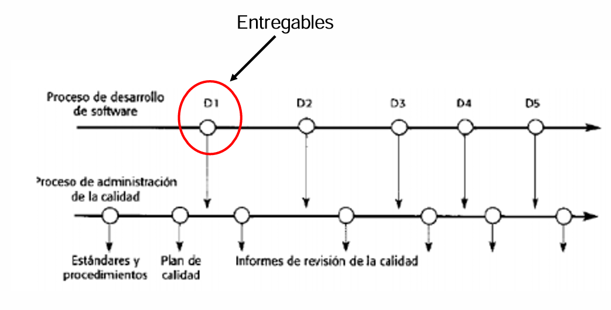

La gestión de la calidad en el ámbito del software comprende el conjunto de actividades que aseguran que los productos y procesos involucrados en su desarrollo cumplan con los requerimientos de calidad establecidos. No es un proceso aislado, sino una función transversal al ciclo de vida del software, desde la concepción hasta el mantenimiento.

Este enfoque incluye:

- La planificación de la calidad, donde se definen políticas, estándares y procedimientos.
- El aseguramiento de la calidad, que verifica que se cumplan esos estándares durante el desarrollo.
- El control de calidad, que consiste en la evaluación del producto y la identificación de desviaciones.
- Y, finalmente, la mejora continua, que busca optimizar procesos y resultados a lo largo del tiempo.

Un principio clave es que la gestión de la calidad debe separarse de la gestión del proyecto. Esto se debe a que la calidad requiere objetividad e independencia, evitando los posibles conflictos de interés que pueden surgir si quien supervisa la calidad es el mismo que dirige el proyecto.

## Informe CHAOS del Standish Group (2020): factores de éxito

El CHAOS Report del Standish Group es uno de los informes más influyentes sobre el éxito y fracaso de proyectos de software. En su edición de 2020, destaca tres elementos fundamentales que determinan el éxito de un proyecto:

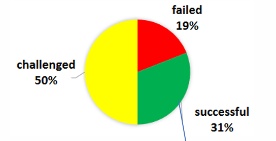

### a. Good Place

Un "buen lugar" es aquel entorno organizacional y humano donde existe apoyo genuino al proyecto. Involucra:

- Un equipo comprometido y con habilidades adecuadas.
- Un patrocinador (sponsor) que apoya activamente el proyecto.
- Relaciones humanas constructivas.

Un “buen lugar” puede ser tanto una plataforma de apoyo como una fuente de conflicto, dependiendo del compromiso y preparación de sus actores. Por eso, mejorar las habilidades y relaciones de quienes lo integran es vital para el éxito.

### b. Good Team

El “buen equipo” es el motor real del proyecto. Si el patrocinador da el impulso inicial, es el equipo quien materializa la visión, transforma las ideas en código y produce un producto de valor.

Un equipo competente debe contar con:

- Conocimientos técnicos sólidos.
- Comunicación efectiva.
- Autonomía y colaboración.
- Capacidad para adaptarse a cambios.

El informe resalta que la calidad del equipo es una variable crítica y directamente proporcional a las probabilidades de éxito del proyecto.

### c. Good Sponsor

El patrocinador del proyecto es el actor que da legitimidad, financiamiento y dirección estratégica al proyecto. Es quien justifica su existencia dentro de la organización.

El CHAOS Report sostiene que mejorar las habilidades del patrocinador es el factor número uno de éxito en proyectos. Esto se debe a que un buen sponsor:

- Comunica con claridad los objetivos.
- Protege al equipo frente a cambios arbitrarios.
- Gestiona los recursos necesarios.
- Apoya activamente el desarrollo.

## lementos de la gestión de calidad

La gestión de calidad en software se estructura en varios componentes fundamentales:

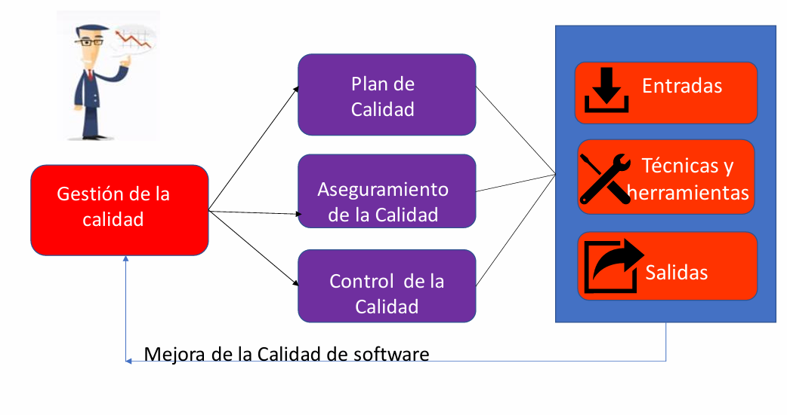

### a. Plan de calidad

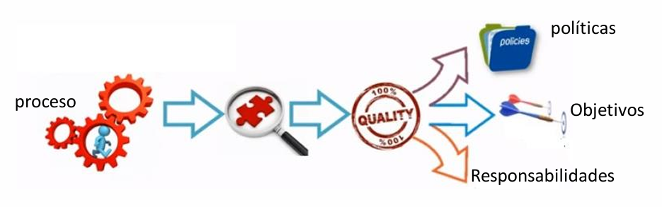

Es el documento que define cómo se va a implementar la calidad dentro de un proyecto. Este plan incluye:

- Objetivos de calidad: alineados con las necesidades del cliente.
- Políticas y procedimientos: normas a seguir para asegurar estándares mínimos.
- Roles y responsabilidades: quién hace qué en relación a la calidad.
- Procesos seleccionados: métodos de desarrollo, pruebas, revisiones.
- Estándares a aplicar: por ejemplo, ISO/IEC 25010, CMMI, etc.

El plan también contempla la posibilidad de adaptar procedimientos a las características particulares del proyecto.

### b. Aseguramiento de la calidad (SQA)

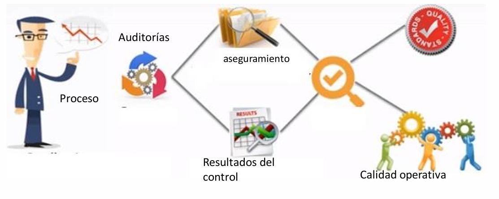

El Software Quality Assurance (SQA) es un conjunto de actividades orientadas a prevenir defectos durante el desarrollo. Se centra más en el proceso que en el producto.

Las acciones típicas del aseguramiento incluyen:

- Auditorías: revisiones sistemáticas de procedimientos.
- Evaluación de procesos: comprobar si se aplican correctamente los estándares.
- Capacitación del equipo en prácticas de calidad.
- Mejora de procesos organizacionales a partir del feedback.

Su enfoque es preventivo, es decir, busca evitar que los errores lleguen al producto.

### c. Control de calidad

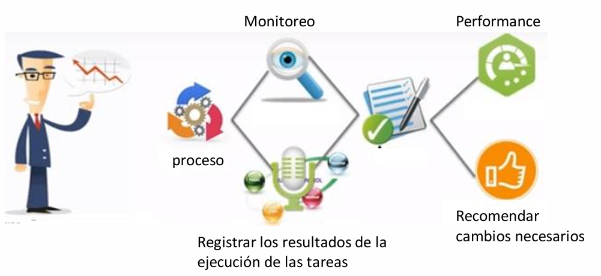

El control de calidad se focaliza en el producto. Su objetivo es identificar errores o desviaciones a partir del análisis de los entregables.

Implica:

- Monitoreo del rendimiento del producto o de actividades.
- Medición de resultados mediante métricas como defectos por KLOC, cobertura de pruebas, etc.
- Registros de ejecución: documentar los resultados de las tareas.
- Recomendación de cambios o correcciones si se detectan problemas.

A diferencia del aseguramiento, el control de calidad es reactivo, ya que actúa sobre los productos resultantes.

### Mejora de la calidad de software

La mejora de la calidad es un proceso continuo. No basta con aplicar controles puntuales; se trata de aprender constantemente de la experiencia, tanto en proyectos exitosos como fallidos.

Esta mejora se da a través de:

- Revisión de métricas y KPIs del proyecto.
- Análisis de defectos y causas raíz.
- Retroalimentación estructurada (retrospectivas, lecciones aprendidas).
- Adopción de buenas prácticas y nuevas herramientas.
- Iteración de procesos: cada ciclo mejora sobre el anterior.

La clave de una verdadera mejora de calidad es que debe estar institucionalizada, no depender solo de la voluntad de un equipo particular.

## Herramientas de Control de Calidad

### 1. Diagrama de Causa y Efecto (Ishikawa)

También conocido como diagrama de espina de pescado, el diagrama de Ishikawa es una herramienta visual utilizada para identificar y analizar las posibles causas de un problema o efecto específico. Fue desarrollado por Kaoru Ishikawa en 1968 y se ha convertido en un pilar fundamental dentro del control de calidad.

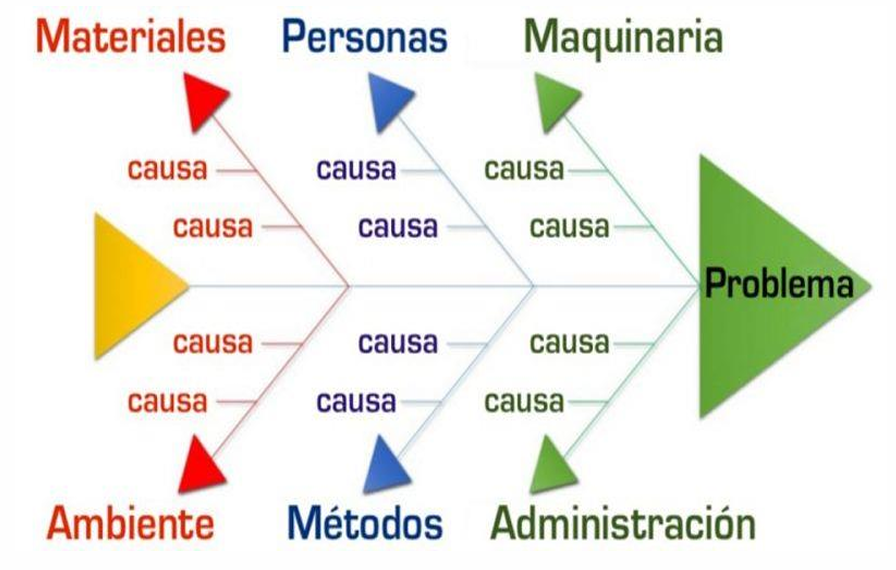

Estructura y uso:

El diagrama tiene una estructura similar a la espina de un pescado. En la "cabeza" del pescado se coloca el efecto o problema principal (por ejemplo, "alta tasa de defectos en producción"). De la columna vertebral surgen ramas principales que representan categorías generales de causas, tales como:

- Máquinas (equipos, tecnología),
- Métodos (procesos, procedimientos),
- Materiales (materias primas),
- Mano de obra (personas, habilidades, capacitación),
- Medio ambiente (factores externos),
- Medición (instrumentos, calibración).

Cada una de estas categorías puede subdividirse en subcausas, lo que permite una visión clara de todas las posibles fuentes de variabilidad.

Aplicación práctica:

El diagrama de Ishikawa no busca determinar la causa raíz directamente, sino facilitar la lluvia de ideas estructurada y abrir el análisis a múltiples factores que puedan estar contribuyendo a un problema. Generalmente se combina con otras herramientas como los 5 porqués o el análisis de Pareto.

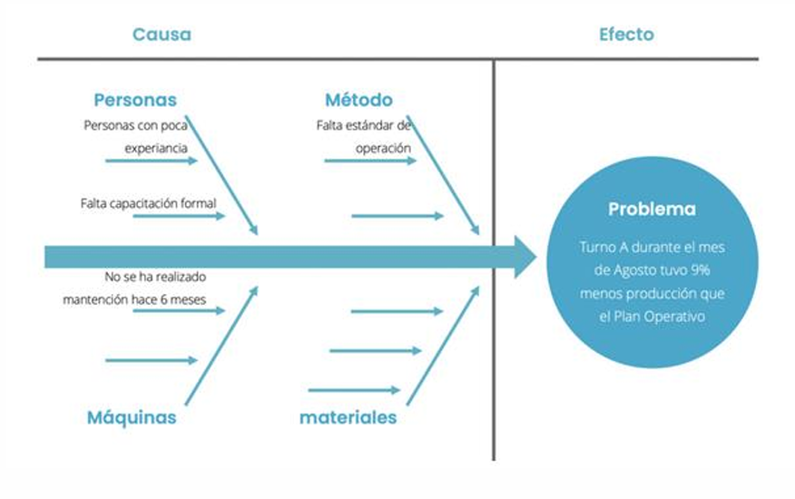

### 2. Diagrama de Control (X barra)

El diagrama de control X̄ (X barra) es una herramienta estadística usada para monitorear la estabilidad de un proceso mediante la medición de una característica de calidad continua (como el peso, el largo, la temperatura, etc.).

Componentes del diagrama:

- Línea central (CL): Representa el promedio de la característica medida.
- Límites de control superior (UCL) e inferior (LCL): Se calculan generalmente como ±3 desviaciones estándar (σ) desde la media, y representan los límites dentro de los cuales se espera que se encuentren las variaciones naturales del proceso.
- Puntos de datos: Son las medias de subgrupos de muestras tomadas periódicamente del proceso.

Interpretación:

Un proceso se considera bajo control estadístico cuando las mediciones caen dentro de los límites de control y no presentan patrones inusuales (tendencias, ciclos, alternancias sistemáticas). Si se detectan ciertos patrones, como una secuencia continua de puntos por encima o por debajo de la media, se puede concluir que hay causas asignables y no solo variación aleatoria.

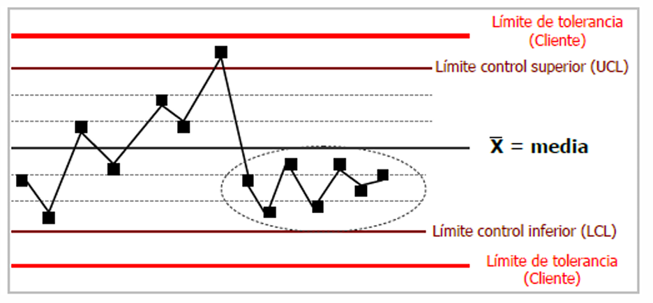

#### Regla de los 7

La regla de los 7 es una heurística utilizada en análisis de control estadístico para detectar señales de alarma en un proceso. Se basa en la observación de secuencias inusuales que pueden sugerir que el proceso ha salido de control.

¿En qué consiste?

Si se observan 7 mediciones consecutivas todas por encima o todas por debajo de la media, aunque estén dentro de los límites de control, se considera una señal de advertencia de que hay una causa no aleatoria afectando el proceso. Este tipo de comportamiento no sería esperado por simple variación natural.

Aplicación proactiva:

Para que este enfoque sea proactivo en la gestión de calidad, los límites de control deberían situarse dentro de los límites de tolerancia (especificaciones del cliente). Así, se puede intervenir antes de que el producto no cumpla con los requisitos.

### 3. Intervalos de Confianza y la Distribución Normal

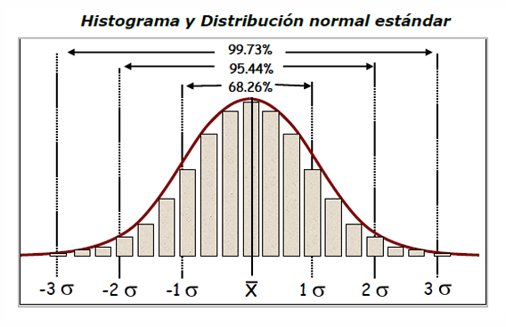

La distribución normal es fundamental para entender el comportamiento de procesos en calidad. Es una curva simétrica en forma de campana que describe cómo se distribuyen los datos alrededor de la media.

Porcentajes de confianza en función de la desviación estándar (σ):

- Media ± 1σ: Captura el 68,26% de los datos.
- Media ± 2σ: Captura el 95,44%.
- Media ± 3σ: Captura el 99,73% (equivale a aproximadamente 2.700 defectos por millón).
- Media ± 6σ: Captura el 99,99985%, es decir, sólo 1,5 defectos por millón. Esto es el objetivo del enfoque Six Sigma, una metodología de mejora de procesos centrada en la reducción de la variabilidad.

Importancia:

Estos intervalos permiten estimar con qué probabilidad un producto o proceso caerá dentro de ciertos límites, lo que facilita la toma de decisiones y la anticipación de fallos.

## Diferencia entre Aseguramiento de la Calidad y Testing

### Aseguramiento de la Calidad (Quality Assurance - QA)

El aseguramiento de calidad se refiere a un conjunto de actividades planificadas y sistemáticas implementadas dentro del sistema de calidad para proporcionar confianza en que un producto o servicio cumplirá con los requisitos de calidad.

Características:

- Enfocado en el proceso completo de desarrollo.
- Tiene una orientación preventiva: busca evitar errores antes de que ocurran.
- Involucra actividades como auditorías, revisión de procesos, control de documentos, capacitación del personal, definición de estándares, etc.
- No se limita a la verificación del producto final, sino que actúa en todas las etapas del ciclo de vida.

### Control de Calidad / Testing

El testing es una forma de control de calidad, orientada a la detección de fallos. Consiste en ejecutar el software en condiciones normales y anormales para encontrar posibles defectos.

Características:

- Se realiza sobre el producto o sistema final, aunque puede hacerse también en etapas intermedias.
- Está orientado a identificar defectos antes de que el software llegue al usuario final.
- Es una actividad reactiva, en contraposición al QA.
- Intenta provocar errores mediante pruebas de límite, estrés, condiciones anómalas, etc.

## Calidad vs Grado

Estos dos términos, aunque relacionados, no significan lo mismo:

### Calidad

Se refiere al grado en que un producto satisface los requisitos del cliente y del proyecto. Es un concepto relacionado con el cumplimiento de especificaciones, confiabilidad, ausencia de defectos y satisfacción del usuario.

Un producto de baja tecnología puede tener alta calidad si cumple perfectamente con lo que promete y no falla.

### Grado

Se refiere al nivel asignado a un producto o servicio basado en sus características técnicas o funcionales, dentro de una misma categoría de uso.

Por ejemplo:

Dos teléfonos móviles pueden tener diferente grado (uno tiene cámara de 108 MP, otro de 12 MP), pero ambos pueden tener alta calidad si cumplen sus funciones de forma confiable.

## Visiones de la Calidad

La calidad puede entenderse desde distintas perspectivas, cada una centrada en un aspecto diferente del producto, el proceso o la experiencia del usuario:

### 1. Visión Trascendental

Es una visión filosófica de la calidad, en la que se considera como una cualidad intangible que se percibe, se siente o se experimenta. No se puede medir directamente. Es común en productos de lujo o en el arte.

### 2. Visión del Usuario

La calidad se define como la capacidad del producto para satisfacer necesidades y expectativas del consumidor. Está ligada al contexto de uso: un producto puede ser de buena calidad para un usuario, pero no para otro.

### 3. Visión del Productor

Desde el punto de vista del fabricante, calidad significa conformidad con las especificaciones técnicas. Se enfoca en evitar defectos, minimizar errores y controlar los costos de reprocesos.

### 4. Visión del Producto

Esta visión asocia la calidad con las características inherentes del producto, como su desempeño, funcionalidad o durabilidad. No considera necesariamente la percepción del cliente.

### 5. Visión Basada en el Valor

Aquí, la calidad se mide en función de cuánto está dispuesto a pagar el cliente. Se vincula con la percepción de que un producto ofrece una buena relación entre costo y beneficio.

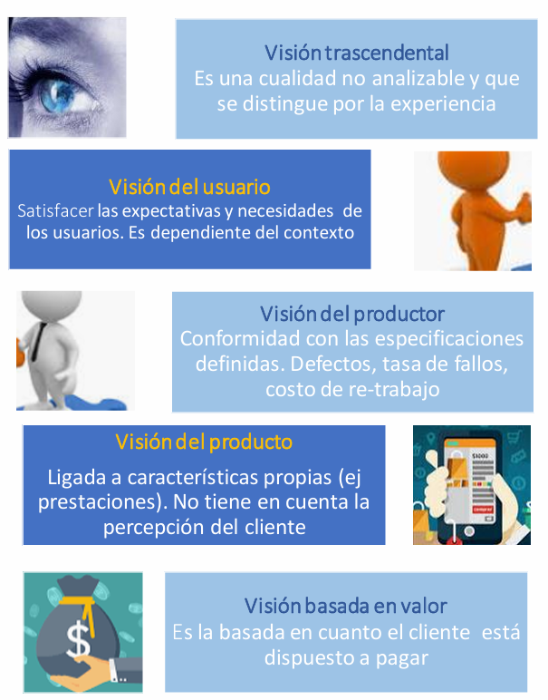

## Dos conceptos diferentes: Calidad del Software vs. Software de Calidad

### Calidad del Software (proceso)

La calidad del software desde la perspectiva del proceso se refiere a la calidad del conjunto de actividades, metodologías y prácticas utilizadas durante todo el ciclo de vida del desarrollo del software. No se enfoca directamente en el producto final, sino en cómo se construye ese producto. Implica aspectos como planificación, gestión de requisitos, codificación, pruebas, mantenimiento, y mejoras continuas.

Una organización que presta atención a la calidad del proceso aplica normas, estándares y metodologías (como CMMI, ISO 9001, Scrum, entre otros) que permiten sistematizar y optimizar la forma en que se desarrolla software. La idea central es que un proceso bien definido y controlado producirá sistemáticamente productos de alta calidad, reduciendo la probabilidad de defectos y mejorando la eficiencia.

### Software de Calidad (producto)

El concepto de software de calidad está orientado al producto final entregado al cliente o usuario. Implica que el software cumple con los requisitos funcionales y no funcionales, que es confiable, seguro, eficiente, mantenible, y que satisface las necesidades del usuario. En esta perspectiva, lo que importa es el resultado, independientemente de cómo se haya logrado.

Este enfoque tiene una fuerte relación con la percepción del usuario final, ya que un software puede estar bien construido técnicamente pero no satisfacer las expectativas del cliente si no se ajusta a sus necesidades o resulta difícil de usar.

### Relación con los requisitos no funcionales

Los requisitos no funcionales son fundamentales para evaluar la calidad del producto. No describen lo que el software hace, sino cómo lo hace, incluyendo aspectos como:

- Rendimiento
- Escalabilidad
- Seguridad
- Usabilidad
- Mantenibilidad
- Portabilidad

Estos requisitos se conocen también como requisitos de calidad y son esenciales para lograr un software que, más allá de cumplir su función, lo haga de forma eficiente, segura y confiable.

## Diferentes aspectos de la calidad

La calidad del software se puede analizar desde distintas perspectivas. ISO/IEC 25010 es una de las normas más reconocidas que establece características y subcaracterísticas de calidad. Aquí se desarrolla una clasificación más general:

### Calidad Interna

La calidad interna hace referencia a aspectos técnicos del software, que pueden evaluarse sin ejecutarlo. Se basa en el análisis del código fuente y su estructura interna. Es importante porque facilita el mantenimiento, reduce errores, y mejora la comprensión por parte de otros desarrolladores.

Algunos atributos de calidad interna incluyen:

- Adecuación funcional: El software realiza correctamente las funciones esperadas.
- Seguridad de confiabilidad: Capacidad de evitar fallas o recuperarse rápidamente de ellas.
- Eficiencia de rendimiento: Uso óptimo de recursos como CPU y memoria.
- Operabilidad: Facilidad para que el sistema sea controlado y operado por los usuarios.
- Compatibilidad: Capacidad de coexistir e interactuar con otros sistemas.
- Mantenibilidad: Facilidad con la que se puede corregir, adaptar o mejorar.
- Transmitibilidad / Portabilidad: Capacidad de adaptarse a diferentes entornos y plataformas.

### Calidad Externa

La calidad externa se refiere al comportamiento del software durante su ejecución, evaluado a través de pruebas en condiciones controladas. Este tipo de calidad es observable para usuarios, testers y clientes, y puede implicar métricas de rendimiento, errores detectados, y experiencia de usuario.

Se destacan atributos como:

- Satisfacción de uso: Qué tan conforme está el usuario con el software.
- Seguridad de uso: Protección frente a accesos no autorizados o datos corruptos.
- Flexibilidad de uso: Adaptabilidad a distintas condiciones o usuarios.
- Eficiencia de uso: Rapidez y fluidez en las operaciones del sistema.

### Calidad en el uso

Es la más compleja de medir, ya que implica observar el software en situaciones reales de uso. Este tipo de calidad tiene que ver con cómo el producto impacta en la productividad, satisfacción, y desempeño de los usuarios reales. Factores contextuales, como el entorno, el tipo de usuario y las condiciones operativas, juegan un rol clave.

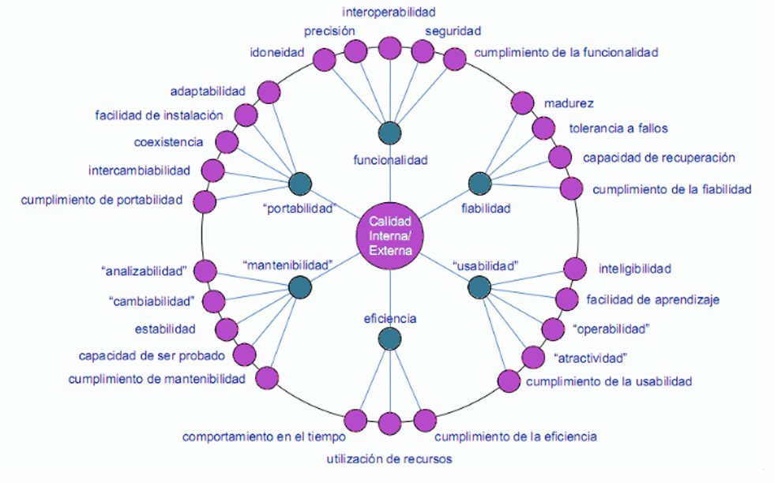

## CMMI – Capability Maturity Model Integration

### Origen y propósito

El CMMI (Modelo Integrado de Madurez de Capacidades) nace como una respuesta a la crisis del software en los años 80, impulsado por el Departamento de Defensa de EE. UU. y desarrollado por el SEI (Software Engineering Institute). Su objetivo es evaluar la madurez de los procesos de desarrollo de software en una organización y promover su mejora continua.

El CMMI propone una escala de 5 niveles que reflejan el grado en que los procesos están definidos, documentados, gestionados y optimizados. La premisa fundamental es que la calidad del software depende en gran parte de la calidad del proceso utilizado para desarrollarlo.

- Capacidad: Atributo del proceso. Mide cuán definido, gestionado y mejorado es un proceso en particular.
- Madurez: Atributo de la organización. Mide cuán consistentemente se siguen procesos definidos y estandarizados en toda la organización.

### Organización inmadura vs. organización madura

#### Organización inmadura

- Los procesos son improvisados, poco documentados y dependen de decisiones individuales.
- No hay planificación efectiva; los plazos y presupuestos suelen fallar.
- No existe una visión de largo plazo ni control sistemático de la calidad.
- Se actúa de forma reactiva, resolviendo problemas a medida que surgen.

#### Organización madura

- Los procesos están definidos, planificados y se ejecutan con consistencia.
- Hay comunicación fluida y clara asignación de roles y responsabilidades.
- Se aplican pruebas, análisis costo-beneficio y mejoras continuas.
- Se usan métricas históricas para planificar presupuestos y tiempos.
- El control de calidad es una actividad formalizada y sistemática.
- Se alcanza un alto nivel de cumplimiento de objetivos, con productos confiables y dentro de los plazos.

### Niveles de madurez del CMM

#### Nivel 1 – Inicial (Ad hoc / Caótico)

No existen procesos definidos. El éxito depende del talento individual más que de una gestión sistemática. Las actividades son impredecibles, los resultados son inconsistentes, y los errores son frecuentes. No se puede garantizar la calidad del producto, ni cumplir plazos o presupuestos de forma confiable.

#### Nivel 2 – Repetible

La organización analiza los procesos actuales y comienza a identificar las ineficacias. Planifica los proyectos con políticas claras. Han asegurado que los requisitos son gestionados y de que los procesos se planifican, realizan, miden y controlan. Todos los cambios se gestionan y documentan.

#### Nivel 3 – Definido

Procesos software bien definidos, estandarizados e integrados, Las actividades de ingeniería como las de gestión son estables y repetibles y están alineadas. Se realiza el seguimiento de calidad, dado que está establecido en el proyecto, los costos, fechas etc. Además, existen programas de capacitación continua. El aseguramiento de la calidad se convierte en un proceso formal.

#### Nivel 4 – Gestionado

Se aplican métricas para evaluar y controlar cuantitativamente el proceso y el producto. La organización toma decisiones basadas en datos, realiza evaluaciones estadísticas y tiene una mayor predictibilidad de resultados. Se miden variables como defectos por módulo, productividad, y tiempos de entrega.

#### Nivel 5 – Optimizado

Es el nivel más alto de madurez. Se implementan mejoras continuas y sistemáticas basadas en retroalimentación. Se experimenta con nuevas tecnologías y herramientas. Se identifican proactivamente debilidades del proceso y se ajustan de forma dinámica. La calidad del software se maximiza y los procesos evolucionan de forma constante.

## ¿Qué es la Calidad según ISO 9000?

En el marco de ISO 9000, calidad se define como el grado en que un conjunto de características inherentes de una entidad cumple con los requisitos establecidos. Esta definición es clave porque destaca dos elementos esenciales:

- Características inherentes: son propiedades propias de la entidad, como rendimiento, diseño, durabilidad, etc.
- Requisitos: pueden ser explícitos (establecidos formalmente por contrato o especificación) o implícitos (esperados por los clientes aunque no estén escritos).

Por tanto, una organización alcanza calidad cuando sus productos o servicios cumplen consistentemente con las expectativas y necesidades del cliente, y lo hacen de forma sistemática y controlada.

### Beneficios

La adopción de un sistema de gestión basado en ISO 9000 aporta beneficios significativos tanto a nivel externo (clientes y mercado) como interno (procesos y personal):

#### Beneficios para los clientes

- Mayor confianza y credibilidad: al contar con un sistema estandarizado, los clientes saben que los productos o servicios han sido elaborados bajo un control riguroso.
- Acceso a nuevos mercados: muchas licitaciones o clientes grandes exigen certificaciones ISO como requisito para contratar.
- Facilidad de comunicación: al usar un lenguaje común en cuanto a calidad, se mejora la interacción con socios, proveedores y clientes.

#### Beneficios internos

- Motivación del personal: la estandarización de procesos y roles genera claridad, lo cual mejora el clima laboral y el compromiso.
- Eficiencia y eficacia: al reducir errores, retrabajos y ambigüedades, se optimizan los recursos utilizados y se logran mejores resultados.
- Control del cambio: la documentación y seguimiento permiten que los cambios se realicen de manera ordenada y segura, reduciendo riesgos.

### Enfoque Basado en Procesos

Uno de los pilares fundamentales de ISO 9000 es el enfoque basado en procesos. Esto significa que una organización debe ser vista como un conjunto de procesos interrelacionados, donde cada proceso transforma entradas en salidas utilizando recursos.

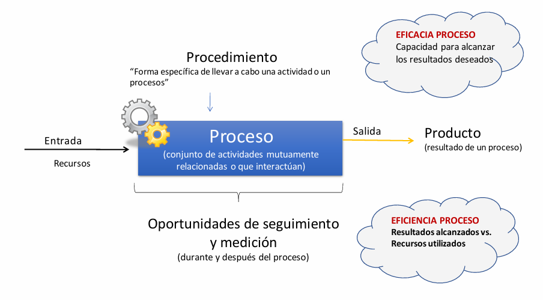

Componentes de un proceso:

- Entradas: elementos que se utilizan como insumo (información, materiales, requisitos).
- Recursos: todo lo necesario para ejecutar el proceso (personas, equipos, tecnologías).
- Actividades: conjunto de tareas interrelacionadas que transforman las entradas.
- Salidas: resultados del proceso (productos, servicios, decisiones).
- Seguimiento y medición: evaluación de desempeño del proceso durante y después de su ejecución.

Eficacia vs Eficiencia del proceso:

- Eficacia: capacidad del proceso para cumplir los objetivos planificados. Por ejemplo, entregar un producto que cumpla con los requisitos funcionales.

- Eficiencia: relación entre los resultados alcanzados y los recursos utilizados. Un proceso es eficiente si logra los resultados deseados con el menor uso posible de recursos.

ISO 9001 (parte de la familia ISO 9000) exige que las organizaciones gestionen sus procesos con este enfoque, evaluando constantemente su desempeño.

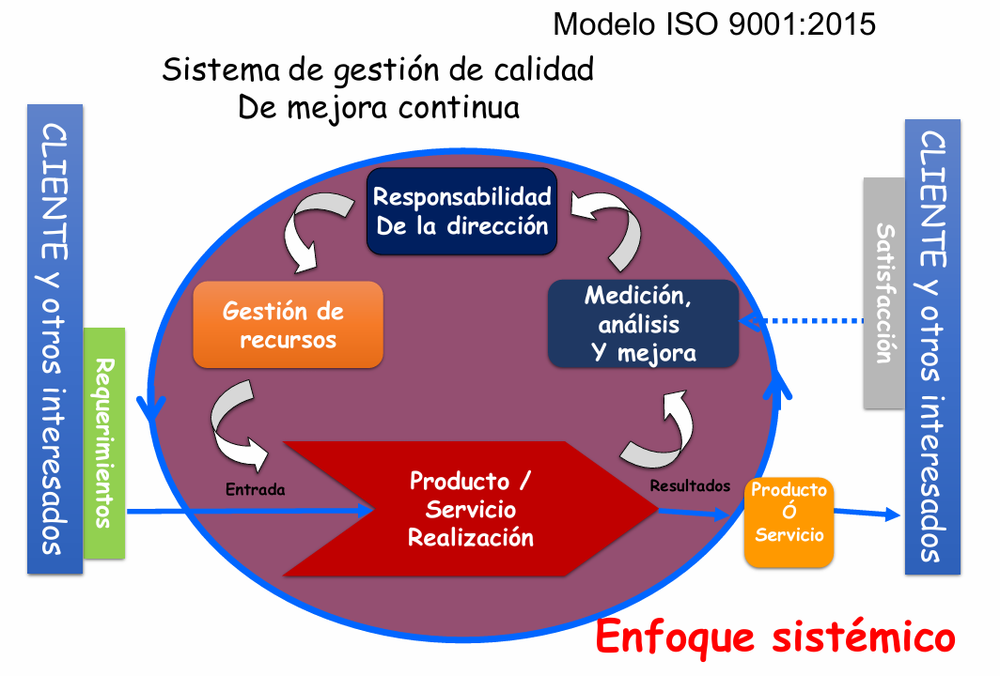

### Proceso de Estandarización

El proceso de estandarización consiste en transformar una operación artesanal o improvisada en un procedimiento sistemático, documentado y controlado. Este proceso se puede resumir en las siguientes etapas:

- Detección del problema: identificar puntos débiles o inconsistencias.
- Propuesta de solución: diseñar una forma adecuada y repetible de ejecutar la actividad.
- Documentación: establecer procedimientos escritos que describan paso a paso cómo debe realizarse la tarea.
- Implementación: aplicar el procedimiento en la práctica.
- Medición y control: evaluar si el procedimiento cumple con los objetivos.
- Corrección y mejora: hacer ajustes según los resultados.

Esta secuencia permite convertir las buenas prácticas en procedimientos repetibles, facilitando la capacitación, el control de calidad y la mejora continua.

### Metodología PHVA (Ciclo de Deming)

El ciclo PHVA (Planificar, Hacer, Verificar, Actuar), también conocido como Ciclo de Deming, es una metodología central en los sistemas de gestión de calidad:

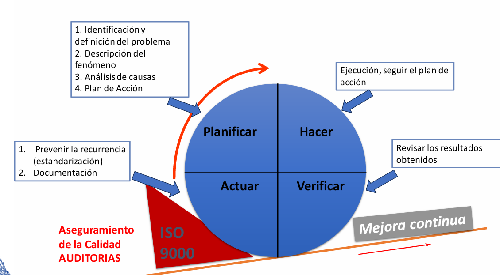

Planificar:

- Identificación y definición del problema.
- Descripción detallada del fenómeno observado.
- Análisis de causas raíz.
- Diseño de un plan de acción específico.

Hacer:

- Ejecución del plan diseñado.
- Documentación de las acciones implementadas.

Verificar:

- Revisión de los resultados obtenidos.
- Comparación con los objetivos planteados.

Actuar:

- Estandarización si el resultado es exitoso.
- Realimentación al sistema.
- Nuevas acciones correctivas o preventivas si es necesario.

Este enfoque permite a las organizaciones mejorar continuamente sus procesos, evitar la repetición de errores y adaptarse proactivamente a los cambios.

### Enfoques de Mejora Continua

ISO 9000 promueve la mejora continua a través de dos enfoques complementarios:

1. Kaizen (mejoramiento incremental):

- Se basa en muchas mejoras pequeñas y sostenidas en el tiempo.
- Involucra a todos los miembros de la organización.
- Tiene baja inversión, pero requiere una cultura organizacional fuerte.
- Es compatible con el ciclo PHVA.
- Su mantenimiento es alto, ya que requiere atención constante.

2. Kairyo (mejoramiento radical o reingeniería):

- Se enfoca en una o pocas mejoras significativas y disruptivas.
- Suele requerir una gran inversión económica.
- Involucra a expertos seleccionados.
- Generalmente, se apoya en la innovación tecnológica o cambios estructurales.
- Su mantenimiento posterior es bajo porque transforma por completo los procesos.

Ambas estrategias pueden aplicarse en conjunto, dependiendo de la naturaleza del problema y los recursos disponibles.

## Costo de la Calidad (COQ: Cost of Quality)

El costo de la calidad no se refiere al costo de hacer las cosas bien, sino al costo total que implica asegurar la calidad, prevenir fallas y corregir errores. Se divide en dos grandes grupos:

A. Costos de cumplimiento (conformidad):

- Prevención: incluyen actividades para evitar defectos como capacitaciones, desarrollo de procedimientos, mantenimiento preventivo, etc.
- Evaluación: costos para controlar que los productos o servicios cumplan con los estándares (inspecciones, auditorías, pruebas).

B. Costos de no cumplimiento (fallas):

- Fallas internas: ocurren antes de llegar al cliente (retrabaos, desperdicio, fallas detectadas en pruebas internas).
- Fallas externas: son las más costosas y peligrosas, pues afectan directamente al cliente (garantías, devoluciones, descuentos, pérdida de reputación o ventas).

Un sistema de calidad maduro busca maximizar la inversión en prevención y evaluación para minimizar las fallas, especialmente las externas.

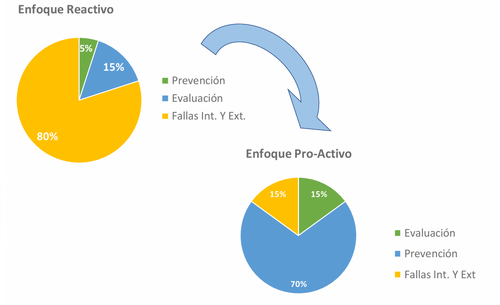

