# Gestión de la ingeniería del software

La gestión de la ingeniería del software es una disciplina fundamental dentro del ciclo de vida del desarrollo de software. Su propósito es asegurar que los proyectos de software se lleven a cabo de manera eficiente, controlada y alineada con los objetivos del negocio, utilizando de manera efectiva los recursos disponibles.

## Gestión de la Ingeniería del Software

La gestión de la ingeniería del software es una disciplina que tiene como objetivo planificar, organizar, evaluar y controlar los recursos necesarios para el desarrollo de productos y servicios de software. No se limita únicamente a aspectos técnicos del desarrollo, sino que también considera factores humanos, organizacionales y de negocio.

Esta gestión busca garantizar que los productos desarrollados:

- Cumplan con los requerimientos y expectativas de las partes interesadas (stakeholders).
- Se entreguen dentro del plazo y presupuesto definidos.
- Sean de alta calidad y mantenibles a lo largo del tiempo.
- Representen un valor tangible para la organización y los usuarios finales.

La gestión efectiva abarca desde la definición inicial del proyecto, pasando por la planificación detallada, hasta el monitoreo constante y la entrega final. Todo esto enmarcado en un enfoque sistemático y profesional que reconoce la complejidad creciente del desarrollo de software.

## Las "4 P" de la Gestión de Proyectos de Software

En las "4 P": Personas, Producto, Proceso y Proyecto cada uno representa un aspecto crítico que debe ser considerado y gestionado adecuadamente.

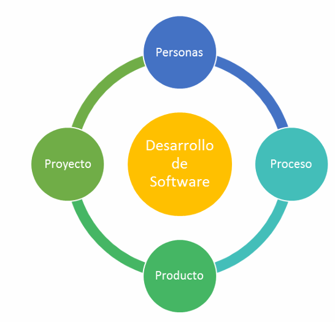

### 1. Personas

En cualquier proyecto de software, el factor humano es el más crítico. Las personas implicadas determinan el éxito o fracaso del proyecto. Aquí se incluyen:

- Usuarios finales: Aquellos que utilizarán el software. Sus necesidades deben guiar el desarrollo.
- Clientes: Quienes financian o solicitan el producto.
- Gestor del proyecto (Project Manager): Responsable de coordinar los recursos y asegurar que se cumplan los objetivos.
- Gestor superior (Senior Manager): Tiene autoridad sobre los recursos organizacionales y define políticas generales.
- Equipo de trabajo: Desarrolladores, testers, diseñadores y demás roles técnicos.
- Stakeholders: Todas las personas u organizaciones que afectan o son afectadas por el proyecto. Pueden ser internas o externas.

Una gestión adecuada del talento humano requiere atención a la motivación, comunicación, formación continua, y cohesión del equipo.

### 2. Producto

El producto es el objetivo central del proyecto: un software o servicio de ingeniería que resuelva un problema o cubra una necesidad. La gestión del producto implica:

- Definir con claridad los requisitos funcionales y no funcionales.
- Asegurar que el producto tenga un propósito claro y esté alineado con las expectativas del cliente.
- Controlar la calidad del producto desde sus primeras etapas.
- Asegurar que el producto sea escalable, mantenible y sostenible en el tiempo.

Aquí se destaca la necesidad de realizar una ingeniería de requerimientos robusta, validaciones frecuentes con el cliente y un diseño centrado en el usuario.

### 3. Proceso

El proceso representa el conjunto de actividades, métodos, prácticas y transformaciones que se utilizan para desarrollar y mantener el software. Un buen proceso permite:

- Estandarizar la producción del software.
- Mejorar la calidad del producto.
- Identificar y mitigar riesgos desde etapas tempranas.
- Reducir retrabajos y errores.

Existen múltiples modelos de proceso (como Cascada, Scrum, Kanban, RUP, etc.), y cada uno puede ser adaptado según las necesidades del proyecto. Lo importante es contar con un marco metodológico que facilite la planificación, ejecución y evaluación continua del progreso.

### 4. Proyecto

El proyecto es la unidad organizativa temporal que tiene como fin desarrollar un producto o servicio dentro de ciertos parámetros de tiempo, costo y calidad. La gestión del proyecto se enfoca en:

- Establecer un plan claro y realista, con metas, cronogramas y presupuesto.
- Asignar y optimizar los recursos disponibles (humanos, tecnológicos, financieros).
- Realizar un seguimiento continuo de los avances mediante indicadores y métricas.
- Manejar los riesgos, conflictos y cambios que puedan surgir.
- Asegurar la comunicación efectiva entre todos los involucrados.

El éxito del proyecto dependerá del equilibrio entre estos cuatro elementos y de la capacidad del equipo de adaptación ante imprevistos.

## Stakeholders y Actores del Sistema

Los stakeholders (o partes interesadas) son todas aquellas personas, grupos u organizaciones que afectan o se ven afectadas por el proyecto. Incluyen a clientes, usuarios finales, desarrolladores, testers, gerentes, proveedores, y reguladores. Comprender sus intereses, expectativas y necesidades es fundamental para alinear el proyecto con los objetivos globales.

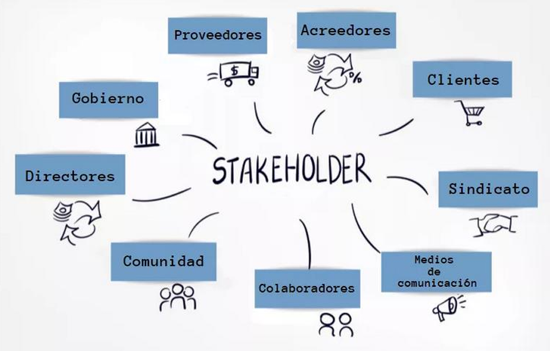

## Aspectos Organizacionales

La gestión de software no se desarrolla en el vacío: está profundamente influenciada por la estructura, cultura y dinámica de la organización que la aloja.

### 1. Estructura de la Organización

Existen distintos tipos de estructuras organizacionales que afectan cómo se gestiona un proyecto:

- Funcional o jerárquica:
    - Basada en departamentos especializados (ingeniería, marketing, etc.).
    - Cada empleado tiene un único jefe.
    - Los proyectos se enmarcan dentro de las áreas funcionales.
    - La autoridad del Director del Proyecto (DP) es limitada.

- Matricial:
    - Combina lo funcional con lo orientado a proyectos.
    - Los recursos se comparten entre distintos proyectos y departamentos.
    - Existen tres tipos:
        - Matricial débil: El DP actúa como coordinador, sin autoridad real.
        - Matricial equilibrada: El DP tiene autonomía moderada, pero depende en lo financiero.
        - Matricial fuerte: El DP tiene poder sobre el proyecto y sus recursos, aunque la estructura funcional se mantiene.

- Orientada a proyectos:
    - Toda la organización gira en torno a proyectos.
    - Equipos dedicados a tiempo completo al proyecto.
    - El DP tiene alta autoridad, incluso similar o superior a los jefes funcionales.
    - Común en consultoras, empresas de tecnología o ingeniería que viven de ejecutar proyectos.

### 2. Cultura Organizacional

La cultura es el conjunto de valores, creencias, normas y prácticas que comparten los miembros de una organización. Influye directamente en:

- La forma en que se comunican y toman decisiones.
- La actitud frente al cambio, la innovación y el riesgo.
- La motivación, compromiso y colaboración del equipo.

Una cultura organizacional fuerte y alineada con los objetivos del proyecto favorece un entorno más propicio para el éxito.

### 3. Comunicación

Una buena gestión de proyectos de software requiere establecer canales de comunicación claros y efectivos. Esto implica:

- Canales formales: Reuniones, reportes, documentos oficiales.
- Canales informales: Conversaciones espontáneas, cultura de colaboración.
- Comunicación electrónica: Correos, chats, herramientas de gestión (como Slack, Jira, Teams, etc.).

Es clave fomentar la transparencia, escuchar a todos los involucrados y asegurar que la información fluya de manera precisa y oportuna.

### 4. Equipos de trabajo

La creación y coordinación de equipos es vital para la ejecución eficiente de un proyecto. Un equipo efectivo debe:

- Tener roles y responsabilidades claras.
- Estar motivado y cohesionado.
- Colaborar activamente y resolver conflictos de manera constructiva.
- Estar liderado por un DP con habilidades tanto técnicas como interpersonales.

## PRODUCTO

### ✓ Objetivos

Los objetivos de un producto son las metas claras y medibles que se persiguen con su desarrollo. Estos deben responder a preguntas fundamentales: ¿Qué problema resolverá el producto? ¿Qué necesidades cubrirá? ¿Qué valor aportará al cliente o a la organización? Definir estos objetivos es el primer paso para alinear a todo el equipo de trabajo, y su correcta formulación debe incluir criterios de éxito, métricas de rendimiento y expectativas de calidad. Los objetivos bien definidos permiten establecer prioridades, asignar recursos correctamente y evaluar el éxito del proyecto una vez finalizado.

### ✓ Ámbito del producto

El ámbito del producto, también conocido como alcance, delimita todo lo que incluirá (y lo que no incluirá) el producto final. Esta definición es clave, ya que guía el diseño, desarrollo y entrega. Implica detallar las funcionalidades, interfaces, usuarios esperados, requisitos técnicos y operativos, así como limitaciones. También establece límites para evitar la expansión incontrolada del proyecto (“scope creep”), lo cual puede comprometer tiempo, costos y calidad. Un documento de visión o especificación de requisitos funcionales suele ser el artefacto que documenta este alcance.

### ✓ Soluciones alternativas

Antes de comprometerse con una solución específica, es fundamental explorar distintas alternativas. Estas pueden diferir en tecnología, arquitectura, estrategia de implementación o proveedores. El análisis de soluciones alternativas implica evaluar ventajas, desventajas, costos, tiempos de desarrollo, facilidad de mantenimiento y escalabilidad. Esta etapa también puede involucrar prototipado, pruebas de concepto y consultas con expertos. Considerar múltiples soluciones reduce el riesgo de tomar decisiones apresuradas o erróneas.

### ✓ Dificultades Técnicas

Las dificultades técnicas son los desafíos relacionados con la implementación del producto en términos de tecnología, infraestructura, integración, rendimiento, seguridad, compatibilidad y otros aspectos ingenieriles. Pueden surgir por falta de experiencia del equipo, por complejidad inherente al problema, por restricciones del entorno operativo o por la elección de tecnologías inmaduras o inadecuadas. Identificar tempranamente estas dificultades permite planificar soluciones, buscar capacitaciones, redefinir requerimientos o ajustar expectativas.

### ✓ Dificultades de Gestión

Las dificultades de gestión tienen que ver con los aspectos organizativos y humanos del proyecto: problemas de comunicación, falta de liderazgo, cambios de alcance mal controlados, conflictos entre partes interesadas, rotación de personal, fallas en la coordinación, etc. Estas dificultades suelen tener un impacto mayor en el éxito del proyecto que las dificultades técnicas, y por ello deben ser abordadas con herramientas de gestión adecuadas, como metodologías ágiles, matrices de responsabilidad (RAM), reuniones regulares y técnicas de negociación y motivación.

Sin esta información es imposible definir:

### ✓ Planificación del proyecto

La planificación del proyecto consiste en definir las actividades, recursos, plazos, costos, riesgos y criterios de control necesarios para llevar a cabo el proyecto con éxito. Sin conocer los objetivos, el alcance, las dificultades y las alternativas posibles, esta planificación sería meramente especulativa. Una buena planificación es iterativa, detallada y participativa. Debe reflejar cómo se va a ejecutar cada fase del proyecto y debe incluir hitos clave, dependencias, cronogramas, presupuestos y estrategias de mitigación de riesgos.

### ✓ Estimación de costos

La estimación de costos permite prever cuánto costará el proyecto en su totalidad y por cada una de sus partes. Sin una definición clara del producto y sus restricciones técnicas y organizativas, estas estimaciones serían poco confiables. El costo no solo incluye el desarrollo del producto, sino también pruebas, documentación, capacitación, soporte y mantenimiento. Las técnicas más comunes de estimación incluyen el uso de datos históricos, el juicio de expertos, el análisis paramétrico y la estimación ascendente.

### ✓ Evaluación de riesgos

La evaluación de riesgos implica identificar, analizar y planificar respuestas ante eventos inciertos que podrían afectar negativamente (o positivamente) el proyecto. Para realizarla adecuadamente, es imprescindible comprender el contexto completo del producto, los recursos disponibles, las posibles soluciones y las limitaciones técnicas y organizativas. Los riesgos pueden ser técnicos, económicos, legales, ambientales, humanos o de otro tipo. La evaluación sistemática permite priorizar esfuerzos y reducir la incertidumbre del proyecto.

## ¿Qué es un proyecto?

Un proyecto es un emprendimiento temporal que tiene como objetivo crear un producto, servicio o resultado único. Su carácter temporal implica que tiene un inicio y un final definidos. Al ser único, se distingue de procesos operativos repetitivos. Su elaboración progresiva significa que se define y refina a medida que se avanza. Todo proyecto debe estar liderado por un gestor de proyecto (o Project Manager), quien se encarga de dirigir al equipo, gestionar los recursos, controlar el cronograma y asegurar que se cumplan los objetivos dentro de las restricciones establecidas.

### Factores de éxito

- Involucrar al cliente: La participación activa del cliente durante todo el proyecto es esencial. Esto asegura que el producto cumpla sus expectativas y se ajuste a sus necesidades reales. El cliente aporta información clave, valida entregables y ayuda a tomar decisiones estratégicas.

- Recursos humanos con experiencia: Contar con un equipo competente y experimentado es un factor crítico. El conocimiento técnico, la capacidad de resolver problemas, la experiencia en proyectos similares y el trabajo en equipo inciden directamente en la calidad y eficiencia del proyecto.

- Medios e infraestructura apropiada: La infraestructura tecnológica, el acceso a herramientas adecuadas, la disponibilidad de entornos de prueba, servidores, licencias, etc., son elementos fundamentales. La carencia de estos medios puede generar demoras, errores y sobrecostos.

- Metodología apropiada, continuamente revisada: El uso de una metodología de gestión (ágil, tradicional, híbrida) adecuada al tipo de proyecto permite ordenar el trabajo, mejorar la comunicación y facilitar el control. Esta metodología debe adaptarse y revisarse según el contexto y la evolución del proyecto.

## Triángulo de negociación

También llamado triángulo del proyecto o triple restricción, este modelo representa la relación entre tres elementos clave:

- Tiempo / Agenda: Es la duración total del proyecto y sus plazos intermedios.
- Costo / Recursos: Son los recursos económicos y humanos disponibles.
- Alcance / Performance / Calidad: Lo que se espera entregar en términos de funcionalidades, características y nivel de calidad.

Cualquier cambio en uno de estos factores impacta en los otros. Por ejemplo, aumentar el alcance puede requerir más tiempo o dinero. El equilibrio entre estas restricciones es uno de los mayores desafíos en la gestión de proyectos.

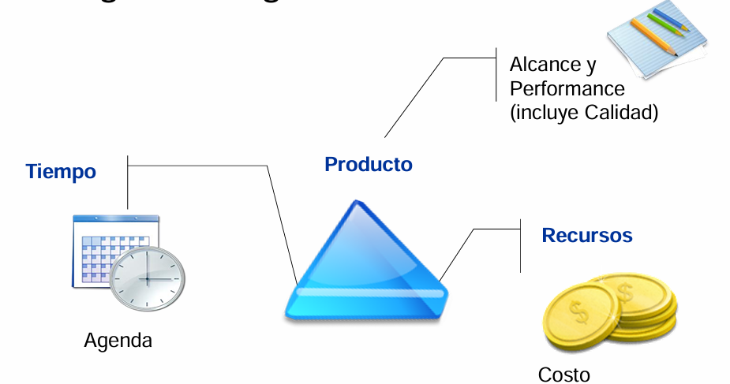

## Gestión de proyectos

La gestión de proyectos es el conjunto de actividades que permiten planificar, ejecutar y controlar un proyecto para alcanzar sus objetivos. Incluye:

- Desarrollar un plan general de control: Definir cómo se va a ejecutar, supervisar y finalizar el proyecto.
- Obtener y mantener el compromiso: Lograr la adhesión de los interesados es fundamental para avanzar sin fricciones.
- Ejecutar el plan: Llevar a cabo las tareas previstas respetando cronogramas y presupuestos.
- Conocer el progreso y tomar acciones correctivas: Evaluar el estado del proyecto y actuar cuando se presentan desvíos para mantener el rumbo.

### Grupos de proceso y área de conocimiento

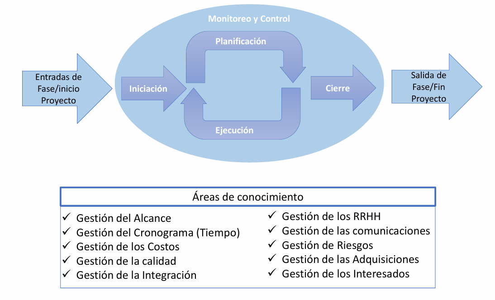

#### 1. Iniciación del Proyecto

La fase de iniciación es el punto de partida de cualquier proyecto. En esta etapa se establecen los fundamentos sobre los que se construirá el resto del proyecto, y se autoriza formalmente su existencia. Su propósito es asegurar que exista una comprensión clara y compartida de por qué se emprende el proyecto, qué se espera lograr, quiénes están involucrados, y cuál es el alcance inicial del trabajo.

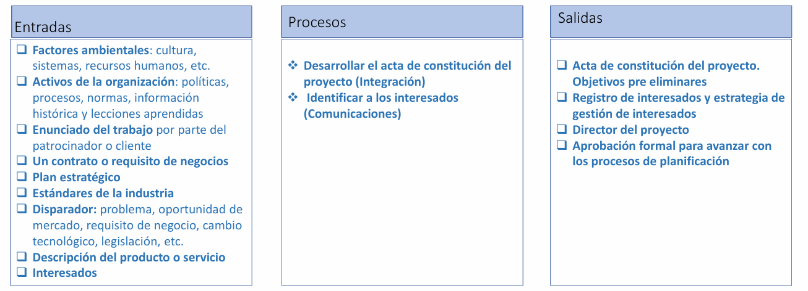

##### Objetivos del Proyecto

Los objetivos deben estar claramente definidos, ser específicos, medibles, alcanzables, relevantes y acotados en el tiempo (SMART). Esto proporciona una dirección clara y permite establecer métricas para evaluar el éxito. Ejemplos de objetivos incluyen mejorar un proceso, desarrollar un producto, implementar un sistema informático, etc.

##### Identificación de los Interesados

Se identifican a todas las personas, grupos u organizaciones que pueden afectar o verse afectadas por el proyecto. Esto incluye clientes, patrocinadores, usuarios finales, proveedores, reguladores, y otros actores clave. Se analiza su influencia, intereses y expectativas para planificar su involucramiento.

##### Nombramiento del Director del Proyecto (DP)

Se designa formalmente a la persona que asumirá el liderazgo del proyecto. Este profesional es responsable de planificar, ejecutar, supervisar y cerrar el proyecto. El DP debe tener autoridad y habilidades para coordinar equipos, gestionar riesgos, y comunicarse eficazmente con los interesados.

##### Autorización Formal del Proyecto

Mediante un acta de constitución del proyecto (Project Charter), se formaliza la autorización para utilizar recursos organizacionales en el proyecto. Este documento establece la existencia del proyecto, define su propósito, el patrocinador, el DP, y los objetivos iniciales.

##### Definición del Alcance

Se establece lo que está incluido y lo que está fuera del proyecto. Esto involucra describir los límites, restricciones técnicas o económicas, entregables esperados, y criterios de aceptación. Una definición clara evita malentendidos y facilita la planificación.

##### Productos típicos de esta fase:

- Documento de visión con alcance definido.
- Descripción de tareas preliminares.
- Esbozo de paquetes de trabajo (Work Breakdown Structure, WBS)

#### 2. Planificación del Proyecto

La planificación es una fase crítica que traduce las metas generales del proyecto en un conjunto organizado y secuencial de actividades y recursos necesarios para alcanzar los objetivos. Este proceso es iterativo: se ajusta a medida que se obtienen más datos o cambian las condiciones.

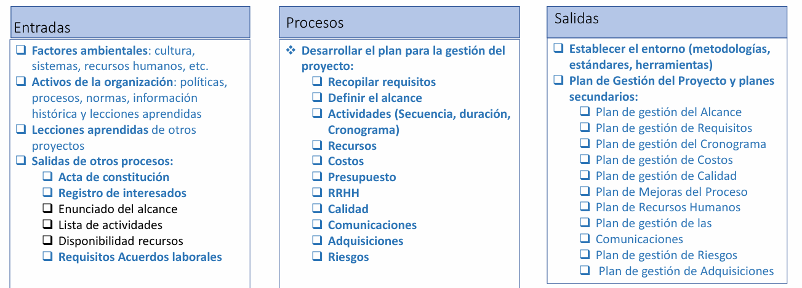

##### Análisis de viabilidad

Antes de continuar, se evalúa si el proyecto es factible desde un punto de vista técnico, económico y organizacional. Esto incluye el análisis de riesgos, beneficios, recursos y capacidades disponibles.

##### Planificación detallada

Se desarrolla un plan detallado que responde a preguntas como: ¿Qué se va a hacer?, ¿cómo?, ¿cuándo?, ¿con qué recursos?, ¿quiénes son los responsables? Esto abarca:

- Cronograma del proyecto.
- Estimaciones de esfuerzo y costo (usando datos históricos o técnicas estadísticas).
- Asignación de recursos.
- Planes de comunicación, calidad, gestión de riesgos y adquisiciones.

##### Compromiso de los interesados

Es vital revisar el plan con todos los involucrados, asegurarse de que entiendan sus responsabilidades y obtener su compromiso explícito. Esto puede implicar reuniones formales, firmar registros de compromiso y definir una matriz de asignación de responsabilidades (RAM).

##### Documentación generada:

- Checklist de evaluación del plan.
- Minutas de reuniones de planificación.
- Registros de compromisos y correos.
- Plan de comunicación y matriz RAM (Responsibility Assignment Matrix).

#### 3. Ejecución del Proyecto

En esta fase se convierte el plan en acción concreta. El equipo realiza el trabajo definido en el plan, siguiendo los cronogramas, presupuestos y estándares establecidos.

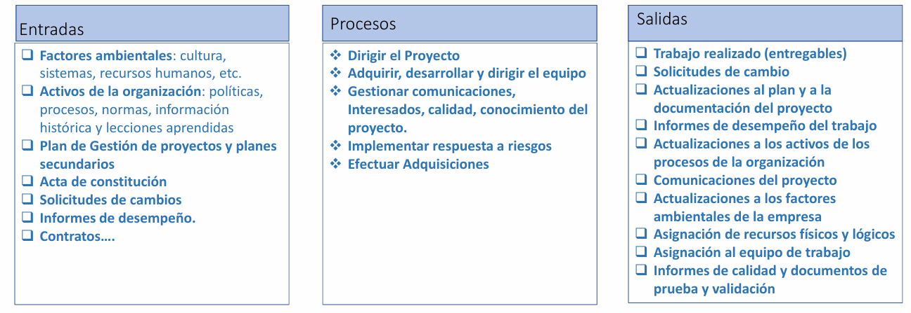

##### Rol del Director del Proyecto

El DP organiza al equipo, supervisa las actividades, administra el tiempo, lidera las reuniones y garantiza que las tareas se estén ejecutando como se planificó. También resuelve conflictos, adapta la ejecución si surgen imprevistos, y mantiene informados a los interesados.

##### Producción de Entregables

Se generan los productos, servicios o resultados previstos. Estos deben cumplir con los estándares de calidad definidos y ser revisados constantemente.

##### Generación de información para pronósticos

Se recopilan datos sobre el avance real del proyecto, con el fin de generar informes que permitan proyectar la evolución futura. Esto facilita la toma de decisiones informadas.

#### 4. Monitoreo y Control

Este grupo de procesos ocurre de forma paralela a la ejecución y tiene como objetivo asegurar que el proyecto avance conforme a lo planificado, detectando desviaciones y aplicando correcciones cuando sea necesario.

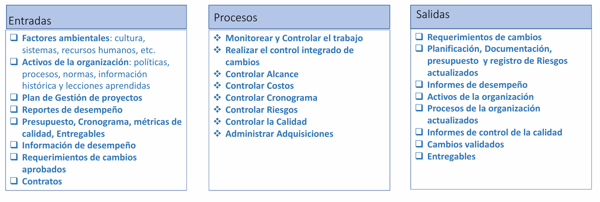

##### Seguimiento del presupuesto y cronograma

Se evalúa regularmente el consumo real de recursos frente a lo estimado. Se establecen hitos, puntos de control y se comparan métricas clave como el valor ganado, el costo real y la desviación de cronograma.

##### Gestión de cambios

Todo cambio al alcance, presupuesto o cronograma debe seguir un proceso de control de cambios. Solo se implementan aquellos que hayan sido formalmente aprobados.

##### Seguimiento del producto y proceso

Se verifica que tanto los entregables como la forma en que se están produciendo cumplen con los estándares técnicos y de calidad. Esto puede incluir revisiones, pruebas, auditorías y reuniones con clientes y equipo.

##### Acciones correctivas

Cuando se detectan desvíos, se debe actuar rápidamente para volver al camino planificado, ya sea reasignando recursos, ajustando tareas, o renegociando plazos y entregables.

#### 5. Cierre del Proyecto

El cierre es la última etapa formal del proyecto. Aquí se aseguran todas las condiciones para dar por finalizado el trabajo de forma ordenada y completa.

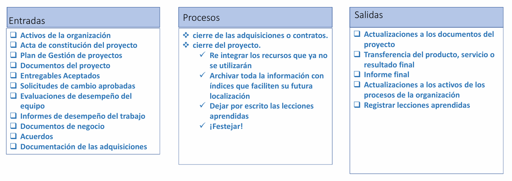

##### Cierre técnico y administrativo

Se verifica que todas las tareas han sido completadas y que los entregables han sido entregados, aceptados y documentados. También se cierran contratos, se libera al equipo, y se archiva la documentación.

##### Aceptación formal del cliente

Se busca una aprobación explícita por parte del cliente o patrocinador, que reconozca que los entregables cumplen con los requisitos establecidos.

##### Lecciones aprendidas

Una parte esencial del cierre es documentar qué salió bien, qué se puede mejorar y qué errores evitar en futuros proyectos. Esta retroalimentación se convierte en un activo de conocimiento para la organización.

## Ciclo de vida del proyecto

El ciclo de vida del proyecto se refiere al conjunto estructurado de fases que un proyecto atraviesa desde su inicio hasta su cierre. Este concepto es fundamental en la gestión de proyectos, ya que permite ordenar, controlar y dirigir el desarrollo del trabajo hacia el cumplimiento de los objetivos. Las fases no son arbitrarias, sino que se relacionan secuencialmente y pueden presentar diferentes grados de interdependencia.

### Fases del ciclo de vida

Típicamente, el ciclo de vida de un proyecto está compuesto por las siguientes fases:

- Inicio: En esta fase se define el propósito del proyecto, se identifican los interesados clave y se autoriza formalmente su ejecución.

- Planificación: Se detallan las actividades, recursos, costos y riesgos necesarios para alcanzar los objetivos del proyecto.

- Ejecución: Se llevan a cabo las actividades planificadas, se coordinan los equipos y se gestionan los recursos.

- Monitoreo y control: Se supervisa el avance respecto al plan, se analizan desviaciones y se implementan acciones correctivas.

- Cierre: Se finalizan todas las actividades, se entrega el producto final y se documentan las lecciones aprendidas.

Cada fase tiene hitos y puntos de control que permiten validar su cumplimiento antes de pasar a la siguiente. Además, muchas veces estas fases no son estrictamente secuenciales, sino iterativas, especialmente en entornos ágiles o complejos, donde la planificación y ejecución se ajustan de forma incremental.

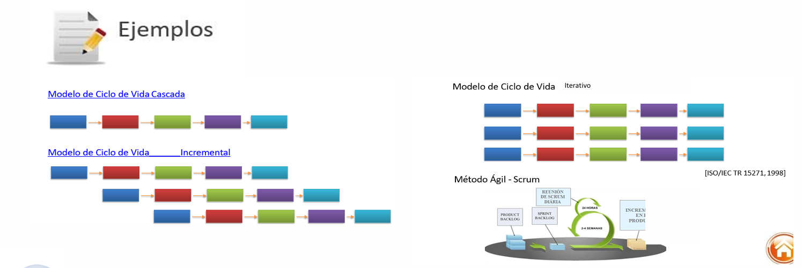

## Planificación de recursos y entorno de trabajo

La planificación de los recursos humanos, materiales y del entorno operativo es una tarea clave en la fase de planificación del proyecto. Un proyecto, por su naturaleza, requiere personas, herramientas, infraestructura y un marco metodológico para ejecutarse de manera efectiva. Esta planificación anticipada reduce el riesgo de cuellos de botella, escasez o improvisaciones costosas.

### Recursos Humanos y Materiales (RRHH y RRMM)

- Recursos Humanos: Implica identificar qué perfiles profesionales se requieren, definir sus roles y responsabilidades, y seleccionar al personal adecuado. Esto puede incluir recursos internos o la contratación de personal externo, consultores o expertos especializados. También se debe prever si es necesario realizar entrenamientos o capacitaciones específicas antes o durante el proyecto.

- Recursos Materiales: Aquí se contemplan los insumos físicos necesarios, como herramientas, tecnología, software, licencias, equipos o laboratorios. Incluso si no implican un costo directo, su disponibilidad debe ser asegurada.

### Ambiente de trabajo

Es esencial definir un entorno de trabajo funcional y coherente con las necesidades del proyecto. Esto incluye:

- Infraestructura tecnológica: Hardware, software, servidores, plataformas de comunicación.
- Metodologías y estándares: Por ejemplo, metodologías ágiles, PMBOK, ISO 9001, etc.
- Herramientas de gestión: Software para planificación, colaboración, seguimiento de tareas, control de versiones, etc.

### Documentación clave

- Inventario de habilidades y planes de personal
- Planes de formación y plan de recursos humanos
- Lista de instalaciones y equipamientos críticos
- Requisitos de recursos y plan de recursos del proyecto

## Compromiso de los interesados

Un proyecto no puede ejecutarse de forma aislada: necesita el apoyo activo y sostenido de sus interesados. Estos pueden incluir patrocinadores, clientes, usuarios finales, proveedores y miembros del equipo. Obtener y mantener su compromiso es esencial para minimizar conflictos y alinear expectativas.

### Gestión del compromiso

- Comunicación clara: Los interesados deben comprender el plan del proyecto, sus implicancias, su cronograma y su rol en cada fase.

- Revisión y reconfirmación: Cada vez que haya cambios significativos en el plan, es crucial volver a revisar el compromiso.

- Participación planificada: Se debe definir cómo y cuándo participarán los interesados: revisiones de avance, toma de decisiones, aprobaciones, etc.

- Cumplimiento y negociación: Los compromisos asumidos deben ser monitoreados y renegociados si es necesario, para evitar incumplimientos que afecten el desarrollo del proyecto.

### Herramientas utilizadas  

- Checklist de evaluación del plan
- Registro de compromisos
- Minutas de reunión
- Plan de comunicación o matriz RAM (Responsable, Aprobador, Consultado, Informado)
- Registros documentales y correos electrónicos

## Descomposición de tareas

La descomposición del trabajo es una técnica esencial que permite gestionar proyectos complejos dividiéndolos en partes más pequeñas, manejables y controlables. Esta práctica se realiza mediante la creación de una Estructura de Desglose del Trabajo (EDT o WBS - Work Breakdown Structure).

### Estructura de Desglose del Trabajo (EDT)

La EDT organiza jerárquicamente el alcance del proyecto en entregables y componentes menores. Su propósito es facilitar la planificación, asignación de responsabilidades, estimación de costos y tiempos, y seguimiento del avance. Cada nivel inferior representa una definición más detallada del trabajo.

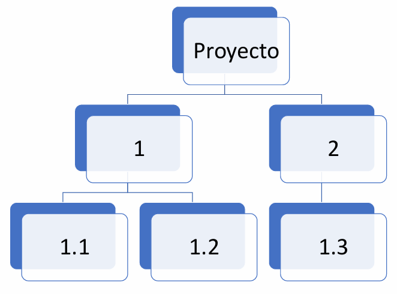

### Paquetes de trabajo

En el nivel más bajo de la EDT se encuentran los paquetes de trabajo. Estas son unidades de trabajo discretas, para las que pueden estimarse con precisión los siguientes elementos:

- Tiempo de ejecución
- Costos
- Recursos necesarios
- Criterios de aceptación

Cada paquete puede asignarse a un responsable específico, lo que mejora el control y la responsabilidad sobre su ejecución.

### Cuenta de control

Una cuenta de control es una unidad de gestión dentro de la EDT donde se combinan los elementos de alcance, cronograma y costos para evaluar el desempeño del proyecto. Es un punto clave para el monitoreo y control.

#### Características

- Puede estar compuesta por uno o más paquetes de trabajo.
- Permite establecer líneas base contra las que se mide el avance.
- Facilita la implementación de técnicas como el Valor Ganado (Earned Value Management).
- Ayuda a identificar rápidamente desviaciones y tomar decisiones correctivas.

Estas cuentas permiten responder preguntas críticas como: ¿Estamos cumpliendo con los plazos? ¿El costo real es acorde al planificado? ¿Estamos generando los entregables con la calidad esperada?