# Gestión de tiempo

## Tipos de Dependencias

En la planificación de un proyecto, es fundamental identificar las dependencias entre actividades, ya que estas determinan el orden lógico en que deben realizarse. Existen tres tipos principales:

### 1. Secuencias Obligatorias (Lógica Dura)

Estas son dependencias ineludibles impuestas por la naturaleza del trabajo. Se conocen como lógica dura porque no hay flexibilidad: una actividad no puede iniciarse si no se ha completado la anterior.

Ejemplo clásico: “No puedo rayar el queso si no lo poseo”. Esta frase sintetiza la esencia de la dependencia obligatoria: la actividad de “rallar” depende físicamente de la existencia previa del queso.

Estas dependencias suelen estar asociadas a:

- Restricciones físicas (no se puede construir una pared si no están los cimientos).
- Lógica de proceso (no se puede probar un software si no se ha codificado).
- Limitaciones técnicas.

Importancia en la planificación: Identificarlas con claridad evita errores de secuencia que podrían llevar a re-trabajo o a ineficiencia en la asignación de recursos.

### 2. Secuencias Discrecionales (Lógica Blanda)

También conocidas como dependencias preferidas o lógica blanda, este tipo de relación entre actividades no está impuesta por factores externos o físicos, sino por decisiones internas del equipo o buenas prácticas del proyecto.

Ejemplo ilustrativo: “Batir los huevos o cocinar la salsa de tomate”. Ambas actividades son necesarias, pero pueden realizarse en cualquier orden. Sin embargo, por eficiencia o costumbre, podríamos preferir una sobre la otra.

Estas dependencias pueden modificarse sin que afecten la calidad del resultado final, lo cual da cierta flexibilidad al planificador para optimizar la ejecución según disponibilidad de recursos, conveniencia, o eficiencia del flujo de trabajo.

### 3. Secuencias Externas

Estas dependencias son impuestas por agentes o factores externos al equipo de proyecto. Son inevitables y suelen implicar tiempos de espera fuera del control directo del gestor del proyecto.

Ejemplo concreto: “Hasta que no apruebe el permiso la Intendencia, no podemos instalar el gas”. Aquí, el proyecto depende de una resolución externa, lo que introduce riesgos y retrasos potenciales.

Estas secuencias deben identificarse con antelación para prever buffers (márgenes de tiempo) o alternativas si los plazos no se cumplen.

## Adelantos y Retrasos

En la gestión de dependencias, también se pueden establecer desplazamientos temporales entre actividades mediante adelantos y retrasos:

### Adelanto

Es cuando una actividad puede comenzar parcialmente antes de que la anterior haya finalizado completamente.

Ejemplo: La actividad “Viabilidad económica” puede comenzar cuando la “Viabilidad legal” tiene un avance del 50%. Esto permite superponer parcialmente tareas y ganar tiempo.

Este tipo de manejo requiere una buena coordinación y control, ya que trabajar sobre actividades no finalizadas puede implicar riesgos si se producen cambios posteriores.

### Retraso

Es cuando se impone una espera forzada entre el fin de una actividad y el inicio de la siguiente.

Ejemplo: La “Viabilidad económica” debe comenzar 30 días después de finalizada la “Viabilidad legal”. Este margen puede deberse a análisis, validaciones o necesidades de sincronización con recursos.

Ambos mecanismos (adelanto y retraso) permiten una calendarización más precisa y realista.

## Calendarización

La calendarización es el proceso de convertir el plan de actividades en un cronograma con fechas específicas, que permita gestionar el tiempo de manera eficiente. Implica estimar la duración, definir recursos y establecer un orden lógico.

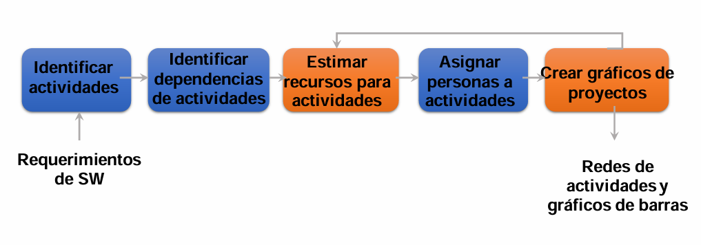

Pasos Clave:

- Identificar actividades
    - Se parte de los requerimientos del sistema o producto y se define cada actividad necesaria para su cumplimiento.
    - Implica descomponer el trabajo en unidades manejables y controlables.
- Identificar dependencias entre actividades
    - Se aplican los conceptos de lógica dura, blanda y externa.
    - También se define si habrá adelantos o retrasos entre ellas.
- Estimar recursos
    - Se determina qué tipo y cuántos recursos son necesarios para cada actividad: personas, materiales, tecnología, etc.
    - Es importante reconocer mínimos y máximos requeridos.
- Asignar personas a actividades
    - Se asocian tareas con responsables, según su disponibilidad, experiencia y carga laboral.
    - Posteriormente, se valida la viabilidad del esfuerzo para evitar sobreasignaciones o subutilización.
- Crear gráficos de proyectos
    - Se utilizan herramientas como diagramas de red (PDM) y gráficos de barras (Gantt).
    - Estas representaciones permiten visualizar la secuencia de actividades, sus relaciones y duraciones previstas.

## ¿Por qué es fundamental?

Gestionar el tiempo es crítico en cualquier proyecto por varias razones:

- Es una de las restricciones clásicas junto con el alcance y el costo.
- Permite prevenir atrasos, en lugar de reaccionar cuando ya es tarde.
- Los proyectos están expuestos a cambios constantes: en recursos, presupuestos, necesidades, etc.
- Las estimaciones nunca son certezas absolutas; siempre hay un margen de error.
- Un retraso en una actividad crítica puede afectar toda la línea de tiempo del proyecto (camino crítico).

Frase clave: “Una vez que el proyecto se atrasa… ¡es demasiado tarde!”

Por eso es esencial tener herramientas y prácticas que permitan adaptarse y replanificar de forma ágil.

## Proceso de Gestión del Tiempo

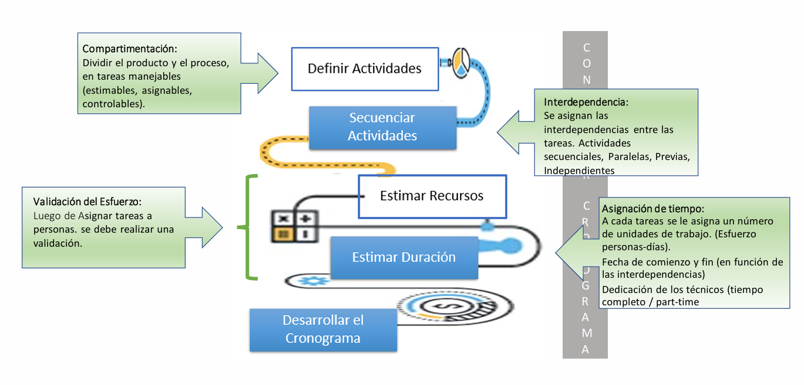

1. Compartimentación
    - Implica dividir el producto/proyecto en tareas pequeñas.
    - Cada tarea debe ser estimable, asignable y controlable.
    - Favorece la claridad en la planificación y ejecución.

2. Validación del esfuerzo
    - Luego de asignar personas a las tareas, se revisa que la carga de trabajo sea realista.
    - Se puede medir en “personas-día” o “personas-hora”.

3. Interdependencia
    - Se definen las relaciones entre tareas: cuáles son secuenciales, paralelas o independientes.
    - Esto permite detectar posibles cuellos de botella y caminos críticos.

4. Asignación de tiempo
    - Se estima la duración de cada actividad en función del esfuerzo necesario y los recursos disponibles.
    - Se definen fechas de inicio y fin, considerando interdependencias y disponibilidad de recursos.

## PDM – Precedence Diagramming Method

Este método de planificación, también conocido como Activity on Node (AON), representa cada actividad como un nodo. Las flechas indican relaciones de precedencia.

Es ideal para construir redes de actividades que permitan:

- Visualizar dependencias.
- Calcular el camino crítico (la secuencia de actividades que define la duración mínima del proyecto).
- Detectar tareas que pueden retrasarse sin afectar la fecha final (holgura).

Se utiliza en conjunto con herramientas como el CPM (Critical Path Method) y se puede representar gráficamente en software de gestión de proyectos como Microsoft Project, Primavera o GanttProject.

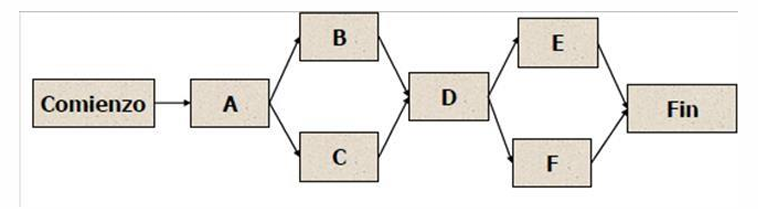

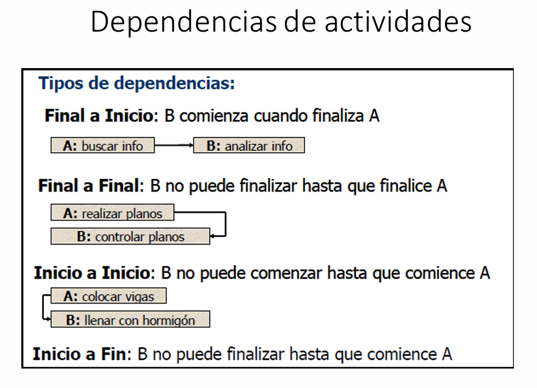

## Estimación de Recursos

Antes de poder determinar cuánto tiempo tomará una actividad, se debe saber con qué recursos se cuenta y cuáles son necesarios.

- Recursos humanos: cantidad, experiencia, dedicación (full-time o part-time).
- Materiales o tecnológicos: disponibilidad de herramientas, maquinaria, licencias, etc.
- La disponibilidad y capacidad de los recursos influye directamente en:
    - La duración realista de la tarea.
    - El coste total del proyecto.
    - La factibilidad del cronograma.

Ejemplo: Una tarea puede llevar 5 días con 1 persona, pero solo 2 días si hay 3 personas trabajando simultáneamente (siempre que la tarea lo permita).

## Duración de las actividades

### Estimación análoga (o por analogía)

La estimación análoga es una técnica de estimación que se basa en la experiencia pasada. Consiste en comparar la actividad actual que se va a ejecutar con otra similar que se haya realizado anteriormente y que cuente con datos de duración bien documentados. Se fundamenta en el principio de que si dos actividades son comparables en alcance, complejidad, entorno y recursos, entonces la duración también puede ser semejante.

Por ejemplo, si en un proyecto anterior se tardaron tres días en instalar un servidor con ciertas características, y ahora se necesita instalar otro servidor con requisitos similares, se puede estimar que esta nueva tarea también tomará alrededor de tres días. Este método es rápido y económico, pero su precisión depende en gran medida de la experiencia del estimador y la similitud real entre las actividades comparadas. Por ello, es útil sobre todo en las primeras etapas del proyecto, cuando hay poca información detallada disponible.

### Estimación paramétrica

La estimación paramétrica se basa en datos históricos y en una relación cuantitativa entre variables. Se utiliza una unidad de medida como parámetro y se escala en función del alcance del trabajo actual. Esta técnica es más precisa que la análoga cuando se tienen datos confiables y cuando existe una relación clara entre los parámetros.

Por ejemplo, si en el pasado se tardaron dos días en pintar una pared de 4 metros cuadrados, y ahora se deben pintar dos paredes iguales, se puede aplicar una regla de tres simple: si una pared toma 2 días, dos paredes tomarán 4 días. Este método puede volverse más sofisticado cuando se incorporan factores adicionales como la eficiencia del equipo, condiciones del entorno, o el tipo de pintura.

La estimación paramétrica es especialmente útil para tareas repetitivas o cuando se cuenta con una base de datos estadística bien mantenida.

### Análisis de reserva

El análisis de reserva consiste en agregar una cantidad de tiempo adicional a las estimaciones de duración de actividades con el fin de cubrir incertidumbres o imprevistos. Esta reserva no representa una ineficiencia, sino una práctica deliberada de gestión de riesgos.

Existen dos tipos principales de reserva:

- Reserva para contingencias: destinada a manejar riesgos conocidos (identificados previamente), como retrasos esperados por clima, problemas técnicos menores, etc.

- Reserva de gestión: se utiliza para riesgos no previstos o desconocidos, y suele ser controlada directamente por la gerencia del proyecto.

Este enfoque mejora la capacidad de reacción ante eventos no planificados y disminuye la probabilidad de que se incumplan plazos. La clave está en equilibrar adecuadamente la reserva para no inflar innecesariamente el cronograma ni subestimar los riesgos.

## Estimaciones por tres valores (Técnica PERT)

La técnica PERT (Program Evaluation and Review Technique) considera la incertidumbre de forma más estructurada. En lugar de una única estimación, se utilizan tres valores para representar diferentes escenarios:

- Optimista (O): el mejor caso posible, si todo sale bien.
- Más probable (M): la duración que se espera en condiciones normales.
- Pesimista (P): el peor caso posible, si todo se complica.

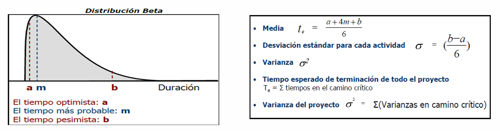

La fórmula de duración estimada es:

$$
\text{Duración estimada (TE)} = \frac{O + 4M + P}{6}
$$

Esta fórmula da mayor peso al valor más probable, y suaviza los efectos de los extremos. La desviación estándar (σ), que mide la incertidumbre de la estimación, se calcula como:

$$
\sigma = \frac{P - O}{6}
$$

Con estos valores, se pueden aplicar principios de estadística para conocer las probabilidades de que una actividad se complete dentro de ciertos rangos de tiempo. Por ejemplo:

- Con un 68,26% de probabilidad, la duración estará dentro de ±1 desviación estándar.
- Con un 95,46%, dentro de ±2 desviaciones.
- Con un 99,73%, dentro de ±3 desviaciones.

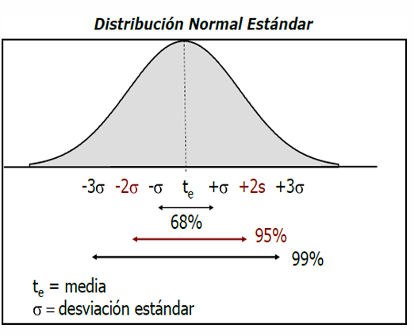

Esta técnica es valiosa cuando la actividad es incierta o crítica y se requiere una planificación más cuidadosa.

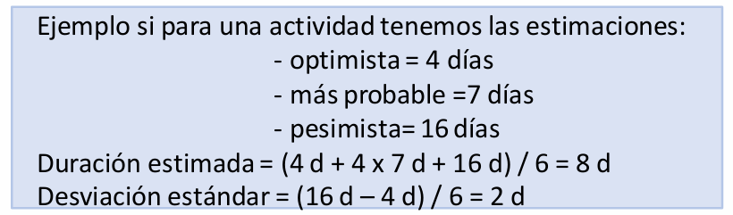

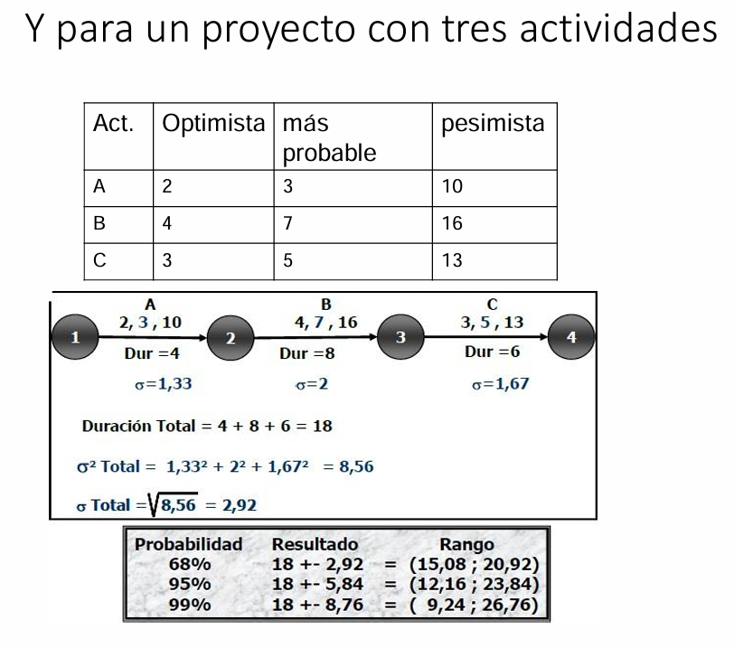

## Estimación de la duración de un proyecto: Método del Camino Crítico (CPM)

El Método del Camino Crítico (Critical Path Method - CPM) es una herramienta fundamental en la gestión de proyectos. Su objetivo es identificar la secuencia de actividades que determina la duración total del proyecto. Esta secuencia se denomina “camino crítico”, y está compuesta por las tareas sucesivas que suman el mayor tiempo posible desde el inicio hasta el fin del proyecto.

Cualquier retraso en una actividad del camino crítico afectará directamente la fecha final del proyecto, ya que no hay margen de demora. Por el contrario, las actividades que no están en ese camino tienen una holgura o tiempo libre, es decir, pueden retrasarse sin impactar la fecha final del proyecto.

### Ejemplo

Posibles caminos en un proyecto (en semanas):

- Ini-A, A-C, C-D, D-Fin = 12 semanas
- Ini-A, A-C, C-E, E-Fin = 11 semanas
- Ini-B, B-E, E-Fin = 13 semanas
- Ini-B, B-C, C-D, D-Fin = 15 semanas (camino crítico)
- Ini-B, B-C, C-E, E-Fin = 14 semanas

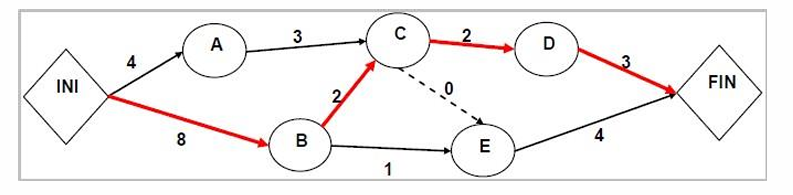

El camino crítico es el de 15 semanas. Cualquier retraso en una de sus actividades atrasará el proyecto.

### Holgura

Holgura de un camino: diferencia entre la duración del camino crítico y la del camino en cuestión.

Ejemplo: Holgura de Ini-B, B-E, E-Fin = 15 - 13 = 2 semanas.

Holgura de una actividad: diferencia entre el camino crítico y el camino más largo al que pertenece la actividad.

Si C pertenece a un camino de 14 semanas, su holgura será 15 - 14 = 1 semana.

Este método permite identificar tareas prioritarias, optimizar recursos y evaluar el impacto de retrasos.

## Diagrama de Gantt

El diagrama de Gantt es una herramienta gráfica utilizada para planificar y visualizar el cronograma de un proyecto. Cada tarea se representa mediante una barra horizontal, ubicada a lo largo de un eje temporal. La longitud de la barra representa la duración estimada de la tarea.

Este tipo de diagrama no solo permite ver cuándo comienzan y terminan las tareas, sino también su superposición, secuencias y dependencias. Por ejemplo, puede mostrar si una tarea comienza al terminar otra (relación Fin-Inicio), o si varias pueden ejecutarse en paralelo.

Además, el Gantt puede integrarse con datos de recursos y calendarios laborales, lo cual permite una planificación más realista y detallada. También ayuda a identificar los puntos críticos del proyecto visualmente, y a realizar un seguimiento efectivo del avance del mismo.

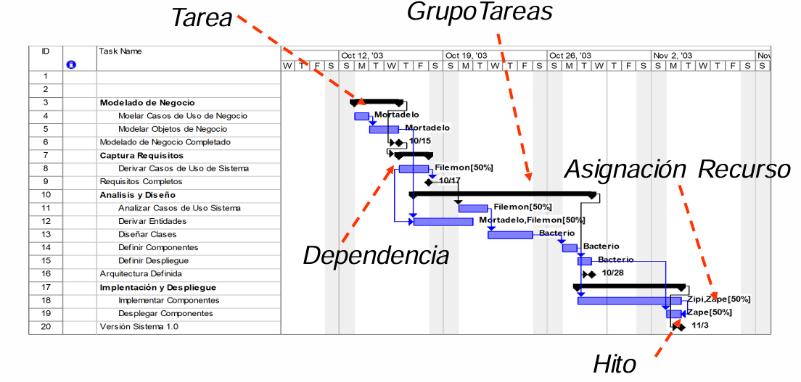

## ¿Cómo se estima en Scrum? — Estimación por historias

En Scrum, el enfoque de estimación es completamente distinto al de las metodologías tradicionales. Aquí no se estiman tiempos exactos, sino que se mide la dificultad relativa de cada tarea a través de unidades llamadas Puntos de Historia (PH).

### ¿Cómo funciona?

Durante la planificación del sprint, el equipo selecciona una historia de usuario que todos conozcan bien y le asigna un número arbitrario de PH. Esta historia se convierte en el pivote, la referencia para estimar las demás.

Luego, usando una técnica llamada Scrum Poker (una dinámica de grupo), se discuten y comparan las nuevas historias con el pivote, asignándoles un valor que representa su complejidad relativa. Esta estimación no depende del tiempo sino de la percepción colectiva del esfuerzo requerido (que puede incluir tiempo, riesgo, incertidumbre y volumen de trabajo).

### ¿Cómo se define el trabajo de un sprint?

Con base en la velocidad del equipo, es decir, la cantidad promedio de PH que se completan por sprint, se determina cuánto trabajo se puede comprometer en el próximo sprint. Por ejemplo, si un equipo completa en promedio 35 PH por sprint, se eligen historias cuya suma no supere esa cantidad.

Este enfoque fomenta la colaboración, reduce la presión de predecir tiempos exactos y permite una mejor adaptación al cambio. A lo largo del proyecto, la velocidad del equipo se vuelve más precisa, lo que mejora la planificación futura.

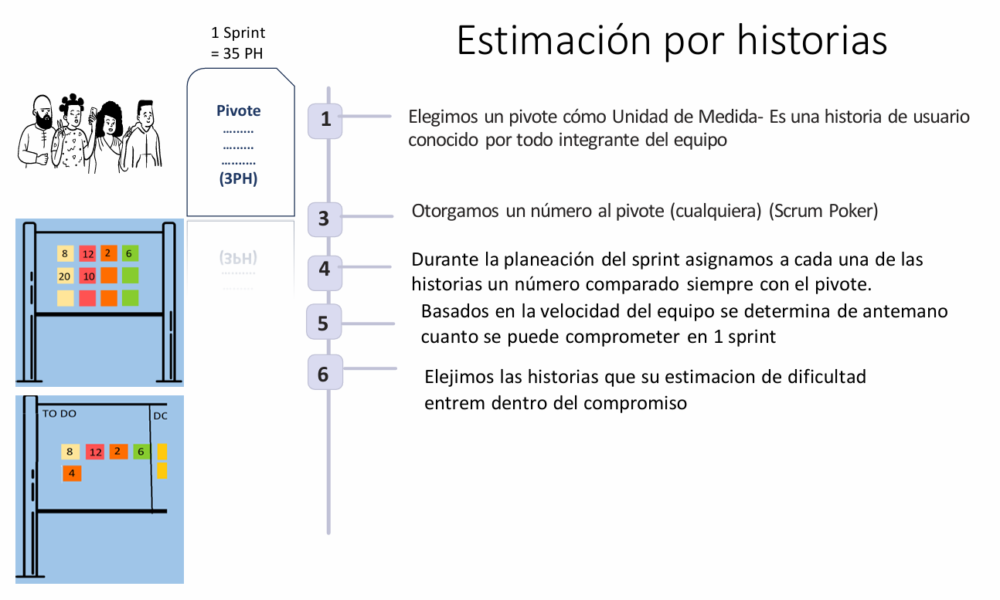

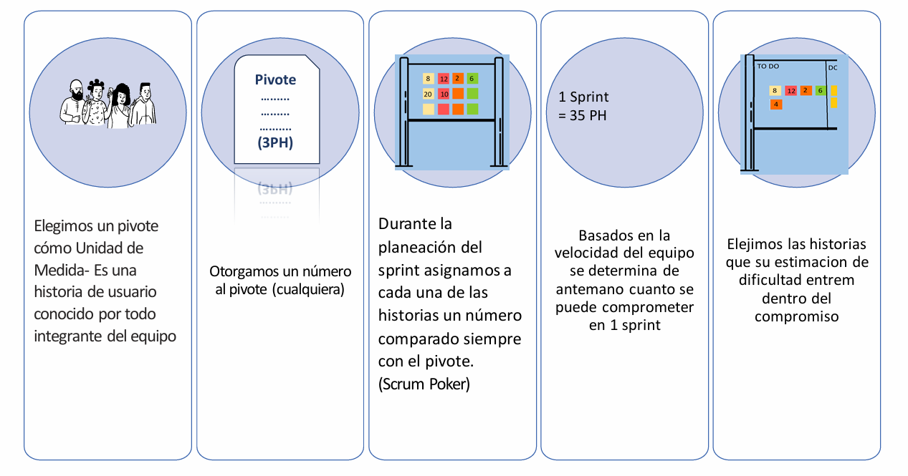
