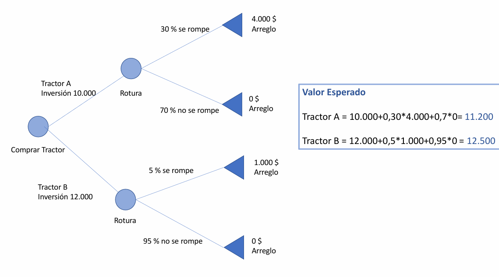

# Gestión de Riesgos

## Gestión de la Ingeniería del Software

La gestión de la ingeniería del software es una disciplina fundamental dentro del ciclo de vida del desarrollo de software. Su propósito principal es asegurar que los productos y servicios de software se entreguen de manera efectiva, eficiente y alineada con las expectativas de las partes interesadas. Esto implica coordinar cuidadosamente los recursos humanos, técnicos, financieros y temporales necesarios para cada etapa del proyecto. A través de la planificación, organización, evaluación y control sistemático de estos recursos, se busca alcanzar objetivos de calidad, plazo y costo, maximizando los beneficios tanto para el cliente como para el equipo de desarrollo.

La gestión efectiva de la ingeniería del software no se limita únicamente a la administración de tareas o a la programación de entregas, sino que también incluye la supervisión de actividades técnicas (como la especificación de requisitos, diseño y pruebas), la gestión del talento humano, el monitoreo del avance del proyecto y, muy especialmente, la gestión de riesgos, la cual es clave para enfrentar la incertidumbre inherente a cualquier desarrollo tecnológico.

## ¿Qué es un Riesgo?

En el contexto de la ingeniería del software, un riesgo se define como la posibilidad de que ocurra un evento incierto que pueda tener un impacto sobre el proyecto. Este impacto puede ser negativo (lo que comúnmente se considera una amenaza), pero también puede ser positivo (una oportunidad). Aunque en la práctica se tiende a asociar el término “riesgo” con problemas o pérdidas, una visión integral también contempla aquellos eventos inesperados que podrían beneficiar al proyecto si se gestionan correctamente.

El riesgo tiene dos componentes fundamentales:

- Probabilidad de ocurrencia: Qué tan probable es que el evento ocurra. Puede estimarse con datos históricos, modelos estadísticos o juicio experto.

- Impacto: Qué consecuencias traería ese evento en caso de que suceda, tanto en términos económicos, técnicos o de cumplimiento de plazos.

Un riesgo puede afectar directamente a las actividades, los recursos, la calidad del producto o incluso la continuidad del proyecto. Por ello, su correcta identificación y gestión temprana es esencial para la salud del proyecto.

## Consideraciones

La gestión del riesgo parte de una premisa importante: no existe certeza en ningún proyecto. Incluso las tareas más simples pueden verse alteradas por factores impredecibles. A diferencia de la incertidumbre, que no permite medir ni predecir la ocurrencia de un evento (como una catástrofe sin precedentes), el riesgo es cuantificable: podemos estimar con cierto grado de precisión la probabilidad de que ocurra y su posible impacto.

El riesgo implica un evento que puede suceder, no que necesariamente lo hará. Si sucede, exigirá una reacción inmediata del equipo de gestión: modificaciones en el cronograma, reasignación de recursos, cambios de alcance, entre otras acciones. Por ello, anticiparse y planificar respuestas es una estrategia de supervivencia en la gestión de proyectos complejos.

## Tipos de Riesgos

La clasificación de los riesgos permite abordarlos con diferentes enfoques. Existen varios tipos según su naturaleza:

- Riesgos conocidos: Son aquellos que pueden identificarse tras una revisión detallada del plan del proyecto. Suelen documentarse y monitorearse desde el inicio. Ejemplos: falta de recursos, dependencias externas no resueltas.

- Riesgos predecibles: Se derivan de la experiencia en proyectos anteriores. Aunque no se presentan en el plan, pueden inferirse si se tiene conocimiento de la historia del equipo o el dominio. Ejemplo: retrasos habituales en la validación del cliente.

- Riesgos impredecibles: Son eventos inesperados cuya ocurrencia no puede anticiparse fácilmente. Suelen estar fuera del control del equipo, como cambios legales abruptos, fallas catastróficas o pandemias. Su impacto suele ser alto y su manejo requiere flexibilidad y resiliencia.

## Gestión de Riesgos

La gestión de riesgos en la ingeniería del software es un proceso estructurado que busca identificar, analizar, priorizar y tratar los riesgos. Este proceso se inicia desde las fases iniciales del proyecto y debe mantenerse activo a lo largo de todo su desarrollo.

Las principales etapas son:

- Identificación: Se hace una lista detallada de los posibles riesgos, basándose en el análisis del proyecto, experiencias anteriores, lecciones aprendidas, talleres y entrevistas con stakeholders.

- Análisis: Cada riesgo se evalúa en términos de:
    - Su impacto sobre el proyecto (costos, plazos, calidad).
    - Su probabilidad de ocurrencia.
    - Su prioridad de atención (a menudo mediante matrices de riesgos).

- Clasificación por categorías:
    - Riesgos del proyecto: afectan al cronograma, presupuesto o planificación general.
    - Riesgos técnicos: comprometen la calidad, estabilidad o funcionalidad del producto.
    - Riesgos del negocio: ponen en duda la utilidad, viabilidad o rentabilidad del software.

Una herramienta clave en esta etapa es el cálculo del Valor Monetario Esperado (VME), que se obtiene multiplicando la probabilidad de ocurrencia del riesgo por su impacto económico estimado. Esta métrica ayuda a decidir cuánto invertir en mitigación.

## Enfoques ante el Riesgo

Existen dos grandes enfoques para abordar los riesgos:

- Reactivo: En este enfoque, no se realiza ninguna acción hasta que ocurre un problema. Se actúa “a lo bombero”, apagando incendios cuando ya hay daños. Este enfoque es común, pero riesgoso, porque no permite anticiparse ni prevenir pérdidas importantes.

- Proactivo: En este enfoque, los riesgos se identifican y analizan antes de que ocurran. Se planifican estrategias para evitarlos, mitigarlos o responder rápidamente. Este enfoque es más profesional, alineado con las buenas prácticas de gestión, y suele estar acompañado por planes de contingencia.

### Estrategias para el Tratamiento del Riesgo

Una vez identificados y evaluados los riesgos, se puede definir una estrategia para cada uno. Las principales son:

- Evitarlo: Consiste en eliminar la causa del riesgo. Es la mejor opción, pero rara vez posible, ya que muchas veces no se pueden eliminar todos los factores de incertidumbre. Por ejemplo, se puede evitar un riesgo al cambiar una tecnología inestable por una más madura.

- Mitigarlo: Reducir la probabilidad de ocurrencia o su impacto. Esto puede lograrse a través de pruebas, capacitación del equipo, revisiones técnicas o mejoras en la comunicación.

- Transferirlo: Pasar la responsabilidad del riesgo a un tercero. El ejemplo más común es contratar un seguro o delegar una tarea riesgosa a una empresa especializada.

- Aceptarlo: Cuando no se puede evitar ni mitigar el riesgo, y transferirlo es inviable, se lo acepta. En este caso, se desarrolla un plan de contingencia para actuar en caso de que el riesgo se materialice. Esta opción requiere preparación emocional y organizacional.

### La Contingencia como Estrategia de Protección

La contingencia en la gestión de proyectos tiene como propósito reducir el impacto que tendría un riesgo si finalmente se concreta. Cuando se habla de contingencia, no se está intentando eliminar la posibilidad de que ocurra un evento adverso, sino prepararse activamente para enfrentarlo de la mejor manera. En este sentido, una de las estrategias más comunes es la reserva monetaria, también conocida como reserva de contingencia. Esta consiste en asignar una parte del presupuesto del proyecto a cubrir costos derivados de la materialización de riesgos conocidos o esperados.

En el caso de riesgos desconocidos—aquellos que no se pueden anticipar ni detectar durante la planificación—se puede establecer una reserva de gestión general. Esta no forma parte de la línea base del costo (el plan formal aprobado de costos del proyecto), pero sí se incluye en el presupuesto total. Es decir, no se planea utilizar esta reserva salvo que ocurra un evento imprevisto. Su inclusión permite cierta flexibilidad sin desestabilizar las proyecciones financieras del proyecto.

## Proceso Sistemático

La gestión de riesgos es un proceso sistemático que abarca varias etapas, cada una interrelacionada y esencial para lograr un control efectivo del riesgo. Este proceso busca no solo minimizar las consecuencias negativas, sino también maximizar las oportunidades que pueden derivarse de eventos inesperados.

### 1. Identificación de Riesgos

El primer paso consiste en identificar todos los riesgos potenciales que podrían afectar el proyecto. Esto incluye amenazas técnicas, operativas, de negocio, legales, ambientales y humanas. La identificación no debe realizarse una sola vez al inicio del proyecto, sino que debe repetirse en diferentes momentos, ya que los riesgos pueden evolucionar con el tiempo.

Se generan listados de riesgos potenciales, con una descripción detallada de cada uno, su posible causa, sus consecuencias, y las áreas del proyecto que podrían verse afectadas. Esta fase se nutre de la experiencia, el conocimiento del dominio, revisiones de proyectos anteriores, y la consulta con expertos.

### 2. Análisis de Riesgos

Una vez identificados, se procede al análisis cualitativo y cuantitativo de los riesgos:

- El análisis cualitativo consiste en valorar cada riesgo en función de su probabilidad de ocurrencia y su impacto (alto, medio, bajo). Esta información permite priorizar los riesgos que requieren atención inmediata.

- El análisis cuantitativo, por su parte, implica el uso de herramientas matemáticas y estadísticas para calcular el valor monetario esperado (VME), estimar la desviación estándar del costo del proyecto y evaluar escenarios a través de simulaciones como Monte Carlo.

El resultado es un listado priorizado de riesgos, lo que orienta los recursos y esfuerzos hacia los puntos más críticos.

### 3. Planificación de la Respuesta al Riesgo

La tercera fase implica diseñar estrategias para responder a los riesgos, una vez analizados y priorizados. Estas respuestas pueden ser:

- Evitar el riesgo: modificar el plan del proyecto para eliminar el riesgo completamente (por ejemplo, cambiar un proveedor poco confiable).
- Mitigar el riesgo: reducir la probabilidad o el impacto del riesgo (por ejemplo, realizar pruebas adicionales).
- Transferir el riesgo: trasladar la responsabilidad del riesgo a un tercero, como una compañía de seguros o un proveedor con garantías contractuales.
- Aceptar el riesgo: reconocer su existencia y prepararse para asumir sus consecuencias si se concreta, generalmente mediante planes de contingencia.

Un plan de contingencia es una parte clave de esta etapa, ya que establece las acciones que se tomarán si un riesgo se materializa. Esta planificación anticipada permite actuar con rapidez y eficiencia cuando se presentan problemas.

### 4. Monitoreo y Control del Riesgo

El riesgo es dinámico. Nuevos riesgos pueden emerger a medida que el proyecto avanza y algunos riesgos previstos pueden desaparecer o cambiar de naturaleza. Por eso, es necesario monitorear continuamente el entorno del proyecto, revaluar los riesgos y aplicar medidas correctivas.

El monitoreo incluye la valoración periódica de los riesgos existentes, el seguimiento de los indicadores clave y la ejecución de auditorías y revisiones. Además, permite verificar la efectividad de las respuestas implementadas y realizar ajustes en el plan si es necesario.

## Priorización de Riesgos y Plan de Respuesta

La priorización de riesgos se basa en el análisis de su probabilidad de ocurrencia y su impacto potencial. Esta clasificación puede representarse gráficamente mediante matrices de riesgo, donde cada riesgo ocupa una posición según estos dos ejes. Así se identifican rápidamente los riesgos más amenazantes, que suelen tener alta probabilidad y alto impacto.

Una herramienta útil para la toma de decisiones es el árbol de decisión. Este diagrama representa visualmente las distintas alternativas que se pueden tomar ante un riesgo o problema, junto con sus posibles consecuencias. En cada nodo del árbol se plantea una decisión o evento, y de cada rama surgen las alternativas posibles. Esta técnica ayuda a evaluar de forma racional las implicaciones de cada opción, en términos de costo, tiempo, calidad y satisfacción de los stakeholders.

El uso de árboles de decisión es especialmente útil en escenarios complejos, donde las decisiones deben tener en cuenta múltiples factores y posibles resultados. Permite visualizar con claridad cuál es el camino más conveniente, ya sea por tener menor riesgo, menor costo esperado o mayor beneficio.

### Ejemplo

Se desea determinar qué tipo de tractor es preferible comprar para un proyecto agrícola. El tractor A tiene un precio de $10.000 y un 30% de probabilidad de rotura. En caso de rotura el arreglo del tractor A asciende a $4.000. Por su parte el tractor B tiene un valor de $12.000 y un 5% de probabilidad de rotura. En caso que se rompa el tractor B, su costo de reparación sería de $1.000. ¿Qué tractor conviene comprar?

