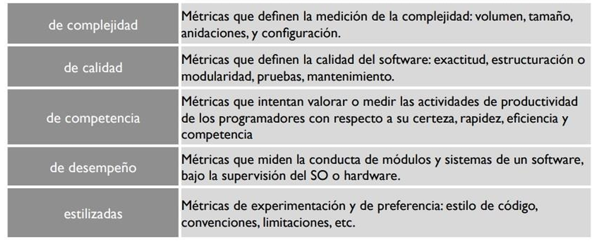
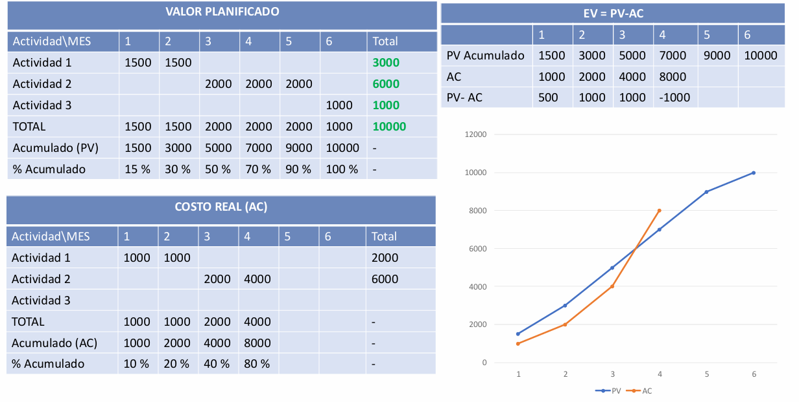
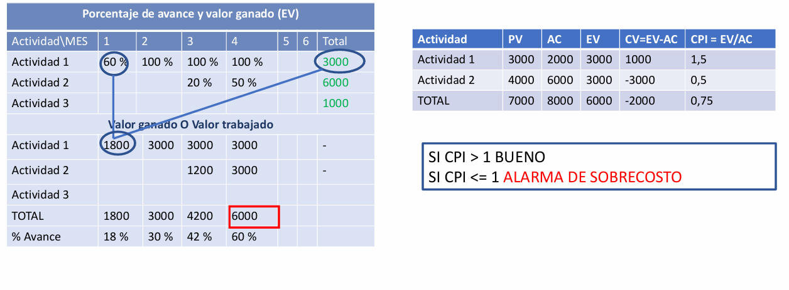
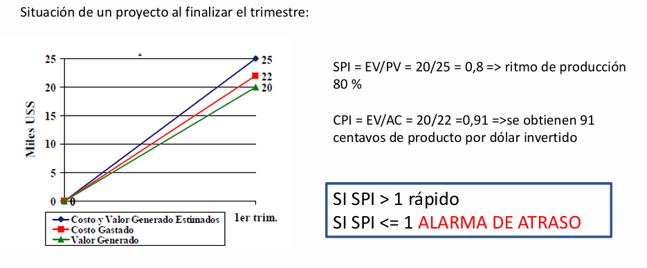
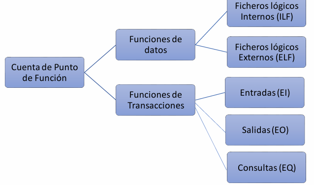

# Métricas

## Medición en la Ingeniería de Software

La medición en la ingeniería de software es un proceso sistemático que permite recopilar datos objetivos sobre distintos aspectos de un producto, proceso o proyecto de software. Esta práctica es fundamental para comprender el comportamiento del software, evaluar su calidad y rendimiento, controlar su desarrollo y mantenimiento, y, sobre todo, mejorar tanto los procesos como los productos finales. En esencia, medir en ingeniería de software es una herramienta estratégica que ayuda a tomar decisiones fundamentadas y a reducir la incertidumbre inherente a los proyectos de desarrollo.

## Métrica en Ingeniería de Software

Según el IEEE, una métrica es una medida cuantitativa del grado en que un sistema, componente o proceso posee un atributo dado. Las métricas permiten cuantificar características del software que de otra manera serían abstractas o subjetivas. Estas mediciones cuantitativas son esenciales para comparar, evaluar, controlar y mejorar distintos aspectos del desarrollo de software.

El objetivo final de aplicar métricas no es solo recolectar datos, sino comprender el proceso de desarrollo, evaluar el estado del software o del proyecto, controlar el progreso y los riesgos, mejorar continuamente la calidad de los procesos y productos, y predecir resultados futuros, como costos, esfuerzo o calidad.

## Conceptos Fundamentales

- Medida: Es una estimación cuantitativa de algún atributo específico de un producto o proceso. Por ejemplo, la cantidad de defectos detectados durante la fase de prueba, el número de líneas de código escritas (LOC), el esfuerzo invertido (horas-hombre), etc.

- Medición: Es el acto de obtener una medida. Involucra observar y registrar una propiedad específica siguiendo criterios definidos. Por ejemplo, medir el número de errores por módulo en la etapa de validación.

- Métrica: Surge de aplicar una fórmula o conjunto de reglas a una o varias medidas, a menudo durante un periodo prolongado. Una métrica representa una abstracción que permite la comparación, como "errores por KLOC" (mil líneas de código).

- Indicador: Es un derivado de las métricas que ofrece una visión profunda sobre el estado del proyecto, proceso o producto. Sirve para tomar decisiones, evaluar si se alcanzaron los objetivos y detectar desviaciones que requieren ajustes. Los indicadores son clave para el gestor del proyecto y el equipo técnico.

## Proceso de Medición y Análisis

La medición no ocurre de manera aislada; forma parte de un ciclo estructurado y continuo:

- Recopilación de Datos: Se extraen datos relevantes de los procesos, productos o proyectos. Esto puede ser manual o automatizado, dependiendo de la infraestructura.
- Cálculo de Métricas: A partir de las medidas recolectadas, se aplican fórmulas para obtener métricas significativas.
- Generación de Indicadores: Se interpretan las métricas para producir indicadores que ayuden en la toma de decisiones.
- Evaluación: Se comparan los indicadores contra estándares, metas u objetivos del proyecto.
- Ajuste del Proceso: Si los indicadores revelan desviaciones o debilidades, se aplican correcciones y mejoras.

## Tipos de Medidas en Ingeniería de Software

### Medidas Directas

Son aquellas que pueden medirse de manera explícita y objetiva, sin necesidad de interpretación adicional.

Del proceso de software:

- Costo total
- Esfuerzo invertido (persona/mes o horas-persona)

Del producto de software:

- Líneas de código (LOC)
- Velocidad de ejecución
- Tamaño del archivo ejecutable

Estas medidas son más fáciles de obtener y evaluar, aunque no siempre reflejan directamente la calidad o valor del software.

### Medidas Indirectas

Son aquellas que no se pueden medir directamente, sino que requieren inferencias o combinaciones de otras métricas.

- Calidad del software
- Eficiencia
- Facilidad de mantenimiento
- Nivel de satisfacción del cliente

Estas medidas son más difíciles de evaluar, pero son fundamentales para medir el éxito real del software a largo plazo.

## Clasificación de las Métricas

### 1. Métricas de Proceso

Se recopilan a lo largo del tiempo, y abarcan múltiples proyectos. Ayudan a caracterizar y mejorar los procesos de desarrollo. Su foco está en la eficiencia y en el control del flujo de trabajo.

- Tiempos de desarrollo en cada fase
- Retrasos o sobrecostos frecuentes
- Tasa de defectos recurrentes

### 2. Métricas de Proyecto

Permiten evaluar el estado de un proyecto específico. Sirven para hacer seguimiento a los cronogramas, identificar riesgos, y verificar si se están cumpliendo los hitos planeados.

- Desviación entre esfuerzo planificado y real
- Porcentaje de tareas completadas
- Burn-down charts (gráficos de avance en métodos ágiles)

### 3. Métricas de Producto

Están relacionadas directamente con las características del software, independientemente de cómo fue construido. Evalúan atributos como tamaño, complejidad, modularidad, acoplamiento, documentación, entre otros.

- Número de funciones implementadas
- Tamaño del código fuente
- Complejidad ciclomática
- Número de errores por componente

## Guía por Objetivos Organizacionales

Las mediciones en ingeniería de software no deben realizarse de forma arbitraria. Deben estar alineadas con los objetivos estratégicos de la organización. Por ejemplo, si la meta principal es "salir primero al mercado con nuevos productos", las métricas deben orientarse a evaluar rapidez de desarrollo, productividad, eficiencia y reducción de defectos.

### Compromiso con la Medición

- Definir el alcance de la medición: ¿Se medirá un solo proyecto, una unidad organizativa o toda la empresa?
- Asignar recursos adecuados: Se deben destinar personas, tiempo, herramientas y capacitación para garantizar que la medición se realice correctamente.
- Compromiso formal: La organización debe respaldar la medición como una actividad estratégica, no como una carga adicional.

### Planificación del Proceso de Medición

Este paso implica:

- Identificar las necesidades de información: ¿Qué decisiones necesitan soporte con datos?
- Seleccionar medidas relevantes: Se eligen con base en su utilidad, facilidad de obtención y análisis.
- Definir procedimientos: Documentar cómo y cuándo se realizará la medición, qué herramientas se usarán y cómo se reportarán los resultados.

### Ejecución y Evaluación de la Medición

Durante la ejecución:

- Se integran los procedimientos de medición en los procesos estándar de software.
- Se recopilan, validan y almacenan datos.
- Se analizan resultados y se comunican a los interesados.

En la evaluación:

- Se revisan los resultados para detectar fortalezas y debilidades.
- Se realizan auditorías internas o externas.
- Se proponen y aplican mejoras al proceso de medición.

## Métricas del Software

### 1. Métricas orientadas al tamaño

Estas métricas utilizan el tamaño del software como base (por ejemplo, líneas de código - LOC). Son útiles pero pueden ser engañosas si se comparan lenguajes diferentes o estilos de programación.

- Errores por KLOC
- Defectos por KLOC
- Costo por KLOC
- Documentación por KLOC
- Errores por hombre-mes
- KLOC por hombre-mes
- Costo por página de documentación

### 2. Métricas orientadas a la funcionalidad

Estas métricas se basan en las funcionalidades entregadas al usuario y son más independientes de la tecnología.

- Puntos de Función (PF): Miden la funcionalidad proporcionada al usuario, considerando entradas, salidas, consultas, archivos y enlaces externos.
- Puntos por Características: Se asignan en función de requerimientos específicos o innovaciones técnicas.
- Puntos por Historia (PH): Métrica común en metodologías ágiles basada en historias de usuario.
- Puntos por Casos de Uso: En entornos orientados a objetos, se miden las funcionalidades a partir de los casos de uso documentados.

## Medir el Desempeño del Proyecto: Gestión de Valor Ganado (EVM)

La Gestión de Valor Ganado o Earned Value Management (EVM) es una herramienta esencial en la administración de proyectos para monitorear y controlar el avance y desempeño de un proyecto durante su ejecución. Su objetivo principal es ofrecer una visión integral del estado del proyecto, integrando el alcance, tiempo y costo en una única métrica coherente y objetiva. Esta técnica permite identificar desviaciones del plan en etapas tempranas y tomar decisiones informadas para corregir el rumbo.

### Conceptos Fundamentales de EVM

#### 1. PV – Valor Planificado (Plan Value)

El Valor Planificado representa el costo presupuestado del trabajo que se planeaba completar hasta un momento determinado en el proyecto. Es decir, responde a la pregunta: ¿cuánto deberíamos haber gastado según el cronograma si todo salía como estaba planificado?

Este valor se deriva de la línea base de costos, también conocida como Presupuesto Acumulado (BAC, Budget at Completion), y está directamente relacionado con la planificación temporal del proyecto. Por ejemplo, si se había previsto terminar el 40% del proyecto para el mes tres y el presupuesto total es de $100,000, entonces el PV sería $40,000.

#### 2. AC – Costo Real (Actual Cost)

El Costo Real es el costo efectivamente incurrido en la realización del trabajo hasta un determinado punto. No refleja cuánto se ha avanzado en términos de trabajo entregado, sino cuánto se ha gastado. Por ejemplo, si se han invertido $22,000 en el tercer mes de ejecución, ese es el AC, independientemente de si se avanzó más o menos de lo planificado.

#### 3. EV – Valor Ganado (Earned Value)

El Valor Ganado representa el valor del trabajo realmente completado hasta una fecha, expresado en términos del costo presupuestado. Este es el punto clave de la metodología EVM, ya que permite evaluar si lo que se ha gastado se tradujo efectivamente en progreso.

Para calcular el EV, es necesario estimar el porcentaje de avance de cada actividad y luego convertirlo en un valor monetario multiplicando dicho porcentaje por el costo presupuestado de esa actividad. Por ejemplo, si una tarea con un presupuesto de $10,000 está completada en un 50%, su valor ganado es de $5,000.

### Indicadores de Desempeño: Análisis de Costo y Cronograma

#### 4. CV – Variación de Costos (Cost Variance)

𝐶𝑉=𝐸𝑉−𝐴𝐶

La variación de costos muestra si el proyecto está por encima o por debajo del presupuesto. Si el CV es positivo, significa que se ha gastado menos de lo planificado para el trabajo realizado (buena señal). Si es negativo, indica sobrecosto.

#### 5. CPI – Índice de Desempeño del Costo (Cost Performance Index)

𝐶𝑃𝐼=𝐸𝑉/𝐴𝐶

Este índice refleja la eficiencia con la que se están utilizando los recursos. Un CPI > 1 indica eficiencia en el gasto (se obtiene más valor del esperado por cada unidad monetaria invertida). En cambio, un CPI < 1 alerta sobre costos excesivos. Es una métrica crucial para anticipar si el proyecto terminará dentro del presupuesto.

#### 6. SV – Variación de Cronograma (Schedule Variance)

𝑆𝑉=𝐸𝑉−𝑃𝑉

Esta métrica indica si el proyecto está adelantado o retrasado respecto a lo planificado. Un SV positivo significa que se ha avanzado más de lo esperado, mientras que un SV negativo señala retrasos.

#### 7. SPI – Índice de Desempeño del Cronograma (Schedule Performance Index)

𝑆𝑃𝐼=𝐸𝑉/𝑃𝑉

Mide la eficiencia temporal del proyecto. Si SPI > 1, el proyecto avanza más rápido que lo planificado. Si SPI < 1, hay un ritmo más lento, lo que puede causar retrasos importantes. Un ejemplo clásico: si EV = 20 y PV = 25, entonces SPI = 0.8, lo que indica un ritmo del 80% respecto al cronograma.

### Proyecciones de Costos y Estimaciones Finales

Para evaluar cuánto costará el proyecto al finalizar, se utilizan las siguientes proyecciones:

#### 8. BAC – Presupuesto hasta la Conclusión (Budget at Completion)

Es el presupuesto total originalmente planificado para completar el proyecto. Este valor es fijo, a menos que se decida cambiar el alcance o replanificar oficialmente el proyecto.

#### 9. EAC – Estimación a la Conclusión (Estimate at Completion)

Este valor representa una nueva proyección del costo total del proyecto basado en el desempeño actual. Hay varias formas de calcularlo, dependiendo de los supuestos:

##### a) Basado en el presupuesto restante

𝐸𝐴𝐶=𝐴𝐶+(𝐵𝐴𝐶−𝐸𝑉)

Supone que el trabajo restante se completará según lo planificado, sin considerar la eficiencia o ineficiencia actual.

##### b) Basado en el CPI actual

𝐸𝐴𝐶=𝐵𝐴𝐶/𝐶𝑃𝐼

Considera que la eficiencia actual se mantendrá constante hasta el final del proyecto.

##### c) Basado en CPI y SPI

𝐸𝐴𝐶=𝐴𝐶+((𝐵𝐴𝐶−𝐸𝑉)/(𝐶𝑃𝐼×𝑆𝑃𝐼))

Este enfoque reconoce que las ineficiencias de tiempo afectan también los costos futuros.

##### d) Reestimación directa

𝐸𝐴𝐶=𝐴𝐶+𝑁𝑢𝑒𝑣𝑎𝑒𝑠𝑡𝑖𝑚𝑎𝑐𝑖𝑜𝑛

En este caso, se realiza una estimación completamente nueva del costo faltante, sin depender de índices.

#### 10. ETC – Estimación para Completar (Estimate to Complete)

Esta variable expresa el costo estimado del trabajo que queda por hacer, desde el presente hasta el final del proyecto:

𝐸𝑇𝐶=𝐸𝐴𝐶−𝐴𝐶

Este valor ayuda a estimar cuánto se necesita aún para terminar, facilitando la planificación de los recursos.

#### 11. TCPI – Índice de Desempeño para Concluir el Proyecto (To Complete Performance Index)

𝑇𝐶𝑃𝐼=(𝐵𝐴𝐶–𝐸𝑉)/(𝐵𝐴𝐶–𝐴𝐶)

Este indicador muestra la eficiencia de costos que se necesita a partir de ahora para alcanzar el presupuesto original. Por ejemplo, si el TCPI es 1.15, entonces se requiere ser 15% más eficiente que el rendimiento hasta el momento. Si el índice es mayor a 1, indica un desafío importante; si es menor que 1, el proyecto puede relajarse un poco y aún terminar dentro del presupuesto.

## Puntos de Función

La estimación por Puntos de Función es una técnica creada por Allan Albrecht en IBM en 1979 con el objetivo de medir el tamaño funcional de un software, es decir, cuánta funcionalidad entrega un sistema al usuario, independientemente de la tecnología utilizada, el lenguaje de programación o la etapa del ciclo de vida del proyecto. A diferencia de métricas tradicionales como las líneas de código (LOC), los puntos de función se centran en lo que el sistema hace, y no en cómo lo hace, lo que permite realizar comparaciones más justas y estimaciones más precisas en etapas tempranas del desarrollo.

Esta técnica se ha convertido en un estándar en la industria del software, sobre todo para la estimación de costos, duración y recursos necesarios, al mismo tiempo que facilita la comparación entre proyectos y la planificación de esfuerzos.

### Componentes de la Estimación por Puntos de Función

La técnica se basa en identificar y clasificar funciones del sistema, dividiéndolas en dos grandes grupos: funciones de datos y funciones de transacciones. Cada una de estas funciones se valora según su complejidad y se le asigna un puntaje específico que depende de la cantidad de elementos que contienen.

#### 1. Funciones de Datos

Estas funciones representan el manejo de datos almacenados y accesibles dentro del sistema o desde sistemas externos. Se dividen en dos tipos:

a. Archivos Lógicos Internos (ILF o ALI - Internal Logical Files)

Los ILF son agrupamientos lógicos de datos mantenidos por la aplicación. Es decir, son entidades que el sistema crea, lee, actualiza o elimina mediante entradas externas.

Por ejemplo, si una aplicación gestiona "empleados", "facturas", o "productos", estas entidades pueden representarse por varios archivos o tablas físicas en la base de datos, pero conceptualmente se consideran una única entidad lógica, por lo que se contabiliza un solo ILF por cada agrupación lógica, independientemente de cuántas tablas físicas la representen.

b. Archivos de Interfaz Externos (ELF o EIF - External Interface Files)

Los EIF son agrupamientos de datos utilizados por la aplicación, pero mantenidos por otro sistema. No son modificados por la aplicación actual, sino que son consultados para obtener información relevante.

Por ejemplo, una aplicación de ventas puede acceder a una lista de códigos postales gestionada por otra aplicación; esta lista se considera un EIF.

#### 2. Funciones de Transacciones

Son aquellas funciones que permiten la interacción entre el usuario y el sistema. Representan cómo los usuarios ingresan, consultan o reciben información. Hay tres tipos:

a. Entradas Externas (EI o EE - External Inputs)

Representan datos o controles que los usuarios envían al sistema. Estas entradas generalmente actualizan ILFs y pueden generar cambios en el estado del sistema.

Características:

- Provienen de un actor externo (usuario o sistema).
- Actualizan datos internos.
- Deben distinguirse de las consultas (que no modifican datos).

Ejemplos: Formulario para registrar empleados, modificar un equipo, cargar una factura.

b. Salidas Externas (EO o ES - External Outputs)

Son los resultados que el sistema envía al exterior. A diferencia de las consultas, las salidas pueden involucrar procesamiento adicional (cálculos, validaciones, formateos) y su objetivo es comunicar información significativa al usuario.

Ejemplos:

- Reportes en PDF.
- Mensajes de error validados.
- Informes de rendimiento.

c. Consultas Externas (EQ o CE - External Queries)

Son interacciones donde el usuario solicita datos, y el sistema responde con una salida directa basada en una entrada, sin procesamiento adicional. No modifican datos ni estados.

Ejemplo típico:

- Buscar un empleado por su cédula.
- Consultar un partido por fecha.

### Conceptos Técnicos: DET y RET

Para determinar la complejidad de las funciones de datos, se deben identificar dos elementos fundamentales:

#### Data Element Type (DET)

Un DET es un campo de datos único y reconocible por el usuario, como nombre, fecha, dirección. Cada campo diferente cuenta como un DET.

#### Record Element Type (RET)

Un RET es un subgrupo lógico de datos dentro de un archivo lógico. Representa registros repetitivos o secciones diferenciadas dentro de la entidad lógica.

Por ejemplo: Una entidad "Factura" puede tener una parte de "cabezal" y otra de "líneas".

Aunque estén en tablas distintas, si pertenecen a la misma entidad lógica, se cuentan como un solo ILF con múltiples RETs.

### Ejemplo 1: Aplicación de tareas asignadas a empleados

Se identifican tres entidades: Tarea, Descripcion_Tarea, y Empleado. Pero, según las reglas de los ILF, Tarea y Descripcion_Tarea forman una única entidad lógica.

ILFs:

- Tarea (incluye Descripcion_Tarea):
    - RETs: 2 (Tarea, Descripcion_Tarea)
    - DETs: 5 (#tarea, nom_tarea, escala, #linea, l_descrip)
- Empleado:
    - RETs: 1
    - DETs: 5 (CI, nom_empleado, fecha_nac, fecha_ingreso, #tarea)

Total ILF: 2.

### Ejemplo 2: Aplicación para registro de partidos de básquet

Requerimientos funcionales identificados:

Entradas externas (EI):

- Registro de equipos
- Registro de partidos
- Actualización de equipos
- Eliminación de equipos

Consultas externas (EQ):

- Buscar partido por fecha

Salidas externas (EO):

- Listado de equipos
- Reporte de equipos por fecha
- Reporte de partidos

Archivos lógicos:

- ILF identificados: 4 tablas en base de datos, aunque algunas pueden corresponder a una misma entidad lógica.

### Estimación de Esfuerzo

La Cuenta de Puntos de Función comienza asignando puntajes a cada función, en base a su tipo (EI, EO, EQ, ILF, EIF) y complejidad (baja, media, alta). Una vez sumados todos los puntos, se obtiene el Punto de Función sin Ajustar (PFA sin ajustar).

Luego, se aplica una fórmula de ajuste basada en 14 factores de influencia (como restricciones de tiempo, reutilización, portabilidad, etc.). Esta fórmula es:

PF Ajustado = PF sin ajustar * (0,65 + 0,01 * Factor de Ajuste)

Por ejemplo, si PF sin ajustar = 75 y el factor de ajuste = 32:

PFA = 75 * (0,65 + 0,01 * 32) = 75 * 0,97 = 73,8

#### Conversión a Esfuerzo (Horas-Hombre)

Una vez calculado el total de puntos de función ajustados, se utiliza un valor promedio de horas por punto de función. Este valor varía por industria y tecnología, pero un valor típico es 8 horas por FP.

En el ejemplo:

Horas-Hombre = PFA * Horas/FP = 74 * 8 = 592 Horas-Hombre

Si un desarrollador trabaja 5 horas por día, 20 días al mes:

592 / (5 * 20) = 5,92 meses

Por lo tanto, el proyecto tendría una duración estimada de casi 6 meses con un solo desarrollador.

## Puntos de Casos de Uso

La estimación por Puntos de Casos de Uso (Use Case Points, o UCP) es una técnica sistemática y estructurada que permite calcular el esfuerzo requerido para desarrollar un sistema de software a partir de los casos de uso del mismo. Introducida por Gustav Karner en 1993, esta metodología tiene como objetivo ofrecer una medida objetiva de tamaño funcional y, a partir de ella, estimar el tiempo y los recursos necesarios para su desarrollo. Es particularmente útil durante las primeras fases del ciclo de vida del software, cuando se dispone de un modelo de análisis o de diseño basado en UML con diagramas de casos de uso y actores.

### Fundamentos de la Estimación UCP

La estimación por UCP reconoce que hay distintos factores que influyen en el esfuerzo de desarrollo. Estos incluyen tanto elementos estructurales del sistema, como los casos de uso y los actores, como también factores contextuales: factores técnicos y ambientales que pueden modificar significativamente el esfuerzo requerido.

Estos cuatro componentes son:

- UUCW (Unadjusted Use Case Weight): Representa el peso bruto de los casos de uso, según su complejidad.
- UAW (Unadjusted Actor Weight): Representa el peso bruto de los actores que interactúan con el sistema.
- TCF (Technical Complexity Factor): Ajuste técnico que refleja el grado de sofisticación técnica del sistema.
- ECF (Environmental Complexity Factor): Ajuste ambiental, que refleja la experiencia, habilidades y condiciones del equipo de desarrollo.

### Cálculo de Puntos de Casos de Uso sin Ajustar (UUCP)

a. UUCW – Peso de Casos de Uso sin Ajustar

Cada caso de uso se clasifica según la cantidad de transacciones que lo componen (una transacción es un conjunto de acciones ejecutadas sin interrupciones por un actor o el sistema). La complejidad también puede reflejarse en la cantidad de clases involucradas.

| Categoría | Descripción                                      | Peso |
|-----------|--------------------------------------------------|------|
| Simple    | 1–3 transacciones y menos de 5 clases            | 5    |
| Medio     | 4–7 transacciones y entre 5–10 clases            | 10   |
| Complejo  | Más de 7 transacciones o más de 10 clases        | 15   |

Se multiplica la cantidad de casos de cada tipo por su peso correspondiente y se suman todos los valores para obtener el UUCW total.

b. UAW – Peso de Actores sin Ajustar

Los actores también se clasifican según la complejidad de su interacción con el sistema:

| Tipo de Actor | Descripción                                                   | Peso |
|---------------|---------------------------------------------------------------|------|
| Simple        | Otro sistema accediendo por API                               | 1    |
| Medio         | Persona interactuando por texto o sistema por protocolo (TCP/IP) | 2    |
| Complejo      | Persona interactuando por interfaz gráfica (GUI)              | 3    |

Al igual que con los casos de uso, se multiplica la cantidad de cada tipo de actor por su peso, y se suman todos para obtener el UAW total.

c. UUCP = UUCW + UAW

Este valor representa el tamaño del sistema sin tener en cuenta condiciones técnicas ni ambientales.

### Ajustes: Factores Técnicos y Ambientales

a. TCF – Technical Complexity Factor

Los factores técnicos ajustan la estimación para reflejar dificultades técnicas específicas. Hay 13 factores técnicos, cada uno con un peso predeterminado que indica su importancia. Cada factor debe ser calificado con un valor de impacto percibido (de 0 a 5) que representa cuán relevante es en el proyecto actual.

| Código | Factor técnico                               | Peso |
|--------|----------------------------------------------|------|
| T1     | Sistema distribuido                          | 2    |
| T2     | Requisitos de rendimiento                    | 1    |
| T3     | Eficiencia para el usuario final             | 1    |
| T4     | Procesamiento interno complejo               | 1    |
| T5     | Reusabilidad del código                      | 1    |
| T6     | Facilidad de instalación                     | 0.5  |
| T7     | Facilidad de uso                             | 0.5  |
| T8     | Portabilidad                                 | 2    |
| T9     | Facilidad de mantenimiento                   | 1    |
| T10    | Concurrencia                                 | 1    |
| T11    | Seguridad                                    | 1    |
| T12    | Acceso a terceras partes                     | 1    |
| T13    | Capacitación requerida para usuarios         | 1    |

Se calcula el total técnico multiplicando el peso por el impacto percibido para cada factor, y sumando todo.

Fórmula:

TCF = 0.6 + (0.01 * Total Técnico)

b. ECF – Environmental Complexity Factor

Este factor considera las habilidades, experiencia y condiciones del equipo de desarrollo. Cada uno de los siguientes factores se califica con un valor de 0 a 5, donde 1 representa un fuerte impacto negativo, 3 impacto medio y 5 fuerte impacto positivo.

| Código | Descripción                                 | Peso |
|--------|---------------------------------------------|------|
| E1     | Familiaridad con el modelo y UML            | 1.5  |
| E2     | Participación parcial del equipo            | -1   |
| E3     | Habilidad del analista líder                | 0.5  |
| E4     | Experiencia en la aplicación                | 0.5  |
| E5     | Experiencia en orientación a objetos        | 1    |
| E6     | Motivación del equipo                       | 1    |
| E7     | Dificultad del lenguaje de programación     | -1   |
| E8     | Estabilidad de requerimientos               | 2    |

Se realiza una suma ponderada similar al TCF, y se utiliza la fórmula:

ECF = 1.4 + (-0.03 * Total Ambiental)

### Cálculo Final de los UCP

Con los tres valores calculados (UUCP, TCF y ECF), se obtiene el número final de Puntos de Casos de Uso Ajustados (UCP):

UCP = UUCP * TCF * ECF

Este valor representa el tamaño funcional del sistema considerando tanto la funcionalidad como las condiciones técnicas y humanas del proyecto.

### Cálculo del Esfuerzo de Desarrollo (Horas-Hombre)

Para traducir los UCP en una estimación de esfuerzo en horas-hombre, se utiliza un factor de productividad (PF). Este factor indica cuántas horas-hombre requiere cada punto de caso de uso. Si no se cuenta con datos históricos, se puede usar:

- 15 a 30 horas por UCP, dependiendo de la madurez y experiencia del equipo.
- Como valor por defecto, 20 horas/UCP para equipos nuevos.

Fórmula:

Horas Estimadas = UCP * PF

Esto permite calcular el tiempo total necesario para desarrollar el sistema. Dividiendo este valor entre las horas disponibles por día y por desarrollador, se obtiene una estimación de duración del proyecto en meses o semanas.