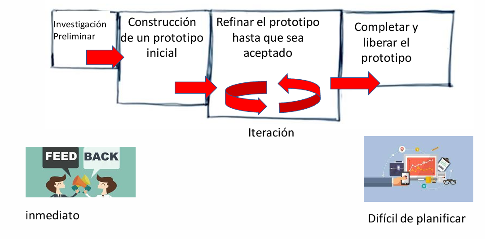
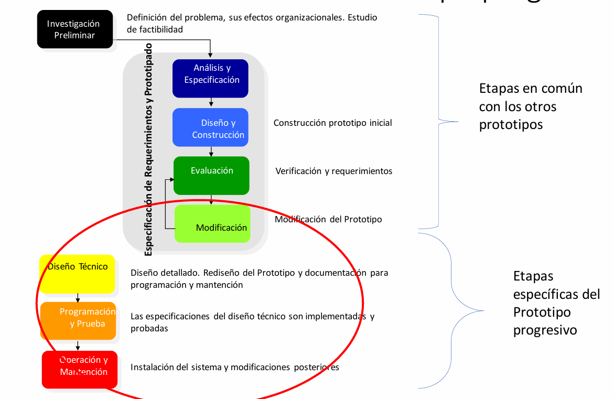

# Modelo Iterativo y el Prototipado

El modelo iterativo de desarrollo de software es una alternativa a los modelos más rígidos, como el modelo en cascada. En lugar de intentar construir el sistema completo de una sola vez (de principio a fin), el modelo iterativo propone desarrollar el sistema por partes, a través de una serie de ciclos repetitivos (iteraciones). En cada iteración se construye una versión parcial pero funcional del sistema, la cual se evalúa, mejora y refina progresivamente.

Una de las formas más comunes de aplicar este enfoque es mediante el prototipado. En este caso, el objetivo principal es crear una versión preliminar del software, o prototipo, que sirva como una especie de borrador funcional para probar ideas, experimentar con interfaces y verificar que los requisitos del cliente se están entendiendo correctamente.

## ¿Qué es un prototipo y para qué sirve?

Un prototipo de software es una simulación del sistema final. No necesariamente tiene todas las funcionalidades ni está desarrollado con la calidad de un producto definitivo, pero cumple una función fundamental: anticiparse al sistema real para evaluar su funcionamiento, su interfaz y su utilidad.

Este enfoque permite mostrarle al cliente un ejemplo visual y tangible de cómo se verá y se comportará el software una vez terminado. Gracias a eso, los usuarios pueden brindar retroalimentación desde las primeras etapas del desarrollo, lo que ayuda enormemente a reducir errores, aclarar requisitos, mejorar la experiencia de uso, e incluso entrenar a los usuarios futuros antes de que el sistema esté finalizado.

Las principales ventajas del uso de prototipos incluyen:

- Mejora en la calidad del sistema final, porque se identifican problemas tempranamente.
- Participación activa del usuario, que se siente más involucrado en el desarrollo.
- Satisfacción de los requerimientos reales, ya que se ajustan mediante prueba y error.
- Reducción del riesgo, al validar ideas antes de comprometerse con una implementación total.

## ¿Cuándo conviene aplicar un modelo basado en prototipos?

Este enfoque es especialmente útil en contextos donde:

- Los requisitos no están del todo claros al inicio del proyecto.
- El alcance del sistema aún no se ha definido con precisión.
- Los usuarios no colaboran mucho en la etapa de análisis inicial.
- La comunicación con el entorno real del sistema es difícil o incierta.
- El cliente tiene dudas sobre la viabilidad del sistema o incluso sobre si contratar al proveedor.

En estos casos, construir un prototipo puede actuar como una herramienta poderosa para obtener compromiso del usuario y validar la dirección del desarrollo sin hacer una inversión completa de recursos.

## Etapas del desarrollo mediante prototipado

El desarrollo de software usando un enfoque de prototipado suele seguir las siguientes fases generales:

- Investigación preliminar: Se estudia el problema, se evalúa la factibilidad y se identifican los requerimientos más generales del sistema.

- Construcción de un prototipo inicial: Se crea una primera versión del sistema que simule su comportamiento, aunque no esté completa.

- Iteración y refinamiento: Con base en la retroalimentación del usuario, el prototipo se ajusta, modifica o rediseña cuantas veces sea necesario.

- Liberación final: Una vez que el prototipo cumple con los objetivos esperados, se convierte en el producto definitivo o se usa como base para su desarrollo completo.

## Tipos de Prototipos

Existen varios tipos de prototipos, cada uno con sus características, ventajas y casos de uso particulares:

1. Maqueta (Mock-up)

Es una representación estática y visual del sistema. Suele mostrar pantallas, botones y flujos de interacción simulados. No tiene funcionalidades reales, pero es muy útil para evaluar la experiencia de usuario (UX), el diseño y la organización de la información. Se utiliza sobre todo en etapas tempranas del proyecto, cuando se quiere validar la interfaz.

2. Prototipo descartable

Este tipo se crea rápida y desprolijamente, con herramientas que no necesariamente son las mismas que se usarán en el desarrollo final. La idea es que sea barato y fácil de modificar, ya que se desechará una vez que se haya comprendido bien el problema y los requisitos. Es muy útil para hacer pruebas rápidas y entender qué necesita realmente el usuario. Pero cuidado: si no se descarta como se debe, podría generar problemas serios de mantenimiento si se usa como base del producto final.

3. Prototipo progresivo (o evolutivo)

Este es el más elaborado. A diferencia del descartable, no se desecha: se parte de un prototipo inicial y se va mejorando continuamente hasta transformarlo en el sistema final. Se aplican buenas prácticas de ingeniería desde el comienzo, se utilizan datos reales, y cada iteración mejora el diseño, la funcionalidad y la calidad del software. Es ideal cuando se dispone de herramientas que permiten desarrollar iterativamente de forma eficiente y con buen control de calidad.

## Prototipo progresivo: etapas específicas

En el caso del prototipo progresivo, el desarrollo incluye tanto las fases comunes como algunas específicas:

- Investigación preliminar: Análisis del problema, su contexto organizacional y estudio de viabilidad.
- Especificación y prototipado: Recopilación de requisitos e inicio del desarrollo del prototipo.
- Evaluación y rediseño: Se prueba, se obtiene feedback, y se redefine hasta lograr una versión aceptada.
- Diseño técnico y detallado: El prototipo se formaliza como diseño real del sistema.
- Programación y pruebas: Se implementan las funcionalidades completas basadas en el diseño validado.
- Operación y mantenimiento: Se instala el sistema y se realizan ajustes posteriores.

Este enfoque es más adecuado cuando:

- El usuario no está dispuesto a analizar modelos abstractos.
- Hay dudas sobre la viabilidad de la solución.
- Los requisitos solo pueden descubrirse por ensayo y error.
- El sistema tiene fuerte interacción con el usuario.
- No se requiere una lógica algorítmica compleja, o se busca una solución visual e intuitiva.
- La complejidad del sistema es media, y se puede construir por partes.

## Desarrollo Rápido de Aplicaciones (DRA / RAD)

El modelo de Desarrollo Rápido de Aplicaciones es un enfoque de desarrollo ágil que pone el foco en la velocidad de entrega del software sin sacrificar la calidad. Su objetivo principal es acortar el ciclo de vida del desarrollo utilizando estrategias como el trabajo modular, la retroalimentación continua del usuario, y el uso intensivo de herramientas y componentes reutilizables.

A diferencia de otros modelos más secuenciales, el DRA promueve la colaboración constante con el usuario y la producción rápida de versiones funcionales del software que pueden ir ajustándose y mejorando iterativamente.

### ¿Cuándo conviene aplicar DRA?

Este enfoque es ideal para ciertos contextos de desarrollo, donde la rapidez es clave y el sistema puede dividirse en partes independientes. Específicamente, se recomienda aplicar DRA cuando:

🕒 Se dispone de un ciclo extremadamente corto para entregar el producto final. Por ejemplo, en entornos empresariales donde se necesita una solución funcional en pocas semanas o meses.

🧱 El sistema puede ser modularizado, es decir, se puede dividir en partes más pequeñas (módulos o componentes) que puedan desarrollarse y probarse por separado.

👥 Es posible contar con equipos de desarrollo paralelos, donde cada equipo se encarga de un módulo o componente, lo cual permite un avance simultáneo y más rápido.

♻️ Existe la posibilidad de reutilizar componentes ya existentes (por ejemplo, librerías, frameworks, APIs, plantillas de interfaz), lo cual reduce el tiempo y el esfuerzo de codificación.

🧪 Se pueden aplicar herramientas y técnicas modernas, como generadores de código, entornos visuales de desarrollo, frameworks ágiles o bases de datos autoadministradas, que permiten acelerar el proceso sin comprometer la funcionalidad.

### Características principales del DRA

El modelo DRA combina varias estrategias que permiten lograr un desarrollo rápido y eficiente. Entre sus características más importantes encontramos:

🔁 Iteración rápida y continua

- El software se desarrolla en versiones funcionales tempranas que evolucionan con la retroalimentación del usuario.
- Se prueba y ajusta constantemente, evitando largos periodos de espera entre el análisis y la implementación.

🔧 Modularidad

- La aplicación se divide en módulos funcionales independientes, lo que permite a los equipos trabajar en paralelo.
- Cada módulo se diseña, construye y prueba por separado, lo que mejora la productividad general.

👥 Alta participación del usuario

- Desde el principio, los usuarios finales participan activamente en el proceso, lo que garantiza que el producto final esté alineado con sus necesidades.
- La retroalimentación inmediata permite corregir errores y ajustar requerimientos rápidamente.

♻️ Reutilización de componentes

- Se reutilizan componentes de software existentes para reducir el tiempo de codificación y asegurar la confiabilidad.
- Esto incluye desde bibliotecas estándar hasta interfaces gráficas, APIs o bases de datos preconfiguradas.

🛠️ Uso de herramientas modernas

- Se aplican entornos de desarrollo visuales, modelado rápido de datos, automatización de pruebas, generación de código, entre otros recursos que aceleran las tareas más repetitivas o complejas.

### Fases típicas del modelo DRA

Aunque el modelo RAD es ágil y flexible, suele dividirse en las siguientes etapas clave:

Modelado de Requisitos:

- Se definen los objetivos funcionales junto con los usuarios mediante reuniones cortas e interactivas.
- No se busca un documento de especificaciones largo y completo, sino una comprensión clara y compartida de lo que se necesita.

Diseño del Sistema:

- Se crea un diseño de alto nivel, orientado a módulos.
- Se identifican los componentes reutilizables y se define la arquitectura base del sistema.

Construcción Rápida:

- Los desarrolladores construyen los módulos en paralelo usando herramientas que faciliten la generación de interfaces, lógica de negocio y conexión con bases de datos.
- Se hacen pruebas unitarias y se integran gradualmente los módulos.

Prueba e Implementación:

- Se realizan pruebas integradas con los usuarios.
- A medida que se detectan mejoras o errores, se corrigen en nuevas iteraciones hasta tener una versión estable.

✅ Ventajas del DRA

- Entrega más rápida del software funcional.
- Menores costos cuando se aprovecha bien la reutilización.
- Alta adaptabilidad a los cambios de requisitos durante el desarrollo.
- Mayor satisfacción del usuario, gracias a su participación constante.

⚠️ Limitaciones o desafíos

- No es recomendable cuando el sistema requiere una arquitectura muy compleja o integrada, difícil de modularizar.
- Puede generar problemas de integración si los módulos no se diseñan con suficiente coordinación.
- Requiere equipos multidisciplinarios, herramientas adecuadas y experiencia en desarrollo ágil.
- No todos los clientes están dispuestos a participar de manera activa durante el proceso.
