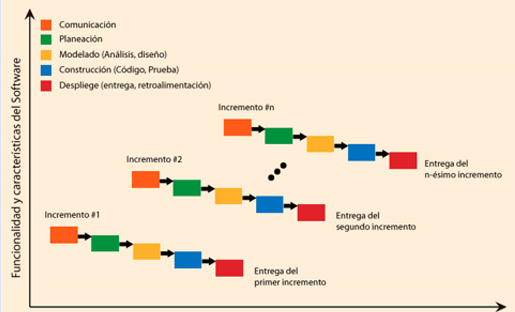
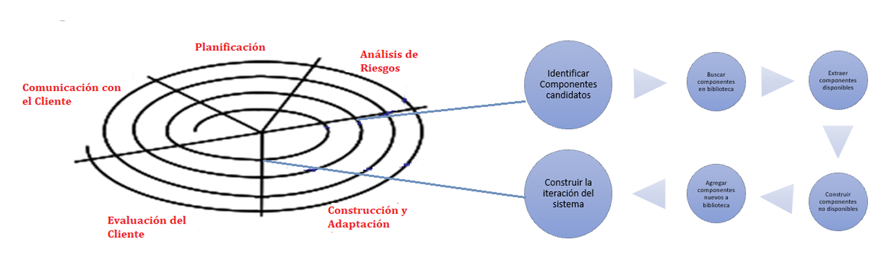
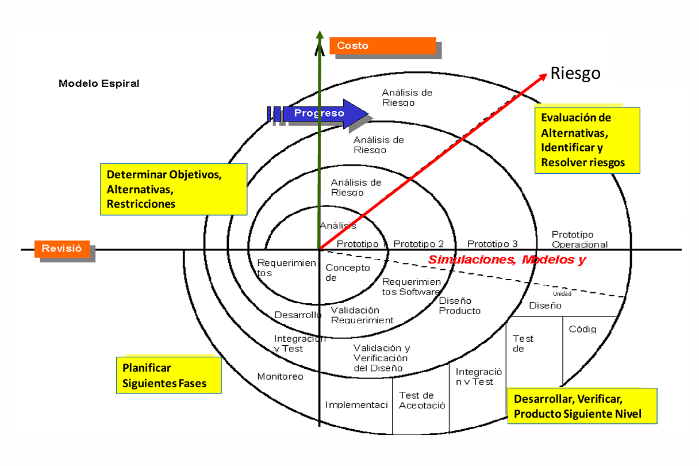

# Modelos evolutivos

## ¿Qué son los Modelos Evolutivos?

Los modelos evolutivos son enfoques de desarrollo que se adaptan a los cambios de requisitos del sistema a lo largo del tiempo. A diferencia de los modelos secuenciales (como el modelo en cascada), estos no requieren conocer todos los requerimientos desde el principio, sino que permiten ir refinando, mejorando e incorporando funcionalidad gradualmente en cada etapa o ciclo.

Son ideales para proyectos en los que los requisitos no están completamente definidos al inicio, o que cambian frecuentemente por nuevas necesidades del cliente o del entorno tecnológico.

## Modelo Incremental

El modelo incremental propone construir el sistema por partes o “incrementos”, donde cada parte es una versión operativa del sistema. No se entrega todo el producto de una sola vez, sino que cada iteración entrega una funcionalidad adicional.

🔧 Cómo funciona

- Se realiza un análisis inicial de los requerimientos.
- Se diseña un sistema básico, funcional pero limitado.
- Se divide el proyecto en módulos o funcionalidades que se entregan en versiones sucesivas.
- Cada incremento incluye nuevas funcionalidades y corrige errores detectados anteriormente.

🎯 Ventajas

- Permite entregar valor temprano al usuario.
- Es más fácil de probar y mantener, ya que se trabaja con partes más pequeñas.
- Se puede ajustar a cambios en los requisitos entre incrementos.
- La complejidad del sistema es media, lo que permite un desarrollo controlado.
- Los errores de una etapa pueden corregirse en la siguiente, sin detener todo el desarrollo.

## Modelo Basado en Componentes

Este modelo se enfoca en el reciclado y reutilización de componentes de software ya existentes. Un componente es una pieza autocontenida de código reutilizable, que cumple una función específica y se comunica a través de interfaces estandarizadas.

📦 ¿Qué es un Componente Reutilizable?

- Es una unidad funcional completa (por ejemplo, un login, una calculadora de precios, un sistema de notificaciones).
- Tiene una interfaz bien definida para conectarse con otros sistemas.
- Cuenta con documentación adecuada.
- Se puede reutilizar sin necesidad de modificar su funcionamiento interno.

🧠 Filosofía del modelo

En lugar de programar todo desde cero, este modelo propone armar el sistema integrando múltiples componentes preexistentes, lo que acelera el desarrollo y mejora la calidad del software.

💡 Beneficios

✅ Reutilización del software: se aprovecha código ya probado.

✅ Simplifica las pruebas: los componentes ya fueron testeados.

✅ Simplifica el mantenimiento: cambiar un componente es más fácil que modificar todo el sistema.

✅ Mayor calidad: los componentes suelen estar optimizados y validados.

✅ Ciclo de desarrollo más corto.

✅ Funcionalidad mejorada.

✅ Mejor retorno de la inversión (ROI), al reducir esfuerzo y costo.

📍 ¿Cuándo aplicarlo?

- Cuando existe una gran disponibilidad de componentes reutilizables.
- En contextos que combinan el modelo espiral con tecnologías orientadas a objetos.
- Cuando el proyecto se puede construir integrando componentes, en lugar de diseñarlo desde cero.

## Modelo en Espiral

Propuesto por Barry Boehm, este modelo combina características del desarrollo incremental y del prototipado. Está diseñado para proyectos grandes, complejos o con alto riesgo. Se centra en el análisis y reducción continua de riesgos y permite ir refinando progresivamente el producto.

Cada vuelta de la espiral incluye 4 fases clave:

- Definición de objetivos:
    - Se establecen metas, restricciones del producto y del proceso.
    - Se realiza una planificación de gestión.
- Evaluación y reducción de riesgos:
    - Se identifican riesgos técnicos, económicos y humanos.
    - Se desarrollan prototipos, simulaciones o pruebas de concepto para mitigarlos.
- Desarrollo y validación:
    - Se selecciona el modelo de desarrollo apropiado para ese ciclo (incremental, por componentes, etc.).
    - Se desarrolla y prueba la versión actual.
- Planificación del siguiente ciclo:
    - Se evalúan los resultados, se decide si se continúa.
    - Se planifica la siguiente iteración con base en los nuevos conocimientos adquiridos.

📍 ¿Cuándo aplicarlo?

- En proyectos grandes y complejos, donde los riesgos son altos.
- Cuando se trabaja con nuevas tecnologías o entornos inestables.
- Cuando se desea mantener un control riguroso sobre el costo y la calidad.
- Cuando hay incertidumbre en los requerimientos (por parte del cliente o del negocio).

🧠 Ventajas

- Análisis y control continuo de costos y riesgos.
- Reducción de incertidumbres técnicas o de requerimientos.
- Combina lo mejor del prototipado y del desarrollo incremental.
- Mejora la gestión de calidad y la toma de decisiones informadas.
- Minimiza la probabilidad de fracaso, al evaluar constantemente si se debe continuar.

| Modelo                 | Ideal para…                              | Clave del enfoque                       | Beneficio central                              |
|------------------------|-------------------------------------------|------------------------------------------|-------------------------------------------------|
| Incremental            | Sistemas medianamente complejos           | Entregas funcionales por iteraciones     | Entrega temprana y corrección progresiva        |
| Basado en Componentes  | Cuando hay muchos módulos reutilizables   | Integrar piezas ya desarrolladas         | Reutilización, ahorro y calidad                 |
| Espiral                | Proyectos grandes, con alta incertidumbre | Reducción iterativa de riesgos           | Minimizar riesgos y mejorar decisiones          |
