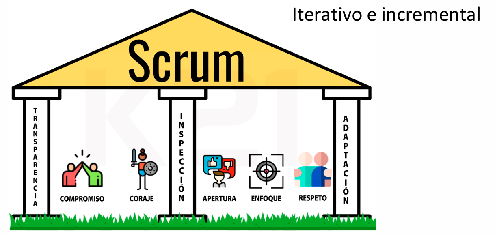
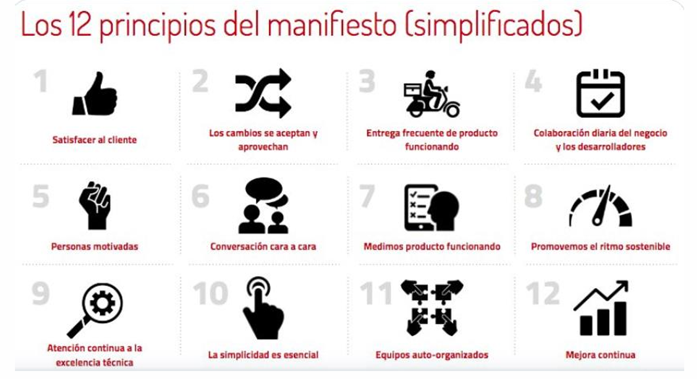
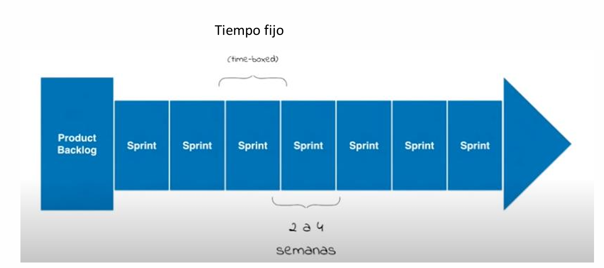
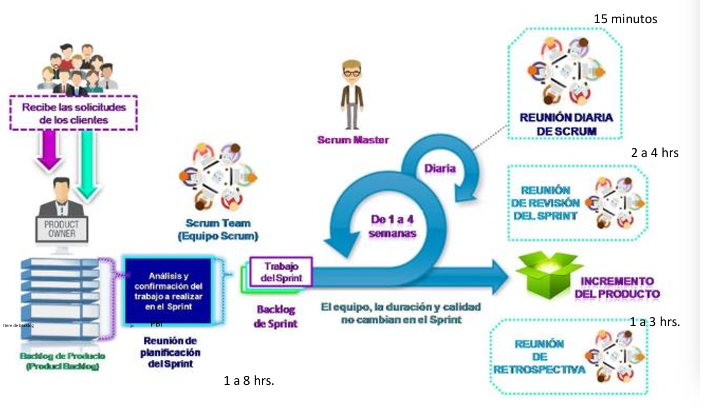
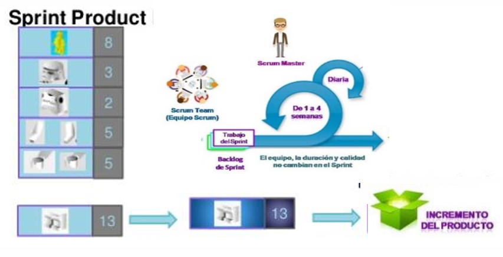
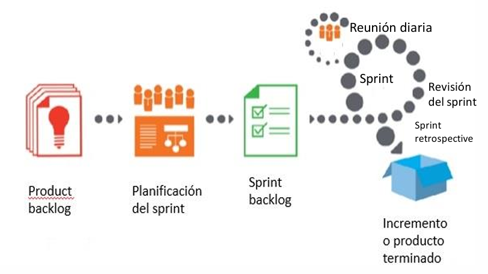
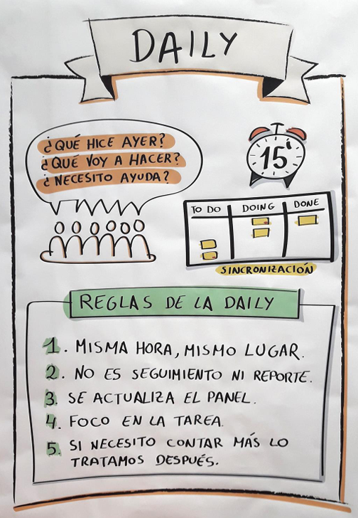
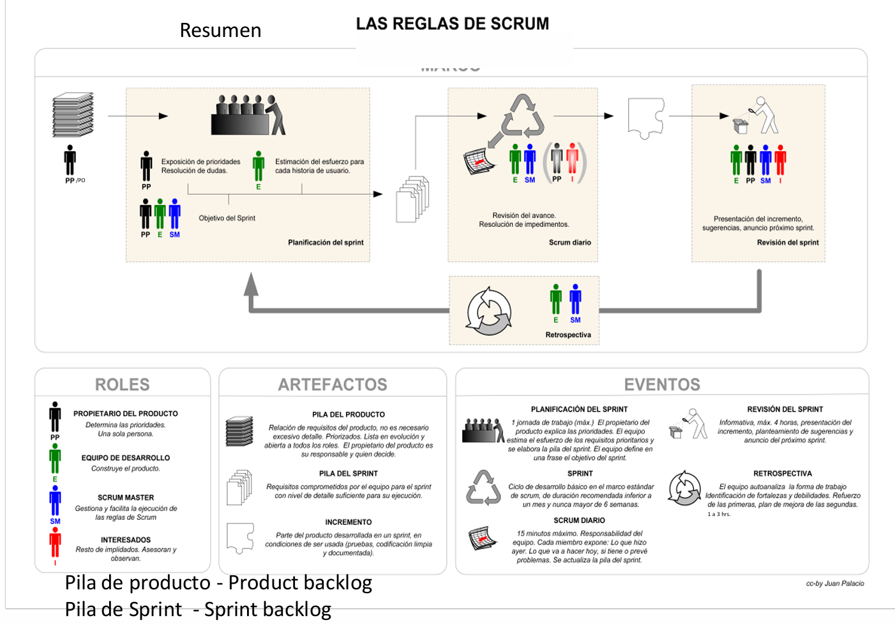

# Ágil

## ENTORNO ACTUAL DE LAS EMPRESAS: EL CONTEXTO PARA LA AGILIDAD

Vivimos en una era donde las organizaciones están inmersas en un entorno altamente cambiante, complejo y muchas veces difícil de predecir. Este entorno se describe comúnmente con el acrónimo VUCA, por sus siglas en inglés:

🔄 Complejidad

- El entorno actual está compuesto por muchas partes interconectadas. Cambiar una de ellas puede afectar al resto de formas inesperadas.

- Las relaciones entre los elementos no siempre son obvias, lo que complica la toma de decisiones.

- En desarrollo de software, esto se traduce en sistemas con múltiples dependencias, tecnologías, equipos distribuidos y requerimientos múltiples que cambian frecuentemente.

⚡ Volatilidad

- Se refiere a la rapidez con la que ocurren los cambios. Las condiciones del mercado, las tecnologías y las prioridades cambian constantemente.

- Esto exige respuestas ágiles y adaptativas por parte de las empresas. El tiempo de reacción se vuelve un factor crítico para la competitividad.

🌫️ Ambigüedad

- Las relaciones de causa y efecto no son claras. A menudo no se puede entender del todo el impacto que tendrán las acciones, ni siquiera después de implementarlas.

- Las organizaciones deben experimentar, aprender rápido y adaptarse continuamente.

❓ Incertidumbre

- Existen posibilidades de cambio, pero no hay seguridad de que ocurran ni cuándo ocurrirán.

- Esto obliga a trabajar con hipótesis y escenarios, más que con planes rígidos.

- Las preguntas clave aquí son:
    - ¿Qué tanto sabemos de la situación actual?
    - ¿Cuán bien podemos predecir los resultados de nuestras acciones?

## METODOLOGÍAS ÁGILES

En este contexto nace la necesidad de adoptar metodologías ágiles, que se centran en la adaptabilidad, entrega continua de valor y colaboración cercana con el cliente.

Las metodologías ágiles nacen como una respuesta al fracaso de los enfoques tradicionales como el modelo en cascada (waterfall), que eran poco flexibles ante los cambios. A través del Manifiesto Ágil, se establecen valores y principios que priorizan:

- A las personas y sus interacciones, por sobre los procesos y herramientas.
- El software funcionando, por encima de la documentación extensiva.
- La colaboración con el cliente, más que la negociación contractual.
- La respuesta al cambio, más que seguir un plan rígido.

## SCRUM: MARCO DE TRABAJO ÁGIL MÁS UTILIZADO

Uno de los marcos de trabajo más conocidos y utilizados en agilidad es Scrum, que permite gestionar proyectos complejos de forma iterativa e incremental.

Scrum se apoya en tres pilares fundamentales:

- Transparencia: Todos los aspectos importantes del proceso deben ser visibles para los involucrados.
- Inspección: Se deben revisar frecuentemente los avances y el proceso.
- Adaptación: Ante cualquier desviación o cambio en los objetivos, el equipo debe poder adaptarse rápidamente.

### CARACTERÍSTICAS

✅ Iterativo e Incremental

- El desarrollo ocurre en ciclos cortos y repetidos llamados sprints, donde se trabaja sobre partes del producto.
- Cada sprint entrega un incremento funcional del producto, es decir, una versión parcial pero operativa que aporta valor.

📅 Tiempo Fijo - Time Boxed

- Cada sprint tiene una duración fija, normalmente entre 1 y 4 semanas (comúnmente 2).
- Este límite temporal ayuda a mantener el foco, facilitar la planificación y medir resultados en períodos regulares.

### ROLES

🧭 Product Owner

- Representa los intereses del cliente y usuarios.
- Se encarga de definir qué se construye y en qué orden (prioridades del Product Backlog).
- Traduce las necesidades del negocio en User Stories.

👨‍💻 Scrum Team

- Equipo de desarrollo autónomo y multidisciplinario.
- Se compromete a entregar un incremento funcional al final de cada sprint.

🧑‍🏫 Scrum Master

- Es el facilitador del proceso Scrum.
- Se asegura de que el equipo siga los principios ágiles, eliminando impedimentos y promoviendo la mejora continua.

### ARTEFACTOS

🔖 Product Backlog

- Lista priorizada de todas las funcionalidades que el producto debería tener.
- Cada ítem del backlog se expresa como una User Story.

📌 User Story: Representa un requisito desde la perspectiva del usuario. Usualmente sigue el formato:
"Como [rol], quiero [función] para [beneficio]"

📋 Sprint Backlog

- Subconjunto del Product Backlog que se elige en la planificación para desarrollar durante el sprint actual.
- Refleja el compromiso del equipo para ese período.

📈 Incremento

- Es el producto funcional resultante al final de un sprint.
- Debe estar en condiciones de ser entregado y aportar valor al cliente.

### EVENTOS

1. 📌 Reunión de Planificación del Sprint

- Se realiza al inicio de cada sprint.
- El equipo selecciona las historias de usuario más prioritarias y planifica cómo desarrollarlas.

2. ☀️ Daily Scrum (Reunión Diaria)

- Duración máxima: 15 minutos.
- Cada miembro responde a tres preguntas:
    - ¿Qué hice ayer?
    - ¿Qué haré hoy?
    - ¿Qué impedimentos tengo?
- Permite mantener la coordinación y transparencia diaria.

3. 📊 Reunión de Revisión del Sprint

- Se realiza al finalizar el sprint.
- El equipo presenta lo que se logró, y se demuestra el incremento al Product Owner y stakeholders.
- Se obtiene feedback directo.

4. 🔁 Reunión de Retrospectiva

- También se realiza al final del sprint.
- El equipo reflexiona sobre:
    - ¿Qué funcionó bien?
    - ¿Qué se puede mejorar?
- Se establecen acciones concretas de mejora para el próximo sprint.
- Clave para la mejora continua.

### REFINAMIENTO DEL BACKLOG

No todos los ítems del Product Backlog están listos para implementarse al principio.

El refinamiento es un proceso continuo donde se:

- Detallan mejor las historias.
- Se estiman tamaños.
- Se dividen las historias grandes (epics) en historias más pequeñas y manejables.
- Se asegura que el equipo comprenda los requerimientos.

### CUÁNDO APLICAR SCRUM

Scrum es especialmente útil en entornos donde:

- Hay incertidumbre o cambios frecuentes en los requisitos.
- Se requiere una entrega continua de valor.
- Es importante involucrar al cliente en cada etapa del proceso.
- Se busca fomentar la autonomía y responsabilidad del equipo.

