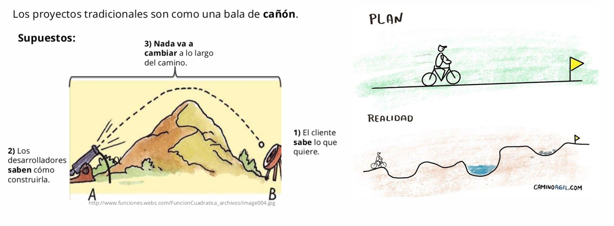
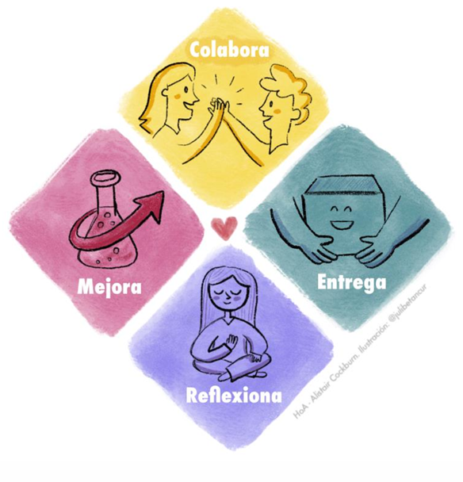
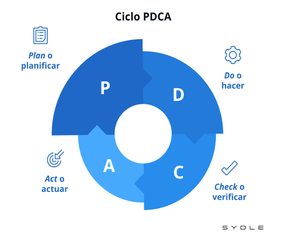
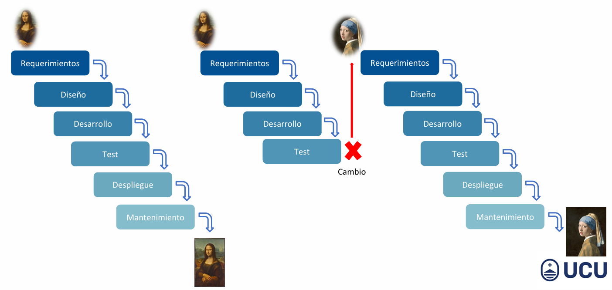
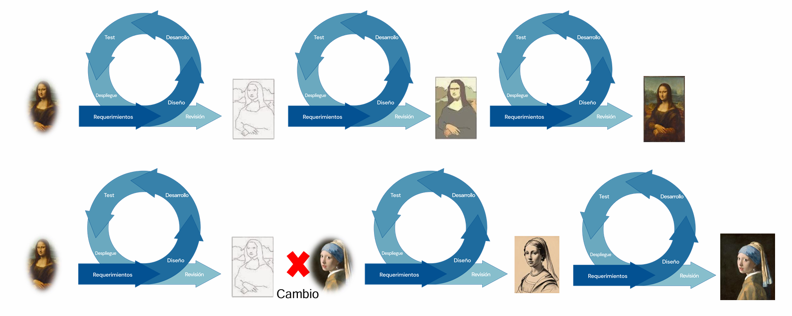
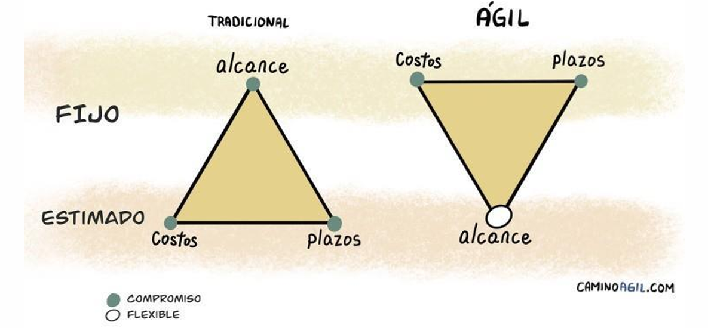

# Agilidad

## Definición de Agilidad (según Kleer)

> “La agilidad es la capacidad de diseñar los pasos a seguir en función del aprendizaje que surge de los resultados de los pasos anteriores y de la habilidad de adaptarse a los cambios del contexto, con el fin de alcanzar los objetivos propuestos de manera efectiva.”

Esta definición pone el foco en la adaptación continua. Ser ágil no significa ser rápido, sino tener la capacidad de aprender y ajustar el rumbo constantemente. La agilidad implica estar en constante observación del entorno, aprendiendo de lo que funciona y de lo que no, para corregir el camino en tiempo real.

Claves:

- Diseñar los pasos a seguir = planificación flexible, no rígida.
- Aprender de los resultados anteriores = mejora continua (retrospectiva).
- Adaptarse al contexto = el cambio es bienvenido, no evitado.
- Alcanzar objetivos de manera efectiva = no solo cumplir tareas, sino lograr impacto real.

## Los 4 pilares de la Agilidad

La agilidad se vive a través de estas prácticas fundamentales:

1. 🤝 Colabora

"Trabaja en equipo para abordar tareas complejas."

La colaboración entre personas y roles es fundamental. El trabajo en silos (cada uno por su cuenta) es ineficiente. Cuando trabajamos juntos, combinamos conocimientos y habilidades.

¿Qué tareas podemos abordar juntos para potenciar nuestro trabajo?

🔹 Ejemplo: Un desarrollador y un tester trabajando juntos desde el principio, no solo al final del desarrollo.

2. 📦 Entrega

"Prioriza lo que realmente importa para tus clientes."

No se trata de entregar mucho, sino de entregar lo correcto. En agilidad, buscamos el máximo valor con el mínimo esfuerzo. La clave es entender qué le importa al cliente realmente.

¿Qué esperan nuestros clientes que realmente aporte valor?

🔹 Ejemplo: En vez de entregar todas las funcionalidades planificadas, entregar primero las más importantes para el negocio.

3. 🔍 Reflexiona

"Aprende de los éxitos y los desafíos para evolucionar."

El equipo se detiene periódicamente para observar qué está funcionando y qué no. Se fomenta la cultura de la mejora continua.

¿Qué estamos haciendo bien? ¿Qué podemos mejorar para no repetir errores?

🔹 Ejemplo: En Scrum, esto se hace con la Retrospectiva de Sprint.

4. 🚀 Mejora

"Da el siguiente paso hacia procesos más efectivos."

Basados en la reflexión, el equipo prueba mejoras concretas. No se trata de grandes cambios, sino de pequeños experimentos que optimizan el proceso.

¿Qué cambio podemos probar para que nuestro proceso de trabajo sea más eficiente?

🔹 Ejemplo: Automatizar una tarea repetitiva que siempre consume tiempo en los sprints.

## Ciclo PDCA (Plan-Do-Check-Act)

El Ciclo PDCA es un enfoque de mejora continua muy usado en agilidad. Consiste en:

- Plan (Planificar): definir qué se quiere lograr y cómo.
- Do (Hacer): ejecutar el plan a pequeña escala.
- Check (Verificar): analizar los resultados y ver si funcionó.
- Act (Actuar): incorporar lo aprendido y estandarizar o corregir.

🔹 Ejemplo: Si un equipo prueba una nueva técnica de estimación, usa PDCA para evaluar si mejora el trabajo y, de ser así, la incorpora al proceso habitual.

## Ciclo de desarrollo tradicional (Modelo Cascada)

En este enfoque lineal, el proyecto se divide en etapas secuenciales:

- Requisitos
- Diseño
- Implementación
- Pruebas
- Producción

Una fase empieza solo cuando la anterior termina.

Características:

- Planificación detallada desde el principio.
- Se intenta cumplir el plan al pie de la letra.
- Cambiar algo implica grandes costos.
- Riesgo de que al final lo entregado no sirva al cliente.

🔹 Ejemplo: Se desarrolla todo un sistema y recién se testea al final. Si algo no funciona como esperaba el cliente, ya es tarde.

## Ciclo de desarrollo Ágil (Iterativo-Incremental)

En este enfoque se trabaja en ciclos cortos (iteraciones) donde se entrega algo funcional y usable al final de cada ciclo.

Características:

- Planificación inicial general, pero detalles se van ajustando.
- Se entrega valor desde el principio.
- Se aprende y mejora en cada iteración.
- El cambio es parte del proceso.

🔹 Ejemplo: Cada 2 semanas se entrega una versión con funcionalidades reales. Se recibe feedback y se ajusta la planificación.

## Triángulo de Proyecto: Alcance – Costo – Tiempo

Este triángulo representa las tres variables que hay que equilibrar en todo proyecto.

En el modelo Tradicional:

- Alcance fijo.
- Tiempo y costo se ajustan para cumplir el alcance.
- Se trata de controlar y predecir.

🔹 Problema: si el alcance no es el correcto, se desperdicia tiempo y dinero.

En el modelo Ágil:

- Tiempo y costo fijos (ej: sprints de 2 semanas con un equipo estable).
- Alcance variable: se prioriza lo más valioso primero.
- Se optimiza para maximizar valor dentro del tiempo y presupuesto disponibles.

🔹 Beneficio: Se puede entregar una solución útil incluso si no se hace todo lo planificado.

## Comparación final: Tradicional vs Ágil

| Característica  | Tradicional (Cascada)     | Ágil (Iterativo-Incremental)      |
|------------------|----------------------------|------------------------------------|
| Planificación     | Detallada al inicio         | Esbozo general, se ajusta           |
| Cambios           | Difíciles de manejar        | Bienvenidos                         |
| Enfoque           | Seguimiento (Tracking)      | Dirección (Steering)                |
| Control           | Basado en plan              | Basado en evidencia                 |
| Visión            | “Seguimos el mapa”          | “Confiamos en el terreno”           |
| Cliente           | Participa poco              | Participa constantemente            |

## ⚡️ ¿Agilidad = Rapidez?

> Spoiler: ¡No! Pero muchas veces se confunden.

❌ ¿Por qué se confunde?

Porque un equipo ágil entrega valor más seguido, y eso da la impresión de que trabaja más rápido. Sin embargo, la agilidad no es un atajo ni magia para hacer en 2 semanas lo que antes llevaba un año.

✅ ¿Entonces qué es realmente?

La agilidad no busca hacer las cosas rápido, sino hacer lo correcto, adaptándose al cambio y mejorando continuamente, lo que puede terminar siendo más eficiente a largo plazo.

Lo que sí hace la agilidad:

### 1. 🧭 Se adapta al cambio

“La agilidad ofrece la capacidad de adaptarse a los cambios en el camino, reduciendo costos y mejorando la respuesta ante imprevistos.”

En lugar de seguir un plan fijo hasta el final, los equipos ágiles ajustan el rumbo a medida que aprenden. Esto minimiza el desperdicio y evita construir cosas que el cliente no necesita.

### 2. 🤸‍♀️ Trabaja con flexibilidad

“Implica trabajar de manera flexible, asegurando que el enfoque esté en la calidad y el valor entregado al cliente.”

No se trata de correr, sino de iterar, escuchar, corregir y evolucionar el producto paso a paso. Lo importante es la calidad del valor entregado, no la cantidad de entregas.

### 3. 🧠 Busca el equilibrio

“La agilidad busca un equilibrio entre avanzar con ritmo y garantizar calidad.”

Se avanza con foco, pero sin sacrificar la calidad. La idea es avanzar con propósito, corrigiendo a tiempo, no correr y tropezar con los errores al final del camino.

