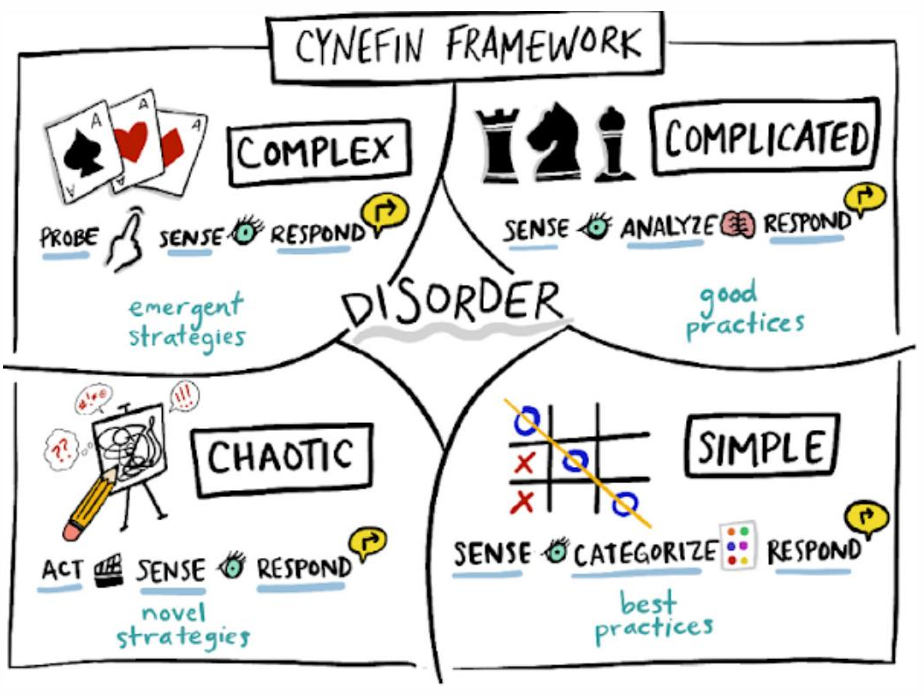
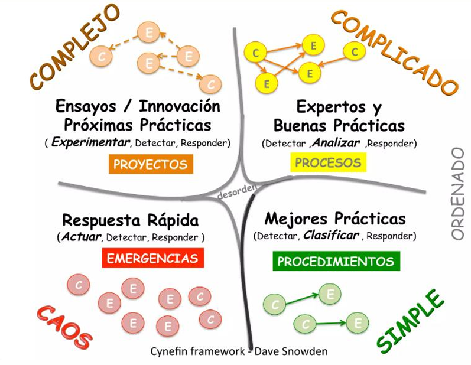
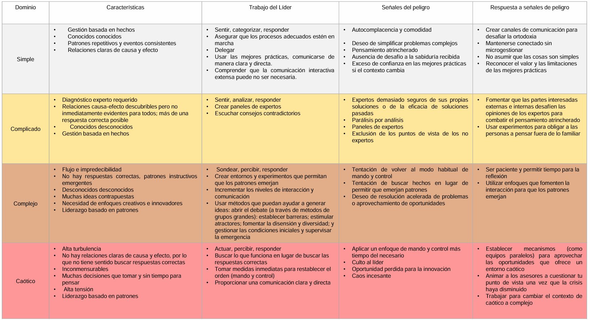

# Marco Cynefin

El marco Cynefin, desarrollado por Dave Snowden en 1999 mientras trabajaba en IBM, es una herramienta clave para la toma de decisiones en entornos complejos. El término Cynefin proviene del galés y significa "hábitat", lo cual refleja la idea de que las decisiones se toman mejor cuando entendemos el entorno en el que nos encontramos. Este marco es fundamental para las organizaciones que enfrentan ambientes cada vez más impredecibles, ya que proporciona un enfoque estructurado para abordar diversos tipos de problemas y situaciones.

En 2007, el marco fue publicado en la Harvard Business Review, donde se destacó por su enfoque innovador en el comportamiento organizacional. Cynefin define cinco dominios que nos ayudan a clasificar los problemas y las mejores formas de abordarlos, dependiendo de su complejidad y previsibilidad. Estos dominios son: simple, complicado, complejo, caótico y desordenado.

## El dominio de lo simple

Los problemas simples son aquellos donde la relación causa-efecto es clara y evidente para todos. Las soluciones son conocidas y fáciles de implementar, basándose en mejores prácticas o procedimientos establecidos. En este dominio, los pasos hacia la solución son bien definidos, y la incertidumbre es mínima.

Un ejemplo claro de este tipo de problemas sería diseñar una aplicación móvil sencilla con una interfaz de usuario fácil de usar y funcionalidades estándar. Aquí, el enfoque es seguir las mejores prácticas, aplicar procedimientos conocidos y revisar los resultados para garantizar que se haya seguido el camino correcto. La clave es usar el sentido común y basarse en experiencias previas.

## El dominio de lo complicado

En los problemas complicados, aunque existe una relación causa-efecto, no es inmediata, y puede requerir la intervención de expertos o un análisis más profundo para identificar la mejor solución. En este dominio, se tiene un buen conocimiento de lo que se necesita para resolver el problema, pero el camino para llegar al resultado óptimo no siempre es claro.

Un ejemplo de esto sería diseñar un sistema complejo con un conjunto de características avanzadas. Este tipo de proyectos requiere planificación exhaustiva y la colaboración de expertos, quienes deben usar su conocimiento para formular el mejor plan de acción. Aquí, el proceso de resolución es más estructurado que en el dominio simple, pero sigue estando basado en buenas prácticas y en el uso de la experiencia para maximizar los resultados.

## El dominio de lo complejo

Los problemas complejos son aquellos en los que la relación causa-efecto solo se entiende en retrospectiva, es decir, después de que se ha tomado acción. En este dominio, no existen soluciones predefinidas ni respuestas correctas inmediatas. La solución surge a través de la experimentación y la interacción dentro del sistema, por lo que se debe estar dispuesto a probar diferentes enfoques y aprender de los resultados.

Un ejemplo sería la creación de una aplicación online innovadora impulsada por inteligencia artificial, donde la necesidad de experimentación constante es fundamental. Aquí, la clave es probar diferentes ideas, recoger feedback de los usuarios (por ejemplo, beta testers) y ajustar el producto de acuerdo con los aprendizajes obtenidos. Se necesita un enfoque iterativo, como el ciclo PDCA (Plan-Do-Check-Act), para refinar el producto de manera continua y adaptativa.

## El dominio de lo caótico

En el dominio caótico, no hay relación causa-efecto clara y la prioridad es restaurar el orden de forma rápida y efectiva. Los problemas en este dominio son urgentes y requieren respuestas inmediatas para estabilizar la situación. Las soluciones no necesariamente serán las mejores, pero el tiempo de respuesta es crítico, ya que el objetivo principal es contener el daño y restaurar la normalidad.

Un ejemplo claro sería lidiar con una falla de seguridad crítica en una aplicación móvil que ha expuesto datos confidenciales de los usuarios. En este tipo de situaciones, la respuesta debe ser rápida y basada en acciones inmediatas para contener el problema (como deshabilitar la funcionalidad comprometida, comunicar la vulnerabilidad a los usuarios, etc.). Solo después de estabilizar la situación, se podrá investigar más a fondo y aplicar una solución más duradera.

## El dominio de lo desordenado

Finalmente, el dominio desordenado se caracteriza por la falta de claridad sobre la causa y el efecto, y el entorno es tan caótico que se hace difícil clasificarlos dentro de los otros dominios. En este caso, el líder o la organización debe ser capaz de manejar la ambigüedad, descubrir las preguntas correctas y abordar los conflictos dentro del equipo de manera efectiva.

En el ámbito de desarrollo de software, un ejemplo de este dominio podría ser gestionar los requisitos conflictivos de los usuarios, junto con desacuerdos internos dentro del equipo de desarrollo. En estos casos, es crucial adoptar un enfoque flexible y dinámico, entendiendo que las soluciones surgirán a medida que se clarifiquen las cuestiones principales.

## ¿Cómo aplicar el marco Cynefin?

Cada dominio requiere un enfoque específico para la toma de decisiones. En un entorno simple, la solución es seguir procedimientos conocidos y examinar los resultados para asegurarse de que se ha seguido el camino correcto. En un entorno complicado, se consultan a los expertos y se aplica un plan de acción basado en buenas prácticas. En situaciones complejas, es fundamental experimentar, aprender de los errores y ajustar el enfoque según lo que se descubra. En un entorno caótico, se debe actuar rápidamente para restaurar el orden, y en situaciones desordenadas, se necesita un liderazgo que ayude a identificar las preguntas correctas y clarificar la situación.

El marco Cynefin es una herramienta poderosa que puede ayudar a las organizaciones a tomar decisiones más informadas, especialmente cuando se enfrentan a situaciones complejas e impredecibles. Es importante reconocer que no hay una única solución para todos los problemas, y que la forma de abordar un desafío debe adaptarse al contexto en el que se presenta.

