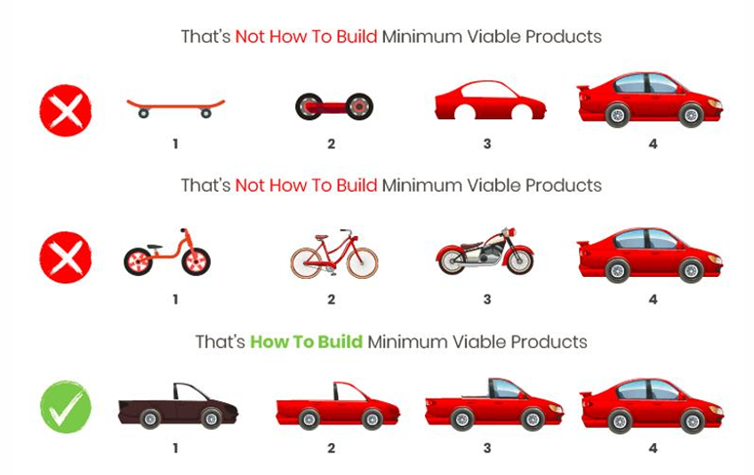

# MVP

## ¿Qué es un MVP (Producto Mínimo Viable)?

Es la versión más simple de un producto que permite lanzarlo rápidamente al mercado, con lo mínimo necesario para obtener retroalimentación real de los usuarios.

Su objetivo no es vender en masa desde el primer día, sino:

- Aprender rápidamente
- Validar una idea
- Reducir el riesgo de construir algo que nadie quiere

Un MVP es un producto que tiene suficientes características para satisfacer a los primeros usuarios, y a la vez, permite obtener información valiosa para desarrollar versiones futuras mejores.

## ¿Cómo construir un MVP?

1. Identificar necesidades del mercado

¿Qué problema real queremos resolver?
¿Existe una necesidad que nadie esté cubriendo bien?

Validar que haya una "herida" antes de aplicar la "curita".

2. Entender al público objetivo

¿A quién le duele ese problema?
¿Qué perfil tienen esas personas?

Dividilos en segmentos (por edad, profesión, hábitos, etc.) para diseñar algo que les sirva a los más críticos primero.

3. Seleccionar funcionalidades esenciales

Solo lo estrictamente necesario para resolver el problema mínimo.

Evitá el “modo perfección”: no se trata de hacer todo, sino de hacer lo que aporta valor real desde el primer uso.

4. Probar la reacción del público

Lanzá tu MVP a un grupo reducido de usuarios reales, conocidos como early adopters.

Obtené feedback directo: ¿Lo usan? ¿Les gusta? ¿Qué no entienden? ¿Qué cambiarían?

5. Analizar resultados

Observá lo que funciona y lo que no.

Aprendé de la experiencia y ajustá el rumbo.

Este es el punto clave de todo MVP: usar la información real para evolucionar.

## ¿Qué nos permite un MVP?

Un MVP bien planteado es una herramienta poderosa para reducir riesgos y aprender rápido.

✅ Validar si el producto es necesario
Evitás invertir tiempo y dinero en algo que nadie quiere o necesita.

✅ Detectar si hay usuarios dispuestos a usarlo o pagar
Te da un primer indicio de si hay demanda real y mercado dispuesto a pagar por tu solución.

✅ Mejorar diseño y funcionalidad
Podés centrarte solo en lo que genera valor, y dejar de lado lo que no aporta nada.

✅ Disminuir riesgo e incertidumbre
En lugar de lanzarte al vacío con una mega-inversión, empezás chico y aprendés en el camino.

✅ Construir comunidad con early adopters
Los primeros usuarios pueden volverse tus mejores promotores, si sienten que los escuchás y mejoras en base a sus ideas.

## Ejemplo real: El caso Amazon

¿Qué hizo Jeff Bezos? Aplicó el MVP antes de que existiera el término.

🧠 El problema:
¿La gente compraría productos por Internet? ¿Y si lo hacían, qué productos?

🧪 El experimento:

- Redujeron la idea a algo controlable: solo una categoría de producto, libros.
- Crearon un sitio web básico (Amazon.com).
- Publicaron una lista de libros.
- Cuando alguien hacía un pedido, Bezos compraba el libro en una librería local y lo enviaba por correo manualmente.

🤯 Lo interesante:

- No hubo almacenes, ni pasarela de pagos compleja, ni inteligencia artificial.
- Solo lo necesario para validar la idea: ¿la gente compra libros online?
- Y funcionó. Eso les generó ingresos y sobre todo: feedback de usuarios reales.

🔁 ¿Y después?

Amazon fue iterando en base a lo aprendido:

- Agregó más categorías.
- Automatizó los pedidos.
- Permitió comentarios, calificaciones y vendedores externos.
- Mejoró la logística y el sistema de pagos.

Siempre con foco en el cliente:

“La empresa más centrada en el cliente del mundo.”