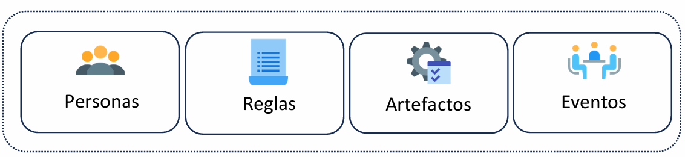
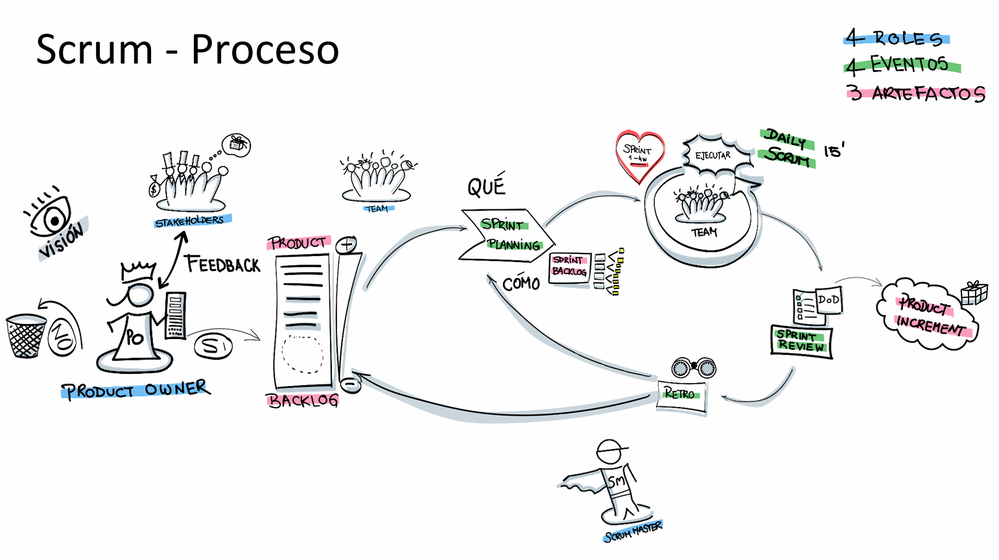
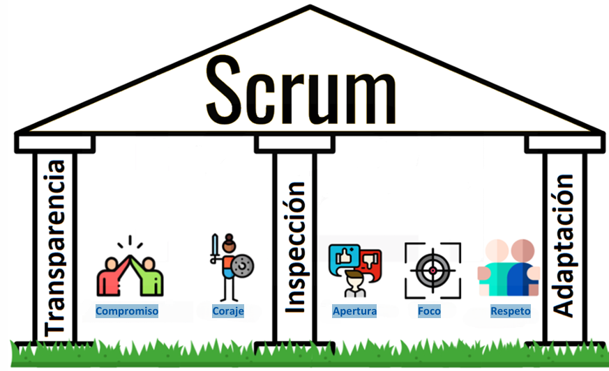

# Introducción

Scrum es un marco de trabajo ágil para el desarrollo de software, aunque también puede ser aplicado en otros campos que involucren proyectos complejos. Tiene sus raíces en los años 90, cuando Ken Schwaber y Jeff Sutherland, dos pioneros del desarrollo ágil, comenzaron a formular los conceptos que hoy conocemos como Scrum. Ambos firmaron el Manifiesto Ágil en 2001 y en 1995 presentaron un "paper" que describía la metodología, lo que finalmente llevó a la creación de la guía oficial de Scrum, que ha sido actualizada de forma regular, con una de sus últimas revisiones en julio de 2016.

A diferencia de metodologías más pesadas, Scrum es considerado un marco de trabajo liviano. Esto significa que se centra en los elementos esenciales y fundamentales para la gestión efectiva de proyectos, dejando espacio para la flexibilidad y la adaptación. Scrum tiene como objetivo generar valor de manera efectiva a través de soluciones adaptativas para problemas complejos, lo que lo hace ideal para proyectos de software que requieren constante evolución y mejora. Este enfoque es coherente con los principios del Manifiesto Ágil, ya que busca una colaboración cercana entre los miembros del equipo y con los clientes, entregar software funcional regularmente y adaptarse a los cambios a medida que surgen.

## ¿Cómo está compuesto Scrum?

Scrum se compone de cuatro elementos principales: personas, reglas, artefactos y eventos. Cada uno de estos elementos juega un rol fundamental en el éxito de la metodología.

### Personas

Las personas en Scrum son los roles clave que participan activamente en el proceso de desarrollo. Estos roles incluyen:

- Scrum Master: Es el facilitador del equipo, ayudando a eliminar obstáculos y garantizando que el proceso de Scrum se siga correctamente. El Scrum Master también actúa como protector del equipo, asegurándose de que las interrupciones externas no interfieran con el trabajo.

- Product Owner: Este rol está enfocado en la gestión del producto. El Product Owner es responsable de definir y priorizar las características que debe tener el producto, manteniendo una visión clara del producto final y de las necesidades del cliente. Se asegura de que el equipo de desarrollo esté trabajando en lo que aporta más valor.

- Equipo de Desarrollo: Este grupo está compuesto por profesionales que tienen las habilidades técnicas para construir el producto. Los miembros del equipo son autoorganizados y trabajan en conjunto para cumplir los objetivos del proyecto.

### Reglas

Las reglas de Scrum son las que guían la interacción de las personas y el uso de los artefactos y eventos. A través de estas reglas, se asegura que todos los miembros del equipo trabajen de manera alineada y colaborativa, respetando los principios ágiles. Estas reglas abarcan aspectos como la duración de los sprints, la priorización de tareas y la responsabilidad de cada rol.

### Artefactos

Los artefactos en Scrum son los elementos que ayudan a gestionar el trabajo y proporcionan la transparencia necesaria para tomar decisiones informadas. Los tres principales artefactos son:

- Product Backlog: Es una lista priorizada de todos los elementos que se necesitan para desarrollar el producto. El Product Owner es el responsable de mantener y ordenar esta lista. Esta lista puede cambiar a lo largo del tiempo, ya que siempre puede haber nuevos requisitos o ajustes de prioridades.

- Sprint Backlog: Es una lista de los elementos que el equipo de desarrollo ha seleccionado para trabajar durante el sprint actual. Este backlog se selecciona a partir del Product Backlog, y su objetivo es asegurar que el equipo de desarrollo se enfoque en las tareas más importantes.

- Incremento: Es la suma de todos los elementos completados durante el sprint. El incremento debe ser funcional y estar en condiciones de ser entregado al cliente si así se decide.

### Eventos

Scrum también tiene eventos clave que estructuran el trabajo del equipo. Estos eventos son las reuniones en las que se realiza la planificación, se revisan los avances y se inspecciona el proceso para asegurar que se está siguiendo correctamente. Los eventos más importantes son:

- Sprint: Es un ciclo de trabajo iterativo que tiene una duración fija (generalmente de 1 a 4 semanas). Durante este tiempo, el equipo de desarrollo trabaja en los elementos seleccionados del Sprint Backlog. Al final de cada Sprint, se entrega un incremento funcional del producto.

- Sprint Planning: Es una reunión al inicio de cada sprint donde el equipo planifica qué trabajo se realizará durante ese ciclo. Durante esta reunión, se definen los objetivos del sprint y los elementos específicos del Product Backlog que se tomarán para trabajar.

- Daily Scrum: Es una reunión diaria de 15 minutos donde el equipo de desarrollo se sincroniza. Cada miembro del equipo responde a tres preguntas: ¿Qué hice ayer? ¿Qué voy a hacer hoy? ¿Hay algún obstáculo? Esta reunión ayuda a mantener a todos en el mismo canal y a identificar problemas rápidamente.

- Sprint Review: Al final de cada sprint, se realiza una revisión en la que el equipo muestra el trabajo realizado al Product Owner y a otros interesados. Se discuten los avances, se obtiene feedback y se toman decisiones sobre los siguientes pasos.

- Sprint Retrospective: Es una reunión en la que el equipo reflexiona sobre el proceso utilizado durante el sprint. Se analizan lo que salió bien, lo que se puede mejorar y qué acciones se pueden tomar para optimizar el trabajo en el próximo sprint.

## Teoría de Scrum

Scrum está basado en tres pilares fundamentales: transparencia, inspección y adaptación.

- Transparencia: En Scrum, toda la información debe ser visible para todos los miembros del equipo, lo que ayuda a garantizar que se pueda tomar decisiones informadas. La transparencia se logra a través de los artefactos y eventos, donde todo el trabajo y el progreso son claramente visibles para todos.

- Inspección: Los miembros del equipo deben inspeccionar continuamente el progreso del trabajo y el proceso en general para identificar cualquier desviación que pueda impedir el logro de los objetivos del sprint. Esta inspección se realiza principalmente en los eventos de revisión y retrospectiva.

- Adaptación: A partir de la inspección, el equipo debe adaptarse a las circunstancias cambiantes. Si se identifican problemas o nuevas oportunidades, el equipo debe estar preparado para ajustar su enfoque y hacer cambios que mejoren el producto o el proceso.

Además, Scrum aplica principios de empirismo, lo que significa que todo el conocimiento y las decisiones deben basarse en la experiencia y la observación directa. En lugar de planificar todo de antemano, Scrum fomenta un enfoque adaptativo donde se toma decisiones basadas en lo que se ha aprendido de los incrementos previos.

Otro principio importante es el de Lean, que busca reducir el desperdicio y centrarse solo en lo esencial. Scrum está diseñado para maximizar la eficiencia y la efectividad del equipo, asegurando que se trabaje solo en lo que agrega valor al cliente.

## Valores de Scrum

Los valores fundamentales de Scrum son:

- Compromiso: Los miembros del equipo se comprometen a alcanzar los objetivos del sprint y a colaborar para lograr el éxito del proyecto.

- Coraje: El equipo debe tener el coraje de tomar decisiones difíciles y de enfrentar los problemas de frente.

- Apertura: La comunicación abierta es esencial, y todos los miembros del equipo deben compartir información relevante.

- Foco: El equipo debe mantenerse enfocado en los objetivos del sprint y evitar distracciones.

- Respeto: Cada miembro del equipo debe respetar a los demás, valorando sus habilidades y conocimientos.

