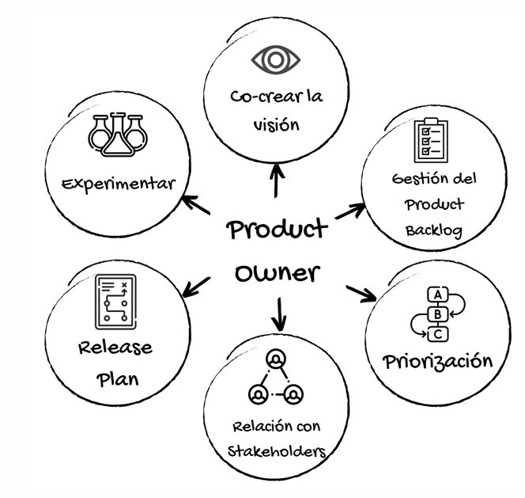
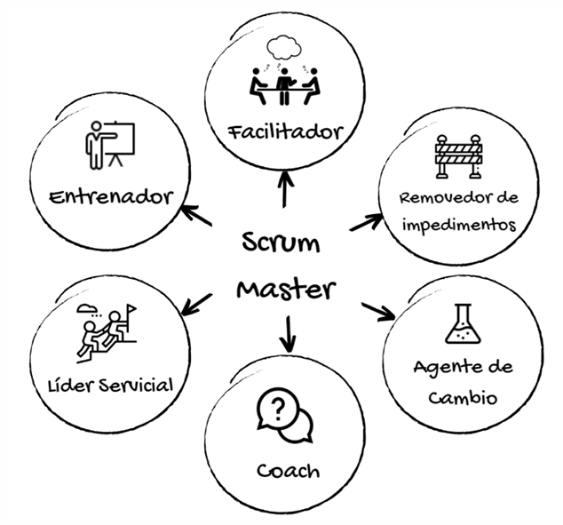

# Introducción

Scrum es un marco de trabajo ágil para el desarrollo de software, aunque también puede ser aplicado en otros campos que involucren proyectos complejos. Tiene sus raíces en los años 90, cuando Ken Schwaber y Jeff Sutherland, dos pioneros del desarrollo ágil, comenzaron a formular los conceptos que hoy conocemos como Scrum. Ambos firmaron el Manifiesto Ágil en 2001 y en 1995 presentaron un "paper" que describía la metodología, lo que finalmente llevó a la creación de la guía oficial de Scrum, que ha sido actualizada de forma regular, con una de sus últimas revisiones en julio de 2016.

A diferencia de metodologías más pesadas, Scrum es considerado un marco de trabajo liviano. Esto significa que se centra en los elementos esenciales y fundamentales para la gestión efectiva de proyectos, dejando espacio para la flexibilidad y la adaptación. Scrum tiene como objetivo generar valor de manera efectiva a través de soluciones adaptativas para problemas complejos, lo que lo hace ideal para proyectos de software que requieren constante evolución y mejora. Este enfoque es coherente con los principios del Manifiesto Ágil, ya que busca una colaboración cercana entre los miembros del equipo y con los clientes, entregar software funcional regularmente y adaptarse a los cambios a medida que surgen.

## ¿Cómo está compuesto Scrum?

Scrum se compone de cuatro elementos principales: personas, reglas, artefactos y eventos. Cada uno de estos elementos juega un rol fundamental en el éxito de la metodología.

### Personas

Las personas en Scrum son los roles clave que participan activamente en el proceso de desarrollo. Estos roles incluyen:

- Scrum Master: Es el facilitador del equipo, ayudando a eliminar obstáculos y garantizando que el proceso de Scrum se siga correctamente. El Scrum Master también actúa como protector del equipo, asegurándose de que las interrupciones externas no interfieran con el trabajo.

- Product Owner: Este rol está enfocado en la gestión del producto. El Product Owner es responsable de definir y priorizar las características que debe tener el producto, manteniendo una visión clara del producto final y de las necesidades del cliente. Se asegura de que el equipo de desarrollo esté trabajando en lo que aporta más valor.

- Equipo de Desarrollo: Este grupo está compuesto por profesionales que tienen las habilidades técnicas para construir el producto. Los miembros del equipo son autoorganizados y trabajan en conjunto para cumplir los objetivos del proyecto.

### Reglas

Las reglas de Scrum son las que guían la interacción de las personas y el uso de los artefactos y eventos. A través de estas reglas, se asegura que todos los miembros del equipo trabajen de manera alineada y colaborativa, respetando los principios ágiles. Estas reglas abarcan aspectos como la duración de los sprints, la priorización de tareas y la responsabilidad de cada rol.

### Artefactos

Los artefactos en Scrum son los elementos que ayudan a gestionar el trabajo y proporcionan la transparencia necesaria para tomar decisiones informadas. Los tres principales artefactos son:

- Product Backlog: Es una lista priorizada de todos los elementos que se necesitan para desarrollar el producto. El Product Owner es el responsable de mantener y ordenar esta lista. Esta lista puede cambiar a lo largo del tiempo, ya que siempre puede haber nuevos requisitos o ajustes de prioridades.

- Sprint Backlog: Es una lista de los elementos que el equipo de desarrollo ha seleccionado para trabajar durante el sprint actual. Este backlog se selecciona a partir del Product Backlog, y su objetivo es asegurar que el equipo de desarrollo se enfoque en las tareas más importantes.

- Incremento: Es la suma de todos los elementos completados durante el sprint. El incremento debe ser funcional y estar en condiciones de ser entregado al cliente si así se decide.

### Eventos

Scrum también tiene eventos clave que estructuran el trabajo del equipo. Estos eventos son las reuniones en las que se realiza la planificación, se revisan los avances y se inspecciona el proceso para asegurar que se está siguiendo correctamente. Los eventos más importantes son:

- Sprint: Es un ciclo de trabajo iterativo que tiene una duración fija (generalmente de 1 a 4 semanas). Durante este tiempo, el equipo de desarrollo trabaja en los elementos seleccionados del Sprint Backlog. Al final de cada Sprint, se entrega un incremento funcional del producto.

- Sprint Planning: Es una reunión al inicio de cada sprint donde el equipo planifica qué trabajo se realizará durante ese ciclo. Durante esta reunión, se definen los objetivos del sprint y los elementos específicos del Product Backlog que se tomarán para trabajar.

- Daily Scrum: Es una reunión diaria de 15 minutos donde el equipo de desarrollo se sincroniza. Cada miembro del equipo responde a tres preguntas: ¿Qué hice ayer? ¿Qué voy a hacer hoy? ¿Hay algún obstáculo? Esta reunión ayuda a mantener a todos en el mismo canal y a identificar problemas rápidamente.

- Sprint Review: Al final de cada sprint, se realiza una revisión en la que el equipo muestra el trabajo realizado al Product Owner y a otros interesados. Se discuten los avances, se obtiene feedback y se toman decisiones sobre los siguientes pasos.

- Sprint Retrospective: Es una reunión en la que el equipo reflexiona sobre el proceso utilizado durante el sprint. Se analizan lo que salió bien, lo que se puede mejorar y qué acciones se pueden tomar para optimizar el trabajo en el próximo sprint.

## Teoría de Scrum

Scrum está basado en tres pilares fundamentales: transparencia, inspección y adaptación.

- Transparencia: En Scrum, toda la información debe ser visible para todos los miembros del equipo, lo que ayuda a garantizar que se pueda tomar decisiones informadas. La transparencia se logra a través de los artefactos y eventos, donde todo el trabajo y el progreso son claramente visibles para todos.

- Inspección: Los miembros del equipo deben inspeccionar continuamente el progreso del trabajo y el proceso en general para identificar cualquier desviación que pueda impedir el logro de los objetivos del sprint. Esta inspección se realiza principalmente en los eventos de revisión y retrospectiva.

- Adaptación: A partir de la inspección, el equipo debe adaptarse a las circunstancias cambiantes. Si se identifican problemas o nuevas oportunidades, el equipo debe estar preparado para ajustar su enfoque y hacer cambios que mejoren el producto o el proceso.

Además, Scrum aplica principios de empirismo, lo que significa que todo el conocimiento y las decisiones deben basarse en la experiencia y la observación directa. En lugar de planificar todo de antemano, Scrum fomenta un enfoque adaptativo donde se toma decisiones basadas en lo que se ha aprendido de los incrementos previos.

Otro principio importante es el de Lean, que busca reducir el desperdicio y centrarse solo en lo esencial. Scrum está diseñado para maximizar la eficiencia y la efectividad del equipo, asegurando que se trabaje solo en lo que agrega valor al cliente.

## Valores de Scrum

Los valores fundamentales de Scrum son:

- Compromiso: Los miembros del equipo se comprometen a alcanzar los objetivos del sprint y a colaborar para lograr el éxito del proyecto.

- Coraje: El equipo debe tener el coraje de tomar decisiones difíciles y de enfrentar los problemas de frente.

- Apertura: La comunicación abierta es esencial, y todos los miembros del equipo deben compartir información relevante.

- Foco: El equipo debe mantenerse enfocado en los objetivos del sprint y evitar distracciones.

- Respeto: Cada miembro del equipo debe respetar a los demás, valorando sus habilidades y conocimientos.

## Roles

En Scrum, los roles son cruciales para garantizar el éxito de un equipo ágil y su capacidad para entregar incrementos de valor de manera efectiva. Cada rol tiene responsabilidades específicas y habilidades clave que ayudan a mantener el marco de trabajo en su curso. A continuación, vamos a profundizar en tres de los roles fundamentales en Scrum: Equipo de Desarrollo, Product Owner (PO) y Scrum Master (SM).

### Equipo de Desarrollo

El Equipo de Desarrollo es el grupo de personas que se comprometen a crear un aspecto del producto en cada sprint. Este equipo es multidisciplinario y cross-funcional, lo que significa que está compuesto por profesionales con habilidades diversas, como desarrolladores (Dev), diseñadores (Designer), y testers (QA), entre otros. Esto permite que el equipo pueda ser autoorganizado y capaz de abordar todas las tareas necesarias para completar los elementos del Product Backlog dentro de cada sprint.

#### Responsabilidades

El equipo de desarrollo tiene varias responsabilidades críticas para el éxito de Scrum:

- Crear el Sprint Backlog: Al inicio de cada sprint, el equipo de desarrollo se encarga de crear un plan detallado de las tareas que se llevarán a cabo durante el ciclo, seleccionando los elementos del Product Backlog que pueden completar dentro del tiempo estimado.

- Inculcar calidad: Esto implica adherirse a una Definición de Terminado (DoD), un conjunto de criterios que deben cumplirse para considerar que un trabajo está completo. Este concepto es esencial para mantener la consistencia y la calidad del producto.

- Adaptar el plan cada día: A medida que avanza el sprint, el equipo debe adaptarse a los cambios que surjan, haciendo ajustes para mantenerse alineado con el Objetivo del Sprint. Este es un proceso continuo, donde se observa el progreso diariamente y se toman decisiones para mejorar la eficiencia.

- Responsabilidad mutua: Los miembros del equipo son responsables entre sí por el trabajo que realizan, fomentando la colaboración y la transparencia. Todos deben comprometerse a contribuir al éxito del equipo y del proyecto en general.

No existen sub-equipos dentro del equipo de desarrollo. Todo el grupo debe colaborar en conjunto y compartir la responsabilidad del resultado final. Además, los equipos de desarrollo en Scrum son pequeños, con una recomendación de no más de 7 personas, más o menos 2, para mantener la comunicación fluida y la efectividad en el trabajo.

### Product Owner (PO)

El Product Owner es el responsable de maximizar el valor del producto que está siendo desarrollado. Este rol se centra en garantizar que el equipo de desarrollo esté trabajando en las tareas más valiosas y alineadas con los objetivos del negocio y las expectativas de los stakeholders. Es el responsable de gestionar el Product Backlog, priorizando los elementos de manera que el equipo trabaje siempre en lo más importante.

#### Responsabilidades

El Product Owner tiene varias responsabilidades críticas:

- Desarrollar y comunicar el Objetivo del Producto: El Product Owner debe tener una visión clara del producto final y ser capaz de comunicar esta visión de manera explícita al equipo y a los stakeholders, para asegurarse de que todos estén alineados.

- Gestionar el Product Backlog: El Product Owner es responsable de crear, mantener y ordenar los elementos en el Product Backlog. Esto incluye la adición de nuevos elementos y la modificación o eliminación de los existentes según cambien las necesidades del negocio.

- Asegurar la transparencia: El Product Owner debe asegurarse de que el Product Backlog sea transparente y visible para todos los miembros del equipo y stakeholders. También debe ser entendido por todos, asegurando que el equipo tenga la información adecuada para realizar su trabajo.

- Delegación y responsabilidad: Aunque el Product Owner puede delegar tareas, como la recolección de información o la gestión de stakeholders, sigue siendo el responsable de garantizar que el trabajo del equipo sea efectivo. Esto incluye la toma de decisiones relacionadas con el contenido y la prioridad del Product Backlog.

#### Habilidades necesarias

El Product Owner debe tener varias habilidades clave para desempeñar su rol con eficacia:

- Mentalidad MVP (Producto Mínimo Viable): Es fundamental que el Product Owner tenga una mentalidad orientada a entregar rápidamente un producto funcional, de manera que se pueda empezar a obtener feedback y realizar mejoras tempranas.

- Negociación: El Product Owner necesita negociar entre los diferentes stakeholders y el equipo de desarrollo, priorizando las tareas que aporten mayor valor.

- Comprensión de la competencia: Debe tener un buen conocimiento del mercado y la competencia para asegurarse de que el producto se mantenga competitivo.

- Comunicación y colaboración: Un Product Owner debe ser un excelente comunicador, capaz de mantener informados a todos los involucrados y de fomentar la colaboración continua.

#### Disfunciones comunes del Product Owner

- No tomar posesión del producto: Algunos Product Owners fallan en comprometerse completamente con el producto, actuando más como un "espectador" en lugar de como un Owner real.

- El PO que toma posesión del equipo: A veces, un Product Owner asume un rol demasiado controlador, queriendo tomar todas las decisiones, incluyendo las que corresponderían al Scrum Master o al equipo de desarrollo. Esto puede generar conflictos de roles.

- El PO que es posesión de un stakeholder: Este tipo de Product Owner actúa como un "secretario", esperando la aprobación de un superior antes de tomar decisiones, lo que puede obstaculizar el progreso y la autonomía del equipo.

### Scrum Master (SM)

El Scrum Master es el facilitador del equipo Scrum. Su rol principal es garantizar que los principios y prácticas de Scrum se implementen correctamente y que el equipo sea capaz de trabajar de manera eficiente. A diferencia del Product Owner, que está más centrado en el qué hacer, el Scrum Master está enfocado en el cómo y en garantizar que el equipo se autoorganice para lograr los objetivos.

#### Responsabilidades

El Scrum Master tiene diversas responsabilidades dentro del equipo:

- Facilitador: Se asegura de que todos los eventos de Scrum (Daily Scrum, Sprint Planning, Sprint Review, Sprint Retrospective) se lleven a cabo de manera eficiente, productiva y dentro del tiempo asignado. También fomenta una comunicación abierta y efectiva entre los miembros del equipo y los stakeholders.

- Eliminar impedimentos: El Scrum Master debe trabajar para eliminar cualquier obstáculo que impida al equipo avanzar, ya sea técnico, organizacional o de cualquier otro tipo.

- Guía hacia la autogestión y multifuncionalidad: Ayuda al equipo a volverse más autónomo y multifuncional, promoviendo la colaboración y el aprendizaje dentro del equipo. Esto fomenta la capacidad del equipo para adaptarse rápidamente a los cambios y tomar decisiones sin depender de instrucciones externas.

- Apoyo al Product Owner: El Scrum Master colabora estrechamente con el Product Owner, ayudando a gestionar el Product Backlog y garantizando que el equipo se enfoque en las tareas de mayor valor.

- Fomentar la mejora continua: Trabaja con el equipo para identificar áreas de mejora y fomentar una cultura de aprendizaje continuo.

#### Habilidades necesarias

Al igual que el Product Owner, el Scrum Master debe poseer una serie de habilidades clave:

- Facilitación y liderazgo: El Scrum Master debe ser un líder servicial que guíe al equipo, facilitando la resolución de problemas y la toma de decisiones.

- Empatía y resolución de conflictos: Es importante que el Scrum Master sea capaz de entender las necesidades de los miembros del equipo y resolver los conflictos de manera que se mantenga la armonía y la productividad.

- Coaching y mentoría: Debe ser capaz de entrenar y guiar al equipo para mejorar continuamente, ayudándoles a adaptarse a los principios de Scrum.

- Mentalidad de mejora continua: El Scrum Master debe ser un defensor de la mejora continua, tanto para el equipo como para la organización.

#### Disfunciones comunes del Scrum Master

- Perder un gran técnico y ganar un pésimo Scrum Master: Esto ocurre cuando un técnico experto es asignado al rol de Scrum Master sin las habilidades necesarias de facilitación y liderazgo.

- El Héroe: El Scrum Master asume un rol demasiado dominante, tomando decisiones y resolviendo problemas en lugar de facilitar que el equipo los resuelva por sí mismo.

- Estar ausente: Cuando el Scrum Master no está disponible para el equipo, lo que puede suceder si la organización no valora adecuadamente este rol o si el Scrum Master tiene que manejar demasiados equipos.

- El “Padrino”: Cuando el Scrum Master se convierte en el jefe del equipo, tomando decisiones autoritarias, en lugar de actuar como un líder servicial.

- "Cada uno en su sitio": El Scrum Master se acomoda en una situación en la que no se toman acciones para resolver problemas dentro del equipo o la organización, lo que puede llevar a una falta de progreso.