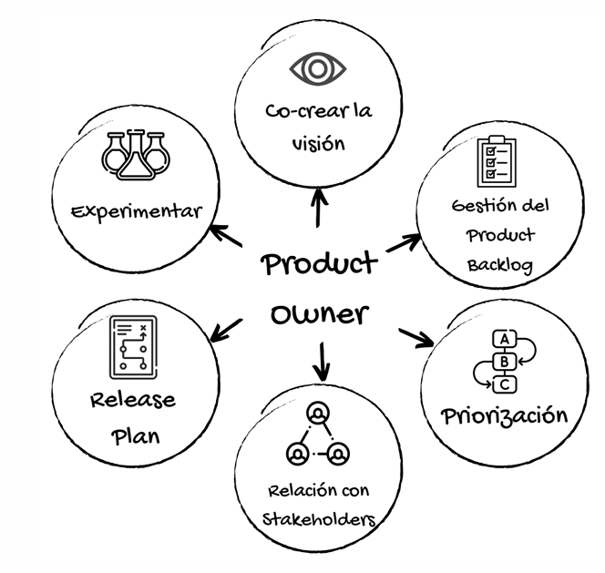
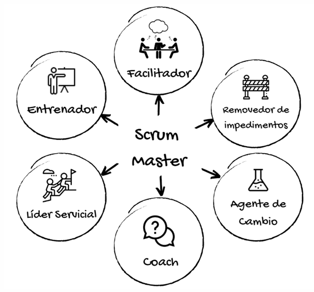

# Roles

En Scrum, los roles son cruciales para garantizar el éxito de un equipo ágil y su capacidad para entregar incrementos de valor de manera efectiva. Cada rol tiene responsabilidades específicas y habilidades clave que ayudan a mantener el marco de trabajo en su curso. A continuación, vamos a profundizar en tres de los roles fundamentales en Scrum: Equipo de Desarrollo, Product Owner (PO) y Scrum Master (SM).

## Equipo de Desarrollo

El Equipo de Desarrollo es el grupo de personas que se comprometen a crear un aspecto del producto en cada sprint. Este equipo es multidisciplinario y cross-funcional, lo que significa que está compuesto por profesionales con habilidades diversas, como desarrolladores (Dev), diseñadores (Designer), y testers (QA), entre otros. Esto permite que el equipo pueda ser autoorganizado y capaz de abordar todas las tareas necesarias para completar los elementos del Product Backlog dentro de cada sprint.

### Responsabilidades

El equipo de desarrollo tiene varias responsabilidades críticas para el éxito de Scrum:

- Crear el Sprint Backlog: Al inicio de cada sprint, el equipo de desarrollo se encarga de crear un plan detallado de las tareas que se llevarán a cabo durante el ciclo, seleccionando los elementos del Product Backlog que pueden completar dentro del tiempo estimado.

- Inculcar calidad: Esto implica adherirse a una Definición de Terminado (DoD), un conjunto de criterios que deben cumplirse para considerar que un trabajo está completo. Este concepto es esencial para mantener la consistencia y la calidad del producto.

- Adaptar el plan cada día: A medida que avanza el sprint, el equipo debe adaptarse a los cambios que surjan, haciendo ajustes para mantenerse alineado con el Objetivo del Sprint. Este es un proceso continuo, donde se observa el progreso diariamente y se toman decisiones para mejorar la eficiencia.

- Responsabilidad mutua: Los miembros del equipo son responsables entre sí por el trabajo que realizan, fomentando la colaboración y la transparencia. Todos deben comprometerse a contribuir al éxito del equipo y del proyecto en general.

No existen sub-equipos dentro del equipo de desarrollo. Todo el grupo debe colaborar en conjunto y compartir la responsabilidad del resultado final. Además, los equipos de desarrollo en Scrum son pequeños, con una recomendación de no más de 7 personas, más o menos 2, para mantener la comunicación fluida y la efectividad en el trabajo.

## Product Owner (PO)

El Product Owner es el responsable de maximizar el valor del producto que está siendo desarrollado. Este rol se centra en garantizar que el equipo de desarrollo esté trabajando en las tareas más valiosas y alineadas con los objetivos del negocio y las expectativas de los stakeholders. Es el responsable de gestionar el Product Backlog, priorizando los elementos de manera que el equipo trabaje siempre en lo más importante.

### Responsabilidades

El Product Owner tiene varias responsabilidades críticas:

- Desarrollar y comunicar el Objetivo del Producto: El Product Owner debe tener una visión clara del producto final y ser capaz de comunicar esta visión de manera explícita al equipo y a los stakeholders, para asegurarse de que todos estén alineados.

- Gestionar el Product Backlog: El Product Owner es responsable de crear, mantener y ordenar los elementos en el Product Backlog. Esto incluye la adición de nuevos elementos y la modificación o eliminación de los existentes según cambien las necesidades del negocio.

- Asegurar la transparencia: El Product Owner debe asegurarse de que el Product Backlog sea transparente y visible para todos los miembros del equipo y stakeholders. También debe ser entendido por todos, asegurando que el equipo tenga la información adecuada para realizar su trabajo.

- Delegación y responsabilidad: Aunque el Product Owner puede delegar tareas, como la recolección de información o la gestión de stakeholders, sigue siendo el responsable de garantizar que el trabajo del equipo sea efectivo. Esto incluye la toma de decisiones relacionadas con el contenido y la prioridad del Product Backlog.

### Habilidades necesarias

El Product Owner debe tener varias habilidades clave para desempeñar su rol con eficacia:

- Mentalidad MVP (Producto Mínimo Viable): Es fundamental que el Product Owner tenga una mentalidad orientada a entregar rápidamente un producto funcional, de manera que se pueda empezar a obtener feedback y realizar mejoras tempranas.

- Negociación: El Product Owner necesita negociar entre los diferentes stakeholders y el equipo de desarrollo, priorizando las tareas que aporten mayor valor.

- Comprensión de la competencia: Debe tener un buen conocimiento del mercado y la competencia para asegurarse de que el producto se mantenga competitivo.

- Comunicación y colaboración: Un Product Owner debe ser un excelente comunicador, capaz de mantener informados a todos los involucrados y de fomentar la colaboración continua.

### Disfunciones comunes del Product Owner

- No tomar posesión del producto: Algunos Product Owners fallan en comprometerse completamente con el producto, actuando más como un "espectador" en lugar de como un Owner real.

- El PO que toma posesión del equipo: A veces, un Product Owner asume un rol demasiado controlador, queriendo tomar todas las decisiones, incluyendo las que corresponderían al Scrum Master o al equipo de desarrollo. Esto puede generar conflictos de roles.

- El PO que es posesión de un stakeholder: Este tipo de Product Owner actúa como un "secretario", esperando la aprobación de un superior antes de tomar decisiones, lo que puede obstaculizar el progreso y la autonomía del equipo.

## Scrum Master (SM)

El Scrum Master es el facilitador del equipo Scrum. Su rol principal es garantizar que los principios y prácticas de Scrum se implementen correctamente y que el equipo sea capaz de trabajar de manera eficiente. A diferencia del Product Owner, que está más centrado en el qué hacer, el Scrum Master está enfocado en el cómo y en garantizar que el equipo se autoorganice para lograr los objetivos.

### Responsabilidades

El Scrum Master tiene diversas responsabilidades dentro del equipo:

- Facilitador: Se asegura de que todos los eventos de Scrum (Daily Scrum, Sprint Planning, Sprint Review, Sprint Retrospective) se lleven a cabo de manera eficiente, productiva y dentro del tiempo asignado. También fomenta una comunicación abierta y efectiva entre los miembros del equipo y los stakeholders.

- Eliminar impedimentos: El Scrum Master debe trabajar para eliminar cualquier obstáculo que impida al equipo avanzar, ya sea técnico, organizacional o de cualquier otro tipo.

- Guía hacia la autogestión y multifuncionalidad: Ayuda al equipo a volverse más autónomo y multifuncional, promoviendo la colaboración y el aprendizaje dentro del equipo. Esto fomenta la capacidad del equipo para adaptarse rápidamente a los cambios y tomar decisiones sin depender de instrucciones externas.

- Apoyo al Product Owner: El Scrum Master colabora estrechamente con el Product Owner, ayudando a gestionar el Product Backlog y garantizando que el equipo se enfoque en las tareas de mayor valor.

- Fomentar la mejora continua: Trabaja con el equipo para identificar áreas de mejora y fomentar una cultura de aprendizaje continuo.

### Habilidades necesarias

Al igual que el Product Owner, el Scrum Master debe poseer una serie de habilidades clave:

- Facilitación y liderazgo: El Scrum Master debe ser un líder servicial que guíe al equipo, facilitando la resolución de problemas y la toma de decisiones.

- Empatía y resolución de conflictos: Es importante que el Scrum Master sea capaz de entender las necesidades de los miembros del equipo y resolver los conflictos de manera que se mantenga la armonía y la productividad.

- Coaching y mentoría: Debe ser capaz de entrenar y guiar al equipo para mejorar continuamente, ayudándoles a adaptarse a los principios de Scrum.

- Mentalidad de mejora continua: El Scrum Master debe ser un defensor de la mejora continua, tanto para el equipo como para la organización.

### Disfunciones comunes del Scrum Master

- Perder un gran técnico y ganar un pésimo Scrum Master: Esto ocurre cuando un técnico experto es asignado al rol de Scrum Master sin las habilidades necesarias de facilitación y liderazgo.

- El Héroe: El Scrum Master asume un rol demasiado dominante, tomando decisiones y resolviendo problemas en lugar de facilitar que el equipo los resuelva por sí mismo.

- Estar ausente: Cuando el Scrum Master no está disponible para el equipo, lo que puede suceder si la organización no valora adecuadamente este rol o si el Scrum Master tiene que manejar demasiados equipos.

- El “Padrino”: Cuando el Scrum Master se convierte en el jefe del equipo, tomando decisiones autoritarias, en lugar de actuar como un líder servicial.

- "Cada uno en su sitio": El Scrum Master se acomoda en una situación en la que no se toman acciones para resolver problemas dentro del equipo o la organización, lo que puede llevar a una falta de progreso.