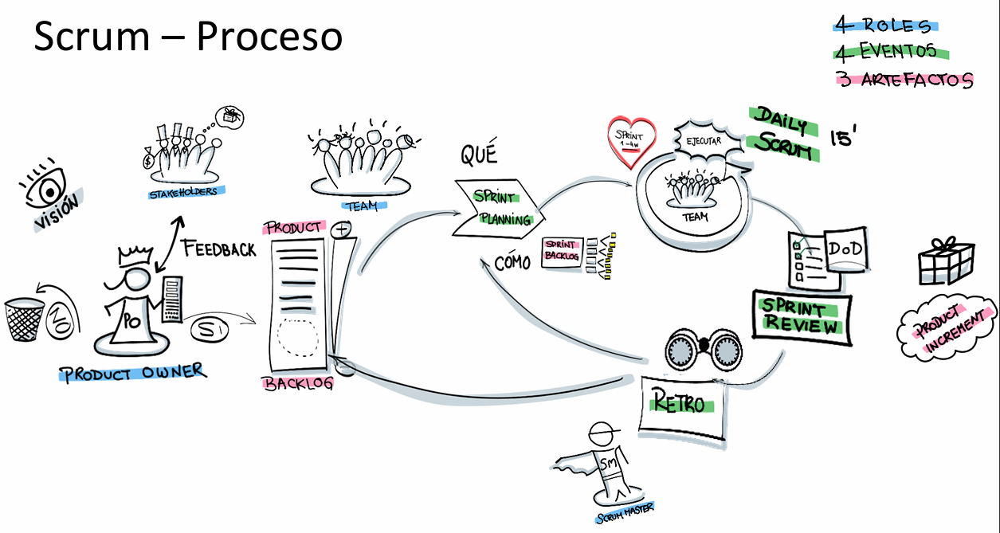

# Ceremonias

Scrum se articula en torno a un conjunto de eventos formalizados—llamados ceremonias—que facilitan la transparencia, la inspección y la adaptación del trabajo. Cada ceremonia cumple un propósito específico dentro del ciclo iterativo del Sprint, y su correcta ejecución contribuye a alinear al equipo, maximizar el valor entregado y mejorar continuamente el proceso. A continuación, se desarrolla en profundidad cada una de estas ceremonias.

## 1. Sprint Planning

El Sprint Planning abre formalmente cada Sprint y marca el punto de partida para que el equipo transforme las ideas del Product Backlog en un incremento de producto potencialmente entregable. Suele durar de 2 a 8 horas segun el tamaño del sprint. Su desarrollo abarca tres grandes preguntas:

- ¿Cómo genera valor este Sprint?
- ¿Qué haremos durante este Sprint?
- ¿Cómo haremos ese trabajo?

### ¿Cómo genera valor el Sprint?

En primer lugar, el Product Owner expone las posibles mejoras o funcionalidades que podrían incorporarse al producto, basándose en la visión estratégica, las necesidades de los stakeholders y el feedback acumulado. A partir de estas propuestas, el Scrum Team colabora para definir un Sprint Goal (objetivo del Sprint), que debe expresar de forma clara y concisa el porqué de las decisiones tomadas y el valor esperado al final del período. Este objetivo funciona como la brújula del equipo: proporciona foco, motiva y guía la toma de decisiones durante el desarrollo.

### ¿Qué haremos durante este Sprint?

Con el Sprint Goal como faro, el equipo debate junto al Product Owner para seleccionar del Product Backlog aquellos Product Backlog Items (PBIs) que, si se completan, conseguirán alcanzar dicho objetivo. En esta fase, el equipo puede refinar estos ítems para aclarar detalles, descomponer historias complejas y elevar el nivel de confianza en su estimación y ejecución. Los principales insumos para esta selección incluyen:

- Conocimientos y lecciones aprendidas de Sprints anteriores.
- Velocidad o rendimiento histórico del equipo (velocidad).
- La Definition of Done, que delimita cuándo un PBI puede considerarse completado.
- La capacidad disponible del equipo según sus compromisos y feriados.

### ¿Cómo haremos ese trabajo?

Una vez seleccionados los ítems, el equipo de Desarrollo planifica, ítem por ítem, las tareas y actividades necesarias para satisfacer la Definition of Done. Es un plan detallado de cómo se va a materializar cada funcionalidad o mejora: diseño, codificación, pruebas, documentación y cualquier paso adicional. Importante: ninguna figura externa impone la manera de hacer el trabajo, pues el equipo es autoorganizado y decide sus propias prácticas. El resultado de esta planificación, junto con el Sprint Goal y los PBIs escogidos, conforma el Sprint Backlog, un artefacto vivo que se irá ajustando conforme avance el Sprint.

### Sprint Goal

El Sprint Goal es el corazón de la planificación. Se trata de un enunciado breve que:

- Resume el objetivo más importante a cumplir en el Sprint.
- Es alcanzable mediante un conjunto coherente de PBIs.
- Puede representar una nueva funcionalidad, la mejora de un flujo, o cualquier resultado que aporte valor tangible.
- Sirve de criterio de decisión cuando surgen impedimentos o cambios: si una actividad no contribuye al Sprint Goal, pierde prioridad.
- Refuerza el sentido de propósito y cohesión en el Development Team.

Con el paso de varios Sprint Plannings, el equipo suele experimentar beneficios palpables: mayor productividad gracias a la comunicación fluida y la creación de sinergias; mayor compromiso con el objetivo común; una mejor autorregulación de la velocidad de entrega y una incertidumbre reducida gracias a estimaciones consensuadas.

## 2. Daily Scrum

La Daily Scrum es la reunión diaria de inspección y adaptación más breve y concentrada de Scrum. Su objetivo esencial es verificar el progreso hacia el Sprint Goal, permitir la identificación temprana de impedimentos y ajustar el plan de trabajo para las próximas veinticuatro horas.

Aunque frecuentemente se asocia a un formato de tres preguntas (“¿Qué hice ayer?”, “¿Qué haré hoy?”, “¿Qué impedimentos tengo?”), lo imprescindible es que cada miembro del equipo comparta un breve diagnóstico de su estado y coordine acciones con el resto. Tradicionalmente dura 15 minutos y se celebra a la misma hora y lugar cada día, pero son el equipo y sus circunstancias (por ejemplo, el teletrabajo) quienes deciden el momento que mejor les funcione, siempre manteniendo la constancia horaria.

### Mitos y verdades frecuentes

“Debe hacerse siempre a primera hora.”

Verdad parcial: no es obligatorio madrugar; el equipo elige el horario que maximice la asistencia y energía, y se compromete a respetarlo.

“Debe hacerse de pie.”

Mito razonable: de pie puede ayudar a ser más breve, pero no es un requisito. En remoto, pueden adaptarlo a videollamadas.

“La duración depende del número de personas.”

Mito: 15 minutos es el máximo, independientemente del tamaño del equipo.

“Cada persona habla máximo 3 minutos.”

Mito: la reunión no está acotada por persona, sino por el total.

“Deben asistir Scrum Master y Product Owner.”

Mito: solo el Development Team tiene que participar. SM y PO pueden unirse como oyentes si aportan valor.

“El objetivo es responder las tres preguntas estándar.”

Mito: esas preguntas son una técnica, no la esencia. El foco es inspeccionar el Sprint Goal y adaptar el plan.

“Es el único espacio para actualizar el estado de las historias.”

Mito: los tableros o dashboards se actualizan constantemente; la Daily es para alinear al equipo, no para reportes formales.

### Técnicas de dinamización

Para que la Daily Scrum no caiga en la rutina o se extienda excesivamente, algunos equipos aplican técnicas sencillas:

- Pelota de intervención: un objeto que se lanza al orador, garantizando que todos presten atención.
- Tótem de palabra: un objeto que indica quién tiene el turno de hablar y previene interrupciones.
- Cronómetro visible: un reloj o temporizador que marca el límite de 15 minutos, fomentando la conciencia del tiempo.

## 3. Sprint Review

La Sprint Review es el evento de inspección del incremento de producto al concluir el Sprint. Organizada y facilitada por el Product Owner, reúne al Scrum Team y a los Stakeholders clave para:

- Mostrar el incremento desarrollado, de forma transparente y orientada a demostrar cómo cumple la Definition of Done.
- Recoger feedback inmediato que ayude a determinar qué está realmente listo y qué posibles mejoras o ajustes conviene incorporar.
- Adaptar el Product Backlog, agregando nuevos ítems o reordenando prioridades según lo aprendido y las oportunidades detectadas.

Muy distinto a un simple “estado de avance”, la Sprint Review busca generar un diálogo constructivo sobre qué funcionó, qué problemas surgieron y cómo se resolvieron. Además, establece las bases de información y alineación para el próximo Sprint Planning, garantizando que todos comparten una visión actualizada del producto y del camino a seguir. Su duración típica oscila entre 1 y 4 horas, ajustada al tamaño del Sprint y la complejidad del trabajo.

## 4. Retrospective Meeting

La Retrospective cierra el ciclo del Sprint y se centra en la mejora continua del proceso y la colaboración. Convoca exclusivamente al Scrum Team para reflexionar sobre:

- Aspectos que funcionaron bien, para reforzarlos.
- Problemas o áreas de mejora, incluyendo dinámicas de equipo, herramientas y prácticas.
- Lecciones aprendidas, que puedan transferirse a futuros Sprints.

A partir de este análisis, el equipo prioriza los desafíos detectados y define un plan de acción concreto, con tareas o experimentos que se implementarán en el siguiente Sprint. Este enfoque sistemático de inspección y adaptación fomenta la alta motivación del equipo, incrementa la calidad del producto y fortalece las relaciones interpersonales. La Retrospective suele durar entre 1 y 3 horas, en función de la duración del Sprint y de la madurez del equipo.

