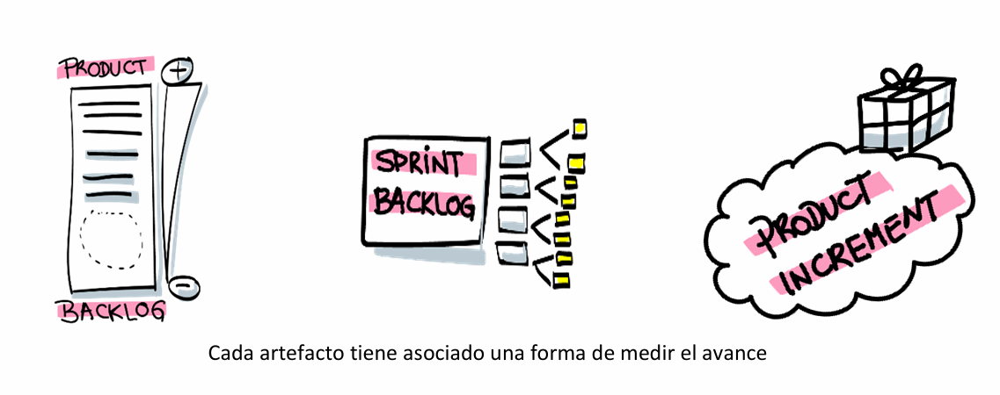

# Artefactos

En Scrum, los artefactos son los repositorios de información que permiten al equipo inspeccionar el estado del producto y del trabajo planificado, así como adaptar su enfoque conforme avanza el proyecto. Cada artefacto no solo contiene datos esenciales, sino que incorpora mecanismos para medir el progreso y asegurar la transparencia. A continuación se desarrollan en detalle los cuatro conceptos clave: Product Backlog, Refinamiento, Sprint Backlog e Incremento de Producto.

## Product Backlog

El Product Backlog es la lista ordenada de todo aquello que podría mejorar el producto: funcionalidades, correcciones, mejoras técnicas o cualquier elemento que aporte valor. Esta lista es dinámica, pues evoluciona constantemente según cambian las prioridades del negocio, el feedback de los usuarios y el aprendizaje que el equipo adquiere durante el desarrollo. 

La responsabilidad de mantener el Product Backlog recae íntegramente en el Product Owner, quien define la descripción de cada ítem, asigna una prioridad basada en el valor para el negocio y aprueba las estimaciones proporcionadas por el Development Team. Estas estimaciones, junto con la velocidad histórica del equipo (velocidad del equipo), permiten dimensionar con realismo el alcance de los Sprints futuros y medir el avance global: a medida que los ítems se completan, el Product Backlog se reduce y el equipo compara el trabajo realizado contra la capacidad para ajustar el rumbo.

El Product Goal complementa al Product Backlog como un horizonte compartido: describe un estado futuro del producto al que todas las Stories apuntan. Está formulado de manera que sirva como referencia para el equipo al seleccionar y refinar elementos, asegurando coherencia entre lo que se planifica y la visión estratégica. Cada vez que el Product Goal cambia, el backlog se reordena, y el Product Owner revisa las prioridades para alinear el trabajo a la nueva meta. Así, el Product Backlog no es solo una lista de requerimientos, sino el reflejo vivo de la estrategia de producto y el indicador más claro de cuánto queda por hacer para alcanzarla.

### Refinamiento (Backlog Refinement)

El Refinamiento es la actividad continua mediante la cual el Scrum Team toma ítems del Product Backlog y los descompone en unidades más pequeñas, precisas y comprendidas por todos. No es un evento formal del marco de Scrum, sino una práctica recomendada que puede ocurrir tanto dentro de las ceremonias existentes (por ejemplo, durante el Sprint Review o el Sprint Planning) como en sesiones dedicadas. El objetivo es agregar detalles—criterios de aceptación, casos de uso, dependencias—y ajustar las estimaciones de esfuerzo, de modo que al llegar la planificación del Sprint, el equipo disponga de PBIs “resultado de calidad”, listos para comprometerse con ellos.

Medir el avance del refinamiento se traduce en evaluar el grado de preparación de los ítems (Ready State) y la estabilidad de las estimaciones frente al cambio de requisitos. Cuando el porcentaje de ítems refinados hasta un nivel de detalle adecuado es alto, el Sprint Planning fluye con mayor rapidez y el riesgo de replanificación posterior disminuye. De esa manera, el refinamiento se convierte en un termómetro de la salud del backlog y en un motor de eficiencia para la planificación.

## Sprint Backlog

El Sprint Backlog es el plan de trabajo que el Scrum Team se autoimpone para alcanzar el Sprint Goal durante el Sprint. Consta de tres elementos inseparables: 

- el objetivo del Sprint (por qué), 
- los PBIs seleccionados (qué) 
- el conjunto de tareas o actividades necesarias –el plan accionable– para entregar un incremento que cumpla la Definition of Done (cómo). 

A diferencia del Product Backlog, el Sprint Backlog es propiedad exclusiva del Development Team: ellos deciden cómo dividir cada PBI en tareas de diseño, desarrollo, pruebas y documentación.

Como foto en tiempo real, el Sprint Backlog se actualiza constantemente: las tareas que se completan se marcan como terminadas, las nuevas tareas surgidas para afrontar imprevistos se agregan y, si el trabajo evoluciona de manera distinta a lo estimado, el Development Team y el Product Owner negocian ajustar el alcance (sin modificar el Sprint Goal). El progreso se puede medir mediante un burndown chart, que muestra la cantidad de trabajo restante en función del tiempo transcurrido, facilitando la detección temprana de desviaciones y promoviendo la adaptación del plan.

## Incremento de Producto

El Incremento de Producto es el resultado tangible y utilizable de un Sprint. Cada PBI completado que cumple la Definition of Done se suma a los incrementos previos, asegurando integración continua y calidad constante. Un incremento debe ser potencialmente entregable al mercado o a un entorno de pruebas reales: no se trata de prototipos, sino de software o componentes que funcionan, documentados y probados de acuerdo a los criterios acordados.

En un mismo Sprint pueden generarse múltiples incrementos (por ejemplo, varios microservicios o módulos de interfaz), pero al final del Sprint se presenta como un único incremento coherente en la Sprint Review, donde se inspecciona su cumplimiento y se obtiene feedback de los stakeholders. Solo aquello que cumpla la Definition of Done —que abarca pruebas unitarias, revisión de código, documentación, despliegue automatizado, etc.— se considera parte del incremento. De este modo, el incremento es la unidad de medida real del avance del proyecto: la suma de los incrementos completados frente al Product Goal revela el ritmo de entrega de valor efectivo.

