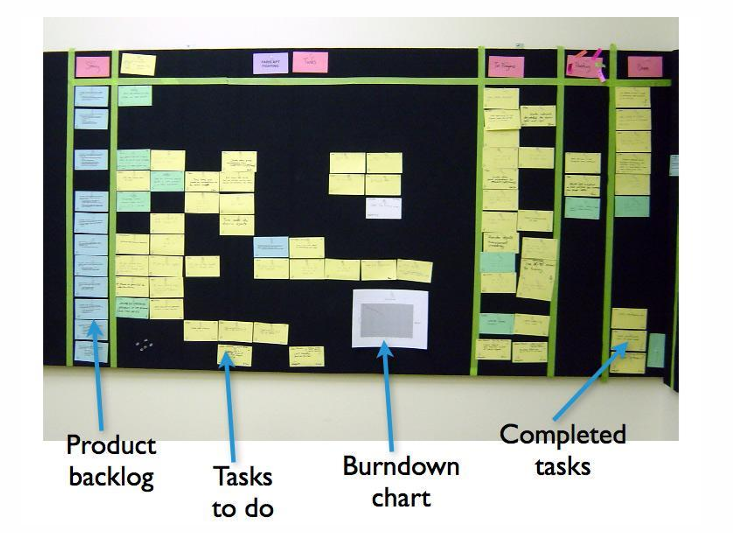
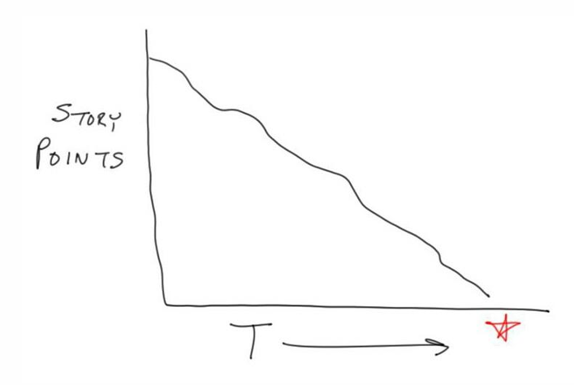

# Herramientas

## Scrum Board

El Scrum Board es la representación visual del Sprint Backlog, diseñada para mostrar de un vistazo el estado de cada tarea o historia de usuario conforme avanza el Sprint. Tradicionalmente consiste en columnas que reflejan el flujo de trabajo (por ejemplo, “Por hacer”, “En curso”, “Hecho”), sobre las cuales se colocan tarjetas que representan actividades específicas. Este tablero puede ser físico (pizarras con post-its) o digital (herramientas online como Jira, Trello o Azure DevOps). Su principal valor radica en la visibilidad: todo el equipo puede ver en tiempo real qué tareas avanzan correctamente y dónde surgen cuellos de botella. Además, promueve la colaboración y la responsabilidad compartida, pues cada miembro actualiza su propio progreso y, a su vez, identifica dónde podría ayudar a otro compañero para cumplir el Sprint Goal. Sobre este soporte visual, el Scrum Master facilita la detección temprana de impedimentos durante la Daily Scrum y el equipo en su conjunto ajusta el plan de trabajo para mantener el ritmo acordado.

## Burndown Chart

El Burndown Chart es una herramienta de medición gráfica que muestra la cantidad de trabajo pendiente frente al tiempo restante del Sprint. En el eje vertical se suele representar el esfuerzo total (en horas, puntos de historia o unidades de trabajo), mientras que en el eje horizontal aparecen los días del Sprint. Cada jornada, el equipo registra el esfuerzo que queda por completar, generando una curva descendente (“burndown”) que se compara con la línea ideal de progreso. Esta comparación permite detectar rápidamente si el equipo va por delante o por detrás respecto a lo planificado. Si la línea real se sitúa por encima de la ideal, se encienden señales de alerta para revisar prioridades, redistribuir tareas o identificar impedimentos que estén ralentizando el flujo. De este modo, el Burndown Chart no solo cuantifica el avance, sino que empodera al equipo para inspeccionar y adaptar su trabajo de forma continua.

## Paquetes de software para metodologías ágiles

Existe un amplio ecosistema de aplicaciones que soportan metodologías ágiles, desde soluciones comerciales con licenciamiento hasta plataformas completamente gratuitas o de código abierto. Las herramientas de pago suelen ofrecer integraciones empresariales, soporte técnico y funcionalidades avanzadas de reporte; mientras que las opciones open source brindan flexibilidad para adaptarlas y menor coste de entrada. Independientemente de la opción elegida, es crucial evaluar no solo el conjunto de funciones (tableros, gráficos, notificaciones, integraciones con repositorios de código), sino también la madurez del equipo y sus necesidades reales: un mercado saturado de características puede resultar contraproducente si el equipo no está preparado para explotarlas plenamente.

## Adaptar la herramienta versus adaptar el proceso

Al introducir una nueva herramienta, surge la disyuntiva entre modificar la forma de trabajo para encajar en la herramienta o buscar una herramienta que se ajuste al proceso ya establecido. Adaptar el proceso al software puede llevar a rígidas dependencias tecnológicas y a prácticas que no aporten valor real. Por el contrario, seleccionar una herramienta partiendo de las necesidades y la cultura del equipo —siguiendo el principio de “primero el problema, luego la solución”— garantiza que la adopción sea orgánica y que el cambio tecnológico impulse, en lugar de frenar, la productividad.

## Enfoque: del problema a la solución

La recomendación fundamental al elegir herramientas ágiles es empezar por identificar claramente las carencias u oportunidades de mejora en el flujo de trabajo: ¿necesitamos mayor visibilidad del progreso? ¿mejorar la colaboración remota? ¿optimizar la gestión de dependencias? A partir de estas preguntas, se define un conjunto de criterios que orienten la búsqueda de soluciones tecnológicas. Este enfoque evita la compra impulsiva de software subutilizado y refuerza la alineación entre la herramienta, la metodología Scrum y los objetivos de negocio.

## Uso de hojas de cálculo (Excel)

A menudo, una planilla de Excel (o Google Sheets) es más que suficiente para cubrir las necesidades iniciales de un equipo Scrum: permite crear tableros sencillos, llevar un registro de tareas, calcular métricas básicas y visualizar gráficos de burndown sin costes adicionales ni curva de aprendizaje. Su gran ventaja es la disponibilidad inmediata y la flexibilidad para personalizar formatos y fórmulas. Sin embargo, a medida que el equipo crece o los requerimientos de integración y trazabilidad se vuelven más exigentes, puede resultar necesario migrar a herramientas especializadas. Aun así, Excel sigue siendo un recurso valioso para la fase de arranque, prototipado de flujos y transiciones suaves hacia soluciones más sofisticadas.