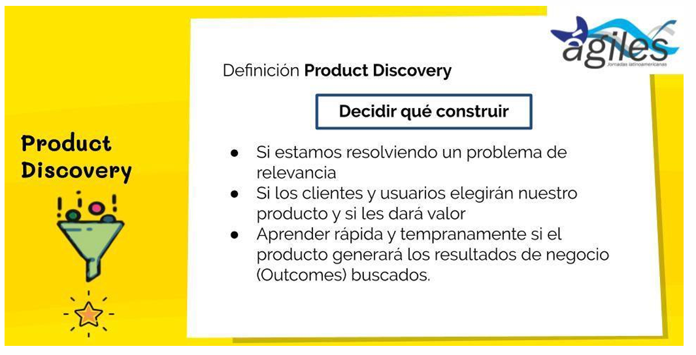
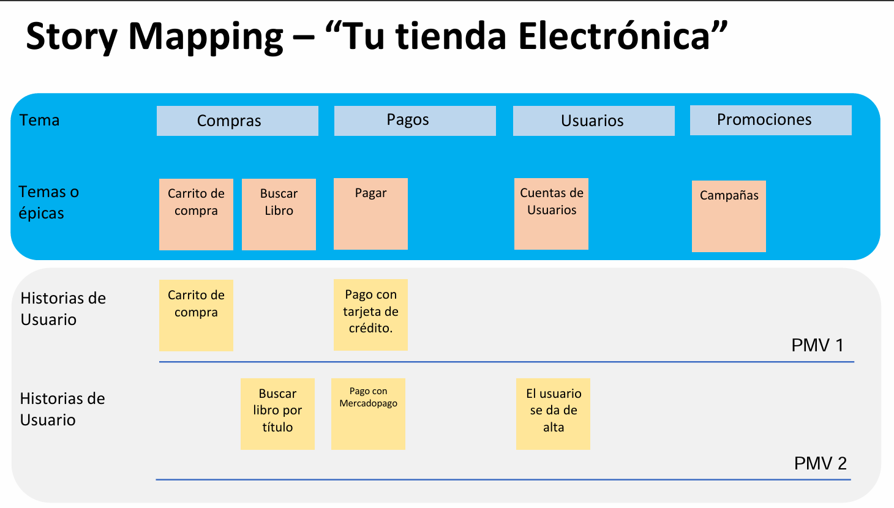

# Definition of Done (DoD)

## ¿Qué es el DoD?

El Definition of Done (Definición de Hecho) es un concepto central dentro del marco de trabajo Scrum, que representa un acuerdo común entre el equipo de desarrollo y el Product Owner respecto a qué condiciones deben cumplirse para que un item de trabajo —ya sea una historia de usuario, una funcionalidad, o cualquier incremento del producto— se considere efectivamente completado.

A diferencia de una simple noción subjetiva de "hecho", el DoD proporciona un criterio objetivo y verificable que garantiza que la tarea ha sido completada no solo desde el punto de vista funcional, sino también desde el punto de vista de calidad, documentación, pruebas y despliegue. Es, en esencia, un contrato interno dentro del equipo Scrum que asegura transparencia, alineación y calidad continua del producto entregado.

Cada equipo Scrum puede (y debe) construir su propio DoD, adaptado a su contexto, nivel de madurez, industria y entorno técnico. El DoD puede ser tan simple como una lista de actividades acordadas (por ejemplo: codificación terminada, pruebas unitarias completas, código revisado, documentación actualizada), o bien puede ser una definición más sofisticada que incluya validaciones automáticas, criterios de aceptación definidos por el cliente, pruebas de usuario exitosas, etc.

Este acuerdo es establecido al principio del proyecto y debe ser comprendido, compartido y respetado por todos los miembros del equipo, incluyendo desarrolladores, testers, QA, y stakeholders. Su propósito final es asegurar que cada incremento entregado esté en condiciones de ser puesto en producción o entregado al cliente sin trabajo pendiente.

## ¿Para qué sirve el DoD?

El DoD no es simplemente una formalidad: cumple funciones estratégicas y operativas fundamentales dentro del proceso Scrum.

1. Foco del equipo en la completitud real del trabajo

    Uno de los beneficios clave del DoD es que permite al equipo concentrarse en alcanzar un resultado que esté efectivamente terminado, en vez de caer en la trampa de considerar "hecho" algo que en realidad aún tiene pasos pendientes como documentación, pruebas o integración. Esto promueve una cultura de responsabilidad y evita la deuda técnica o la postergación de tareas esenciales.

2. Evaluación del trabajo completado

    El DoD actúa como un filtro claro y objetivo para evaluar cuándo un incremento de producto está verdaderamente terminado. Esto es particularmente relevante durante las revisiones de Sprint (Sprint Reviews), ya que permite discutir únicamente entregas que cumplen con todos los estándares definidos, evitando debates ambiguos sobre si algo está listo o no.

3. Fundamento para la calidad continua

    Cumplir con los criterios del DoD asegura que el equipo entregue no solo funcionalidades operativas, sino también soluciones robustas y sostenibles. Al incluir prácticas como pruebas automatizadas, validación de usuarios, revisión de código y documentación, se evita la entrega de código incompleto o defectuoso. Así, el DoD actúa como una barrera contra el deterioro de la calidad técnica.

4. Reducción de ambigüedad entre cliente y equipo técnico

    Muchas veces, lo que un desarrollador considera "listo" difiere radicalmente de lo que el cliente espera. Esta diferencia de percepción puede generar frustraciones y malentendidos. El DoD elimina esta ambigüedad al establecer de antemano criterios claros que alinean las expectativas de todos los involucrados. Por eso se dice que "lo que entiende un desarrollador por hecho ni se aproxima a lo que el cliente espera como producto terminado".

5. Impulso a equipos altamente funcionales

    Un equipo Scrum maduro y eficaz no solo entrega tareas, sino que lo hace de manera consistente y alineada a estándares predefinidos. El DoD es uno de los mecanismos que permiten esa madurez. Sirve como guía constante para los equipos en la mejora continua de su proceso y la consolidación de buenas prácticas.

## Ejemplo detallado de un Definition of Done

Un DoD bien construido debe ser concreto, verificable y aplicable a todos los ítems de trabajo. A modo de ejemplo, un DoD típico en una organización de desarrollo ágil puede incluir los siguientes puntos:

- Testing Unitario e Integración completado y exitoso: Todas las funciones deben contar con pruebas unitarias que aseguren su correcto funcionamiento. Además, la integración con otros componentes debe ser validada, sin errores ni conflictos.

- Actualización de Checklists y Test Cases para QA: Los documentos o herramientas utilizadas por el área de QA deben ser actualizadas con información sobre los nuevos casos, escenarios de prueba o resultados esperados.

Build ejecutada en el servidor de QA: La nueva versión del software debe ser compilada y desplegada en un entorno de pruebas (QA), donde se pueda verificar su funcionamiento de manera controlada.

Revisión y validación por parte de QA: El equipo de aseguramiento de calidad debe revisar la funcionalidad y confirmar que no hay errores abiertos relacionados. Sin este OK, el trabajo no se considera terminado.

Revisión de código completada: Al menos otro miembro del equipo debe haber revisado el código, sugiriendo mejoras, detectando errores potenciales y aprobando la calidad del desarrollo.

Documentación generada y actualizada: Toda documentación relevante (manuales de usuario, APIs, diagramas técnicos) debe estar actualizada con los últimos cambios incorporados.

Tarea marcada como resuelta en JIRA (u otra herramienta de seguimiento): La historia o ítem correspondiente debe cerrarse oficialmente en la herramienta de gestión de trabajo.

Validación de la funcionalidad en entorno de UAT (User Acceptance Testing): En caso de requerirse, el cliente o usuario final debe haber validado que la funcionalidad satisface sus necesidades y expectativas.

## Scrum – Product Discovery

El Product Discovery en Scrum es una etapa previa o paralela al desarrollo formal del producto, cuyo propósito es entender a fondo el problema a resolver, validar la solución propuesta y minimizar riesgos antes de invertir en la construcción técnica. Si bien Scrum se centra principalmente en el desarrollo incremental de productos, muchas organizaciones complementan este marco con prácticas de Product Discovery para tomar decisiones informadas sobre qué construir y por qué.

Esta etapa suele involucrar al Product Owner, diseñadores UX, usuarios reales, stakeholders y a veces incluso al equipo de desarrollo. Durante este proceso, se formulan y responden preguntas críticas que determinan si una historia de usuario o funcionalidad tiene sentido desde los puntos de vista de negocio, técnico y de usuario final.

A continuación se analizan cada una de estas preguntas fundamentales:

1. ¿La solución propuesta para este ítem/historia de usuario funciona para nuestro negocio?

    Esta es una pregunta esencial de viabilidad de negocio. Antes de desarrollar una funcionalidad, debemos comprender si está alineada con los objetivos estratégicos del producto y si genera valor real. Por ejemplo, agregar una función de "favoritos" en una app de e-commerce solo tiene sentido si se espera que aumente la retención o la tasa de conversión de los usuarios.

    En esta etapa, se analiza si la historia de usuario contribuirá a alcanzar métricas clave (KPIs), si resuelve un problema existente o si responde a una necesidad detectada mediante estudios de mercado o entrevistas con usuarios. Si la historia no aporta valor medible al negocio, probablemente deba ser reformulada o descartada.

2. ¿Es factible la construcción de este ítem/historia desde el punto de vista técnico?

    Aquí se aborda la viabilidad técnica. Muchas ideas pueden parecer atractivas, pero resultar muy costosas, riesgosas o inviables técnicamente con las herramientas, recursos y tiempo disponibles. El equipo técnico debe evaluar si la historia de usuario es desarrollable, si requiere tecnologías nuevas, integraciones complejas o cambios estructurales importantes.

    Este análisis incluye estimaciones de esfuerzo, identificación de posibles bloqueos, validación de dependencias y análisis de alternativas de implementación. La colaboración temprana del equipo de desarrollo en el Product Discovery es crucial para evitar promesas incumplibles o retrasos innecesarios.

3. ¿El usuario sabrá cómo utilizar la funcionalidad propuesta por este ítem/historia de usuario?

    Esta pregunta se refiere a la usabilidad y diseño UX. Una funcionalidad puede estar bien construida y tener sentido de negocio, pero si los usuarios no entienden cómo usarla, su impacto será nulo. Aquí se evalúa si la historia está acompañada de un diseño intuitivo, consistente con el resto del producto y validado mediante pruebas con usuarios reales.

    Se puede recurrir a prototipos, pruebas A/B, entrevistas o pruebas de usabilidad para detectar posibles confusiones, fricciones o errores de interpretación. El objetivo es garantizar que el producto no solo funcione, sino que sea fácil y agradable de usar.

4. ¿El usuario escogerá hacer uso de la funcionalidad propuesta o buscará una alternativa?

    Finalmente, esta pregunta aborda la atractividad y adopción de la funcionalidad. Aun si es útil y fácil de usar, es posible que los usuarios simplemente no la utilicen porque prefieren otras soluciones (propias o de la competencia), o porque no la consideran necesaria.

    Aquí entra en juego la validación con usuarios reales, el análisis del comportamiento actual, las encuestas o entrevistas. También se considera la competencia: ¿los usuarios ya están resolviendo ese problema con otra aplicación o funcionalidad? ¿Estamos ofreciendo algo realmente diferenciador? Esta reflexión permite priorizar aquellas historias que tienen más probabilidad de generar adopción y uso frecuente.

