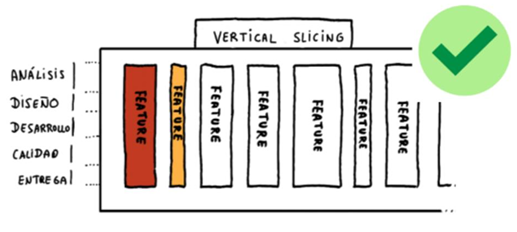

# Historias de Usuario

## Historias de Usuario y Product Backlog Items

En Scrum, todo el trabajo por realizar se organiza y prioriza en un artefacto conocido como Product Backlog, el cual es mantenido por el Product Owner (PO). Este backlog no contiene descripciones extensas ni especificaciones detalladas como en los modelos tradicionales de desarrollo de software. En cambio, se compone de elementos llamados Product Backlog Items (PBIs), los cuales pueden tomar diversas formas según el contexto y la madurez del equipo. La forma más popular y recomendada para expresar estos elementos son las Historias de Usuario (User Stories).

El enfoque ágil busca dejar atrás la excesiva documentación y prescripciones que caracterizaban a modelos como el cascada, donde los requisitos se definían de manera exhaustiva desde el inicio, abarcando todos los posibles flujos, escenarios y detalles técnicos. Este tipo de rigidez suele conducir a proyectos poco adaptables al cambio y con bajo involucramiento del usuario final. En cambio, las metodologías ágiles proponen contar la historia del producto y de sus usuarios de forma evolutiva, enfocándose en entender el valor que cada ítem aporta y adaptándose progresivamente a las necesidades del cliente.

Las historias de usuario no son solo un medio de especificación, sino una herramienta que promueve la colaboración, la empatía y el aprendizaje continuo. Al estar escritas desde la perspectiva del usuario, invitan al equipo de desarrollo a pensar desde su punto de vista, fomentando una conexión directa entre quienes construyen el producto y quienes lo utilizarán. Además, permiten validar rápidamente si se está construyendo algo que realmente será usado y valorado.


## ¿Qué son las Historias de Usuario?


Las historias de usuario son una técnica ágil para gestionar requisitos de forma simple, colaborativa y centrada en el valor. En lugar de largos documentos funcionales, las historias son breves descripciones de funcionalidades escritas en lenguaje natural desde la perspectiva del usuario. Cada historia representa una necesidad, un deseo o un objetivo que el usuario final espera satisfacer mediante el uso del producto.

Estas historias no deben entenderse como especificaciones técnicas cerradas, sino como promesas de conversaciones futuras. Son, esencialmente, una forma de recordar que existe una necesidad y que se debe conversar más a fondo sobre ella antes de comenzar a desarrollarla.

Para que una historia de usuario esté bien formulada, se sugiere seguir el modelo de las 3 C’s:

- Card (Tarjeta): Cada historia se reduce a una tarjeta o una nota breve que pueda pegarse físicamente (en tableros kanban, por ejemplo) o digitalmente. No es una especificación completa, sino un recordatorio para seguir conversando.

- Conversation (Conversación): Antes de que una historia se desarrolle, debe haber una conversación entre el Product Owner y el equipo para detallar los criterios de aceptación, aclarar dudas y explorar enfoques. Estas conversaciones pueden tener lugar durante las sesiones de refinamiento o planificación.

- Confirmation (Confirmación): Al final, se valida si el equipo comprendió correctamente la necesidad del usuario mediante los criterios de aceptación. Estos son condiciones objetivas y específicas que deben cumplirse para considerar la historia como completa.

## Estructura típica de una Historia de Usuario


Una historia de usuario se suele redactar siguiendo la estructura:

> Como [rol del usuario], quiero [objetivo] para poder [beneficio].

Esta estructura tiene tres componentes fundamentales:

- Como [rol del usuario]: No se refiere a un rol técnico (como "tester" o "developer"), sino al perfil humano detrás del requerimiento, basado en la representación de un user persona. La empatía es clave: el equipo debe entender quién es esa persona, qué necesita y por qué.

- Quiero [objetivo]: Aquí se expresa qué desea lograr el usuario, es decir, su intención. Importa entender qué está tratando de conseguir, no cuál funcionalidad quiere usar.

- Para poder [beneficio]: Finalmente, se vincula la necesidad con un beneficio más amplio, explicando cómo encaja dentro del flujo del negocio o del día a día del usuario. Este beneficio es el valor que se espera lograr con la funcionalidad.

Un ejemplo completo sería:

> Como comprador habitual, quiero guardar productos en una lista de deseos, para poder consultarlos más tarde antes de decidir mi compra.

## Refinamiento del Backlog y el Rol del Product Owner

En Scrum, el trabajo con las historias de usuario no se detiene una vez redactadas. Existe un proceso iterativo conocido como refinamiento del backlog (backlog refinement), en el cual el equipo revisa y mejora constantemente las historias, asegurándose de que estén claras, estimadas y listas para ser desarrolladas en futuros sprints.

Durante este proceso, el Product Owner cumple un rol crucial:

- Poner al equipo en contexto: El PO debe contar la historia del usuario asociada a cada ítem. No se trata de solo describir funcionalidad, sino de sumergir al equipo en el problema, para que todos comprendan el valor que hay detrás.

- Transmitir conocimiento: El PO comparte todas las alternativas que se hayan evaluado, permitiendo que el equipo entienda el porqué de una solución y explore nuevas posibilidades si fuese necesario.

- Crear compromiso: Al generar empatía con el usuario y hacer del problema algo compartido, se fomenta el compromiso del equipo con la solución. El equipo no solo desarrolla código, sino que resuelve problemas reales de personas reales.

## INVEST: Buenas Prácticas para Historias de Usuario

Las historias de usuario deben cumplir con el acrónimo INVEST, que resume seis características fundamentales que garantizan su calidad:

- I – Independientes: Las historias deben poder desarrollarse sin depender estrictamente de otras. Esto evita bloqueos y facilita su organización dentro del sprint.

- N – Negociables: No deben ser contratos rígidos. El alcance debe discutirse y ajustarse con el Product Owner hasta que haya acuerdo sobre lo que se va a entregar.

- V – Valiosas: Cada historia debe aportar valor al usuario o cliente. Si no hay valor visible, su desarrollo debe cuestionarse.

- E – Estimables: El equipo debe poder estimar cuánto esfuerzo requerirá la historia. Si esto no es posible, puede ser señal de que está mal definida o es demasiado compleja.

- S – Small (Pequeñas): Las historias deben ser lo suficientemente pequeñas como para completarse en uno o pocos días. Si una historia es muy grande, debe dividirse en historias más manejables.

- T – Testeables: Deben tener criterios de aceptación claros y verificables. Idealmente, estos pueden automatizarse para asegurar calidad continua en cada entrega.

## Spikes: Exploración Técnica o Funcional

En el desarrollo ágil, es común enfrentar situaciones en las que el equipo no tiene suficiente información o conocimiento técnico para abordar una historia de usuario con confianza. En esos casos, se recurre a un artefacto conocido como spike.

Un spike es una tarea que no genera directamente valor funcional para el usuario, pero que permite aprender lo necesario para desbloquear el desarrollo posterior. Son especialmente útiles para mitigar riesgos y reducir incertidumbres.

Se pueden clasificar en dos tipos:

- Spikes técnicos: Su objetivo es explorar aspectos tecnológicos, como la viabilidad de usar una determinada API, biblioteca o arquitectura.

- Spikes funcionales: Se orientan a comprender funcionalidades deseadas por el usuario, validar hipótesis de diseño, prototipar interfaces o investigar comportamientos esperados.

Los spikes no deben convertirse en un recurso habitual para evadir decisiones. Deben tener un tiempo acotado, un objetivo claro y una entrega concreta (un documento, una prueba de concepto, una recomendación).

## Épicas, Temas y Tareas: Escalando la Gestión de Requerimientos

Cuando se desarrollan productos simples, las Historias de Usuario (User Stories) son suficientes para representar las funcionalidades deseadas. Sin embargo, a medida que los productos crecen en complejidad, se vuelve necesario escalar la representación de requerimientos utilizando estructuras jerárquicas que mantengan la claridad, el foco en el valor y la trazabilidad. Estas estructuras son: Temas, Épicas y Tareas.


### Tema

Un Tema es una agrupación conceptual de épicas e historias de usuario relacionadas entre sí que describen un sistema o subsistema. A diferencia de una funcionalidad específica, el tema tiene un enfoque más amplio y estratégico. Se vincula directamente con la visión del producto y puede representar un módulo completo, una gran área de experiencia del usuario o un conjunto de necesidades de negocio relacionadas.

Por ejemplo, en un sistema bancario, un tema podría ser “Gestión de Cuentas”, que abarcaría múltiples funcionalidades como creación de cuentas, cierre, actualización de datos, etc. Cada una de estas funcionalidades puede luego expresarse como épicas o historias.

La importancia de los temas radica en que:

- Ayudan a organizar el backlog de forma más coherente.
- Facilitan la planificación a largo plazo, alineando desarrollo con objetivos de negocio.
- Permiten mantener una visión de alto nivel del producto, sin perder el detalle operativo.

### Épica

Una Épica es una historia de usuario de gran tamaño o complejidad, que no puede ser desarrollada en un solo sprint. Normalmente, una épica tiene un mayor grado de incertidumbre, tanto técnica como funcional, por lo que se considera un requerimiento en estado inicial o preliminar. El equipo de desarrollo, junto con el Product Owner, deberá descomponerla en historias de usuario más pequeñas, manejables y estimables cuando se aproxime su implementación.

Ejemplo de una épica:

- “Como cliente, quiero poder gestionar mis tarjetas desde la aplicación móvil, para tener mayor control sobre mis medios de pago”.

Esta necesidad puede implicar múltiples historias más pequeñas: activar/desactivar tarjeta, ver consumos, denunciar robo, pedir tarjeta nueva, etc.

Las épicas son útiles porque:

- Evitan el microdetalle prematuro, permitiendo un enfoque progresivo.
- Sirven para visualizar el valor funcional completo antes de dividirlo.
- Facilitan la conversación inicial con stakeholders antes de entrar al detalle.

### Tarea

Las Tareas representan el nivel más bajo de descomposición del trabajo y se enfocan en el cómo construir una funcionalidad, en lugar del qué. Son actividades técnicas o específicas que el equipo realiza para cumplir con una historia de usuario. Pueden incluir tareas como diseñar una pantalla, escribir pruebas unitarias, crear un endpoint o integrar un componente.

Las tareas:

- Permiten gestionar y seguir el trabajo diario del equipo de desarrollo.
- Son útiles para estimar horas de esfuerzo, organizar el trabajo en pares y distribuir responsabilidades.
- No tienen por sí solas valor de negocio, pero son instrumentales para completar una historia que sí lo tiene.


## Refinamiento de Historias de Usuario


El refinamiento (también conocido como backlog grooming) es una práctica esencial dentro de Scrum que tiene como objetivo preparar los elementos del Product Backlog para que estén listos antes de su desarrollo. Refinar implica mejorar la claridad, dividir en partes más pequeñas, consensuar los criterios de aceptación y ajustar las estimaciones.

Una mala práctica común en refinamiento es caer en una división horizontal de las historias, es decir, descomponer en tareas según fases del ciclo de vida (diseño, desarrollo, testing). Esto genera un enfoque tipo “cascada disfrazada”, donde se pierde el foco funcional y se generan cuellos de botella.


Por el contrario, en metodologías ágiles se promueve una división vertical de las historias, donde cada unidad pequeña sigue siendo funcional, entregable y valiosa por sí misma. Esta división permite:

- Tener incrementos funcionales y testeables en cada entrega.
- Maximizar el aprendizaje a través del feedback temprano.
- Asegurar que el software que se construye siempre esté orientado al negocio y al usuario.



### Técnicas de Refinamiento


Existen múltiples formas de dividir una historia de usuario para facilitar su implementación:

- Por Reglas de Negocio: si una funcionalidad tiene muchas variaciones dependiendo de condiciones o reglas, se puede dividir por cada una de ellas.
- Por Grado de Complejidad: dividir una historia compleja en versiones más simples, para luego iterar hacia soluciones completas.
- Por Tipo de Operación: separar acciones diferentes como “ver”, “crear”, “editar” o “eliminar”.
- Refinamiento de un Spike: cuando se hace una investigación técnica o funcional (spike), los aprendizajes obtenidos pueden llevar a definir nuevas historias más claras.

## Criterios de Aceptación

Los Criterios de Aceptación son uno de los elementos más críticos en la definición de una historia de usuario, ya que determinan las condiciones mínimas bajo las cuales una historia se considera completada. Estos criterios se expresan como escenarios específicos, y deben ser claros tanto para el equipo como para los stakeholders.

Los criterios cumplen varias funciones:

- Se suelen expresar en forma de checklist.
- Se refinan en la Sprint Planning.
- Ayudan al equipo de desarrollo a entender el funcionamiento del producto, de manera que estimarán mejor el tamaño de la historia.
- Sirven como guía para la toma de decisiones durante el desarrollo.
- Durante la Sprint Review, el PO comprobará a través de estos criterios y la DoD, si cada una de las historias de usuario se puede dar por finalizada.
- Los criterios de aceptación deben describir siempre un contexto, un evento y la respuesta o consecuencia esperada del sistema.
- Ayudan a reducir la ambigüedad del requerimiento.
- Sirven como guía para el diseño de pruebas funcionales.
- Son un instrumento de validación durante la Sprint Review, donde el Product Owner evalúa si el resultado cumple lo pactado.

### Método SMART para Criterios de Aceptación

Un buen criterio de aceptación debe cumplir con las características del método SMART:

- Specific (Específico): debe centrarse en un comportamiento o resultado concreto.
- Measurable (Medible): debe poder comprobarse si se cumple o no.
- Achievable (Alcanzable): debe ser posible dentro del contexto técnico y funcional.
- Relevant (Relevante): debe aportar valor desde el punto de vista del negocio.
- Time-boxed (Limitado en el tiempo): debe poder completarse en el tiempo disponible del sprint.

#### BDD y Gherkin

Una técnica muy útil para definir criterios de aceptación es el Behavior Driven Development (BDD), que permite describir el comportamiento esperado del sistema desde el punto de vista del usuario, utilizando el lenguaje Gherkin. Este lenguaje estructurado permite describir escenarios de manera comprensible tanto para técnicos como no técnicos.

Ejemplo con Gherkin:

```
Escenario: Cuenta con crédito suficiente
Dado que la cuenta tiene crédito
Y que la tarjeta es válida
Y que el cajero tiene dinero disponible
Cuando el cliente pide dinero
Entonces la cuenta es debitada
Y el dinero es entregado al cliente
Y el cliente recupera su tarjeta
```


La sintaxis de gherkin es la siguiente:

- (Scenario) Escenario [número de escenario] [titulo del escenario]
- (Given) Dado que [contexto] y adicionalmente [contexto]
- (When) Cuando [evento]
- (Then) Entonces [resultado / comportamiento esperado]

Este tipo de definición no solo mejora la comunicación, sino que además puede integrarse con herramientas de automatización de pruebas.

### Ventajas de Definir Criterios de Aceptación

Contar con criterios bien definidos proporciona múltiples beneficios:

- Da al equipo una comprensión clara de lo que significa “hecho”.
- Promueve el pensamiento desde la perspectiva del usuario, alejándose del enfoque técnico aislado.
- Fomenta la calidad desde el inicio del desarrollo, al definir qué significa éxito para una historia.
- Establece la base para las pruebas automatizadas, permitiendo un ciclo de desarrollo más ágil y confiable.
- Facilita el trabajo del Product Owner durante la Sprint Review, al tener una herramienta objetiva para aceptar o rechazar entregables.
