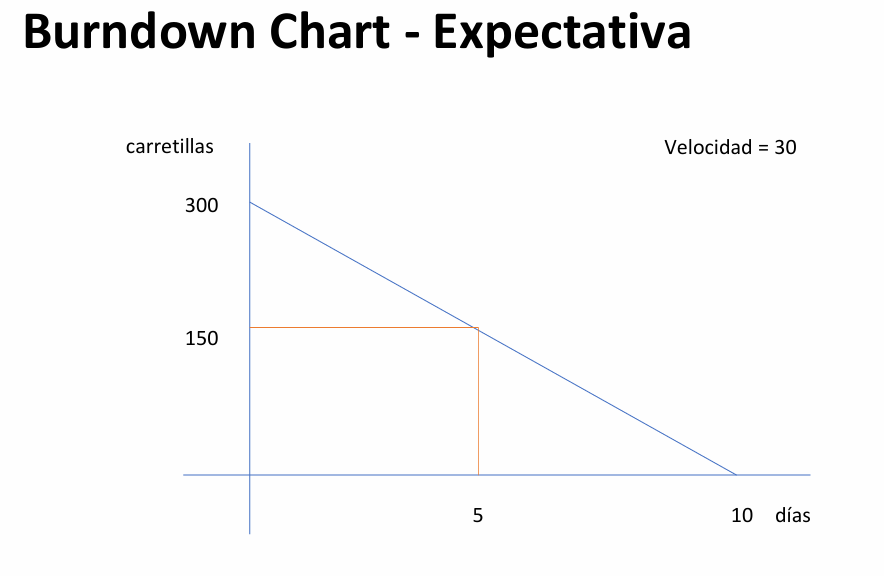
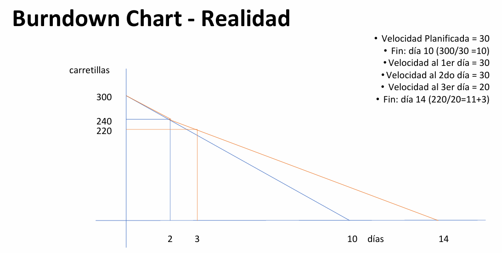
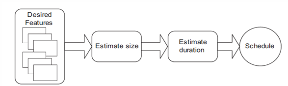
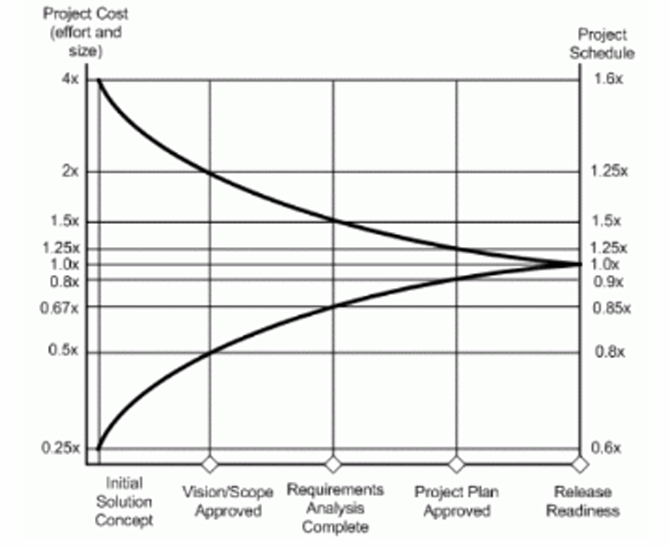
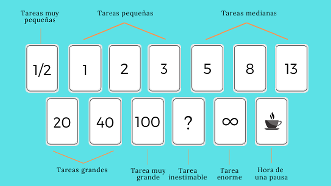

# Estimación

Las estimaciones en el contexto de desarrollo de software son intentos deliberados de anticipar el esfuerzo necesario para completar una determinada funcionalidad, tarea o proyecto. Sin embargo, aunque se utilicen herramientas y técnicas para realizarlas, es fundamental entender que siguen siendo, en esencia, una suposición informada. Esto da lugar a una afirmación provocadora pero realista: una estimación es una adivinanza disfrazada de promesa. A veces, esta suposición termina utilizándose como un compromiso contractual, lo cual puede generar expectativas poco realistas, tensiones en el equipo o resultados decepcionantes. Esta dualidad hace que muchas personas perciban las estimaciones como una "mentira necesaria".

## ¿Para qué se usan las estimaciones?

Las estimaciones se utilizan principalmente para la toma de decisiones. Por ejemplo, los líderes y patrocinadores de un proyecto necesitan estimaciones para decidir si vale la pena invertir recursos, tiempo y dinero en su ejecución. También se usan para planificar, priorizar funcionalidades, asignar recursos y gestionar expectativas de clientes y stakeholders. En este sentido, ayudan a buscar previsibilidad, es decir, una idea aproximada de cuándo podrían estar listas ciertas funcionalidades.

No obstante, es importante comprender que las estimaciones son subjetivas. El significado de "dos horas", por ejemplo, puede variar completamente entre distintos desarrolladores, proyectos o contextos. Esta variabilidad y ambigüedad es una de las razones por las cuales la agilidad propone una manera diferente de estimar.

## Estimaciones en Proyectos Tradicionales

En los enfoques tradicionales de gestión de proyectos, las estimaciones se hacen generalmente en unidades de tiempo (horas, días) y muchas veces a través del juicio de expertos. Este juicio puede provenir de alguien que tiene experiencia en proyectos similares, pero no necesariamente del equipo que ejecutará el trabajo. Esta falta de participación puede conducir a una desconexión entre lo que se estima y lo que realmente ocurre en la ejecución.

Por ejemplo, si se tiene un proyecto con tres requerimientos:

- Req1: 80 horas
- Req2: 60 horas
- Req3: 200 horas

El tiempo total estimado sería de 340 horas. Con base en este cálculo, se construye un plan de ejecución calendarizado. Sin embargo, este enfoque tiene una gran limitación: no se adapta bien al cambio. Si surgen imprevistos, la rigidez del plan original complica el reajuste de estimaciones y cronogramas. Además, subestima la incertidumbre propia del desarrollo de software.

## Estimaciones en Agilidad

En los enfoques ágiles, el foco cambia radicalmente. En lugar de estimar en unidades de tiempo, las estimaciones se hacen de forma relativa y por todo el equipo, no por una única figura de autoridad. Esto promueve la transparencia, la colaboración y el sentido de responsabilidad compartida. Se busca estimar el esfuerzo relativo entre historias de usuario y funcionalidades, no una duración exacta.

Por ejemplo, si una historia A parece el doble de compleja que una historia B, se le asignará el doble de puntos, sin hablar de cuántas horas tomará exactamente. Esta aproximación se basa en la observación de que los seres humanos somos más precisos comparando que prediciendo.

En la agilidad, los requerimientos de alto nivel pueden estimarse con técnicas como tamaños de camiseta (XS, S, M, L, XL), y luego detallarse en historias de usuario que se estiman con Story Points. A partir de allí, se pueden generar tareas más concretas, que sí pueden estimarse en horas ideales, especialmente si son de corto alcance (menos de un día).

La estimación ágil no es estática. Se ajusta constantemente en cada evento de planificación y refinamiento. El plan no se congela en el tiempo, sino que evoluciona con la información que se obtiene en cada iteración (sprint).

## Ejemplo

## Niveles de Estimación Ágil

En los entornos ágiles, existen distintos niveles de estimación según el nivel de granularidad del trabajo:

- Alto Nivel (Épicas): Son bloques funcionales grandes, a menudo estimados con medidas cualitativas como "tamaños de camiseta". Por su tamaño y complejidad, las épicas no pueden completarse en un único sprint.

- Nivel Medio (Historias de Usuario): Son funcionalidades específicas del producto que pueden estimarse con Story Points, una métrica que representa esfuerzo relativo considerando complejidad, incertidumbre y tamaño.

- Bajo Nivel (Tareas): Son actividades concretas, resultantes de la descomposición de las historias de usuario. Aquí sí puede estimarse en horas ideales, pero se recomienda que las tareas no duren más de un día.

- La stories/tareas deben tener la menor dependencia posible
- Las estimaciones son realizadas en equipo y por todo el equipo Scrum
    - Todos saben qué se estimó para el cliente
    - Permiten analizar las actividades desde perspectivas diferentes
    - Responsabilidad compartida y no hay un culpable
    - Todos pueden opinar, genera sentido de pertenencia

### Cono de la Incertidumbre

### Spikes y Pruebas de Concepto

En ocasiones, antes de poder estimar una historia de usuario, es necesario investigar o hacer una pequeña prueba técnica. Estas actividades se llaman Spikes. Son investigaciones acotadas en el tiempo (timebox) cuyo objetivo es reducir la incertidumbre y recolectar información para luego estimar con mayor precisión. Aunque no entregan funcionalidad directamente, son clave para el éxito de historias más complejas.

## Story Points

Los Story Points son la técnica de estimación más utilizada en agilidad, aunque también la más debatida. Representan una medida relativa del esfuerzo, no un tiempo absoluto. Se basan en una combinación de factores como:

- Tamaño de la funcionalidad
- Complejidad técnica
- Nivel de incertidumbre
- Riesgos asociados

La escala más comúnmente usada es la serie de Fibonacci (0, 1, 2, 3, 5, 8, 13…), porque refleja el crecimiento exponencial del esfuerzo: una tarea de 8 puntos no es el doble de una de 4, sino considerablemente más incierta y compleja.

### ¿Por qué funcionan los Story Points?

- Comparación en lugar de predicción: los humanos estiman mejor al comparar tareas conocidas con tareas nuevas.
- No se comprometen tiempos concretos: se evita la presión de comprometerse con fechas específicas.
- Se pueden sumar: permiten hacer cálculos agregados del esfuerzo de un sprint o backlog.
- Fomentan consenso: el equipo llega a un acuerdo sobre cuánto esfuerzo representa cada historia, y eso mejora la comunicación interna.

### Beneficios de las Estimaciones Ágiles

- Estimación más rápida y con contexto: Al tener un histórico de puntos de historias ya completadas, se puede estimar con mayor precisión.

- Evitan compromisos de tiempo rígidos: No se da una promesa explícita de “esto tomará X horas”, lo cual protege al equipo de errores de cálculo.

- Aceptación de la incertidumbre: Al usar escalas relativas (como Fibonacci), se contempla que cuanto mayor es la funcionalidad, mayor es la incertidumbre.

- Planificación iterativa y precisa: A medida que se completan sprints, se obtiene información más confiable sobre la velocidad del equipo (cantidad de puntos entregados por sprint), lo cual permite planificar el futuro con más seguridad.

- Fomenta la colaboración y pertenencia: Al estimar en grupo, todos los miembros del equipo aportan su perspectiva, lo cual mejora la calidad de la estimación y fortalece la cohesión del grupo.

## Velocidad en Scrum

La velocidad en Scrum es una métrica fundamental que mide la capacidad de un equipo para entregar trabajo terminado en un marco de tiempo determinado. Esencialmente, permite evaluar el desempeño del equipo, detectar tendencias, y establecer un ritmo de trabajo sostenible. La velocidad no solo se utiliza para observar retrospectivamente cuánto trabajo se completó, sino también como insumo en la planificación futura, permitiendo proyectar de forma empírica cuántos elementos se podrán completar en futuros sprints.

Se calcula como:

Velocidad = Trabajo / Tiempo

En Scrum, el "trabajo" hace referencia a la suma de los Story Points completados durante un Sprint. El "tiempo" es simplemente la duración del Sprint (habitualmente una, dos o tres semanas). Esta fórmula, aunque simple, ofrece información poderosa: con ella se puede prever si un equipo podrá cumplir con los compromisos del Product Backlog y permite realizar ajustes tempranos cuando los resultados no están alineados con lo esperado.

Por ejemplo, si un equipo completa consistentemente 30 puntos por Sprint, puede usarse esa velocidad como base para planificar releases futuras. Esta cifra puede variar por diferentes razones (vacaciones, interrupciones, cambios de equipo, etc.), por lo que Scrum promueve la inspección y adaptación constantes. La velocidad también es útil como indicador del aprendizaje y madurez del equipo, ya que idealmente tiende a estabilizarse a medida que el equipo gana experiencia y mejora sus prácticas.

## Ideal Time

El concepto de Ideal Time hace referencia a cuánto tiempo tomaría realizar una tarea en condiciones perfectas, es decir, en un mundo ideal. Implica que:

- La persona trabaja exclusivamente en esa tarea.
- No hay interrupciones externas ni internas.
- Todos los recursos necesarios están disponibles inmediatamente.
- No hay esperas, dependencias ni cambios de contexto.

Bajo este enfoque, se estima el trabajo suponiendo un flujo continuo y sin fricciones. Así, en teoría, una jornada laboral ideal equivaldría a 8 horas de productividad neta. Sin embargo, en la práctica, este ideal rara vez se cumple. Reuniones, correos electrónicos, pausas, multitarea, dependencias técnicas o humanas, todo eso reduce significativamente la cantidad de tiempo efectivo que una persona puede dedicar al trabajo real del proyecto.

En muchos equipos, se calcula que solo 4 horas efectivas al día se destinan al desarrollo puro de software. Por eso, aunque el “Ideal Time” es útil como referencia, no se debe confundir con la disponibilidad real del equipo. El valor de las estimaciones se pierde cuando no se consideran estos factores contextuales.

## Story Points vs. Ideal Time

Ambas formas de estimación buscan determinar el tamaño del trabajo, pero lo hacen desde enfoques distintos. A continuación se desarrollan los argumentos a favor de cada uno:

### A favor de Story Points

- Sumabilidad sin ambigüedad: Los Story Points son una unidad relativa y abstracta. Se pueden sumar sin riesgo de malinterpretación, a diferencia del tiempo, que tiende a asociarse con compromisos fijos.

- Evita falsas expectativas del cliente: Decir que algo tomará “250 horas” genera la ilusión de precisión absoluta, algo riesgoso en entornos complejos como el desarrollo de software. Los Story Points eliminan esta percepción errónea.

- Rapidez en la estimación: Estimar con Story Points, comparando entre historias similares, suele ser más ágil que discutir horas específicas.

- Aprendizaje progresivo: Las estimaciones en puntos se mantienen útiles a lo largo del tiempo, mientras que las hechas en tiempo tienden a perder valor a medida que cambia el contexto o el equipo evoluciona.

- Neutralidad respecto a la experiencia: Los Story Points no dependen del nivel de experiencia de quien realiza el trabajo. Una historia de 5 puntos lo es para el equipo, más allá de la persona que la ejecute.

### A favor de Ideal Time

Mayor comprensión externa: Para clientes o stakeholders ajenos a Scrum, hablar en horas puede ser más intuitivo que utilizar puntos.

- Facilidad para equipos novatos: Al comenzar con Scrum, algunos equipos encuentran más fácil estimar en tiempo porque están acostumbrados a ese modelo tradicional.

## Estimación Ágil: Analogía del Corgi

Una manera didáctica de entender cómo se estiman las historias en Agile es a través de analogías, como la del tamaño de los perros. Preguntar “¿Qué tan grande es un Corgi?” resulta abstracto y difícil, pero si lo comparamos con otras razas, como un Chihuahua, un Border Collie o un San Bernardo, se vuelve más fácil identificar cuál se le parece más.

Llevado al mundo ágil, este razonamiento nos muestra que:

- Estimar en términos absolutos es difícil. En cambio, comparar historias entre sí es más intuitivo.

- Si asignamos puntos (como 1 para Chihuahua, 5 para Border Collie y 13 para San Bernardo), podemos crear una escala relativa, como la serie de Fibonacci, que captura la incertidumbre e incrementa la separación entre tamaños más grandes.

Así nacen los Story Points, unidades abstractas que capturan tamaño, complejidad y esfuerzo, sin pretender ser métricas exactas de tiempo. Con esta técnica, los equipos pueden estimar cualquier historia, aunque no conozcan cada detalle, porque están comparando con algo ya conocido.

## Planning Poker

Planning Poker es una técnica colaborativa de estimación que combina discusión grupal, consenso y juego. Favorece la participación de todo el equipo, minimiza el efecto de la influencia jerárquica y promueve el análisis colectivo de las tareas.

El proceso es el siguiente:

- Cada integrante tiene un mazo de cartas con números (habitualmente de la serie de Fibonacci).
- Se presenta una historia de usuario y se discute brevemente.
- Todos eligen una carta de forma individual.
- Se revelan las cartas al mismo tiempo.
- Si hay discrepancias grandes (por ejemplo, entre un 2 y un 13), se discuten los motivos.
- Se repite la estimación hasta que se alcanza un acuerdo (o se aplica una regla como “tres rondas y se promedia”).

Esta técnica funciona por varias razones:

- Los desarrolladores que harán el trabajo son quienes lo estiman, garantizando realismo y compromiso.
- Las diferencias en las cartas generan debate y aprendizaje: a veces una persona detecta una complejidad que otros no habían considerado.
- Se escucha a todos por igual, eliminando sesgos y reforzando el sentido de equipo.
- El enfoque lúdico ayuda a mantener la energía y motivación durante el proceso.

## T-shirt Sizing

La técnica de T-shirt sizing (tallas de camiseta) es especialmente útil en etapas tempranas de los proyectos o cuando se quiere una estimación rápida a alto nivel. En lugar de usar números, se asignan tamaños como XS, S, M, L y XL a los ítems del Product Backlog.

Su propósito es desasociar la estimación de cualquier unidad medible (como horas o puntos), para enfocarse únicamente en la comparación relativa entre elementos. Esta técnica tiene las siguientes ventajas:

- Reduce la ansiedad inicial del equipo frente a una planificación detallada.
- Facilita el consenso: es más fácil acordar que una historia es "M" que determinar si son 5 u 8 puntos.
- Sirve como entrada para una estimación más precisa posteriormente, cuando se refine la historia.

## Re-estimación

En el contexto ágil, la re-estimación no es sinónimo de corrección por fallos, sino una revisión del entendimiento del tamaño relativo de una historia. Debe hacerse únicamente cuando:

- La historia ha cambiado significativamente en su definición funcional.
- Se ha descubierto una complejidad o dependencia nueva.
- En retrospectiva, se advierte que estaba desalineada con respecto a otras historias de igual puntaje.

No se debe re-estimar simplemente porque una historia “tomó más tiempo”. La variación de tiempo real es parte del aprendizaje del equipo. Re-estimar debe ser una herramienta de mejora, no una fuente de estrés.

## Entendiendo Avances

Una de las preguntas más comunes (y mal respondidas) en proyectos es: ¿Cuál es el progreso hasta hoy?

Respuestas pobres:

“Han transcurrido 100 horas”: Este dato solo refleja tiempo real transcurrido, no dice nada sobre el avance funcional del proyecto.

“Se han completado 80 horas estimadas”: Aunque se relaciona con el esfuerzo previsto, no muestra si se ha entregado valor real al cliente.

Criterio correcto de avance:

La única medida válida en Agile es:

¿Cuánta funcionalidad fue finalizada y entregada al cliente?

Esto se expresa típicamente en cantidad de Story Points completados, o historias de usuario entregadas. Por ejemplo: “Hasta el último Sprint, el equipo completó 35 puntos” es una respuesta concreta y útil, porque:

- Permite proyectar el ritmo de avance.
- Correlaciona directamente con el valor funcional entregado.
- Alimenta la transparencia hacia los stakeholders.

Esta visión evita caer en métricas engañosas y orienta el proyecto hacia lo verdaderamente importante: la entrega continua de valor.
