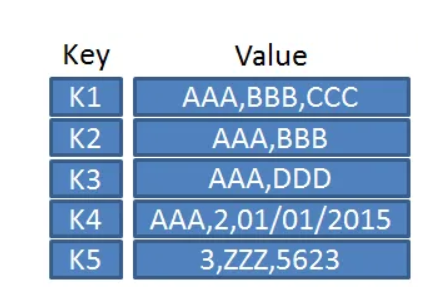
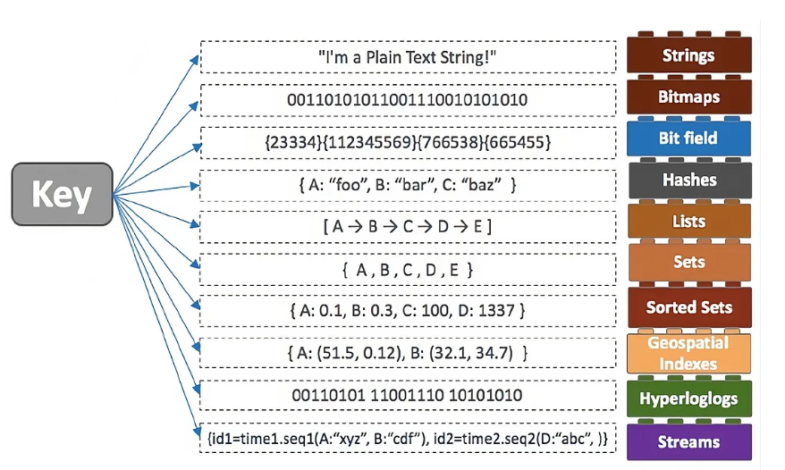
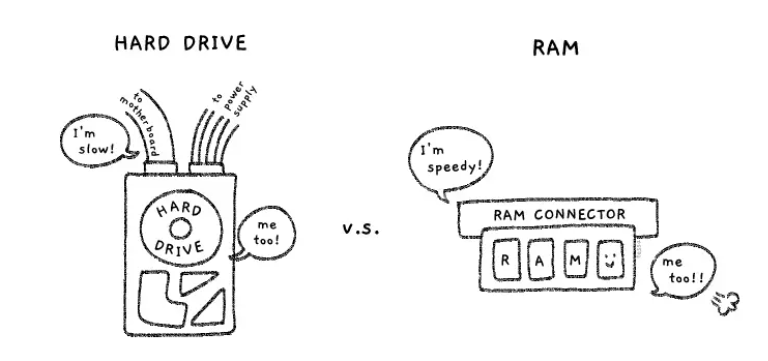

# ¿Qué es Redis?

> Redis (REmote DIctionary OSServer) es un almacén de clave/valor NoSQL de código abierto, en memoria, que se utiliza principalmente como caché de aplicaciones o base de datos de respuesta rápida.

Redis almacena los datos en la memoria, en lugar de en un disco o unidad de estado estable (SSD), lo que ayuda a ofrecer una velocidad, confiabilidad y rendimiento incomparables.

Cuando una aplicación depende de fuentes de datos externas, la latencia y el rendimiento de esas fuentes pueden crear un cuello de botella en el performance, especialmente a medida que aumenta el tráfico o la aplicación escala. Una forma de mejorar el performance en estos casos es almacenar y manipular datos en memoria, físicamente más cerca de la aplicación. Redis está diseñado para esta tarea: Almacena todos los datos en memoria, lo que brinda el performance más rápido posible al leer o escribir datos, y ofrece capacidades de replicación integradas que le permiten colocar los datos físicamente más cerca del usuario para la latencia más baja.

Otras características de Redis que vale la pena mencionar incluyen soporte para múltiples estructuras de datos, scripts Lua incorporados, múltiples niveles de persistencia en el disco y alta disponibilidad.

## Capacidades diferenciadoras

Redis se distingue de los almacenes de datos NoSQL "tradicionales" como un componente auxiliar diseñado específicamente para mejorar el rendimiento de las aplicaciones. Estas son algunas capacidades diferenciadoras de Redis:

### Sesiones de caché de Redis

Nuevamente, a diferencia de las bases de datos NoSQL como MongoDB y PostreSQL, Redis almacena datos en la memoria principal del servidor en lugar de en discos duros y unidades de estado sólido. Esto conduce a tiempos de respuesta significativamente más rápidos al realizar operaciones de lectura y escritura. También ayuda a garantizar el alta disponibilidad (junto con Redis Sentinel) y la escalabilidad de los servicios y las cargas de trabajo de las aplicaciones.

### Colas de Redis

Redis puede poner en cola tareas que pueden tardar más de lo habitual en procesar los clientes sitio web. La cola de tareas multiproceso es común en muchas de las aplicaciones basadas en sitio web actuales, y Redis facilita la implementación de procesos automatizados escritos en Python que se ejecutan en segundo plano de los ciclos de solicitud/respuesta.

### Tipos de datos de Redis

Aunque técnicamente es un almacén de claves/valores, Redis es en realidad un servidor de estructuras de datos que admite múltiples tipos y estructuras de datos, entre los que se incluyen:

- Elementos de cadena únicos y sin clasificar
- Datos con seguridad binaria
- HyperLogLogs
- Matrices de bits
- Hashes
- Listas

### Gestión de clientes Redis

Redis cuenta con capacidades nativas de integración de clientes para ayudar a los desarrolladores a manipular e interactuar con sus datos. Actualmente hay más de 100 clientes de código abierto diferentes disponibles en la biblioteca de clientes de Redis, y los desarrolladores pueden agregar fácilmente nuevas integraciones para admitir características y lenguajes de programación adicionales.

## Características

Algunas de las características más importantes o notables de Redis incluyen:

### Redis Sentinel

Redis Sentinel es un sistema distribuido independiente que ayuda a los desarrolladores a calibrar sus instancias para que estén altamente disponibles para los clientes. Sentinel utiliza una serie de procesos de monitoreo, notificaciones y failovers automáticos para informar a los usuarios cuando hay algún problema con las instancias maestra y esclava, mientras reconfigura automáticamente nuevas conexiones para las aplicaciones cuando sea necesario.

### Clúster de Redis

Redis Cluster es una implementación distribuida de Redis que divide automáticamente los conjuntos de datos entre varios nodos. Esto permite un mayor rendimiento y escalabilidad de los despliegues de bases de datos, al tiempo que garantiza la continuidad de las operaciones en caso de que los subconjuntos de nodos no puedan comunicar con el resto del clúster.

### Redis Pub/Sub

Dado que Redis admite el uso de comandos de publicación y subscripción (Pub/Sub), los usuarios pueden diseñar servicios de chat y mensajería de alto rendimiento en todas sus aplicaciones y servicios. Esto incluye la capacidad de emplear estructuras de datos de lista para ejecutar operaciones atómicas y capacidades de bloqueo.

### Persistencia de Redis

Redis utiliza almacenamiento persistente en disco diseñado para sobrevivir a interrupciones del proceso y cuellos de botella de la red. Redis puede conservar conjuntos de datos tomando instantáneas periódicas de los datos y agregándolas con los cambios a medida que estén disponibles. Redis se puede configurar para generar estas copias de seguridad de la base de datos bajo demanda o a intervalos automáticos para garantizar la durabilidad e integridad de la base de datos.

## Redis frente a Memcached

Tanto Redis como Memcached son data stores de código abierto en memoria, pero difieren en lo que respecta a sus beneficios y características. Memcached es a menudo la opción preferida para aplicaciones simples que requieren menos recursos de memoria, pero es limitado cuando se almacenan datos en su forma serializada. El uso de estructuras de datos por parte de Redis proporciona mucha más potencia cuando se trabaja con grandes conjuntos de datos y más capacidad para afinar el contenido de la memoria caché y mantener una mayor eficiencia en escenarios de aplicaciones específicas.

## Redis vs. MongoDB

Si bien Redis es un almacén de bases de datos en memoria, MongoDB se conoce como un almacén de documentos en disco. Aunque ambas soluciones están diseñadas para diferentes propósitos, a menudo se emplean juntas para maximizar la velocidad y la eficiencia de una base de datos NoSQL. Gracias a su capacidad de almacenamiento en caché, Redis puede localizar los datos necesarios con extrema rapidez, lo que sirve como un búfer de ingesta que hace que MongoDB sea más eficiente y capaz de gestionar mayores frecuencias de actualizaciones de documentos casi en tiempo real. Con la capacidad de MongoDB para almacenar cantidades significativas de datos y la capacidad de Redis para procesarlos más rápido, el emparejamiento ofrece una poderosa solución de gestión de bases de datos para una variedad de casos de uso.

## Casos de uso

Estos son algunos casos de uso comunes de los que las compañías se benefician cuando trabajan con Redis:

- Análisis en tiempo real: debido a que Redis puede procesar datos con latencia de menos de un milisegundo, es ideal para análisis en tiempo real, campañas publicitarias en línea y procesos de machine learning impulsados por IA.

- Aplicaciones basadas en la ubicación: Redis simplifica el desarrollo de aplicaciones y servicios basados en la ubicación al proporcionar indexación, conjuntos y operaciones geoespaciales. Al emplear conjuntos ordenados, Redis puede ahorrar la tarea de buscar y ordenar datos de ubicación, que requiere mucho tiempo, y al mismo tiempo emplear una implementación de geohashing inteligente.

- Almacenamiento en caché para bases de datos: Redis puede manejar grandes cantidades de datos en tiempo real, haciendo uso de sus capacidades de almacenamiento de datos en memoria para ayudar a admitir construcciones de bases de datos altamente receptivas. El almacenamiento en caché con Redis permite menos accesos a la base de datos, lo que ayuda a reducir la cantidad de tráfico y las instancias necesarias. Al usar Redis para el almacenamiento en caché, los equipos de desarrollo pueden mejorar significativamente el rendimiento de sus aplicaciones al lograr una latencia de menos de un milisegundo. Y dado que la capa de almacenamiento en caché de Redis puede escalar de forma rápida y económica, las organizaciones pueden desarrollar estas aplicaciones altamente receptivas mientras reducen sus gastos generales.

- Almacenamiento en caché: Redis, situado "delante" de otra base de datos, crea una caché en memoria de alto rendimiento que reduce la latencia de acceso, incrementa el desempeño y alivia la carga de la base de datos relacional o NoSQL.

- Administración de sesiones: Redis es ideal para tareas de administración de sesiones. Simplemente utilice Redis como almacén de valores de clave rápido con TTL adecuado en las claves de sesión para administrar la información de la sesión. Normalmente, la administración de sesiones es necesaria para aplicaciones online, incluidos juegos, sitios web de comercio electrónico y plataformas de redes sociales.

- Clasificaciones en tiempo real: Con la estructura de datos de conjuntos clasificados de Redis, los elementos se guardan en una lista ordenados por sus puntuaciones. Esto facilita la creación de clasificaciones dinámicas con el fin de mostrar quién va ganando en un juego o publicar los mensajes más populares, o cualquier otra aplicación en la que desee mostrar quién va a la cabeza.

- Limitación de la velocidad: Redis puede medir y, cuando sea necesario, limitar la velocidad de los eventos. Al utilizar un contador de Redis asociado con la clave de la API de un cliente, puede contar la cantidad de solicitudes de acceso dentro de un periodo de tiempo y tomar acción si se excede un límite. Los limitadores de velocidad se utilizan con frecuencia para limitar la cantidad de publicaciones de un foro, el uso de recursos y el impacto de los spammers.

- Colas: La estructura de datos de listas de Redis facilita la implementación de una cola ligera y persistente. Las listas ofrecen operaciones atómicas, así como capacidades de bloqueo, por lo que resultan aptas para una variedad de aplicaciones que requieren un agente de mensajes fiable o una lista circular.

- Chat y mensajería: Redis es compatible con el estándar PUB/SUB con la correspondencia de patrones. Eso le permite a Redis abastecer salas de chat de alto desempeño, transmisiones de comentarios en tiempo real e intercomunicación en los servidores. También puede utilizar PUB/SUB para activar acciones a partir de eventos publicados.

## Ventajas

### Desempeño increíblemente rápido

Todos los datos de Redis se encuentran en la memoria principal del servidor, a diferencia de la mayoría de sistemas de administración de bases de datos, que almacenan los datos en el disco o en SSD. Al eliminar la necesidad de acceder a discos, las bases de datos en memoria como Redis evitan los retrasos y pueden acceder a los datos con algoritmos más sencillos que utilizan menos instrucciones de la CPU. Las operaciones típicas tardan menos de un milisegundo en ejecutarse.

### Estructuras de datos en memoria

Redis permite a los usuarios almacenar claves que se corresponden con diversos tipos de datos. El tipo de datos fundamental es una cadena, que puede componerse de texto o datos binarios y tener un tamaño de hasta 512 MB. Redis también admite listas de cadenas en el orden en el que se han agregado, conjuntos de cadenas sin ordenar, conjuntos clasificados ordenados por puntuación, hashes que almacenan una lista de campos y valores, e HyperLogLogs que cuentan los elementos únicos de un conjunto de datos. Con Redis, se puede almacenar en la memoria prácticamente cualquier tipo de datos.

### Versatilidad y facilidad de uso

Redis incorpora varias herramientas que facilitan y aceleran el desarrollo y las operaciones, incluidas Pub/Sub, para publicar mensajes en canales, que se entregan a suscriptores, lo que es ideal para sistemas de chat y mensajería; las claves TTL, que indican un tiempo de vida determinado, tras el que se eliminan a sí mismas, lo que resulta útil para evitar llenar las bases de datos de datos no necesarios; los contadores atómicos, para garantizar que las condiciones de la carrera no creen resultados incoherentes; y Lua, un lenguaje de scripts ligero pero potente.

### Replicación y persistencia

Redis utiliza una arquitectura maestro-esclavo y admite la replicación asíncrona mediante la que los datos se replican en numerosos servidores esclavos. De este modo, se logra una mejora en el desempeño de lectura (ya que las lecturas se pueden repartir entre servidores) y de recuperación cuando el servidor principal sufre un fallo.

Para proporcionar durabilidad, Redis admite las snapshots de un momento determinado (copiando el conjunto de datos de Redis en un disco) y la creación de un archivo de solo anexos (AOF) para almacenar cada uno de los cambios a los datos en un disco a medida que se producen. Ambos métodos facilitan la recuperación rápida de los datos de Redis si se produce un fallo.

### Compatibilidad con su lenguaje de programación favorito

Los desarrolladores de Redis tienen a su disposición más de cien clientes de código abierto. Entre los lenguajes admitidos se encuentran Java, Python, PHP, C, C++, C#, JavaScript, Node.js, Ruby, R, Go y muchos otros.

## ¿Cuándo usarías Redis?

Imagine por un momento que es un ingeniero que trabaja en una aplicación hipotética llamada Novel, un sitio de redes sociales para escritores. Ya sabe cómo esconder contenido que es estático y que es poco probable que cambie con frecuencia, como los estilos CSS y la imagen de perfil del usuario, en la memoria caché de su navegador .

¿Qué pasa con las cosas que son un poco más dinámicas, como las publicaciones más populares del día? Es probable que la lista de publicaciones principales cambie con relativa frecuencia, tal vez una vez por hora, pero no tan a menudo como para que no valga la pena almacenarla… en alguna parte. ¿Pero donde?

## ¿Por qué Redis es rápido?

Podríamos almacenar las noticias principales en una base de datos relacional estructurada de forma tradicional. Las tablas de bases de datos son útiles para almacenar y clasificar de manera confiable grandes cantidades de grandes cantidades de datos. Pero también puede llevar tiempo localizar y recuperar datos de los discos duros que los almacenan a largo plazo. La memoria RAM, por otro lado, es mucho más rápida . Está diseñado para almacenar y recuperar datos temporales a una velocidad consistentemente rápida, sin importar en qué parte de la "memoria" se encuentre físicamente.

La RAM también es donde Redis almacena datos. En otras palabras, los datos se almacenan "en la memoria". Esto es lo que convierte a Redis en un lugar óptimo para almacenar en caché datos temporales y dinámicos que múltiples usuarios obtendrán y actualizarán, y su diseño no relacional es adecuado para muchos casos de uso en los que se prioriza la velocidad de acceso más que los enlaces entre tablas.

## ¿Como funciona?

Redis almacena datos en una estructura similar a un objeto JSON, en una masa gigante de pares clave-valor. Este paradigma se refleja en su nombre, que en realidad es una abreviatura de Remote Dictionary Server .

Podemos establecer la cantidad de tiempo que un par clave-valor específico debe permanecer en la memoria (¿tres días? ¿para siempre?) a través de su propiedad de tiempo de vida, y saber que los datos que hemos almacenado se actualizarán en un orden relativamente consistente usando una estrategia de desalojo por uso menos reciente (LRU) . Esto significa que cuando la tienda de Redis esté llena, los nuevos datos reemplazarán el fragmento que ha pasado más tiempo sin acceder.

También podemos estar seguros de que todas las actualizaciones de Redis son atómicas , lo que significa que un conjunto de actualizaciones dentro de una transacción tendrá éxito o fallará por completo, en lugar de quedarse atascado en un estado parcialmente actualizado.

Y si algo sale mal, podemos reemplazar nuestra tienda principal de Redis con nuestra copia de seguridad, gracias a las funciones de replicación asíncrona y conmutación por error automática de Redis.

Otras características interesantes que Redis incluye de fábrica son la compatibilidad con pub/sub (comunicación cliente-servidor escalable y mensajería distribuida) y secuencias de comandos Lua ( Lua es un lenguaje rápido y liviano con una API pequeña y simple).

