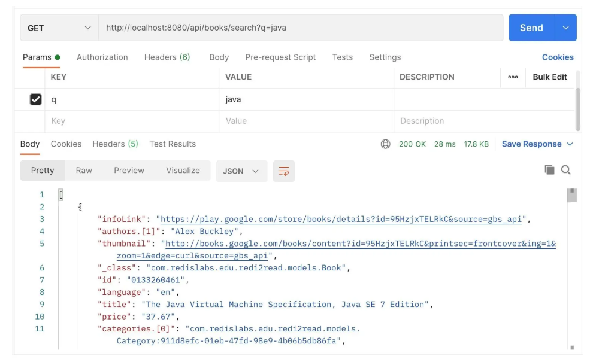
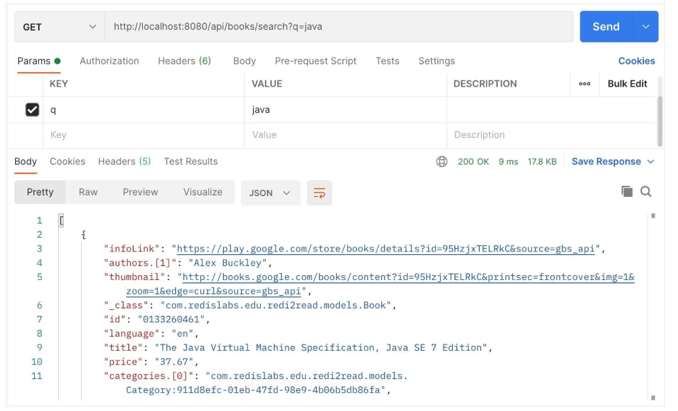

# Cache con redis

## 1. Información general

El caché es una técnica de optimización crucial utilizada para mejorar el rendimiento y la escalabilidad de las aplicaciones web. Almacena temporalmente datos en memoria caché para reducir el tiempo de acceso y la carga sobre los sistemas backend. Redis (Remote Dictionary Server) es un popular almacén de estructuras de datos en memoria, de código abierto, usado como caché, base de datos y broker de mensajes. En este artículo, te guiaremos sobre cómo integrar el caché Redis en una aplicación Spring Boot para mejorar su eficiencia y tiempos de respuesta.

### 1.1 Caché en Spring Boot con Redis

El caché es fundamental para construir aplicaciones de alto rendimiento y escalables. Permite almacenar datos que se acceden frecuentemente en caché, reduciendo la necesidad de acceder a sistemas de almacenamiento subyacentes más lentos, como bases de datos. Redis es un popular almacén de estructuras de datos en memoria usado como caché, base de datos y broker de mensajes. Spring Boot se integra perfectamente con Redis para caché a través de su abstracción Spring Cache.

### 1.2 Introducción al Caché y Redis

- Caché: Consiste en almacenar datos que se acceden con frecuencia en memoria para que futuras solicitudes puedan ser atendidas más rápido, sin necesidad de recuperarlos de la fuente primaria (por ejemplo, base de datos o API).

- Redis: Redis es un almacén de datos en memoria, de código abierto, que soporta varias estructuras de datos como cadenas, hashes, listas, conjuntos y conjuntos ordenados. Redis es muy eficiente y comúnmente usado para caché por su baja latencia y alto rendimiento.

### 1.3 ¿Por qué usar Redis para caché en Spring Boot?

- Rendimiento: Redis opera en memoria, ofreciendo latencia extremadamente baja y acceso a datos a alta velocidad.
- Escalabilidad: Redis maneja un gran número de operaciones de lectura/escritura, siendo apto para aplicaciones altamente escalables.
- Flexibilidad: Soporta varios tipos de datos y operaciones, permitiendo escenarios complejos de caché.
- Persistencia: Redis puede configurarse para persistir datos en disco, brindando un equilibrio entre velocidad y durabilidad.

### 1.4 Abstracción Spring Cache

El framework Spring provee una abstracción de caché que permite definir la lógica de caché sin ligar la aplicación a una solución específica. Esta abstracción puede integrarse fácilmente con distintos proveedores de caché, incluido Redis.

La abstracción Spring Cache utiliza anotaciones para definir el comportamiento del caché:

- @EnableCaching: Habilita la gestión de caché basada en anotaciones de Spring.
- @Cacheable: Indica que el valor retornado por el método debe ser almacenado en caché.
- @CachePut: Actualiza la caché sin interferir con la ejecución del método.
- @CacheEvict: Elimina datos del caché.

### 1.5 Cómo funciona el caché con Redis en Spring Boot

- @Cacheable: Cuando se usa, Spring primero verifica si el valor está en la caché Redis. Si está presente, devuelve el valor almacenado sin ejecutar el método. Si no, ejecuta el método, almacena el resultado en Redis y devuelve ese resultado.
- @CachePut: Actualiza la caché con nuevos datos, independientemente de si el método se ejecutó o no.
- @CacheEvict: Elimina datos del caché, útil para mantener la consistencia cuando los datos subyacentes cambian.

## 2. Dependencias

Para comenzar, agreguemos los artefactos spring-boot-starter-cache y spring-boot-starter-data-redis:

```
<dependency>
    <groupId>org.springframework.boot</groupId>
    <artifactId>spring-boot-starter-cache</artifactId>
</dependency>
<dependency>
    <groupId>org.springframework.boot</groupId>
    <artifactId>spring-boot-starter-data-redis</artifactId>
</dependency>
```

Estos agregan soporte de caché e incorporan todas las dependencias requeridas.

## 3. Configuración

Con Spring Boot y la dependencia requerida ya funcionando con Maven, podemos configurar una instancia local de Redis con solo tres líneas en nuestro archivo application.properties como:

```JAVA
# Redis Config
spring.cache.type=redis
spring.redis.host=localhost
spring.redis.port=6379
```

Además, use la anotación @EnableCaching en la clase principal de Spring Boot:

```JAVA
package com.journaldev.rediscachedemo;

import org.springframework.boot.SpringApplication;
import org.springframework.boot.autoconfigure.SpringBootApplication;
import org.springframework.cache.annotation.EnableCaching;

@SpringBootApplication
@EnableCaching
public class Application {

  public static void main(String[] args) {
    SpringApplication.run(Application.class, args);
  }
}
```

Al agregar las dependencias anteriores y la anotación @EnableCaching, Spring Boot configurará automáticamente un RedisCacheManager con la configuración de caché predeterminada. Sin embargo, podemos modificar esta configuración antes de la inicialización del gestor de caché de un par de maneras útiles.

Primero, creemos un bean RedisCacheConfiguration:

```JAVA
@Bean
public RedisCacheConfiguration cacheConfiguration() {
    return RedisCacheConfiguration.defaultCacheConfig()
      .entryTtl(Duration.ofMinutes(60))
      .disableCachingNullValues()
      .serializeValuesWith(SerializationPair.fromSerializer(new GenericJackson2JsonRedisSerializer()));
}
```

Esto nos da más control sobre la configuración predeterminada. Por ejemplo, podemos establecer los valores deseados de tiempo de vida (TTL) y personalizar la estrategia de serialización predeterminada para la creación de caché en vuelo.

Para tener control total sobre la configuración de caché, registremos nuestro propio bean RedisCacheManagerBuilderCustomizer:

```JAVA
@Bean
public RedisCacheManagerBuilderCustomizer redisCacheManagerBuilderCustomizer() {
    return (builder) -> builder
      .withCacheConfiguration("itemCache",
        RedisCacheConfiguration.defaultCacheConfig().entryTtl(Duration.ofMinutes(10)))
      .withCacheConfiguration("customerCache",
        RedisCacheConfiguration.defaultCacheConfig().entryTtl(Duration.ofMinutes(5)));
}
```

Aquí hemos utilizado RedisCacheManagerBuilder junto con RedisCacheConfiguration para configurar valores TTL de 10 y 5 minutos para itemCache y customerCache, respectivamente. Esto ayuda a ajustar aún más el comportamiento de la caché por caché individual, incluyendo valores nulos, prefijos de claves y serialización binaria.

Vale la pena mencionar que los detalles de conexión predeterminados para la instancia de Redis son localhost:6379. La configuración de Redis puede ser utilizada para ajustar aún más los detalles de conexión de bajo nivel junto con el host y el puerto.

## 4. Ejemplo

### 4.1 Definiendo el Modelo

Para guardar un objeto en la base de datos Redis, definimos un objeto modelo Person con campos básicos:

```JAVA
package com.journaldev.rediscachedemo;

import javax.persistence.*;
import java.io.Serializable;

@Entity
public class User implements Serializable {

    @Id
    private Long id;
    private String name;
    private long followers;

    public User() {
    }

    // constructor, getters y setters estándar
}
```

### 4.2 Definiendo el Repositorio

Antes de mostrar cómo funciona Redis, definiremos un Repositorio para la funcionalidad relacionada con JPA:

```JAVA
package com.journaldev.rediscachedemo;

import org.springframework.data.jpa.repository.JpaRepository;
import org.springframework.stereotype.Repository;

@Repository
public interface UserRepository extends JpaRepository<User, Long> { }
```

No tiene métodos declarados por ahora, ya que no los necesitamos.

### 4.3 Definiendo el Controlador

Los controladores son el lugar donde la caché de Redis es llamada a actuar. De hecho, este es el mejor lugar para hacerlo porque la caché está directamente asociada a él, y la solicitud ni siquiera tendrá que entrar al código del servicio para esperar resultados en caché. Aquí está el esqueleto del controlador:

```JAVA
package com.journaldev.rediscachedemo;

import org.springframework.beans.factory.annotation.Autowired;
import org.springframework.cache.annotation.CacheEvict;
import org.springframework.cache.annotation.CachePut;
import org.springframework.cache.annotation.Cacheable;
import org.springframework.web.bind.annotation.*;

@RestController
public class UserController {

  private final UserRepository userRepository;

  @Autowired
  public UserController(UserRepository userRepository) {
    this.userRepository = userRepository;
  }
   ...
}
```

Ahora, para poner algo en la caché, usamos la anotación @Cacheable:

```JAVA
@Cacheable(value = "users", key = "#userId", unless = "#result.followers < 12000")
@RequestMapping(value = "/{userId}", method = RequestMethod.GET)
public User getUser(@PathVariable String userId) {
  LOG.info("Getting user with ID {}.", userId);
  return userRepository.findOne(Long.valueOf(userId));
}
```

En el mapeo anterior, el método getUser pondrá una persona en una caché llamada ‘users’, identificando a esa persona por la clave ‘userId’ y solo almacenará un usuario con seguidores mayores a 12000. Esto asegura que la caché se llene con usuarios que son muy populares y que se consultan con frecuencia. Además, hemos agregado intencionalmente una línea de log en la llamada al API.

Hagamos algunas llamadas a la API desde Postman en este momento. Estas son las llamadas que hicimos:

```JAVA
localhost:8090/1
localhost:8090/1
localhost:8090/2
localhost:8090/2
```

Si observamos los logs, serán estos:

```JAVA
... : Getting user with ID 1.
... : Getting user with ID 1.
... : Getting user with ID 2.
```

¿Notás algo? Hicimos cuatro llamadas a la API pero solo hay tres registros en el log. Esto se debe a que el usuario con ID 2 tiene 29000 seguidores y, por lo tanto, sus datos fueron cacheados. Esto significa que cuando se hizo una llamada a la API para ese usuario, los datos se devolvieron desde la caché y no se realizó ninguna consulta a la base de datos.

### 4.4 Actualizando la Caché

Los valores de la caché también deben actualizarse cada vez que se actualizan los valores reales de sus objetos. Esto se puede hacer usando la anotación @CachePut:

```JAVA
@CachePut(value = "users", key = "#user.id")
@PutMapping("/update")
public User updatePersonByID(@RequestBody User user) {
  userRepository.save(user);
  return user;
}
```

Con esto, una persona es identificada nuevamente por su ID y se actualiza con los resultados.

### 4.5 Limpiando la Caché

Si algunos datos deben eliminarse de la base de datos real, ya no tiene sentido mantenerlos en la caché. Podemos limpiar los datos de la caché usando la anotación @CacheEvict:

```JAVA
@CacheEvict(value = "users", allEntries=true)
@DeleteMapping("/{id}")
public void deleteUserByID(@PathVariable Long id) {
  LOG.info("deleting person with id {}", id);
  userRepository.delete(id);
}
```

En el último mapeo, simplemente eliminamos las entradas de la caché y no hicimos nada más.

## 5. Ejemplo 2

### 5.1 Crear una configuración opcional de RedisTemplate

Spring Boot autoconfigura RedisTemplate, pero si querés controlar mejor otros aspectos, podés crear tu propio RedisConfig.java:

```JAVA
@Configuration
@EnableCaching
public class RedisConfig {

    @Bean
    public RedisConnectionFactory redisConnectionFactory() {
        return new LettuceConnectionFactory();
    }

    @Bean
    public CacheManager cacheManager(RedisConnectionFactory redisConnectionFactory) {
        RedisCacheConfiguration redisCacheConfiguration = RedisCacheConfiguration.defaultCacheConfig()
                .entryTtl(Duration.ofMinutes(10));
        return RedisCacheManager.builder(redisConnectionFactory)
                .cacheDefaults(redisCacheConfiguration)
                .build();
    }
}
```

👉 ¿Qué hace esto?

- @Configuration: Marca la clase como una configuración de Spring.

- RedisConnectionFactory: Crea la conexión entre tu aplicación y el servidor de Redis. Usa Lettuce, que es un cliente de Redis rápido y no bloqueante.

- CacheManager: Define cómo Spring va a administrar las cachés. En este caso, configuraste que cada entrada en Redis dure 10 minutos.

- @EnableCaching: Sin esta anotación, aunque configures Redis, nunca se activarían las anotaciones @Cacheable o @CacheEvict. Le dice a Spring que empiece a observar las anotaciones relacionadas al caché en todos los servicios.

### 5.2 Usar caché en servicios (@Cacheable)

En los métodos de PetService, usamos @Cacheable.

Por ejemplo:

```JAVA
@Cacheable(value = "getPublicPets", key = "#speciesList?.toString() + '-' + #age + '-' + #sizeList?.toString() + '-' + #sexList?.toString() + '-' + #pageable.pageNumber")
public Page<PetResponse> getPublicPets(List<String> speciesList,
                                       Integer age,
                                       List<String> sizeList,
                                       List<String> sexList,
                                       Pageable pageable) {
    // lógica del método...
}
```

👉 ¿Qué hace esto?

- @Cacheable le dice a Spring: "Antes de ejecutar este método, fíjate si ya existe un resultado guardado en Redis con esta llave".

- value = "getPublicPets": Define el nombre del caché que va a usar (como una "carpeta" dentro de Redis).

- key = ...: Define cómo armar la clave única para guardar o buscar en Redis. Combinas filtros como speciesList, age, sizeList, sexList y la página que se pidió. Así evitas que dos búsquedas distintas se pisen entre sí.

```JAVA
@Cacheable(value = "getPublicPetById", key = "#id")
public PetResponse getPublicPetById(long id) {
    // lógica del método...
}
```

👉 ¿Qué hace esto?

- Cachea una mascota individual basándose en su ID. Si alguien pide el mismo ID, lo devuelve desde Redis, sin tener que ir a la base de datos.

### 5.3 Invalidar (borrar) la cache cuando cambian datos (@CacheEvict)

Cuando alguien crea, actualiza o elimina una mascota, los datos cacheados quedan desactualizados. Ahí es donde entra @CacheEvict, que elimina una entrada (o todo) de Redis cuando ejecutás un método.

```JAVA
@CacheEvict(value = {"getPublicPets"}, allEntries = true)
public Pet createPet(PetRequest petRequest) {
    // Código para crear la mascota...
}
```

👉 ¿Qué hace esto?

- value = "getPublicPets": Dice qué caché afectar.

- allEntries = true: Borra todas las entradas del caché getPublicPets, porque una nueva mascota podría afectar cualquier página o filtro.

```JAVA
@CacheEvict(value = {"getPublicPetById"}, key = "#id")
public Pet updatePet(long id, PetRequest petRequest) {
    // Código para actualizar la mascota...
}
```

👉 ¿Qué hace esto?

- Solo borra el caché de la mascota con ese ID, no todo el caché de mascotas.

### 5.4 Actualizar el cache manualmente (@CachePut)

Si querés ser aún más fino, podés actualizar el caché en vez de solo borrarlo cuando se actualiza algo.
Para eso existe @CachePut.

```JAVA
@CachePut(value = "getPublicPetById", key = "#id")
public PetResponse updatePet(long id, PetRequest petRequest) {
    // Código para actualizar la mascota...
}
```

👉 ¿Qué hace esto?

- Ejecuta el método normal (actualiza DB).

- El resultado se guarda automáticamente en Redis, reemplazando el viejo.

## 6. Resumen

### 6.1 Receta de Caching con Spring-Redis

Para implementar caching en nuestra aplicación Spring Boot:

- Configurar el administrador de caché de Redis
- Habilitar el caching a nivel de aplicación con la anotación @EnableCaching

En el archivo principal de la aplicación (src/main/java/com/redislabs/edu/redi2read/Redi2readApplication.java), agregar el método cacheManager como se muestra:

```JAVA
@SpringBootApplication
@EnableCaching
public class Redi2readApplication {

  // ...

  @Bean
  public RedisCacheManager cacheManager(RedisConnectionFactory connectionFactory) {
    RedisCacheConfiguration config = RedisCacheConfiguration.defaultCacheConfig() //
        .prefixCacheNameWith(this.getClass().getPackageName() + ".") //
        .entryTtl(Duration.ofHours(1)) //
        .disableCachingNullValues();

    return RedisCacheManager.builder(connectionFactory) //
        .cacheDefaults(config) //
        .build();
  }

  // ...
}
```

El método cacheManager toma una instancia de RedisConnectionFactory. En él, configuraremos nuestra caché para usar un prefijo de clave de Redis igual al paquete principal de nuestra aplicación más un punto, es decir, com.redislabs.edu.redi2read. También establecemos el TTL o "Tiempo de Vida" de nuestras entradas de caché en 1 hora y nos aseguramos de no almacenar valores nulos en caché. A nivel de clase, también usamos la anotación @EnableCaching para habilitar el caching globalmente en nuestras aplicaciones.
Los cambios anteriores requerirán las sentencias de importación que se muestran a continuación:

```JAVA
import org.springframework.cache.annotation.EnableCaching;
import org.springframework.data.redis.cache.RedisCacheConfiguration;
import org.springframework.data.redis.cache.RedisCacheManager;
import java.time.Duration;
```

### 6.2 Uso de la anotación @Cacheable

En el contexto de un servicio RESTful, el caching tiene sentido en el punto de traspaso entre la aplicación y el protocolo HTTP. Parece casi tonto pensar en hacer caching en una aplicación impulsada por Redis, pero una lógica de negocio compleja que toque muchos repositorios de datos y realice cálculos intensivos puede aumentar la latencia de tu respuesta.

El lugar ideal para realizar este caching es a nivel de controlador. Por ejemplo, supongamos que queremos almacenar en caché las respuestas de nuestras búsquedas de libros en el BookController. Simplemente podríamos agregar la anotación @Cacheable de la siguiente manera:

```JAVA
@GetMapping("/search")
@Cacheable("book-search")
public SearchResults<String,String> search(@RequestParam(name="q")String query) {
  RediSearchCommands<String, String> commands = searchConnection.sync();
  SearchResults<String, String> results = commands.search(searchIndexName, query);
  return results;
}
```

Ahora, Spring usará Redis para crear claves bajo el prefijo com.redislabs.edu.redi2read.book-search para almacenar las entradas de caché del método search. No hay necesidad de realizar mantenimiento de la caché manualmente. Spring interceptará la solicitud y verificará la caché; en caso de un acierto (hit) de caché, devolverá su valor. De lo contrario, en caso de fallo (miss), almacenará el valor devuelto por el método search en la caché, permitiendo que el método se ejecute como si no existiera caché.

Si probamos la solicitud http://localhost:8080/api/books/search?q=java:

```JAVA
curl --location --request GET 'http://localhost:8080/api/books/search?q=java'
```

En la primera solicitud obtenemos un tiempo de respuesta de 28 ms:



Las respuestas posteriores se devuelven consistentemente en el rango de 8 ms a 10 ms:

