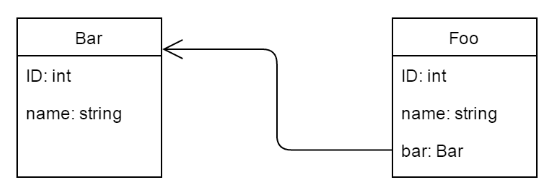

# Auditoría con JPA, Hibernate y Spring Data JPA

## 1. Visión general

En el contexto de ORM, la auditoría de bases de datos significa rastrear y registrar eventos relacionados con entidades persistentes, o simplemente el versionado de entidades. Inspirado en los triggers de SQL, los eventos son operaciones de inserción, actualización y eliminación sobre las entidades. Los beneficios de la auditoría de bases de datos son análogos a los proporcionados por el control de versiones de código fuente.

En este tutorial, demostraremos tres enfoques para introducir auditoría en una aplicación. Primero, lo implementaremos usando JPA estándar. Luego, veremos dos extensiones de JPA que proporcionan su propia funcionalidad de auditoría, una proporcionada por Hibernate, otra por Spring Data.

Aquí están las entidades de ejemplo relacionadas, Bar y Foo, que usaremos en este ejemplo:



## 2. Auditoría con JPA

JPA no contiene explícitamente una API de auditoría, pero podemos lograr esta funcionalidad utilizando eventos del ciclo de vida de las entidades.

### 2.1. @PrePersist, @PreUpdate y @PreRemove

En la clase de Entidad de JPA, podemos especificar un método como un callback, que podemos invocar durante un evento particular del ciclo de vida de la entidad. Como estamos interesados en callbacks ejecutados antes de las correspondientes operaciones DML, las anotaciones de callback @PrePersist, @PreUpdate y @PreRemove están disponibles para nuestros propósitos:

```JAVA
@Entity
public class Bar {
      
    @PrePersist
    public void onPrePersist() { ... }
      
    @PreUpdate
    public void onPreUpdate() { ... }
      
    @PreRemove
    public void onPreRemove() { ... }
      
}
```

Los métodos de callback internos siempre deben devolver void y no deben tomar argumentos. Pueden tener cualquier nombre y cualquier nivel de acceso, pero no deben ser estáticos.

Tenga en cuenta que la anotación @Version en JPA no está estrictamente relacionada con nuestro tema; tiene más que ver con el bloqueo optimista que con los datos de auditoría.

### 2.2. Implementando los métodos de callback

Sin embargo, existe una restricción significativa con este enfoque. Como se establece en la especificación JPA 2 (JSR 317):

> En general, el método de ciclo de vida de una aplicación portátil no debe invocar operaciones de EntityManager o Query, acceder a otras instancias de entidad, ni modificar relaciones dentro del mismo contexto de persistencia. Un método de callback de ciclo de vida puede modificar el estado que no sea de relación de la entidad sobre la que se invoca.

En ausencia de un framework de auditoría, debemos mantener el esquema de la base de datos y el modelo de dominio manualmente. Para nuestro caso de uso simple, agreguemos dos nuevas propiedades a la entidad, ya que solo podemos administrar el "estado no relacionado de la entidad". Una propiedad de operación almacenará el nombre de una operación realizada, y una propiedad de marca de tiempo será para la marca temporal de la operación:

```JAVA
@Entity
public class Bar {
     
    //...
     
    @Column(name = "operation")
    private String operation;
     
    @Column(name = "timestamp")
    private long timestamp;
     
    //...
     
    // standard setters and getters for the new properties
     
    //...
     
    @PrePersist
    public void onPrePersist() {
        audit("INSERT");
    }
     
    @PreUpdate
    public void onPreUpdate() {
        audit("UPDATE");
    }
     
    @PreRemove
    public void onPreRemove() {
        audit("DELETE");
    }
     
    private void audit(String operation) {
        setOperation(operation);
        setTimestamp((new Date()).getTime());
    }
}
```

Si necesitamos agregar dicha auditoría a múltiples clases, podemos usar @EntityListeners para centralizar el código:

```JAVA
@EntityListeners(AuditListener.class)
@Entity
public class Bar { ... }
```

```JAVA
public class AuditListener {
    
    @PrePersist
    @PreUpdate
    @PreRemove
    private void beforeAnyOperation(Object object) { ... }
    
}
```

## 3. Hibernate Envers

Con Hibernate, podemos hacer uso de Interceptors y EventListeners, así como de triggers de base de datos, para lograr auditoría. Pero el framework ORM ofrece Envers, un módulo que implementa auditoría y versionado de clases persistentes.

### 3.1. Comenzar con Envers

Para configurar Envers, necesitamos agregar el JAR de hibernate-envers en nuestro classpath:

```JAVA
<dependency>
    <groupId>org.hibernate.orm</groupId>
    <artifactId>hibernate-envers</artifactId>
    <version>6.4.4.Final</version>
</dependency>
```

Luego agregamos la anotación @Audited, ya sea en una @Entity (para auditar toda la entidad) o en columnas específicas @Column (si solo necesitamos auditar propiedades específicas):

```JAVA
@Entity
@Audited
public class Bar { ... }
```

Tenga en cuenta que Bar tiene una relación de uno a muchos con Foo. En este caso, necesitamos auditar también Foo agregando @Audited en Foo, o configurar @NotAudited en la propiedad de la relación en Bar:

```JAVA
@OneToMany(mappedBy = "bar")
@NotAudited
private Set<Foo> fooSet;
```

### 3.2. Creando tablas de registro de auditoría

Hay varias formas de crear tablas de auditoría:

- configurar hibernate.hbm2ddl.auto en create, create-drop o update, para que Envers pueda crearlas automáticamente
- usar org.hibernate.tool.EnversSchemaGenerator para exportar el esquema completo de la base de datos programáticamente
- configurar una tarea de Ant para generar las sentencias DDL apropiadas
- usar un plugin de Maven para generar un esquema de base de datos a partir de nuestros mapeos (como Juplo) para exportar el esquema de Envers (funciona con Hibernate 4 y versiones superiores)

Seguiremos la primera opción, ya que es la más directa, pero tenga en cuenta que usar hibernate.hbm2ddl.auto no es seguro en producción.

En nuestro caso, las tablas bar_AUD y foo_AUD (si también configuramos Foo como @Audited) deberían generarse automáticamente. Las tablas de auditoría copian todos los campos auditados de la tabla de la entidad con dos campos adicionales, REVTYPE (los valores son: "0" para agregar, "1" para actualizar, y "2" para eliminar una entidad) y REV.

Además de estas, se generará por defecto una tabla extra llamada REVINFO. Incluye dos campos importantes, REV y REVTSTMP, y registra la marca temporal de cada revisión. Como podemos suponer, bar_AUD.REV y foo_AUD.REV son en realidad claves foráneas a REVINFO.REV.

### 3.3. Configurando Envers

Podemos configurar propiedades de Envers igual que cualquier otra propiedad de Hibernate.

Por ejemplo, cambiemos el sufijo de la tabla de auditoría (que por defecto es "_AUD") a "_AUDIT_LOG." Así es como configuramos el valor de la propiedad correspondiente org.hibernate.envers.audit_table_suffix:

```JAVA
Properties hibernateProperties = new Properties(); 
hibernateProperties.setProperty(
  "org.hibernate.envers.audit_table_suffix", "_AUDIT_LOG"); 
sessionFactory.setHibernateProperties(hibernateProperties);
```

Un listado completo de propiedades disponibles se puede encontrar en la documentación de Envers.

### 3.4. Accediendo al historial de la entidad

Podemos consultar datos históricos de una manera similar a cómo consultamos datos mediante la API de Criterios de Hibernate. Podemos acceder al historial de auditoría de una entidad usando la interfaz AuditReader, que podemos obtener con un EntityManager o Session abiertos a través de AuditReaderFactory:

```JAVA
AuditReader reader = AuditReaderFactory.get(session);
```

Envers proporciona AuditQueryCreator (retornado por AuditReader.createQuery()) para crear consultas específicas de auditoría. La siguiente línea devolverá todas las instancias de Bar modificadas en la revisión #2 (donde bar_AUDIT_LOG.REV = 2):

```JAVA
AuditQuery query = reader.createQuery()
  .forEntitiesAtRevision(Bar.class, 2)
```

Así es como podemos consultar las revisiones de Bar. El resultado será obtener una lista de todas las instancias auditadas de Bar en todos sus estados:

```JAVA
AuditQuery query = reader.createQuery()
  .forRevisionsOfEntity(Bar.class, true, true);
```

Si el segundo parámetro es falso, el resultado se une con la tabla REVINFO. De lo contrario, solo se devuelven instancias de la entidad. El último parámetro especifica si se deben devolver instancias de Bar eliminadas.

Luego podemos especificar restricciones usando la clase de fábrica AuditEntity:

```JAVA
query.addOrder(AuditEntity.revisionNumber().desc());
```

## 4. Spring Data JPA

Spring Data JPA es un framework que extiende JPA agregando una capa extra de abstracción sobre el proveedor de JPA. Esta capa soporta la creación de repositorios JPA extendiendo las interfaces de repositorio de Spring JPA.

Para nuestros propósitos, podemos extender CrudRepository<T, ID extends Serializable>, la interfaz para operaciones CRUD genéricas. Tan pronto como hayamos creado e inyectado nuestro repositorio en otro componente, Spring Data proporcionará la implementación automáticamente, y estaremos listos para agregar funcionalidad de auditoría.

### 4.1. Habilitando la auditoría de JPA

Para comenzar, queremos habilitar la auditoría mediante configuración de anotaciones. Para hacerlo, agregamos @EnableJpaAuditing en nuestra clase @Configuration:

```JAVA
@Configuration
@EnableTransactionManagement
@EnableJpaRepositories
@EnableJpaAuditing
public class PersistenceConfig { ... }
```

### 4.2. Agregando el Entity Callback Listener de Spring

Como ya sabemos, JPA proporciona la anotación @EntityListeners para especificar clases listener de callbacks. Spring Data proporciona su propia clase de listener de entidad JPA, AuditingEntityListener. Así que vamos a especificar el listener para la entidad Bar:

```JAVA
@Entity
@EntityListeners(AuditingEntityListener.class)
public class Bar { ... }
```

Ahora podemos capturar información de auditoría por medio del listener al persistir y actualizar la entidad Bar.

### 4.3. Rastreando las fechas de creación y última modificación

A continuación, agregaremos dos nuevas propiedades para almacenar las fechas de creación y última modificación en nuestra entidad Bar. Las propiedades son anotadas respectivamente con las anotaciones @CreatedDate y @LastModifiedDate, y sus valores se establecen automáticamente:

```JAVA
@Entity
@EntityListeners(AuditingEntityListener.class)
public class Bar {
    
    //...
    
    @Column(name = "created_date", nullable = false, updatable = false)
    @CreatedDate
    private long createdDate;

    @Column(name = "modified_date")
    @LastModifiedDate
    private long modifiedDate;
    
    //...
    
}
```

Generalmente, movemos las propiedades a una clase base (anotada con @MappedSuperClass), que todas nuestras entidades auditadas extenderían. En nuestro ejemplo, las agregamos directamente en Bar por simplicidad.

### 4.4. Auditando el autor de los cambios con Spring Security

Si nuestra aplicación usa Spring Security, podemos rastrear cuándo se hicieron cambios y quién los hizo:

```JAVA
@Entity
@EntityListeners(AuditingEntityListener.class)
public class Bar {
    
    //...
    
    @Column(name = "created_by")
    @CreatedBy
    private String createdBy;

    @Column(name = "modified_by")
    @LastModifiedBy
    private String modifiedBy;
    
    //...
    
}
```

Las columnas anotadas con @CreatedBy y @LastModifiedBy se completan con el nombre del principal que creó o modificó por última vez la entidad. La información proviene de la instancia Authentication de SecurityContext. Si queremos personalizar los valores que se establecen en los campos anotados, podemos implementar la interfaz AuditorAware<T>:

```JAVA
public class AuditorAwareImpl implements AuditorAware<String> {
 
    @Override
    public String getCurrentAuditor() {
        // your custom logic
    }

}
```

Para configurar la aplicación para usar AuditorAwareImpl para buscar el principal actual, declaramos un bean del tipo AuditorAware, inicializado con una instancia de AuditorAwareImpl, y especificamos el nombre del bean como valor del parámetro auditorAwareRef en @EnableJpaAuditing:


```JAVA
@EnableJpaAuditing(auditorAwareRef="auditorProvider")
public class PersistenceConfig {
    
    //...
    
    @Bean
    AuditorAware<String> auditorProvider() {
        return new AuditorAwareImpl();
    }
    
    //...
    
}
```

## 5. Conclusión

En este artículo, consideramos tres enfoques para implementar funcionalidad de auditoría:

- El enfoque puro de JPA es el más básico y consiste en utilizar callbacks del ciclo de vida. Sin embargo, solo se nos permite modificar el estado no relacional de una entidad. Esto hace que el callback @PreRemove sea inútil para nuestros propósitos, ya que cualquier configuración que hagamos en el método será eliminada junto con la entidad.

- Envers es un módulo de auditoría maduro proporcionado por Hibernate. Es altamente configurable y carece de los defectos de la implementación pura de JPA. Por lo tanto, nos permite auditar la operación de eliminación, ya que registra en tablas diferentes a la tabla de la entidad.

- El enfoque de Spring Data JPA abstrae el trabajo con callbacks de JPA y proporciona anotaciones prácticas para propiedades de auditoría. También está listo para la integración con Spring Security. La desventaja es que hereda los mismos defectos del enfoque de JPA, por lo que la operación de eliminación no puede ser auditada.
