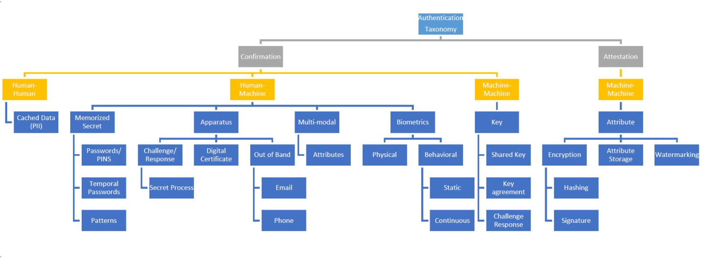
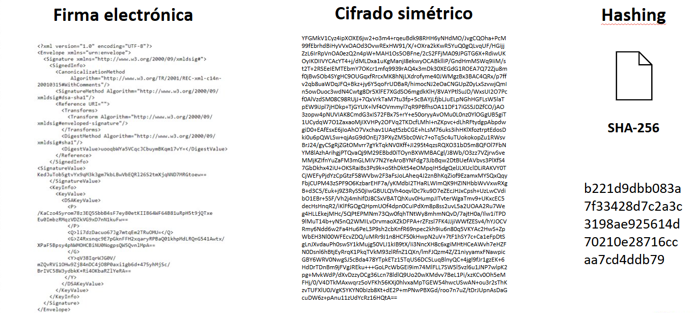

# Autenticación

La autenticación es un pilar fundamental de la seguridad en los sistemas de información. Es el proceso mediante el cual se verifica la identidad de una entidad (persona, organización, dispositivo o proceso) que intenta acceder a un sistema. Este proceso no solo valida que "alguien" o "algo" esté allí, sino que confirma que realmente sea quien dice ser. 

## Fundamentos y Garantía

Autenticar es confirmar una identidad previamente establecida. Este proceso garantiza que una identidad digital —normalmente establecida en el proceso de gestión de identidades— realmente corresponde a quien está intentando acceder al sistema. En otras palabras, mientras la identidad responde a “quién sos”, la autenticación verifica si realmente sos quien decís ser.

Este proceso puede involucrar la validación de personas, organizaciones, procesos automatizados o dispositivos. La forma de llevar a cabo la autenticación depende del tipo de entidad y de los mecanismos tecnológicos y humanos disponibles.

### Garantía de Autenticación

La fortaleza de un mecanismo de autenticación se refiere a su capacidad para resistir ataques o suplantaciones. Esta garantía no es absoluta; es una variable que depende de múltiples factores: tipo de mecanismo, configuración del sistema, calidad del entorno operativo, y contexto. La garantía se mide indirectamente en términos de falsos positivos, tasa de éxito de ataques y robustez del sistema frente a pruebas de resistencia.

## Tipos de Autenticación según Interacción

Los mecanismos de autenticación pueden clasificarse según las partes que participan en la interacción:

Humano-Máquina: es el caso más habitual en sistemas informáticos. Una persona interactúa con una interfaz para ingresar una contraseña, escanear una huella, utilizar un token, etc.

Máquina-Máquina: protocolos automáticos que permiten a sistemas o procesos autenticarse entre sí mediante certificados, claves, o firmas digitales. Ejemplos son TLS (Transport Layer Security), IPsec o DNSSec.

Humano-Humano: ocurre en interacciones sociales donde una persona identifica a otra por su apariencia, voz o comportamiento. También se aplica en escenarios de verificación manual de identidades (por ejemplo, control de acceso físico por parte de personal de seguridad).

## Categorías Clásicas de Autenticación

Los mecanismos de autenticación pueden organizarse según el tipo de evidencia que utiliza la entidad para probar su identidad:

### 1. Secreto Memorizado (Something you know)

El usuario memoriza un dato compartido con el sistema. La autenticación ocurre al ingresar correctamente ese dato.

- Contraseñas: ampliamente utilizadas pero vulnerables si no se gestionan adecuadamente.
- PINs: similares a contraseñas pero normalmente más cortos.
- Preguntas secretas: menos seguras, ya que las respuestas pueden ser adivinadas o recuperadas mediante ingeniería social.

#### Conceptos clave:

- Espacio de claves: número total de combinaciones posibles.
- Fuerza bruta: intento sistemático de todas las combinaciones posibles.
- Tasa (Rate): cuántos intentos por unidad de tiempo puede hacer un atacante.
- Fortaleza del secreto = Espacio de claves / tasa de intentos. Por ejemplo, un PIN de 4 dígitos a una tasa de 1 intento por segundo puede ser adivinado en un máximo de 10,000 segundos (alrededor de 2.8 horas).

#### Contramedidas incluyen:

- Limitar cantidad de intentos antes de bloquear.
- Aumentar la complejidad y longitud.
- Establecer tiempos de validez del secreto.

### 2. Aparatos (Something you have)

El acceso se valida a través de un objeto físico o virtual en posesión del usuario:

- TOTP (Time-Based One-Time Password): genera contraseñas temporales que cambian constantemente, sincronizadas con el tiempo.
- Smartcards: tarjetas inteligentes que contienen un chip criptográfico.
- Apps de autenticación (como Google Authenticator): requieren aprobación o ingreso de un código desde otro canal.

Estos métodos son más seguros que los secretos memorizados porque requieren que el atacante tenga acceso físico al dispositivo.

### 3. Biometría (Something you are)

La autenticación biométrica se basa en características físicas o de comportamiento únicas de una persona:

- Huella dactilar
- Reconocimiento facial
- Iris
- Reconocimiento de voz
- Biometría conductual: como patrones de tipeo o movimientos del mouse.

Este tipo de autenticación presenta desafíos únicos:

- No revocable: si alguien roba tu huella, no podés “cambiarla” como una contraseña.
- Falsos positivos/negativos: nunca hay coincidencia exacta, por lo que se usa un umbral de confianza.
- Susceptible a falsificación: aunque es difícil, es posible replicar huellas o caras con suficiente esfuerzo y tecnología.

### 4. Multi Modal

Implica el uso de más de un mecanismo para autenticar a un usuario. También llamado autenticación multifactor, mejora significativamente la seguridad combinando diferentes categorías:

- Algo que sabés + algo que tenés.
- Algo que sos + algo que sabés.
- Algo que tenés + validación contextual.

Además, puede incluir:

- Tiempo: acceso permitido solo en ciertos horarios.
- Ubicación: acceso solo desde determinadas ubicaciones físicas o redes IP específicas.
- Este enfoque aumenta el costo y la complejidad del ataque, ya que requiere vulnerar múltiples capas simultáneamente.

## Autenticación de Sistemas y Dispositivos

En el caso de dispositivos o sistemas, la autenticación se realiza de manera automática, generalmente basada en criptografía. Esto incluye protocolos como:

- IPSec: para autenticar y cifrar la comunicación en redes IP.
- TLS/SSL: para garantizar la identidad del servidor (y opcionalmente del cliente) en conexiones web.
- DNSSec: para asegurar la autenticidad de las respuestas del sistema de nombres de dominio.

Estos mecanismos son casi siempre transparentes para el usuario final, pero fundamentales para proteger las comunicaciones en la infraestructura digital moderna.

## Casos donde no es posible autenticar directamente

En contextos donde no se puede aplicar una autenticación estándar (por pérdida de credenciales, falta de acceso a mecanismos activos), se recurre a:

- Credenciales de respaldo de una fuente confiable (p. ej., verificación manual con documentos).
- Datos cacheados previamente: el sistema verifica con información antigua registrada (por ejemplo, preguntas secretas o registros previos).

Estos métodos son más costosos y frágiles, ya que requieren personal y están más expuestos a ataques de ingeniería social.

## Certificación

Cuando hablamos de certificación en el contexto de autenticación, nos referimos a un tipo de autenticación que no valida la identidad de una entidad (persona, dispositivo, sistema), sino que verifica la autenticidad de un objeto. Es decir, la pregunta no es "¿quién sos?", sino "¿esto es lo que dice ser?".

Esta verificación se realiza a partir del análisis de uno o varios atributos del objeto en cuestión, y puede involucrar:

- Características físicas
- Propiedades digitales
- Métodos criptográficos
- Códigos internos o marcas únicas

El objetivo principal es asegurar que el objeto no ha sido alterado, suplantado o falsificado. Esto es fundamental en numerosos contextos, como autenticación de software, documentos electrónicos, certificados digitales, dispositivos físicos, e incluso archivos multimedia.

### Mecanismos criptográficos comunes en certificación

En los procesos de certificación suelen emplearse métodos criptográficos avanzados que proporcionan garantía de integridad, autenticidad y a veces confidencialidad. Estos son algunos de los mecanismos clave:

#### Cifrado

El cifrado permite transformar información legible en una forma ilegible para quienes no posean la clave de descifrado. En certificación, puede cumplir distintos roles:

1. Cifrado simétrico

- Utiliza la misma clave para cifrar y descifrar.
- Es rápido y eficiente.
- Se emplea para proteger objetos cuya autenticidad se verifica al desencriptarlos con una clave compartida previamente.
- Ejemplo: protección de archivos que sólo ciertos sistemas autorizados pueden leer.

2. Firma electrónica

- Utiliza criptografía asimétrica.
- Se genera con una clave privada y se verifica con una clave pública.
- Sirve para garantizar que un objeto (por ejemplo, un documento) fue emitido por una entidad específica, y que no ha sido alterado desde entonces.
- Muy común en correos electrónicos, contratos digitales, certificados SSL, etc.

3. Hashing

- No cifra, sino que transforma el contenido en una huella digital (hash).
- Esta huella es única para el contenido original.
- Es útil para verificar que un objeto no ha sido modificado (integridad), comparando su hash actual con el esperado.
- Es irreversible (no se puede recuperar el original a partir del hash), por eso se complementa con otros mecanismos.

#### Almacenamiento de autenticación: Marcas de agua

Otra técnica relacionada con certificación es el uso de marcas de agua digitales (o watermarking).

- Son datos ocultos insertados en archivos multimedia (imágenes, videos, audio).
- Sirven para certificar la autoría o procedencia del archivo. 
- Generalmente no afectan la experiencia del usuario ni la calidad del contenido visible.
- Pueden ser perceptibles (visibles) o imperceptibles (detectables solo mediante análisis).

Ejemplo: un estudio de fotografía incluye un sello digital invisible en las fotos que permite rastrear su uso indebido.

## Medición de la calidad de los mecanismos de autenticación

Para evaluar y comparar los distintos mecanismos de autenticación, se suelen analizar ciertas propiedades clave:

1. Representatividad

- ¿Qué tan bien representa el token (el objeto) a la entidad o contenido que dice representar?
- Una firma digital de un archivo, por ejemplo, tiene alta representatividad si fue generada directamente por el autor.

2. Inimitabilidad

- ¿Qué tan difícil es duplicar el objeto o token sin autorización?
- Un hash seguro o una firma digital con criptografía fuerte tienen alta inimitabilidad.
- Un archivo con nombre modificado, pero sin firma digital, tiene baja inimitabilidad.

3. Entrega segura

- ¿Qué garantías hay de que el objeto no fue alterado entre su creación y su uso?
- Se evalúa la seguridad del canal de transmisión.
- TLS, VPNs, o el uso de certificados ayudan a garantizar entrega segura.

4. Almacenamiento seguro

- ¿Qué tan bien protegida está la información usada para verificar la autenticidad?
- Si una base de datos con claves o certificados está mal protegida, todo el sistema queda expuesto.
- Se deben aplicar buenas prácticas de gestión de secretos, cifrado en reposo, y acceso mínimo necesario.

5. Usabilidad

- Define qué tan fácil, intuitivo y cómodo es para el usuario utilizar un mecanismo de autenticación.
- Un sistema usable es más propenso a ser adoptado correctamente y de forma sostenida.
- Un mecanismo difícil o intrusivo puede llevar al abandono, o incluso a conductas de riesgo (como anotar contraseñas).

6. Satisfacción

- Se refiere a la aceptación subjetiva del mecanismo por parte del usuario.
- No es solo cuestión técnica: también entra en juego la percepción de esfuerzo, comodidad y confiabilidad.

7. Efectividad y eficiencia

- La efectividad mide si el mecanismo permite lograr la meta deseada (ej. impedir acceso no autorizado).
- La eficiencia evalúa cuántos recursos (tiempo, CPU, dinero, complejidad) requiere para lograr esa efectividad.

### ¿Relación inversa?

Muchos estudios han sugerido que existe una relación inversa entre usabilidad y seguridad: cuanto más segura es una medida, más difícil es de usar (y viceversa). Sin embargo, esto no es estrictamente cierto: con un diseño cuidadoso, se pueden lograr soluciones altamente seguras y razonablemente usables.

Ejemplos de esta tensión:

- Contraseñas complejas mejoran la seguridad, pero son difíciles de recordar.
- La biometría es muy usable, pero puede presentar problemas de privacidad o falsos negativos.
- La autenticación multifactor es muy segura, pero puede ser intrusiva si se aplica mal.

La clave del éxito en el diseño de un sistema de autenticación no está en maximizar la seguridad a cualquier costo, sino en encontrar ese punto óptimo donde el sistema es suficientemente seguro y suficientemente usable.

Esto implica:

- Comprender el contexto de uso.
- Evaluar los riesgos y amenazas.
- Diseñar con el usuario en el centro.
- Incorporar capas de seguridad (defensa en profundidad) sin entorpecer la experiencia.