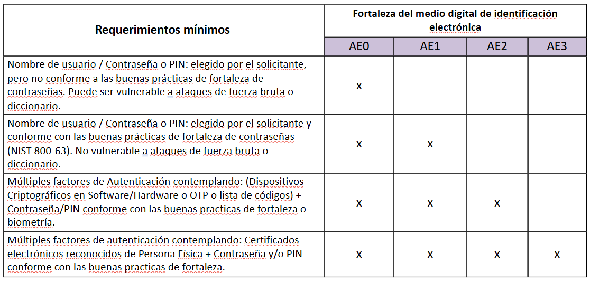
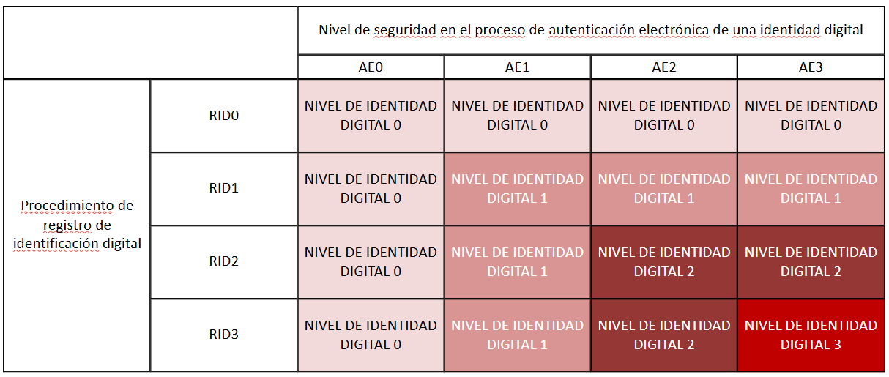

# Usuario GUB.UY

## ¿Qué es Usuario GUB.UY?

Usuario GUB.UY es un sistema centralizado de gestión de identidad digital creado por AGESIC (Agencia de Gobierno Electrónico y Sociedad de la Información y el Conocimiento) de Uruguay. Su propósito fundamental es simplificar y asegurar la identificación y autenticación de los ciudadanos uruguayos (y en ciertos casos, de ciudadanos extranjeros) ante los servicios digitales que ofrece el Estado.

Este sistema responde a la necesidad de brindar un acceso único y seguro a múltiples plataformas del gobierno, permitiendo que el usuario se registre una sola vez para utilizar una gran variedad de servicios digitales estatales, sin tener que gestionar múltiples cuentas y contraseñas.

El sistema implementa dos pasos claves del proceso IAA (Identificación, Autenticación y Autorización):

- Identificación, que consiste en declarar quién se es.
- Autenticación, que busca validar esa declaración mediante algún mecanismo confiable (contraseña, certificado digital, biometría, etc.).
- Una vez el usuario se ha identificado y autenticado correctamente, accede a los servicios digitales en función de su nivel de seguridad verificado.

## Mecanismos de Autenticación

Usuario GUB.UY implementa distintos mecanismos de autenticación que se adaptan a diferentes niveles de seguridad, dependiendo de la criticidad del servicio que se quiere utilizar:

- Contraseñas tradicionales: método más básico, puede complementarse con factores adicionales de seguridad.
- Autenticación de doble factor (2FA): agrega un segundo paso de verificación (como un código enviado por SMS o generado por una app de autenticación).
- Certificados digitales: asociados al chip de la cédula electrónica, permiten una autenticación altamente segura.
- Biometría (huella dactilar): usada especialmente en contextos controlados o presenciales.

## Federación de autenticación

Usuario GUB.UY también permite mecanismos de federación de autenticación, lo que significa que se puede utilizar una cuenta de otro proveedor confiable (federado) para acceder a servicios. Esto es útil cuando existen múltiples entes emisores de identidad digital.

Los dos estándares usados son:

- OpenID Connect: protocolo basado en OAuth 2.0, utilizado ampliamente para permitir autenticación con proveedores como Google o Microsoft.
- SAML (Security Assertion Markup Language): más usado en entornos institucionales y gubernamentales, permite intercambio seguro de identidades.

Además, el sistema se encuentra federado con otros prestadores como TuID e ID Digital, lo que permite interoperabilidad de identidades.

## Identificación: Registro del Usuario

Modalidades de registro

- Registro presencial: el usuario se presenta ante un agente autorizado (Punto de Atención a la Ciudadanía) con su documento, y un funcionario verifica su identidad.

- Auto-registro básico: el ciudadano ingresa sus datos en línea y confirma su identidad mediante un correo electrónico. Este método genera una cuenta con privilegios mínimos (nivel RID0).

- Auto-registro con certificado: usando la cédula electrónica y un lector de tarjetas, se puede generar una cuenta digital más segura, ya que la identidad se verifica con el certificado del chip.

### Documentos aceptados

- Se aceptan todos los documentos nacionales de identidad emitidos por países de América del Sur.
- Para ciudadanos de otros continentes, el uso de pasaporte es obligatorio para su validación.

## Niveles de Registro (RID)

El sistema distingue entre distintos niveles de Identificación y Autenticación, dependiendo del método y rigurosidad del registro del usuario. Esta clasificación determina qué servicios o funcionalidades están disponibles para el usuario:

| Nivel | Descripción                                                                                                      |
|-------|------------------------------------------------------------------------------------------------------------------|
| RID0  | Registro en línea sin verificación de datos (cuenta básica).                                                    |
| RID1  | Registro en línea con validación de datos ingresados.                                                           |
| RID2  | Registro en línea con validación presencial (en Punto de Atención). Habilita el uso de 2FA.                    |
| RID3  | Registro a través de un prestador acreditado ante la UCE (Unidad de Certificación Electrónica). Equivale a una identificación presencial completa. |

Cada uno de estos niveles representa un escalón en la confiabilidad del vínculo entre la cuenta digital y la persona física.

## Cédula de Identidad Electrónica

Desde 2015, Uruguay ha implementado una cédula de identidad electrónica que cumple funciones tanto físicas como digitales para la identificación segura en entornos digitales.

### Características técnicas

Sin contacto:

- Actúa como documento de viaje electrónico, útil para situaciones donde un humano verifica la identidad de otro humano (ej: aduanas).
- Incorpora elementos como un chip RFID y medidas de seguridad físicas.

Con contacto:

- Incluye un certificado digital dentro del chip de contacto, que puede utilizarse para firmar digitalmente y autenticarse en servicios online.
- Permite match-on-card con huellas digitales, útil en contextos controlados como oficinas estatales o sistemas biométricos cerrados.

### Funcionalidades

- Autenticación remota segura: a través del certificado digital, el usuario puede probar su identidad sin necesidad de estar presente físicamente.

- Firma electrónica avanzada: el certificado permite realizar trámites legales o firmar documentos con la misma validez que una firma manuscrita.

- Autenticación biométrica: en combinación con sistemas de lectura de huellas, puede confirmar la identidad del usuario con alta precisión.