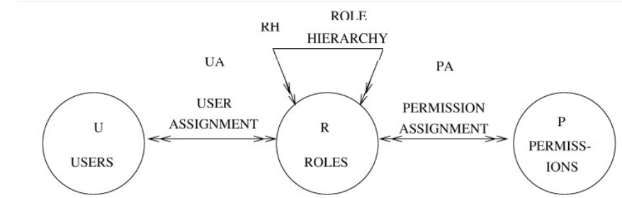

# Autorización

La autorización es un pilar fundamental en la seguridad informática. Es el proceso que determina si una entidad (persona, sistema o aplicación) tiene permiso para realizar una acción específica sobre un recurso dentro de un sistema. A diferencia de la autenticación, que busca validar la identidad de una entidad, la autorización se enfoca en determinar qué puede hacer esa entidad una vez ha sido identificada.

Existen varios modelos de control de acceso que definen cómo se implementa la autorización dentro de un sistema. Cada uno tiene sus propios mecanismos, ventajas, limitaciones y casos de uso ideales.

## MAC – Mandatory Access Control

El control de acceso obligatorio (MAC, por sus siglas en inglés) se caracteriza por estar completamente regulado por una autoridad central, que define políticas de seguridad de forma rígida y no modificables por los usuarios individuales. Este modelo se utiliza principalmente en entornos donde la seguridad es crítica, como instituciones gubernamentales o militares.

Cada recurso dentro del sistema, como archivos, bases de datos o servicios, recibe una etiqueta de seguridad. De forma similar, a cada entidad (usuario o proceso) también se le asigna una etiqueta o nivel de acceso. Estas etiquetas representan distintos niveles de sensibilidad de la información, y forman un orden parcial.

Ejemplo de jerarquía de etiquetas:

Público ≤ Confidencial ≤ Restringido ≤ Secreto

El principio clave en MAC es que una entidad solo puede acceder a un recurso si su nivel de autorización es igual o superior al nivel del recurso, y además cumple con las restricciones de categoría. Esto introduce el concepto de etiquetado compuesto, como (S, C), donde:

- S representa el nivel de seguridad (por ejemplo, Confidencial),
- C es un conjunto de categorías (por ejemplo, marketing, operaciones, etc.).

### Evaluación de acceso mediante tuplas (S, C):

Supongamos una persona tiene acceso con nivel:

(Restringido, {marketing, comercial})

Entonces:

- ¿Puede acceder a un documento (Confidencial, {marketing})?
    - Sí, porque Restringido ≥ Confidencial y {marketing} ⊆ {marketing, comercial}.

- ¿Puede acceder a (Restringido, {operaciones})?
    - No, aunque tiene el mismo nivel de seguridad, la categoría requerida (operaciones) no está en su conjunto autorizado.

- ¿Qué permiso necesita alguien para ver (Público, {marketing})?
    - Cualquier entidad con nivel ≥ Público y que contenga “marketing” en sus categorías.

Este modelo es extremadamente seguro, ya que los usuarios no pueden modificar sus permisos, pero también es poco flexible y complejo de administrar en organizaciones dinámicas.

## DAC – Discretionary Access Control

El modelo de control de acceso discrecional (DAC) permite que el propietario de un recurso controle quién puede acceder a él y con qué permisos. Es el modelo más común en sistemas operativos como Windows o Linux, y se basa en una premisa sencilla pero poderosa: los usuarios tienen control sobre los objetos que crean o poseen.

En este esquema, los permisos son definidos por los propios usuarios, quienes pueden conceder o revocar accesos a otros sujetos sobre los objetos que les pertenecen. La relación básica se describe como:

Un sujeto S posee el permiso R sobre el objeto O.

Donde:

- Sujeto: representa un proceso o usuario actuando en nombre de una entidad.
- Permiso (R): puede ser leer, escribir, ejecutar, eliminar, entre otros.
- Objeto: cualquier recurso accesible en el sistema (archivo, carpeta, base de datos, etc.).

### Implementación técnica

La gestión de permisos en DAC se realiza habitualmente mediante Listas de Control de Acceso (ACL, por sus siglas en inglés). Estas listas detallan qué usuarios tienen qué permisos sobre un recurso específico. También pueden representarse mediante matrices de acceso, donde las filas corresponden a sujetos, las columnas a objetos, y las celdas indican los permisos correspondientes.

Ejemplo de ACL:

| Objeto       | Sujeto | Permisos        |
|--------------|--------|-----------------|
| archivo.txt  | Juan   | leer, escribir  |
| archivo.txt  | María  | solo leer       |

DAC es flexible y fácil de implementar, pero menos seguro que MAC porque un usuario puede otorgar sin querer permisos excesivos a otros usuarios o procesos, creando riesgos de seguridad si no se gestiona correctamente.

## RBAC – Role-Based Access Control

El modelo de control de acceso basado en roles (RBAC) introduce una capa de abstracción más eficiente para administrar permisos en entornos complejos. En lugar de asignar permisos directamente a los usuarios, estos se asignan a roles, y los usuarios obtienen permisos al ser asignados a esos roles.

### Elementos clave

- Usuario: es la identidad que interactúa con el sistema.
- Rol: representa una función dentro de una organización (por ejemplo, Administrador, Vendedor, Auditor). A cada rol se le asigna un conjunto de permisos.
- Permiso: es una operación que se puede realizar sobre un recurso (como “crear factura” o “acceder a reportes”).

### Ventajas principales

- Escalabilidad: en sistemas con muchos usuarios, es mucho más sencillo modificar permisos de un rol que actualizar cada usuario individualmente.
- Organización lógica: los permisos se asignan según funciones y responsabilidades.
- Facilidad de auditoría: es más sencillo saber quién tiene acceso a qué recursos y por qué.

### Relaciones importantes

- Asignación de usuarios: relación N a M entre usuarios y roles. Un usuario puede tener múltiples roles.
- Jerarquía de roles: se pueden definir relaciones entre roles (por ejemplo, el rol Gerente hereda permisos del rol Empleado). Esta jerarquía es una relación N a M sin ciclos, lo que evita bucles lógicos en la estructura.

### Ejemplo

- Rol: “Supervisor de Ventas”
    - Permisos: “Ver reportes”, “Aprobar descuentos”
- Usuario: Laura
    - Roles: “Supervisor de Ventas”, “Empleado”

RBAC es ampliamente adoptado en sistemas empresariales, plataformas en la nube, y sistemas de gestión de bases de datos por su equilibrio entre seguridad, organización y facilidad de administración.
