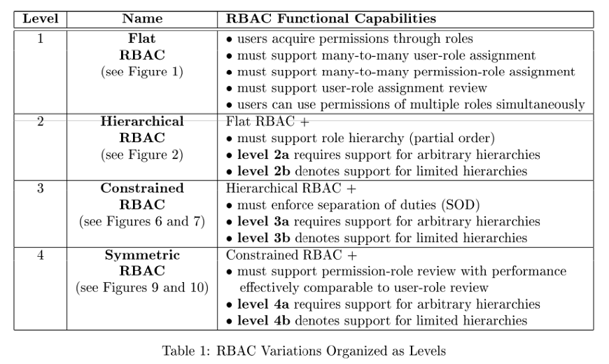
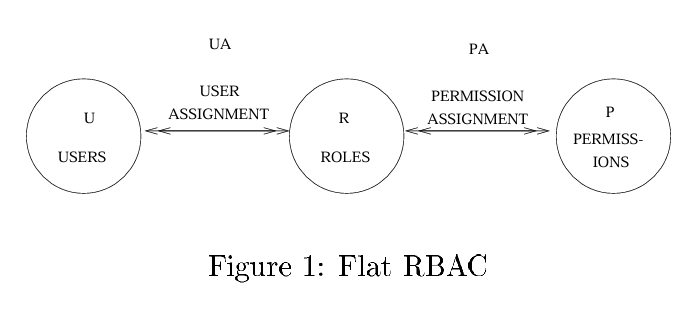
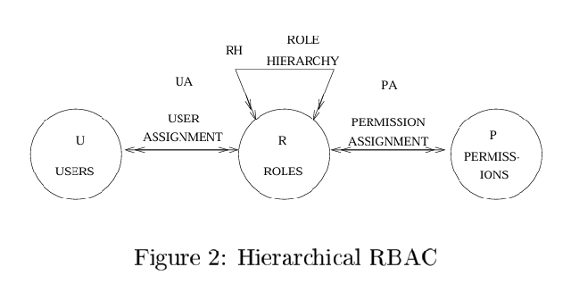
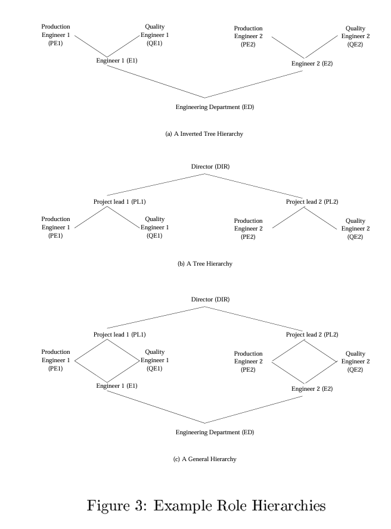
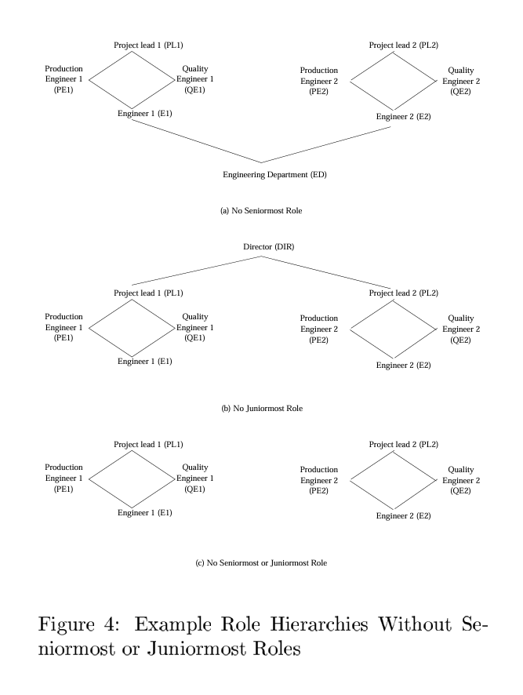
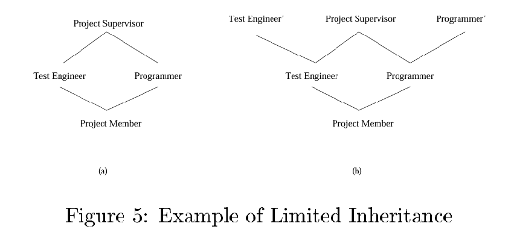
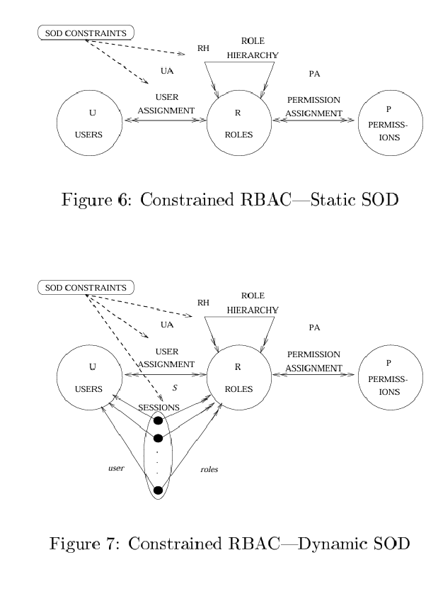
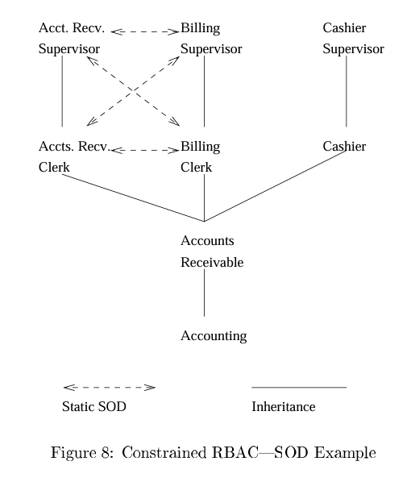
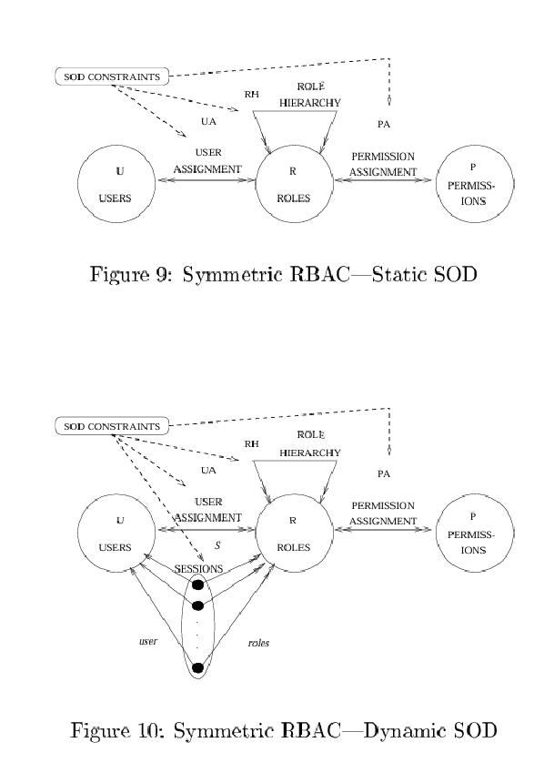

# El Modelo NIST para el Control de Acceso Basado en Roles

Hacia un Estándar Unificado

## 1 INTRODUCCIÓN

Este documento propone un modelo de referencia estándar para el control de acceso basado en roles (RBAC). RBAC es una tecnología que es tanto nueva como antigua. Aunque los modelos rigurosos de RBAC han aparecido recientemente, el concepto básico de roles ha sido utilizado durante décadas como un medio para gestionar privilegios. La falta de estándares para RBAC ha llevado a que los roles se implementen de diferentes maneras, obstaculizando el avance de la tecnología RBAC. El término RBAC en sí no tiene un significado generalmente aceptado, y es utilizado de distintas formas por diferentes proveedores y usuarios. El objetivo de este documento es proporcionar un estándar en este ámbito.

RBAC proporciona un valioso nivel de abstracción para promover la administración de la seguridad a nivel empresarial en lugar de a nivel de identidad de usuario. El concepto básico de rol es simple: establecer permisos basados en los roles funcionales de la empresa, y luego asignar apropiadamente a los usuarios a un rol o conjunto de roles. Con RBAC, las decisiones de acceso se basan en los roles que tienen los usuarios individuales como parte de una empresa. Los roles podrían representar las tareas, responsabilidades y calificaciones asociadas con una empresa.

Dado que los roles dentro de una empresa son relativamente persistentes con respecto a la rotación de usuarios y la reasignación de tareas, RBAC proporciona un mecanismo poderoso para reducir la complejidad, el costo y el potencial de error en la asignación de permisos de usuario dentro de la empresa.

Debido a que los roles dentro de una empresa típicamente tienen permisos superpuestos, los modelos RBAC a menudo incluyen características para establecer jerarquías de roles, donde un rol dado puede incluir todos los permisos de otro rol.

RBAC permite la especificación y aplicación de una variedad de políticas de protección que pueden adaptarse según cada empresa. Las políticas aplicadas dentro de un sistema particular son el resultado de la configuración de varios componentes de RBAC.

Este enfoque para el control de acceso y la gestión de autorización representa un cambio radical respecto a los estándares de control de acceso existentes—como el control de acceso clásico discrecional y obligatorio—donde la política está esencialmente “preestablecida” en el modelo de control de acceso.

Dado que los permisos están organizados en funciones empresariales mediante roles, las relaciones de conflicto de interés son más evidentes que si se gestionaran los permisos individualmente. Como tal, muchos modelos RBAC permiten el establecimiento de restricciones de separación de funciones entre roles. Esto proporciona a los administradores capacidades mejoradas para especificar y hacer cumplir la política empresarial en comparación con los estándares de control de acceso existentes.

Debido a la demanda de los clientes por RBAC, los proveedores han incorporado características de RBAC en sus productos de base de datos, gestión de sistemas y sistemas operativos. Estos esfuerzos de desarrollo continúan sin ningún acuerdo general sobre qué constituye realmente las características de RBAC.

Como intento de definir rigurosamente las características de RBAC, se han propuesto e implementado varios modelos RBAC [FK92, FCK95, FBK99, Gui95, NO99, RS98, SCFY96, San98b, San98a, TDH92]. Estos modelos han sido propuestos independientemente sin ningún intento de estandarizar las características fundamentales de RBAC. Como tal, RBAC sigue siendo un concepto amorfo.

Una forma de fomentar el desarrollo y uso de la tecnología RBAC es desarrollar estándares. El modelo RBAC del NIST es un primer paso en esta dirección.

RBAC es un concepto amplio y abierto que abarca desde lo muy simple en un extremo hasta lo bastante complejo y sofisticado en el otro. Se ha reconocido que un único modelo definitivo para RBAC es, por lo tanto, poco realista. Tal modelo incluiría o excluiría demasiado, y representaría solo un punto dentro de un espectro de opciones.

El modelo RBAC del NIST está, por consiguiente, organizado en una secuencia de cuatro pasos de capacidades funcionales crecientes que se describen a continuación.

Estos niveles son acumulativos en el sentido de que cada uno incluye los requisitos de los anteriores en la secuencia:

- RBAC Plano
- RBAC Jerárquico
- RBAC Restringido
- RBAC Simétrico

## 2 VISIÓN GENERAL DEL MODELO

Esta sección de proporciona una visión general del modelo RBAC del NIST, tal como se resume en la tabla 1. También se da una justificación para los cuatro niveles del modelo.

El modelo RBAC del NIST está organizado en una secuencia de cuatro pasos con capacidades funcionales crecientes, como se da a continuación. Estos niveles son acumulativos, es decir, cada uno incluye los requisitos de los anteriores en la secuencia. Cada nivel añade exactamente un nuevo requisito. La justificación para especificar esta secuencia y para la elección de características añadidas en cada nivel se da a continuación, a medida que se describe cada nivel. Se brinda una justificación adicional en las secciones posteriores que discuten cada nivel por separado.

### 2.1 RBAC Plano (Flat RBAC)

El RBAC plano encarna los aspectos esenciales del RBAC. El concepto básico de RBAC es que los usuarios se asignan a roles, los permisos se asignan a roles, y los usuarios adquieren permisos al ser miembros de roles.

El modelo RBAC del NIST requiere que la asignación usuario-rol y permiso-rol pueda ser de muchos a muchos. Así, un mismo usuario puede estar asignado a muchos roles y un solo rol puede tener muchos usuarios. Lo mismo aplica para los permisos.

RBAC plano tiene un requisito de revisión usuario-rol, mediante el cual se puede determinar qué roles están asignados a un usuario específico, así como qué usuarios están asignados a un rol específico. (Un requisito similar para revisión permiso-rol se impone en RBAC simétrico).

Finalmente, RBAC plano requiere que los usuarios puedan ejercer simultáneamente los permisos de múltiples roles. Esto excluye productos que restringen a los usuarios a activar solo un rol a la vez.

Justificación:

RBAC plano captura las características del control de acceso tradicional basado en grupos, tal como se ha implementado en sistemas operativos hasta la generación actual. Como tal, es una tecnología ampliamente desplegada y familiar. Las características requeridas de RBAC plano son obligatorias para cualquier forma de RBAC y son casi obvias. La cuestión principal al definir RBAC plano es determinar qué características excluir. El modelo RBAC del NIST ha mantenido deliberadamente un conjunto muy mínimo de características en el RBAC plano. En particular, estas características acomodan un control de acceso tradicional pero robusto basado en grupos. No todo mecanismo basado en grupos califica, debido a los requisitos dados anteriormente.

### 2.2 RBAC Jerárquico (Hierarchical RBAC)

RBAC jerárquico añade el requisito de soporte para jerarquías de roles. Una jerarquía es, matemáticamente, un orden parcial que define una relación de jerarquía entre roles, por la cual los roles superiores adquieren los permisos de sus roles inferiores.

El modelo del NIST reconoce dos subniveles en este sentido:

- RBAC Jerárquico General

En este caso, se permite un orden parcial arbitrario como jerarquía de roles.

- RBAC Jerárquico Restringido

Algunos sistemas pueden imponer restricciones sobre la jerarquía de roles. Comúnmente, las jerarquías se limitan a estructuras simples como árboles invertidos.

Estos subniveles también se aplican a las formas posteriores de RBAC, como se indica en la tabla 1.

Las jerarquías de roles pueden ser jerarquías de herencia (donde la activación de un rol implica la activación de todos los roles inferiores), jerarquías de activación (donde no hay tal implicancia), o ambas. La naturaleza precisa de una jerarquía de roles queda abierta.

Justificación:

Las jerarquías de roles en forma de órdenes parciales arbitrarios son la característica más deseada además del RBAC plano. Esta característica se ha mencionado frecuentemente en la literatura y está disponible en varios productos existentes. 

La justificación para requerir las propiedades transitiva, reflexiva y antisimétrica de un orden parcial ha sido ampliamente discutida [SCFY96]. Hay un fuerte consenso sobre este aspecto. También hay consenso sobre los beneficios de soportar órdenes parciales arbitrarios.

Sin embargo, existen productos que solo soportan jerarquías restringidas, las cuales aún proporcionan capacidades significativamente mejoradas respecto al modelo plano. Por tanto, se reconocen dos subniveles en este contexto.

### 2.3 RBAC Restringido (Constrained RBAC)

RBAC restringido añade el requisito de hacer cumplir la separación de deberes (SOD, por sus siglas en inglés). La SOD es una técnica tradicional para reducir la posibilidad de fraude y daño accidental, conocida y practicada mucho antes de la existencia de las computadoras.

La SOD distribuye la responsabilidad y la autoridad de una acción o tarea entre múltiples usuarios, elevando así el riesgo de cometer un acto fraudulento al requerir la participación de más de una persona.

Se han identificado muchos tipos diferentes de SOD en la literatura. Estos incluyen SOD estática (basada en la asignación usuario-rol) y SOD dinámica (basada en la activación de roles). El modelo RBAC del NIST deja abierta la forma exacta de SOD que se apoya.

Justificación:

La SOD se menciona a menudo como una de las principales motivaciones detrás de RBAC. Se practica rutinariamente en organizaciones y debe ser soportada por productos sofisticados de control de acceso. Se introduce después de las jerarquías principalmente porque los productos existentes suelen soportar jerarquías antes que la SOD.

### 2.4 RBAC Simétrico (Symmetric RBAC)

RBAC simétrico añade el requisito de revisión permiso-rol, similar a la revisión usuario-rol introducida en el nivel 1. Así, se puede determinar a qué roles está asignado un permiso en particular, así como qué permisos están asignados a un rol específico. El desempeño de la revisión permiso-rol debe ser efectivamente comparable al de la revisión usuario-rol.

Justificación:

El requisito de revisión permiso-rol se ha pospuesto hasta el nivel 4 porque puede ser intrínsecamente difícil de implementar en sistemas distribuidos a gran escala. A veces se menciona como un aspecto intrínseco del RBAC que lo distingue del control de acceso basado en grupos.

El modelo del NIST adopta un enfoque pragmático en este aspecto: esta característica, difícil de implementar en ciertos entornos, se reserva para niveles más altos de RBAC.

## 3 RBAC PLANO

RBAC plano se ilustra en la figura 1.

Las características requeridas de RBAC plano son obligatorias para cualquier forma de RBAC y son casi obvias. El principal problema con RBAC plano son las características que han sido excluidas. RBAC plano captura las características del control de acceso tradicional basado en grupos tal como se implementa en los sistemas operativos de la generación actual.

Algunos podrían argumentar que estas características no son suficientes para merecer la designación de RBAC. El modelo RBAC del NIST reconoce el control de acceso tradicional basado en grupos como el primer nivel de RBAC porque es una tecnología ampliamente desplegada y familiar que sirve bien como punto de partida para RBAC.

Este enfoque evita el habitual debate infructuoso sobre la diferencia entre roles y grupos [San97] al reconocer la comunalidad subyacente. Al mismo tiempo, al permitir niveles adicionales más sofisticados de RBAC, el modelo del NIST reconoce que RBAC es más que simplemente otro nombre para controles de acceso tradicionales pero robustos basados en grupos.

Un aspecto importante de RBAC plano es la capacidad de soportar una relación de asignación de usuario a rol de muchos a muchos. Claramente, todo sistema práctico tendrá algún límite en el número de roles a los que un usuario puede pertenecer. Al mismo tiempo, los productos deberían tener cierta escalabilidad en este aspecto. Algunos sistemas actuales imponen un límite muy pequeño, como 16 o 32, en el número de roles a los que se puede asignar un usuario. Otros permiten números mayores en los cientos e incluso miles. El modelo del NIST no legisla un mínimo cuantitativo que deba ser soportado para satisfacer el requerimiento plano. Un modelo operacional necesitaría especificar requerimientos numéricos al respecto.

Hay otros aspectos de RBAC donde surgen problemas de escalabilidad similares. El requisito de que los usuarios adquieran permisos a través de roles es la esencia de RBAC. RBAC plano no excluye otros medios por los cuales los usuarios pueden adquirir permisos tales como por asignación directa al usuario o por medio de etiquetas de seguridad en el control de acceso basado en retículos [San93].

La figura 1 muestra tres conjuntos de entidades llamados usuarios (U), roles (R) y permisos (P).

- Un usuario en este modelo es un ser humano u otro agente autónomo como un proceso o una computadora.
- Un rol es una función laboral o título dentro de la organización con cierta semántica asociada respecto a la autoridad y responsabilidad conferidas a un miembro del rol.
- Un permiso es una aprobación de un modo particular de acceso a uno o más objetos en el sistema.

Los términos autorización, derecho de acceso y privilegio también se usan en la literatura para denotar un permiso. Los permisos son siempre positivos y confieren la capacidad al titular del permiso para realizar alguna(s) acción(es) en el sistema.

La naturaleza de un permiso depende en gran medida de los detalles de implementación de un sistema y del tipo de sistema que sea. Un modelo general para control de acceso debe por lo tanto tratar los permisos como símbolos no interpretados hasta cierto punto. La naturaleza exacta de los permisos en un sistema queda abierta en RBAC plano.

RBAC plano requiere que la asignación usuario-rol (UA) y la asignación permiso-rol (PA) sean relaciones de muchos a muchos. Este es un aspecto esencial de RBAC.

El concepto de una sesión no es explícitamente parte de RBAC plano. Una sesión corresponde a una ocasión particular en que un usuario inicia sesión en el sistema para llevar a cabo alguna actividad. La semántica de una sesión varía ampliamente de sistema a sistema. En algunos casos, todos los roles de un usuario (según se asignan en la relación UA) se activan en cada sesión del usuario. En otros casos, se le da al usuario la opción de activar y desactivar roles en una sesión determinada a discreción del usuario. Esto permite al usuario activar sesiones con roles apropiados para la tarea que el usuario está realizando. En particular, los roles poderosos pueden mantenerse inactivos hasta que se necesiten para proveer un elemento de mínimo privilegio y seguridad. Algunos sistemas limitan a los usuarios a la activación de un solo rol en una sesión.

El modelo del NIST no requiere soporte para sesiones con activación de roles discrecional. Sí requiere la capacidad de activar múltiples roles simultáneamente y en una sola sesión. Esto excluye productos que limitan a los usuarios a la activación de un solo rol en una sesión. Esta característica se considera excesivamente restrictiva.

Flat RBAC requiere soporte para la revisión de usuario-rol, mediante la cual se pueda determinar eficientemente a qué roles pertenece un usuario determinado y a qué usuarios está asignado un rol determinado. A menudo se considera que un requisito similar para la revisión de permiso-rol es una parte intrínseca del RBAC. La revisión de permiso-rol permite respuestas eficientes a preguntas sobre qué permisos están asignados a un rol y a qué roles está asignado un permiso. Algunos han argumentado que el soporte para la revisión de permiso-rol es la característica esencial que distingue a los roles de los grupos [San97].

En el modelo de NIST, el requisito para la revisión de permiso-rol se difiere hasta el nivel 4, en reconocimiento de su dificultad intrínseca en sistemas distribuidos a gran escala.

El modelo Flat RBAC deja abiertas muchas cuestiones importantes de RBAC que deben ser abordadas en una implementación. No hay requisitos de escalabilidad sobre el número de roles, usuarios, permisos, etc., que deban ser soportados. La naturaleza de los permisos y el soporte para la activación discrecional de roles no están completamente especificados. El comportamiento de la revocación no está especificado. La revocación puede ocurrir cuando un usuario es removido de un rol o un permiso es removido de un rol. Qué tan rápido ocurre realmente la revocación, particularmente con respecto a la actividad que ya está en curso, queda sin especificar. En algunos aspectos, esto es un problema de garantías.

El tema importante de la administración de roles no está especificado. La administración de roles se refiere a quién tiene la facultad de asignar usuarios a roles y permisos a roles. Hay dos razones por las cuales estas características no están especificadas en Flat RBAC. En algunos casos, no es apropiado legislar los detalles de una característica particular en un modelo estándar. Dado que hay muchas opciones disponibles, depende de los proveedores y del mercado determinar qué combinaciones resultan ser más útiles. En otros casos, hay un consenso insuficiente en la comunidad para justificar hacer una elección específica como parte de un estándar.

## 4 RBAC JERÁRQUICO

El RBAC jerárquico se ilustra en la figura 2.

Difiere de la figura 1 únicamente en la introducción de la relación de jerarquía de roles RH. Las jerarquías de roles se incluyen a menudo cada vez que se discuten roles. También son comúnmente implementadas en sistemas que proveen roles. Las jerarquías de roles son un medio natural para estructurar los roles de manera que reflejen las líneas de autoridad y responsabilidad de una organización.

Matemáticamente, estas jerarquías son órdenes parciales. Un orden parcial es una relación reflexiva, transitiva y antisimétrica.
Por convención, los roles más poderosos (o superiores) se muestran hacia la parte superior de los diagramas de jerarquía de roles, y los roles menos poderosos (o inferiores) hacia la parte inferior.

La justificación para requerir las propiedades transitiva, reflexiva y antisimétrica de un orden parcial ha sido ampliamente discutida en la literatura [SCFY96]. Hay un fuerte consenso sobre este aspecto. También hay un fuerte consenso con respecto a los beneficios de admitir órdenes parciales arbitrarias. Sin embargo, existen productos que solo admiten jerarquías limitadas, pero que aun así proporcionan capacidades sustancialmente mejoradas en comparación con un modelo plano.
Por lo tanto, se reconoce la existencia de dos subniveles en este contexto como sigue:

- RBAC Jerárquico General

En este caso se admite un orden parcial arbitrario que sirve como jerarquía de roles.

- RBAC Jerárquico Limitado

Si se impone cualquier restricción sobre la estructura de la jerarquía de roles, entonces estamos en este caso.
Comúnmente, las jerarquías se limitan a estructuras simples como árboles o árboles invertidos.

### 4.1 Jerarquías Limitadas vs. Generales

La figura 3(a) muestra una jerarquía en forma de árbol invertido que podría existir en un departamento de ingeniería hipotético. En estos diagramas, los roles superiores se muestran hacia la parte superior con bordes que los conectan a los roles inferiores. Los bordes transitivos, como desde PE1 hasta ED, se omiten para evitar desorden. Existe un rol más inferior ED al cual pertenecen todos los empleados del departamento.

Superiores a este rol hay roles para dos proyectos dentro del departamento, proyecto 1 a la izquierda y proyecto 2 a la derecha.
Cada proyecto tiene un rol de ingeniero y, superior a él, roles de ingeniero de producción e ingeniero de calidad.

Un árbol invertido facilita el compartir recursos. Los recursos disponibles para el rol ED también están disponibles para los roles superiores. Sin embargo, un árbol invertido no permite la agregación de recursos desde más de un rol.

La figura 3(b) muestra una jerarquía en forma de árbol en la cual los roles superiores agregan los permisos de los roles inferiores. Así, PL1 adquiere los permisos de PE1 y QE1, y puede tener permisos adicionales propios. Los árboles son buenos para la agregación pero no admiten el compartir. En esta jerarquía no puede haber compartir de recursos entre los roles del proyecto 1 a la izquierda y los roles del proyecto 2 a la derecha.

La figura 3(c) muestra una jerarquía general que facilita tanto el compartir como la agregación. Dentro del departamento de ingeniería hay un rol más inferior ED y un rol más superior DIR. En el medio hay roles para dos proyectos. Cada proyecto tiene un rol más superior de líder de proyecto (PL1 y PL2) y un rol más inferior de ingeniero (E1 y E2). En el medio, cada proyecto tiene dos roles incomparables: ingeniero de producción (PE1 y PE2) e ingeniero de calidad (QE1 y QE2). 

Esta estructura puede, por supuesto, extenderse a docenas e incluso cientos de proyectos dentro del departamento de ingeniería. Además, cada proyecto podría tener una estructura diferente para sus roles. El ejemplo también puede extenderse a múltiples departamentos con estructuras y políticas diferentes aplicadas a cada departamento.

Las jerarquías prácticas típicamente tendrán una estructura irregular en lugar de la construcción altamente simétrica de este ejemplo. Enfatizamos que no hay requerimiento de que exista un rol más superior como DIR en este ejemplo. De manera similar, no hay requerimiento de que exista un rol más inferior como ED. 

Por ejemplo, las jerarquías de la figura 4 son todas aceptables. El diseño de una jerarquía adecuada es una cuestión de política. El requerimiento es admitir jerarquías generales en el nivel 2a y jerarquías limitadas en el nivel 2b.

### 4.2 Herencia Limitada

Los roles superiores como DIR en la figura 3(c) son a menudo considerados peligrosos porque agregan demasiado poder. Incluso si los usuarios en estos roles son muy confiables, tienen el potencial de cometer errores graves así como ser susceptibles al software malicioso.

Es posible limitar la herencia en jerarquías de roles como se ilustra en la figura 5. La figura 5(a) muestra que el rol de Supervisor de Proyecto hereda todos los permisos del proyecto. La figura 5(b), por otro lado, permite a los Ingenieros de Pruebas tener permisos en el rol de Ingeniero de Pruebas que no son heredados por el Supervisor de Proyecto.

Los ingenieros de pruebas se asignan al rol de Ingeniero de Pruebas mientras que el rol de Ingeniero de Pruebas es simplemente un marcador de posición para aquellos permisos del rol de Ingeniero de Pruebas que necesitan ser heredados hacia arriba. Roles como Ingeniero de Pruebas se llaman roles privados [SCFY96]. Una situación similar se da con respecto al rol de Programador.

### 4.3 Herencia vs. Jerarquías de Activación

Hay dos interpretaciones distintas de una jerarquía de roles que se han discutido en la literatura. En una interpretación, los miembros de un rol superior en la jerarquía se consideran como heredando permisos de los roles inferiores. Esto se llama la interpretación de herencia de permisos y la jerarquía se llama jerarquía de herencia.

Interpretando la figura 3(c) como una jerarquía de herencia, cuando se activa el rol PL1, los permisos asignados a PL1, PE1, QE1, E1, ED y E están todos disponibles para su uso.

En la interpretación alternativa, la activación de un rol superior no activa automáticamente los permisos de los roles inferiores. Esto se llama la interpretación de activación y la jerarquía se llama jerarquía de activación. En este caso, la activación del rol PL1 no activa los permisos de los roles inferiores. Cada rol inferior debe ser activado explícitamente para habilitar sus permisos en una sesión.

Es posible aplicar ambas interpretaciones simultáneamente. En tales casos, la jerarquía de activación puede extender la jerarquía de herencia o ser separada e independiente de ella [San98a]. El modelo NIST deja abierta la interpretación exacta de las jerarquías de roles ya que son posibles múltiples interpretaciones.

## 5 CONSTRAINED RBAC

RBAC con restricciones, como se muestra en las Figuras 6 y 7, agrega restricciones al modelo jerárquico de RBAC. Las restricciones pueden estar asociadas con la asignación de roles a usuarios (estática, Figura 6), o con la activación de roles dentro de sesiones de usuario (dinámica, Figura 7). Los requisitos de separación se utilizan para hacer cumplir políticas de conflicto de intereses que las organizaciones pueden emplear para evitar que los usuarios excedan un nivel razonable de autoridad para sus cargos.

La separación de funciones se refiere a la partición de tareas y privilegios asociados entre diferentes roles para evitar que un solo usuario acumule demasiada autoridad. La motivación es garantizar que no puedan ocurrir fraudes ni errores importantes sin la colusión deliberada de múltiples usuarios. Dentro de un sistema RBAC, los conceptos de separación se apoyan en el principio de privilegio mínimo.

El privilegio mínimo es la práctica administrativa consagrada de asignar privilegios a los usuarios de forma selectiva, de modo que el usuario no tenga más privilegios de los necesarios para realizar su función laboral. El principio de privilegio mínimo evita el problema de que un individuo tenga la capacidad de realizar acciones innecesarias y potencialmente dañinas simplemente como efecto secundario de otorgarle la capacidad de realizar funciones deseadas.

Los permisos (o privilegios) son derechos otorgados a un individuo, o sujeto que actúe en nombre de un usuario, que permiten al titular de esos derechos actuar en el sistema dentro de los límites de esos derechos. El privilegio mínimo proporciona una justificación sobre dónde instalar los límites de separación que deben ser provistos por los mecanismos de protección RBAC.

El modelo NIST permite tanto la separación de funciones estática como dinámica, pero deja abierto cuál de estas debe ser admitida y en qué forma exacta.

### 5.1 Separación Estática de Funciones

El conflicto de intereses en un sistema basado en roles puede surgir como resultado de que un usuario obtenga autorización para permisos asociados con roles conflictivos. Una forma de prevenir este tipo de conflicto de intereses es mediante la separación estática de funciones (SSD), es decir, imponer restricciones en la asignación de usuarios a roles.

Esto significa que si un usuario está autorizado como miembro de un rol, se le prohíbe ser miembro de un segundo rol. Por ejemplo, un usuario que esté autorizado para el rol de Empleado de Facturación puede no estar autorizado para el rol de Empleado de Cuentas por Cobrar (ver Figura 8). Es decir, los roles de Empleado de Facturación y Empleado de Cuentas por Cobrar son mutuamente excluyentes.

La política SSD puede ser especificada de forma centralizada y luego aplicada uniformemente a roles específicos. Las restricciones se heredan dentro de una jerarquía de roles. Por ejemplo, si el rol Supervisor de Cuentas por Cobrar hereda de Empleado de Cuentas por Cobrar, y este último tiene una relación SSD con Empleado de Facturación, entonces el Supervisor de Cuentas por Cobrar también tiene una relación SSD con Empleado de Facturación.

Otra forma de pensar esto es que cualquier instancia de Supervisor de AR puede ser tratada como una instancia de Empleado de Cuentas por Cobrar. Por lo tanto, la restricción SSD que tiene Empleado de Facturación con Empleado de Cuentas por Cobrar también debe aplicarse al Supervisor de AR.

Dado que un rol contenedor es efectivamente una instancia de sus roles contenidos, no puede existir una relación SSD entre ellos. En el ejemplo anterior, no tendría sentido tener una relación SSD entre Supervisor de AR y Empleado de AR, ya que por definición no puede haber un conflicto de intereses. De lo contrario, no se debería haber utilizado una relación de contención para heredar propiedades implícitas que entran en conflicto con propiedades explícitas que están siendo definidas.

### 5.2 Separación dinámica de deberes

RBAC también proporciona a los administradores la capacidad de hacer cumplir una política específica de la organización de separación dinámica de deberes (DSD). SSD proporciona a una organización la capacidad de abordar posibles conflictos de interés en el momento en que se autoriza la membresía de un usuario para un rol.

Con DSD, es permisible que un usuario sea autorizado como miembro de un conjunto de roles que no constituyen un conflicto de interés cuando se actúa en ellos de forma independiente, pero que generan preocupaciones de política cuando se permite actuar en ellos simultáneamente.

Por ejemplo, un usuario puede estar autorizado tanto para los roles de Cajero como de Supervisor de Cajeros, donde el supervisor tiene permitido reconocer correcciones en la caja abierta de un Cajero. Si el individuo que actúa en el rol de Cajero intenta cambiar al rol de Supervisor de Cajeros, RBAC requeriría que el usuario abandone su rol de Cajero, y por lo tanto, fuerce el cierre de la caja antes de asumir el rol de Supervisor de Cajeros. Mientras no se permita que el mismo usuario asuma ambos roles al mismo tiempo, no surgirá una situación de conflicto de interés.

Aunque este efecto podría lograrse mediante el establecimiento de una relación SSD, las relaciones DSD generalmente brindan a la empresa una mayor flexibilidad operativa. Téngase en cuenta que, a diferencia de los roles en una relación SSD, los roles en una relación DSD pueden estar relacionados jerárquicamente a través de la relación de contención. Esto es consistente con la propiedad DSD de restringir la activación simultánea de roles y con la jerarquía de roles como una representación de las autorizaciones implícitas y explícitas de un usuario para un rol. Como tal, la autorización y la activación pueden ser tratadas como nociones independientes.

Algunos aspectos de la separación de deberes pueden implementarse con RBAC plano o mecanismos simples basados en grupos. El modelo NIST requiere jerarquías de roles como requisito previo en los sistemas que proporcionan separación de deberes porque la mayoría de los beneficios de RBAC están estrechamente integrados con la provisión de jerarquías. Los mecanismos de separación de deberes implementados sin jerarquías tienen serias limitaciones en cuanto a flexibilidad y funcionalidad.

## 6 RBAC SIMÉTRICO

Mantener asignaciones de permisos y roles apropiadas y precisas es un componente esencial de cualquier esquema de gestión de autorizaciones. Las asignaciones de permisos a roles del pasado pueden volverse inapropiadas a medida que cambian las situaciones dentro de una empresa y pueden llegar a ser perjudiciales para los objetivos de política de una organización. Mantener estas relaciones puede ser especialmente problemático en situaciones donde los permisos de usuarios y roles se establecen a través de límites administrativos distribuidos, donde los esfuerzos coordinados de múltiples administradores se vuelven una necesidad.

Para mantener eficazmente las asignaciones de permisos, una organización debe contar con la capacidad de identificar y revisar la asignación de permisos a roles sin importar dónde se encuentren dentro de la organización. Al mantener las asignaciones de permisos, se presta especial atención al principio del menor privilegio. El desafío entonces se convierte en cómo mantener asignaciones de permisos apropiadas, entre el conjunto agregado de objetos del sistema, que correspondan a las funciones o deberes autorizados del usuario dentro de la empresa.

La necesidad de revisar las asignaciones de permisos puede surgir debido a una variedad de situaciones administrativas. Cuando un usuario abandona la empresa, cambia de puesto o responsabilidades dentro de la misma, o cuando los permisos existentes se vuelven obsoletos, se debe tener mucho cuidado al revisar y eliminar selectivamente permisos que ya no son necesarios para las operaciones de la empresa. En el caso en que el usuario deja la empresa, se deben revocar eficazmente todos sus permisos.

Un enfoque para este problema podría ser simplemente eliminar todas las cuentas existentes del usuario dentro de la empresa. Sin embargo, esto dejaría residuos en el sistema, que podrían conducir a accesos potencialmente dañinos. En el caso en que el empleado cambie de responsabilidades dentro de la empresa, el administrador debe tener mucho cuidado al revocar permisos de forma selectiva. Eliminar permisos necesarios para el desempeño de las nuevas responsabilidades del usuario inhibiría su capacidad para realizar eficazmente su trabajo. No eliminar permisos que ya no son necesarios para sus nuevas funciones sería una violación del principio del menor privilegio, y por lo tanto proporcionaría un potencial de abuso.

A partir del Nivel 1, los sistemas RBAC están obligados a establecer y mantener relaciones de muchos a muchos entre las asignaciones de usuario-rol y permiso-rol. Entre estas relaciones, los sistemas RBAC de nivel 1 y nivel 2 requieren una interfaz para la revisión de las asignaciones de usuario a rol. Los requisitos de nivel 1 incluyen el establecimiento del conjunto de roles que están asignados directamente a un usuario. El RBAC de nivel 2 amplía la cobertura de la revisión usuario-rol para incluir no solo los roles asignados directamente a un usuario, sino también los roles heredados por los roles asignados a dicho usuario.

El RBAC de nivel 4 amplía aún más estos requisitos para incluir una interfaz para la revisión de permisos por rol con respecto a un usuario o rol definido. Estos requisitos se refieren al tipo de datos que se devuelven al administrador como resultado de una revisión, la capacidad de seleccionar asignaciones de permisos directas o indirectas, y para sistemas distribuidos, la capacidad de seleccionar los sistemas objetivo en los que se aplicará la revisión de permisos.

El RBAC de nivel 4 o simétrico requiere que la interfaz de revisión de permiso-rol proporcione la capacidad de devolver uno de dos tipos de resultados. Estos resultados incluyen el conjunto completo de objetos asociados con los permisos asignados a un usuario o rol en particular, o el conjunto completo de pares operación-objeto asociados con los permisos asignados a un usuario o rol en particular.

Como una opción en esta consulta, los requisitos de RBAC simétrico incluyen además la capacidad de definir selectivamente asignaciones de permisos directas e indirectas. La asignación directa de permisos se refiere al conjunto de permisos asignados al usuario y/o a los roles a los que el usuario está asignado. Las asignaciones indirectas de permisos se refieren al conjunto de permisos que se incluyen en la asignación directa, además de los permisos asignados a los roles que son heredados por los roles asignados al usuario.

Como una opción adicional en una consulta de permisos, el RBAC simétrico requiere la capacidad de seleccionar los sistemas objetivo para los cuales se llevará a cabo la revisión.

## 7 OTROS ATRIBUTOS RBAC

Esta sección discute atributos de productos RBAC que no están cubiertos o sólo están parcialmente cubiertos en el modelo RBAC de NIST. RBAC es una tecnología rica y abierta. Como tal, no sería apropiado fijar todos los aspectos de RBAC en un modelo estándar. Algunos de los temas tratados en esta sección no son adecuados para su estandarización. En otros, falta consenso para justificar su estandarización en este momento.

### 7.1 Escalabilidad

La escalabilidad es un requisito importante para sistemas modernos, especialmente con el enorme crecimiento de Internet. Algunos de los productos actuales pueden cumplir con los requisitos RBAC de nivel 1, pero sólo ofrecen soporte para un número pequeño de roles, como 16 o 32. Otros son más escalables, proporcionando soporte para cientos de roles. Claramente, esto es un atributo importante en la selección de un producto.

La noción de escalabilidad es multidimensional. En RBAC podemos tener escalabilidad con respecto al número de roles, número de permisos, tamaño de la jerarquía de roles, límites en asignaciones usuario-rol, etcétera. Un producto dado puede ser escalable en algunas dimensiones pero no en otras.

Como guía general podríamos adoptar la siguiente medida de escala:

- Pequeña escala: decenas
- Escala media: cientos
- Gran escala: miles

Sin embargo, un producto puede ser de pequeña escala en, digamos, número de roles, y gran escala en número de usuarios. El modelo RBAC de NIST no incorpora un atributo de escalabilidad, pero este es un tema importante al elegir un producto.

### 7.2 Autenticación

El modelo RBAC de NIST no aborda el tema de la autenticación. ¿Cómo se autentican los usuarios individuales y se asocian con los roles a los que pertenecen? Este es un atributo importante que puede tener un impacto significativo en la usabilidad de un producto en un entorno específico. Este tema está fuera del alcance de un modelo de control de acceso y es parte de consideraciones de arquitectura y mecanismos del sistema.

### 7.3 Permisos negativos

El modelo NIST se basa en permisos positivos que otorgan la capacidad de hacer algo a los titulares del permiso. El modelo NIST no descarta el uso de los llamados permisos negativos que deniegan acceso. Por lo tanto, los proveedores son libres de añadir esta característica.

No obstante, se advierte a proveedores y usuarios que el uso de permisos negativos puede ser muy confuso, especialmente en presencia de jerarquías generales. Los usos para los cuales se aplican pueden ser a menudo mejor logrados mediante el uso juicioso de restricciones.

### 7.4 Naturaleza de los permisos

La naturaleza de los permisos no está especificada en el modelo RBAC de NIST. Los permisos pueden ser granulares (por ejemplo, a nivel de objetos individuales) o gruesos (por ejemplo, a nivel de subsistemas completos). Pueden definirse en términos de operaciones primitivas como leer y escribir, o de operaciones abstractas, como acreditar y debitar.

Los permisos también pueden ser personalizados. Por ejemplo, a un rol de Médico se le puede conceder permiso para leer registros médicos, pero sólo para aquellos pacientes asignados al médico individual en cuestión.

La naturaleza exacta de los permisos está determinada por la naturaleza del producto. Sistemas operativos, sistemas de gestión de bases de datos, sistemas de flujo de trabajo y sistemas de gestión de redes soportarán diferentes tipos de permisos.

La estandarización de los permisos está más allá del alcance de un modelo de control de acceso de propósito general.

### 7.5 Activación discrecional de roles

El modelo RBAC de NIST no especifica la capacidad de un usuario para seleccionar qué roles se activan en una sesión particular. El único requisito es que debería ser posible permitir que un usuario active múltiples roles simultáneamente.

Esto descarta productos que sólo permiten el uso de un rol a la vez. Algunos productos existentes no ofrecen opción al usuario y activan todos los roles del usuario en una sesión. Otros activan un conjunto por defecto de roles y dejan a discreción del usuario añadir o quitar roles de este conjunto.

El modelo RBAC de NIST no impone un requisito en esta área. Es una característica que los proveedores pueden usar para distinguir sus productos según lo consideren apropiado.

### 7.6 Ingeniería de roles

El modelo RBAC de NIST no provee directrices para diseñar roles y asignar permisos y usuarios a roles. Esta actividad se llama ingeniería de roles.

El uso efectivo de RBAC a gran escala depende fuertemente de una ingeniería de roles efectiva. Sin embargo, este tema está fuera del alcance del modelo RBAC de NIST.

### 7.7 Restricciones

El modelo RBAC de NIST reconoce restricciones de separación de deberes (SOD). El soporte para SOD es requerido en el nivel 3. Las formas exactas que deben ser soportadas no están legisladas en el modelo RBAC de NIST.

El modelo NIST distingue entre SOD estática y dinámica. Sin embargo, hay muchas otras formas de SOD que pueden ser distinguidas. Por ejemplo, se han introducido recientemente en la literatura conceptos de SOD centrados en roles, centrados en permisos y centrados en usuarios [AS99].

La SOD es un ejemplo de una restricción de prohibición que impide que algo ocurra. RBAC también puede incorporar restricciones de obligación que requieren que algo ocurra [AS99]. El concepto de restricciones de obligación se considera todavía demasiado nuevo para incorporarse a un modelo estándar en este punto.

### 7.8 Administración de RBAC

El modelo de RBAC del NIST no especifica la autorización para asignar usuarios a roles, permisos a roles y roles a roles (en una jerarquía de roles), ni para revocar estas asignaciones. Varios modelos con este propósito han sido propuestos en la literatura. Algunos de estos están basados en el control de acceso discrecional tradicional, donde se permite al propietario de un rol tener control total sobre ese rol. Otros centralizan la autoridad administrativa en un único rol de oficial de seguridad. Recientemente se ha publicado un modelo administrativo descentralizado basado en roles administrativos [SBM99]. Debido a la falta de consenso en este ámbito, el modelo de RBAC del NIST no incorpora un componente administrativo.

### 7.9 Revocación de roles

La semántica de la revocación de roles no está especificada en el modelo de RBAC del NIST. El tema principal es la inmediatez de la revocación. Cuando a un usuario se le revoca un rol, ¿qué ocurre con las sesiones existentes donde el usuario ha activado ese rol? ¿Se le debería permitir completar la sesión o debería desactivarse inmediatamente el rol revocado de esa sesión? Esta es una cuestión difícil, particularmente en sistemas distribuidos, donde la noción de realizar alguna acción inmediatamente en sí misma es difícil de concretar. El modelo de RBAC del NIST no especifica el comportamiento de revocación, pero es un tema importante al que los proveedores y usuarios de productos RBAC deben prestar especial atención.

## 8 Conclusión

La motivación principal de RBAC es simplificar la administración de políticas de seguridad mientras se facilita la definición de políticas flexibles y personalizadas. En los últimos nueve años se han realizado avances significativos tanto en la modelación teórica como en la implementación práctica de las funcionalidades de RBAC. Hoy en día, RBAC se está volviendo una expectativa entre grandes usuarios y el número de proveedores que ofrecen funciones RBAC está creciendo rápidamente. Este desarrollo continúa sin que exista un acuerdo general sobre qué constituye funciones RBAC.

Este artículo es el primer intento de desarrollar una definición autorizada de las funciones principales de RBAC para su uso en sistemas de gestión de autorización. Aunque RBAC continúa siendo una tecnología en evolución, las funcionalidades de RBAC elegidas para ser incluidas en este artículo representan un conjunto estable y ampliamente aceptado de características descritas en la literatura sobre RBAC y/o que están comenzando a ser incluidas en una amplia gama de implementaciones comerciales.

Se espera que la estandarización sobre un conjunto básico de funciones RBAC proporcione múltiples beneficios. Estos beneficios incluyen un conjunto común de criterios para que los proveedores, que ya están desarrollando mecanismos RBAC, los utilicen en sus especificaciones de producto. También brindará a los consumidores de TI, quienes son los principales beneficiarios de la tecnología RBAC, una base para la creación de especificaciones uniformes de adquisición.

Además, este modelo estandarizado de RBAC promoverá el desarrollo posterior de una API estándar de RBAC, que a su vez fomentará el desarrollo de nuevas e innovadoras herramientas de gestión de autorización garantizando interoperabilidad y portabilidad.

Aunque RBAC es a menudo considerado un único modelo de control de acceso y autorización, en realidad RBAC se compone de varios modelos, cada uno adecuado para una aplicación específica de gestión de seguridad. Como tal, el modelo de RBAC del NIST ha sido organizado en cuatro niveles separados con capacidad funcional creciente, cada uno con una razón específica para su implementación.

El primer nivel, RBAC plano, define características que son mínimamente requeridas en todos los sistemas RBAC. RBAC plano requiere que las asignaciones de usuario a rol y de permiso a rol consistan en una relación de muchos a muchos. Aunque este requisito básico puede lograrse usando un mecanismo simple de grupos, no todos los mecanismos de grupo actuales son capaces de cumplir este requisito. Además, el nivel 1 tiene un requisito para una función de revisión de usuario-rol. Para que un sistema cumpla con los requisitos de RBAC plano debe proporcionar la capacidad de identificar los usuarios asignados a cualquier rol, así como los roles asignados a cualquier usuario.

El nivel 2, RBAC jerárquico, agrega requisitos para jerarquías de roles. Entre las funciones de RBAC, las jerarquías de roles se consideran las más beneficiosas desde el punto de vista de la eficiencia administrativa y están incluidas en varias implementaciones comerciales. Nivel 2 reconoce dos tipos de jerarquías de roles: 2a, jerarquías generales, para admitir un orden parcial arbitrario de roles que sirva como jerarquía, y 2b, jerarquías limitadas, para permitir estructuras jerárquicas más simples como árboles o árboles invertidos.

Aunque las jerarquías compuestas por órdenes parciales arbitrarios son más potentes y flexibles, las estructuras de árbol y árbol invertido son las implementaciones más comunes y se incluyen con ese propósito.

Nivel 3, RBAC restringido, añade requisitos para la aplicación de políticas de separación de deberes (SOD). La forma exacta de la SOD queda abierta en el modelo RBAC. Se definen dos subniveles, 3a y 3b, similares a los niveles 2a y 2b, que requieren soporte para jerarquías arbitrarias y limitadas respectivamente.

Nivel 4 amplía aún más estos requisitos para incluir una interfaz de revisión de permisos-rol con respecto a un usuario o rol definido. Estos requisitos se refieren al tipo de datos que se devuelve al administrador, la capacidad de seleccionar asignaciones de permisos directas o indirectas, y para sistemas distribuidos, la capacidad de seleccionar los sistemas de destino en los cuales se aplicará la revisión de permisos.