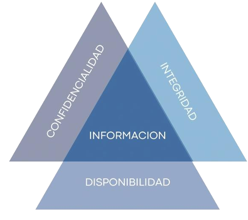

# Introducción

## ¿Seguridad de la Información, Seguridad Informática y Ciberseguridad son lo mismo?

Aunque muchas veces estos términos se usan indistintamente, no son lo mismo. La Seguridad de la Información, la Seguridad Informática y la Ciberseguridad son conceptos relacionados, pero con enfoques y alcances diferentes. Comprender las diferencias y relaciones entre ellos es clave para diseñar e implementar políticas de protección eficaces.

### 🔐 Seguridad de la Información

La Seguridad de la Información es un concepto amplio que abarca la protección de toda la información, sin importar el formato en el que se encuentre. Esto incluye información en medios digitales, pero también en papel, verbal, visual (como pizarras) o cualquier otro soporte físico o electrónico. Su objetivo principal es garantizar que la información se mantenga segura y confiable, y para ello se apoya en tres principios fundamentales conocidos como el Triángulo CIA:

- Confidencialidad
- Integridad
- Disponibilidad

Este enfoque no se limita al ámbito tecnológico. La seguridad de la información también abarca procesos organizacionales, normativas internas, aspectos legales y comportamientos humanos. Por ejemplo, evitar que una persona lea un documento impreso confidencial sin autorización también es parte de la seguridad de la información.

Además, este campo reconoce que la información es un activo valioso para las organizaciones, y por eso su protección debe ser tratada con el mismo nivel de importancia que se le da a otros recursos empresariales. Esto se refleja en normas internacionales como la ISO/IEC 27001, que establece un sistema de gestión de seguridad de la información (SGSI) aplicable a todo tipo de organizaciones.

### 🖥️ Seguridad Informática / Ciberseguridad

La Seguridad Informática, también llamada Ciberseguridad, se enfoca específicamente en la protección de los sistemas informáticos, redes y datos digitales. Su objetivo es prevenir, detectar y responder a ataques o accesos no autorizados que puedan comprometer los sistemas y la información que manejan. Aunque en algunos contextos técnicos puede haber una ligera distinción entre ambos términos, para efectos prácticos y académicos suelen considerarse sinónimos.

La ciberseguridad protege contra amenazas tales como:

- Virus y malware
- Accesos no autorizados
- Phishing
- Ataques de denegación de servicio (DoS)
- Ransomware
- Filtración de datos confidenciales

Su enfoque es tecnológico, pero no por eso menos complejo. Requiere medidas técnicas como cortafuegos (firewalls), antivirus, cifrado, autenticación multifactor, así como también un marco de políticas, procedimientos y formación para los usuarios.

Uno de los aspectos clave de la ciberseguridad es que no solo se trata de prevenir ataques, sino también de tener la capacidad de responder y recuperarse de ellos, restaurando la operación segura de los sistemas afectados.

### Relación entre Seguridad de la Información y Ciberseguridad

La Ciberseguridad o Seguridad Informática puede verse como una subcategoría dentro de la Seguridad de la Información, ya que se enfoca en proteger la información cuando esta está almacenada, procesada o transmitida a través de medios digitales.

Por ejemplo:

- Proteger un archivo en la nube con cifrado es ciberseguridad.
- Evitar que alguien vea una contraseña anotada en un papel en una oficina es seguridad de la información.
- Una política empresarial que prohíbe discutir información confidencial en espacios públicos también forma parte de la seguridad de la información.

Ambas disciplinas comparten los objetivos del modelo CIA (Confidencialidad, Integridad, Disponibilidad), pero la ciberseguridad se ocupa exclusivamente del entorno digital.

## Modelo CIA: Confidencialidad, Integridad, Disponibilidad

Este modelo representa los tres pilares fundamentales de cualquier sistema de seguridad de la información. Cualquier medida o estrategia en este campo debe apuntar a preservar al menos uno de estos principios.

### 🔒 Confidencialidad

La confidencialidad se refiere a asegurar que la información solo sea accesible para personas o sistemas autorizados. Implica evitar que terceros no autorizados puedan ver, copiar, modificar o distribuir información sensible.

Ejemplos de mecanismos para garantizar la confidencialidad incluyen:

- Uso de contraseñas seguras
- Cifrado de datos
- Control de accesos físicos y lógicos
- Clasificación de la información (pública, confidencial, secreta, etc.)

Un fallo en la confidencialidad puede dar lugar a filtraciones de información privada o robo de datos personales, lo cual puede tener consecuencias legales, económicas y de reputación.

### 🧮 Integridad

La integridad busca garantizar que la información sea exacta y completa, y que no haya sido modificada sin autorización, ni de forma accidental ni maliciosa.

Los mecanismos para preservar la integridad incluyen:

- Hashes y funciones de verificación
- Controles de versiones
- Registros de auditoría
- Firmas digitales

Por ejemplo, en un sistema bancario, modificar sin autorización el saldo de una cuenta sería una violación de la integridad. La pérdida de integridad puede ocasionar errores en la toma de decisiones, daño a sistemas críticos y fraudes.

### 📶 Disponibilidad

La disponibilidad asegura que la información y los servicios relacionados estén accesibles cuando sean requeridos por entidades autorizadas. No basta con que los datos existan, sino que deben estar accesibles en el momento y forma adecuados.

Los riesgos comunes para la disponibilidad incluyen:

- Ataques de denegación de servicio (DoS/DDoS)
- Fallos de hardware
- Errores de configuración
- Desastres naturales

Para mitigar estos riesgos, se aplican medidas como:

- Redundancia de sistemas
- Backups regulares
- Planes de recuperación ante desastres
- Monitoreo constante

## Conceptos complementarios

Además del modelo CIA, existen otras propiedades esenciales que complementan la comprensión moderna de la seguridad de la información:

### ✅ Autenticidad

La autenticidad hace referencia a la capacidad de verificar que algo o alguien es genuino y confiable. Se aplica tanto a la identidad de un usuario como al origen de un mensaje o sistema.

Por ejemplo, al ingresar a una cuenta bancaria, se debe asegurar que:

- El usuario realmente es quien dice ser (autenticación).
- El sitio web es legítimo y no una réplica falsa (validación del canal).
- El mensaje no fue alterado en tránsito.

La autenticidad es clave para prevenir fraudes y ataques de suplantación de identidad.

### 🧾 Rendición de cuentas (Accountability)

Este principio garantiza que las acciones realizadas dentro de un sistema puedan ser atribuibles a una entidad específica, y que esa entidad pueda ser responsabilizada por sus actos.

Se logra mediante:

- Auditorías
- Registros de actividad (logs)
- Identificación y autenticación individual

La rendición de cuentas es fundamental en ambientes donde se maneja información sensible o crítica, ya que permite reconstruir eventos pasados, identificar errores o actos maliciosos y aplicar sanciones si corresponde.

### 🧬 No repudio

El no repudio asegura que una parte no pueda negar posteriormente la autoría de una acción o mensaje. En otras palabras, es la capacidad de probar la existencia y procedencia de un evento.

Por ejemplo, una firma digital garantiza que un contrato electrónico fue efectivamente firmado por la persona que dice haberlo hecho, y esa persona no puede negar su participación más adelante.

El no repudio es esencial en contextos legales y contractuales donde se requiere evidencia verificable de las acciones realizadas.

### 👤 Privacidad

La privacidad es un derecho humano fundamental que se refiere a la capacidad de una persona de controlar cuándo, cómo y en qué medida sus datos personales son compartidos con otros.

En el contexto digital, la privacidad requiere medidas técnicas y legales para proteger los datos personales, especialmente los llamados datos sensibles (como salud, religión, ideología, orientación sexual, etc.).

Legislaciones como el Reglamento General de Protección de Datos (GDPR) en Europa o la Ley de Protección de Datos Personales en muchos países latinoamericanos, refuerzan el principio de que la privacidad no es opcional: debe estar protegida por diseño y por defecto.

## Leyes nacionales

### 1. Protección de Datos Personales – Ley 18.331

La Ley N.º 18.331, promulgada en 2008, constituye el marco jurídico fundamental en Uruguay para la protección de los datos personales. Esta legislación tiene como objetivo garantizar que la recolección, tratamiento, almacenamiento y difusión de datos personales se realicen respetando los derechos fundamentales de las personas, en especial su derecho a la privacidad.

#### Principios Fundamentales

La ley establece una serie de principios rectores que deben regir todo tratamiento de datos personales. Algunos de los más relevantes son:

- Legalidad: El tratamiento de los datos debe estar basado en la ley. No se puede manipular información personal sin una causa legítima o sin base normativa.

- Veracidad: Los datos recolectados deben ser exactos, actuales y adecuados para el propósito que se persigue.

- Finalidad: Toda información debe ser recolectada con un propósito específico, explícito y legítimo. No debe utilizarse con fines diferentes a los declarados.

- Consentimiento informado: El titular de los datos debe autorizar expresamente su tratamiento, luego de haber sido informado de los fines, responsables y derechos vinculados al proceso.

#### Derechos de los titulares

La norma también reglamenta los derechos que poseen los ciudadanos sobre sus propios datos, destacándose los siguientes:

- Acceso: Derecho a conocer si se están tratando sus datos, qué información se conserva y con qué finalidad.

- Rectificación: Posibilidad de modificar datos erróneos o desactualizados.

- Supresión: Derecho a solicitar la eliminación de sus datos cuando ya no sean necesarios o hayan sido tratados de manera ilegítima.

URCDP

La Unidad Reguladora y de Control de Datos Personales (URCDP) es el organismo encargado de velar por el cumplimiento de esta ley. Entre sus funciones destacan la fiscalización, la elaboración de recomendaciones y sanciones en caso de infracciones.

### 2. Identidad Digital – Ley 18.600

La Ley N.º 18.600 regula el uso de medios electrónicos para asegurar la validez jurídica de los documentos y las firmas realizadas digitalmente.

Documento Electrónico y Firma Electrónica

Esta ley establece dos tipos de firmas:

- Firma electrónica simple: Se basa en cualquier método electrónico que permita identificar al firmante. Es válida pero tiene un menor peso probatorio.

- Firma electrónica avanzada: Se genera utilizando certificados digitales y criptografía asimétrica. Permite garantizar no solo la identidad del firmante, sino también la integridad del documento y su no repudio (es decir, el firmante no puede negar posteriormente su autoría).

La firma avanzada tiene el mismo valor legal que una firma manuscrita, siempre que haya sido emitida por un prestador certificado por la autoridad competente.

### 3. Ciberdelito – Ley N.º 20.327

La Ley 20.327, promulgada en 2023, introduce en el Código Penal uruguayo nuevas figuras delictivas relacionadas con el uso indebido de las tecnologías de la información.

#### Tipificación de Ciberdelitos

Algunos delitos destacados que ahora están expresamente tipificados incluyen:

- Fraude informático: Manipulación de sistemas o datos con el fin de obtener un beneficio económico o causar perjuicio a terceros.

- Acoso telemático (stalking) y grooming: Persecución, vigilancia o engaño hacia menores de edad con fines sexuales mediante medios digitales.

#### Otras disposiciones clave

- Se establece una campaña educativa nacional sobre ciberseguridad y ciberdelitos, buscando la concientización ciudadana.

- Se crea un Registro de Ciberdelincuentes para centralizar información sobre los responsables de estos delitos.

- Se establecen mecanismos para contrarrestar la inmovilización de fondos obtenidos de manera ilícita en medios electrónicos.

## Certificaciones

En el campo de la seguridad de la información y la ciberseguridad, las certificaciones permiten demostrar que una persona u organización posee determinados conocimientos o sigue ciertas normas de calidad.

### Certificaciones Personales

Estas certificaciones están dirigidas a profesionales individuales y avalan su dominio en áreas específicas. Existen muchas certificaciones en el mercado, que varían según su profundidad, costo y prestigio. Algunas se enfocan en seguridad ofensiva (como escribir exploits), otras en gestión de seguridad, auditorías, etc.

Ejemplos:

- CompTIA Security+
- Certified Ethical Hacker (CEH)
- CISSP (Certified Information Systems Security Professional)

Estas certificaciones, emitidas por organismos reconocidos, se han vuelto un requisito casi indispensable para profesionales que deseen destacarse en el área de ciberseguridad.

### Certificaciones Organizacionales

Las organizaciones también pueden certificarse para demostrar que implementan buenas prácticas en sus procesos. Esto otorga confianza a clientes, usuarios y socios, asegurando que se cumplen con estándares reconocidos internacionalmente.

#### ISO/IEC 27001

- Es la norma más importante en materia de Sistemas de Gestión de Seguridad de la Información (SGSI).
- Define cómo identificar, evaluar y gestionar los riesgos relacionados con la información.
- Abarca temas como control de accesos, encriptación, gestión de incidentes y formación del personal.
- Su versión vigente es la de 2022, y pertenece a la familia de estándares ISO 27k.
- La ISO 27000:2018 es de acceso gratuito y proporciona un glosario de términos esenciales.

#### PCI DSS

- Es un estándar específico para la industria de tarjetas de pago, como Visa o Mastercard.
- Fue creado por el Payment Card Industry Security Standards Council (PCI SSC).
- Su objetivo es proteger los datos del titular de la tarjeta durante el procesamiento, almacenamiento y transmisión.
- La versión actual es la 4.0 (2022).
- Aplica a bancos, pasarelas de pago y cualquier entidad que maneje datos de tarjetas.

#### WebTrust

- Diseñado para autoridades de certificación (CA), quienes emiten certificados digitales.
- Este sello certifica que las CA siguen buenas prácticas de seguridad en la emisión y manejo de certificados.
- Aumenta la confianza en las comunicaciones seguras mediante PKI (Infraestructura de Clave Pública).

## Marco de Ciberseguridad de AGESIC

La AGESIC (Agencia de Gobierno Electrónico y Sociedad de la Información y del Conocimiento) desarrolló un marco nacional de ciberseguridad para regular y estandarizar las prácticas de seguridad en entornos públicos y, más recientemente, privados.

### Origen y Evolución

- Surge por la necesidad de generar confianza en el uso de servicios electrónicos del Estado.
- En 2016 se publicó la versión inicial (v1), centrada en organismos públicos.
- A partir de enero de 2024, se establece la obligatoriedad del cumplimiento del marco para empresas que integran sectores críticos (por ejemplo, financieras o servicios esenciales).

### Inspiración y Referencias

Este marco se basa y adapta estándares internacionales ampliamente utilizados:

- NIST Cybersecurity Framework (CSF): Referencia técnica de Estados Unidos que proporciona un enfoque estructurado para gestionar riesgos cibernéticos.
- ISO/IEC 27001
- COBIT 5
- NIST SP 800-53: Catálogo detallado de controles de seguridad y privacidad.

### Funciones del Marco

El marco de AGESIC está estructurado en torno a cinco funciones clave, que representan el ciclo de gestión de la ciberseguridad:

- Identificar: Determinar activos, riesgos, amenazas y vulnerabilidades.
- Proteger: Implementar salvaguardas y controles que reduzcan el impacto de posibles incidentes.
- Detectar: Establecer mecanismos que permitan identificar incidentes de seguridad en forma oportuna.
- Responder: Tener procedimientos claros para reaccionar frente a eventos de seguridad y mitigar daños.
- Recuperar: Establecer planes para restaurar los servicios afectados tras un incidente.

Este modelo busca no solo reducir riesgos, sino también mejorar la capacidad de resiliencia tecnológica de los sistemas públicos y privados.